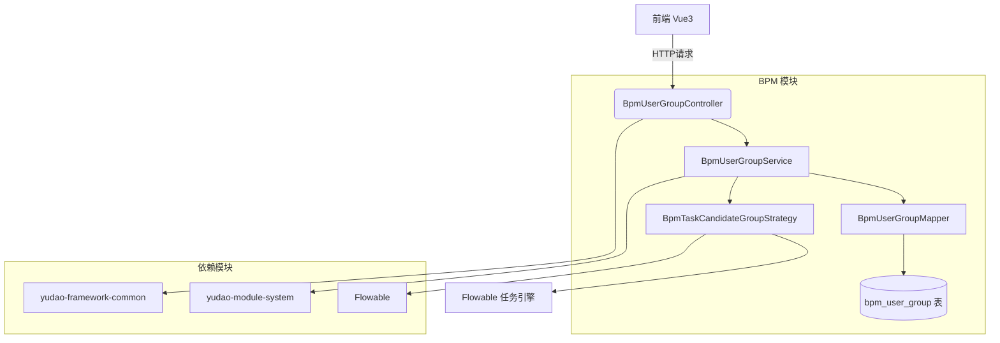
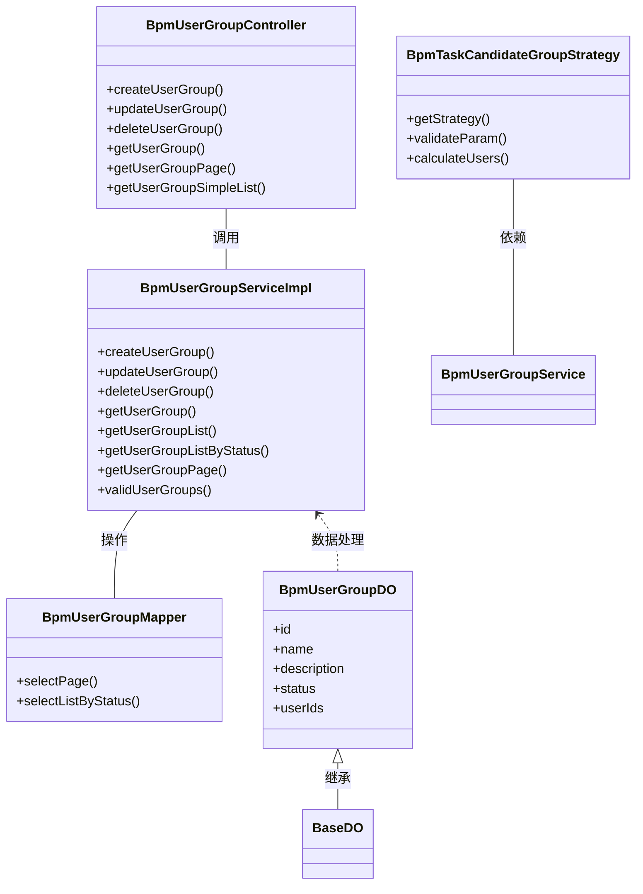

# BPM 用户组模块定义文档

## 1. 概述

BPM 用户组模块是工作流引擎中用于管理用户组的核心组件，主要职责是维护用户与组的关联关系，为流程任务的分发提供候选用户组支持。该模块实现了用户组的增删改查功能，并与 Flowable 任务分配策略集成，支持基于用户组的任务分配。

## 2. 核心功能

- **用户组管理**：创建、更新、删除、查询用户组
- **成员管理**：维护用户组与用户的关联关系（多对多）
- **状态管理**：启用/禁用用户组
- **任务分配**：作为 Flowable 任务候选者策略，支持将任务分配给用户组中的所有成员
- **数据校验**：在任务分配前验证用户组是否存在且处于启用状态

## 3. 架构设计

### 3.1 系统架构图



### 3.2 组件关系图



## 4. 数据库设计

### 4.1 bpm_user_group 表结构

| 字段名 | 类型 | 说明 | 备注 |
|--------|------|------|------|
| id | BIGINT | 主键 | 自增 |
| name | VARCHAR(255) | 组名 | 唯一标识 |
| description | VARCHAR(255) | 描述 | 可选 |
| status | INT | 状态 | 1=启用, 0=禁用 (CommonStatusEnum) |
| user_ids | JSON | 成员用户编号数组 | Jackson3TypeHandler 序列化存储 |
| create_time | DATETIME | 创建时间 | BaseDO 继承字段 |
| update_time | DATETIME | 更新时间 | BaseDO 继承字段 |

### 4.2 表关系说明

- `bpm_user_group` 表通过 `userIds` 字段以 JSON 数组形式存储关联的用户 ID 集合
- 用户信息存储在 `sys_user` 系统模块表中，通过用户 ID 关联
- 无外键约束，由业务层保证数据一致性

## 5. API 接口说明

### 5.1 接口列表

| 接口路径 | 方法 | 描述 | 权限标记 |
|----------|------|------|----------|
| `/bpm/user-group/create` | POST | 创建用户组 | `bpm:user-group:create` |
| `/bpm/user-group/update` | PUT | 更新用户组 | `bpm:user-group:update` |
| `/bpm/user-group/delete` | DELETE | 删除用户组 | `bpm:user-group:delete` |
| `/bpm/user-group/get` | GET | 获取用户组详情 | `bpm:user-group:query` |
| `/bpm/user-group/page` | GET | 获取用户组分页 | `bpm:user-group:query` |
| `/bpm/user-group/simple-list` | GET | 获取启用中的用户组列表 | - |

### 5.2 请求/响应示例

#### 5.2.1 创建用户组

**请求体：**
```json
{
  "name": "技术部",
  "description": "技术研发团队",
  "userIds": [1001, 1002, 1003],
  "status": 1
}
```

**响应：**
```json
{
  "code": 200,
  "message": "成功",
  "data": 123  // 用户组ID
}
```

#### 5.2.2 更新用户组

**请求体：**
```json
{
  "id": 123,
  "name": "研发部",
  "description": "产品研发团队",
  "userIds": [1001, 1002, 1003, 1004],
  "status": 1
}
```

**响应：**
```json
{
  "code": 200,
  "message": "成功",
  "data": true
}
```

#### 5.2.3 获取用户组分页

**查询参数：**
```
GET /bpm/user-group/page?pageNo=1&pageSize=10&name=研发&status=1
```

**响应：**
```json
{
  "code": 200,
  "message": "成功",
  "data": {
    "list": [...],
    "pageNum": 1,
    "pageSize": 10,
    "total": 100,
    "pages": 10
  }
}
```

## 6. 核心代码实现

### 6.1 BpmUserGroupServiceImpl

服务层实现类，负责业务逻辑处理：

- **createUserGroup**：将 VO 转换为 DO，插入数据库
- **updateUserGroup**：先校验存在性，再更新记录
- **deleteUserGroup**：先校验存在性，再删除记录
- **validUserGroups**：批量校验用户组是否存在且启用（用于任务分配前的验证）
- **getUserGroupListByStatus**：按状态查询用户组列表（用于下拉选择等场景）

### 6.2 BpmTaskCandidateGroupStrategy

任务候选者策略实现，将用户组与 Flowable 任务引擎集成：

- **getStrategy**：返回策略类型为 USER_GROUP
- **validateParam**：解析用户组 ID 字符串，校验有效性
- **calculateUsers**：获取用户组中的所有用户 ID，作为任务候选人

### 6.3 BpmUserGroupMapper

数据访问层，继承 BaseMapperX，提供：

- **selectPage**：带条件查询的分页方法
- **selectListByStatus**：按状态查询列表

## 7. 与其他模块的集成

### 7.1 与系统模块（system）集成

- 用户组中的用户 ID 引用自 `sys_user` 表
- 权限控制使用系统模块的 `@PreAuthorize` 注解和权限表达式

### 7.2 与 Flowable 引擎集成

- 通过 `BpmTaskCandidateGroupStrategy` 实现任务候选者策略
- 在流程定义中，用户组可作为任务分配的目标
- 任务分配时，自动扩展为用户组内的所有成员

### 7.3 与前端模块（ui）集成

- 前端通过 REST API 调用用户组管理功能
- 提供精简版用户组列表供前端下拉选择使用（`/simple-list`）

## 8. 错误码定义

| 错误码 | 说明 | 触发场景 |
|--------|------|----------|
| USER_GROUP_NOT_EXISTS | 用户组不存在 | 删除、更新、校验时用户组 ID 不存在 |
| USER_GROUP_IS_DISABLE | 用户组已禁用 | 任务分配时用户组状态为非启用 |

## 9. 使用场景示例

### 9.1 流程任务分配

在 BPMN 流程定义中，设置用户任务（User Task）的候选人表达式为 `${groupIds}`，其中 `groupIds` 是以逗号分隔的用户组 ID 字符串。当流程执行到该节点时，`BpmTaskCandidateGroupStrategy` 会被调用，将用户组中的所有成员作为任务的候选人。

### 9.2 组织架构管理

企业可以在系统中建立部门或项目组作为用户组，将相关成员加入组内。在审批流程中，可以直接将任务分配给整个组，而不需要逐个指定个人。

## 10. 扩展建议

1. **添加组成员管理接口**：目前用户组创建/修改时需一次性传入所有成员 ID，可考虑增加单独的成员添加/移除接口
2. **支持用户组嵌套**：未来可考虑支持用户组包含其他用户组的功能
3. **添加缓存机制**：对于频繁读取的用户组信息，可引入 Redis 缓存提升性能
4. **审计日志**：记录用户组的变更历史，便于追溯

## 11. 相关文件清单

| 文件路径 | 说明 |
|----------|------|
| `BpmUserGroupController.java` | 控制器层，暴露 REST API |
| `BpmUserGroupService.java` | 服务接口定义 |
| `BpmUserGroupServiceImpl.java` | 服务实现类 |
| `BpmUserGroupMapper.java` | 数据访问层 |
| `BpmUserGroupDO.java` | 数据对象 |
| `BpmUserGroupSaveReqVO.java` | 创建/更新请求 VO |
| `BpmUserGroupPageReqVO.java` | 分页查询请求 VO |
| `BpmTaskCandidateGroupStrategy.java` | Flowable 任务候选策略 |
