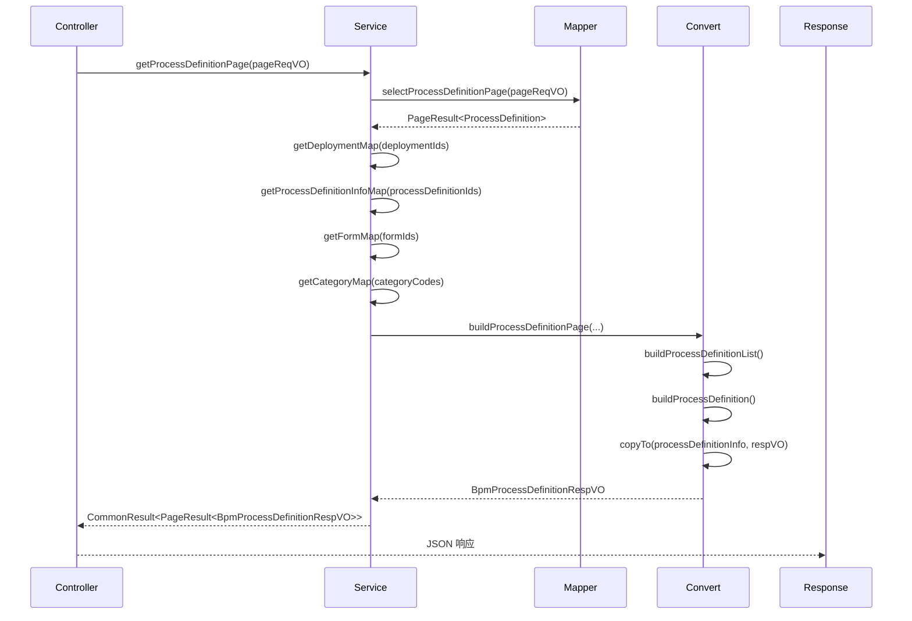
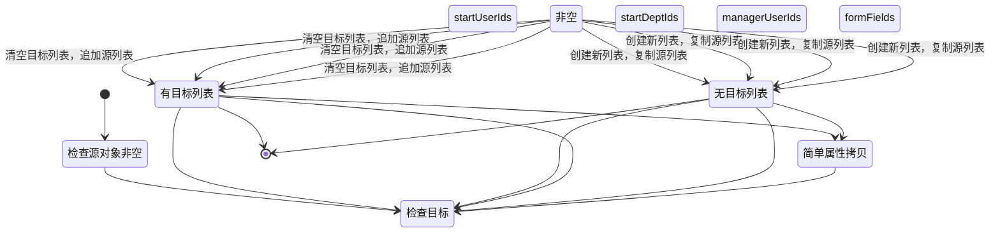

# definition_4 模块文档 - BPM 流程定义转换层

## 1. 模块概述

`definition_4` 模块是 **BPM（业务流程管理）模块**中的核心转换层组件，主要负责 **流程定义（Process Definition）** 和 **流程模型（Model）** 的数据对象（DO）、响应视图对象（VO）之间的转换。该模块基于 MapStruct 注解处理器自动生成转换实现类，提供类型安全、高性能的对象映射功能。

### 核心职责

- **数据转换**：将数据库实体 `BpmProcessDefinitionInfoDO` 转换为前端响应 `BpmProcessDefinitionRespVO`
- **模型转换**：为流程模型相关的数据提供转换支持（当前为空实现，待扩展）
- **解耦业务逻辑**：通过转换层隔离持久层与表现层，降低模块间耦合

### 模块定位

```
┌─────────────────────────────────────────────────────────────┐
│                      BPM 模块                               │
│  ┌─────────────┐    ┌─────────────┐    ┌─────────────┐      │
│  │  Controller │    │   Service   │    │   Mapper    │      │
│  │ (定义层)    │    │ (定义层)    │    │ (数据层)    │      │
│  └──────┬──────┘    └──────┬──────┘    └──────┬──────┘      │
│         │                  │                   │            │
│         └────────┬─────────┼─────────────────┬─────────────┘
│                  │         │                 │
│           ┌──────▼──────┐ ┌─▼──────┐   ┌─────▼──────┐
│           │  Convert    │ │  DO    │   │    VO      │
│           │  Interface  │ │ 层     │   │  层        │
│           └──────┬──────┘ └───────┘   └─────┬──────┘
│                  │                         │
│           ┌──────▼──────┐           ┌──────▼──────┐
│           │  ConvertImpl│           │  ConvertImpl│
│           │ (definition_4)│         │ (其他模块)   │
│           └─────────────┘           └─────────────┘
└─────────────────────────────────────────────────────────────┘
```

## 2. 架构设计

### 2.1 转换层架构

`definition_4` 模块采用 **MapStruct 注解处理器** 自动生成转换实现，遵循以下架构模式：

```
┌─────────────────┐      ┌─────────────────┐      ┌─────────────────┐
│   BpmProcessDef │      │  BpmProcessDef  │      │  BpmProcessDef  │
│   Convert (接口) │─────▶│  ConvertImpl   │─────▶│  RespVO (VO)    │
│   (定义层)      │      │ (definition_4) │      │ (表现层)        │
└─────────────────┘      └─────────────────┘      └─────────────────┘
       ▲                         ▲                         ▲
       │                         │                         │
    定义转换方法           自动生成实现              接收转换数据
    (业务语义)              (MapStruct)               (前端展示)
```

### 2.2 组件关系图

```mermaid
classDiagram
    class BpmProcessDefinitionConvert {
        <<interface>>
        +copyTo(BpmProcessDefinitionInfoDO, BpmProcessDefinitionRespVO)
        +buildProcessDefinitionPage(...)
        +buildProcessDefinitionList(...)
        +buildProcessDefinition(...)
    }

    class BpmProcessDefinitionConvertImpl {
        +BpmProcessDefinitionConvertImpl()
        +copyTo(BpmProcessDefinitionInfoDO, BpmProcessDefinitionRespVO)
    }

    class BpmModelConvert {
        <<interface>>
        +buildModelList(...)
        +buildModel(...)
        +buildModel0(...)
        +copyToModel(...)
        +parseMetaInfo(...)
    }

    class BpmModelConvertImpl {
        +BpmModelConvertImpl()
    }

    class BpmProcessDefinitionInfoDO {
        -id: Long
        -processDefinitionId: String
        -modelId: String
        -modelType: Integer
        -category: String
        -icon: String
        -description: String
        -formType: Integer
        -formId: Long
        -formConf: String
        -formFields: List<String>
        -formCustomCreatePath: String
        -formCustomViewPath: String
        -simpleModel: String
        -visible: Boolean
        -sort: Long
        -startUserIds: List<Long>
        -startDeptIds: List<Long>
        -managerUserIds: List<Long>
        -allowCancelRunningProcess: Boolean
        -allowWithdrawTask: Boolean
        -processIdRule: BpmModelMetaInfoVO.ProcessIdRule
        -autoApprovalType: Integer
        -titleSetting: BpmModelMetaInfoVO.TitleSetting
        -summarySetting: BpmModelMetaInfoVO.SummarySetting
        -processBeforeTriggerSetting: BpmModelMetaInfoVO.HttpRequestSetting
        -processAfterTriggerSetting: BpmModelMetaInfoVO.HttpRequestSetting
        -taskBeforeTriggerSetting: BpmModelMetaInfoVO.HttpRequestSetting
        -taskAfterTriggerSetting: BpmModelMetaInfoVO.HttpRequestSetting
        -printTemplateSetting: BpmModelMetaInfoVO.PrintTemplateSetting
    }

    class BpmProcessDefinitionRespVO {
        -id: String
        -version: Integer
        -name: String
        -key: String
        -category: String
        -categoryName: String
        -modelType: Integer
        -modelId: String
        -formConf: String
        -formFields: List<String>
        -formName: String
        -suspensionState: Integer
        -deploymentTime: LocalDateTime
        -bpmnXml: String
        -simpleModel: String
        -sort: Long
        +UserTask {
            -id: String
            -name: String
        }
    }

    BpmProcessDefinitionConvertImpl <|-- BpmProcessDefinitionConvert
    BpmModelConvertImpl <|-- BpmModelConvert
    BpmProcessDefinitionInfoDO <-- BpmProcessDefinitionConvertImpl: 源对象
    BpmProcessDefinitionRespVO <-- BpmProcessDefinitionConvertImpl: 目标对象
    BpmProcessDefinitionConvertImpl "1" -- "1" BpmProcessDefinitionInfoDO
    BpmProcessDefinitionConvertImpl "1" -- "1" BpmProcessDefinitionRespVO
```

## 3. 核心组件说明

### 3.1 BpmProcessDefinitionConvert（转换接口）

**文件路径**：`yudao-module-bpm/src/main/java/cn/iocoder/yudao/module/bpm/convert/definition/BpmProcessDefinitionConvert.java`

**功能描述**：定义流程定义对象转换的接口规范，包含以下核心方法：

| 方法名 | 参数 | 返回值 | 说明 |
|--------|------|--------|------|
| `copyTo` | `BpmProcessDefinitionInfoDO`, `@MappingTarget BpmProcessDefinitionRespVO` | `void` | 将 DO 对象属性复制到 VO 对象（支持部分更新） |
| `buildProcessDefinitionPage` | `PageResult<ProcessDefinition>`, 多个 Map 对象 | `PageResult<BpmProcessDefinitionRespVO>` | 构建分页响应，包含流程定义列表及关联数据 |
| `buildProcessDefinitionList` | `List<ProcessDefinition>`, 多个 Map 对象 | `List<BpmProcessDefinitionRespVO>` | 构建流程定义列表 |
| `buildProcessDefinition` | `ProcessDefinition`, `Deployment`, `BpmProcessDefinitionInfoDO`, `BpmFormDO`, `BpmCategoryDO`, `BpmnModel` | `BpmProcessDefinitionRespVO` | 构建单个流程定义响应对象，整合多源数据 |

**关键特性**：
- 使用 `@Mapper` 注解，由 MapStruct 自动生成实现
- 提供 `INSTANCE` 单例访问模式
- 包含默认方法（default）实现复杂转换逻辑
- 支持批量转换和分页转换

### 3.2 BpmProcessDefinitionConvertImpl（转换实现）

**文件路径**：`yudao-module-bpm/target/generated-sources/annotations/cn/iocoder/yudao/module/bpm/convert/definition/BpmProcessDefinitionConvertImpl.java`

**功能描述**：MapStruct 自动生成的转换实现类，负责具体的属性拷贝逻辑。这是 `definition_4` 模块的核心组件。

**转换字段映射表**：

| DO 字段 | VO 字段 | 说明 |
|---------|---------|------|
| `icon` | `icon` | 流程图标 |
| `description` | `description` | 流程描述 |
| `formType` | `formType` | 表单类型 |
| `formId` | `formId` | 动态表单 ID |
| `formCustomCreatePath` | `formCustomCreatePath` | 自定义表单创建路径 |
| `formCustomViewPath` | `formCustomViewPath` | 自定义表单查看路径 |
| `visible` | `visible` | 可见性标志 |
| `startUserIds` | `startUserIds` | 可发起用户列表（特殊处理：清空后追加） |
| `startDeptIds` | `startDeptIds` | 可发起部门列表（特殊处理：清空后追加） |
| `managerUserIds` | `managerUserIds` | 可管理用户列表（特殊处理：清空后追加） |
| `allowCancelRunningProcess` | `allowCancelRunningProcess` | 是否允许取消运行中的流程 |
| `allowWithdrawTask` | `allowWithdrawTask` | 是否允许撤回任务 |
| `processIdRule` | `processIdRule` | 流程 ID 规则 |
| `autoApprovalType` | `autoApprovalType` | 自动审批类型 |
| `titleSetting` | `titleSetting` | 标题设置 |
| `summarySetting` | `summarySetting` | 摘要设置 |
| `processBeforeTriggerSetting` | `processBeforeTriggerSetting` | 流程前置通知设置 |
| `processAfterTriggerSetting` | `processAfterTriggerSetting` | 流程后置通知设置 |
| `taskBeforeTriggerSetting` | `taskBeforeTriggerSetting` | 任务前置通知设置 |
| `taskAfterTriggerSetting` | `taskAfterTriggerSetting` | 任务后置通知设置 |
| `printTemplateSetting` | `printTemplateSetting` | 打印模板设置 |
| `category` | `category` | 流程分类 |
| `modelType` | `modelType` | 模型类型 |
| `modelId` | `modelId` | 模型 ID |
| `formConf` | `formConf` | 表单配置 |
| `formFields` | `formFields` | 表单项列表（特殊处理：清空后追加） |
| `simpleModel` | `simpleModel` | SIMPLE 设计器模型数据 |
| `sort` | `sort` | 排序值 |

**特殊处理逻辑**：
对于 `List` 类型的字段（`startUserIds`、`startDeptIds`、`managerUserIds`、`formFields`），实现类包含特殊的空值检查逻辑：
1. 如果目标对象已存在列表，则先清空再追加源对象数据
2. 如果目标对象为 null，则创建新列表并复制源对象数据
3. 如果源对象为 null，则设置目标对象为 null

这种设计支持 **部分更新** 场景，避免重复数据。

### 3.3 BpmModelConvert（模型转换接口）

**文件路径**：`yudao-module-bpm/src/main/java/cn/iocoder/yudao/module/bpm/convert/definition/BpmModelConvert.java`

**功能描述**：定义流程模型相关的转换接口，虽然 `definition_4` 模块中 `BpmModelConvertImpl` 为空实现，但接口本身提供了完整的转换能力：

| 方法名 | 说明 |
|--------|------|
| `buildModelList` | 构建模型列表，整合表单、分类、部署、流程定义、用户、部门等多源数据 |
| `buildModel` | 构建单个模型响应，支持 BPMN XML 和 SIMPLE 模型数据 |
| `buildModel0` | 内部构建方法，执行基础属性拷贝 |
| `copyToModel` | 将请求 VO 数据复制到模型对象（用于创建/更新操作） |
| `parseMetaInfo` | 解析模型元信息 JSON 字符串为 `BpmModelMetaInfoVO` 对象 |

### 3.4 BpmModelConvertImpl（模型转换实现）

**文件路径**：`yudao-module-bpm/target/generated-sources/annotations/cn/iocoder/yudao/module/bpm/convert/definition/BpmModelConvertImpl.java`

**状态**：当前为空白实现类，仅包含默认构造函数。实际转换逻辑由 `BpmModelConvert` 接口中的默认方法提供，无需额外实现。

## 4. 数据流分析

### 4.1 流程定义查询数据流



### 4.2 属性拷贝详细流程

以 `copyTo` 方法为例，详细数据流如下：



## 5. 模块依赖关系

### 5.1 依赖的 BPM 模块组件

`definition_4` 模块与 BPM 模块的其他组件紧密集成：

| 依赖组件 | 模块路径 | 用途 |
|----------|----------|------|
| `BpmProcessDefinitionInfoDO` | `yudao-module-bpm/src/main/java/cn/iocoder/yudao/module/bpm/dal/dataobject/definition/BpmProcessDefinitionInfoDO.java` | 源数据对象，包含流程定义的扩展属性 |
| `BpmProcessDefinitionRespVO` | `yudao-module-bpm/src/main/java/cn/iocoder/yudao/module/bpm/controller/admin/definition/vo/process/BpmProcessDefinitionRespVO.java` | 目标响应对象，包含前端展示所需的所有字段 |
| `BpmFormDO` | `yudao-module-bpm/src/main/java/cn/iocoder/yudao/module/bpm/dal/dataobject/definition/BpmFormDO.java` | 表单数据对象，用于获取表单名称 |
| `BpmCategoryDO` | `yudao-module-bpm/src/main/java/cn/iocoder/yudao/module/bpm/dal/dataobject/definition/BpmCategoryDO.java` | 分类数据对象，用于获取分类名称 |
| `Deployment` | Flowable 核心类 | 部署信息，用于获取部署时间 |
| `ProcessDefinition` | Flowable 核心类 | 流程定义实体 |
| `BpmnModel` | Flowable 核心类 | BPMN 模型，用于获取 BPMN XML |

### 5.2 依赖的外部库

| 库 | 版本 | 用途 |
|----|------|------|
| MapStruct | 1.6.3 | 注解处理器，生成转换实现类 |
| Lombok | - | 自动生成 POJO 的 getter/setter 等方法 |
| Flowable | - | BPMN 引擎核心类 |
| Jackson | - | JSON 序列化和反序列化（用于 `@TableField(typeHandler = Jackson3TypeHandler.class)`） |

## 6. 使用示例

### 6.1 在 Service 层使用转换接口

```java
// BpmProcessDefinitionConvert.java 中的默认方法示例
default BpmProcessDefinitionRespVO buildProcessDefinition(
    ProcessDefinition definition,
    Deployment deployment,
    BpmProcessDefinitionInfoDO processDefinitionInfo,
    BpmFormDO form,
    BpmCategoryDO category,
    BpmnModel bpmnModel) {
    
    // 1. 基础属性拷贝
    BpmProcessDefinitionRespVO respVO = BeanUtils.toBean(definition, BpmProcessDefinitionRespVO.class);
    
    // 2. 设置挂起状态
    respVO.setSuspensionState(definition.isSuspended() 
        ? SuspensionState.SUSPENDED.getStateCode() 
        : SuspensionState.ACTIVE.getStateCode());
    
    // 3. 设置部署时间
    if (deployment != null) {
        respVO.setDeploymentTime(LocalDateTimeUtil.of(deployment.getDeploymentTime()));
    }
    
    // 4. 设置扩展属性（通过 copyTo 方法）
    if (processDefinitionInfo != null) {
        BpmProcessDefinitionConvert.INSTANCE.copyTo(processDefinitionInfo, respVO);
        // 5. 设置表单名称
        if (form != null) {
            respVO.setFormName(form.getName());
        }
    }
    
    // 6. 设置分类名称
    if (category != null) {
        respVO.setCategoryName(category.getName());
    }
    
    // 7. 设置 BPMN XML
    if (bpmnModel != null) {
        respVO.setBpmnXml(BpmnModelUtils.getBpmnXml(bpmnModel));
    }
    
    return respVO;
}
```

### 6.2 在 Controller 层使用转换

```java
// BpmProcessDefinitionController.java 示例
@GetMapping("/page")
public CommonResult<PageResult<BpmProcessDefinitionRespVO>> getProcessDefinitionPage(
        BpmProcessDefinitionPageReqVO pageReqVO) {
    
    // 1. 查询分页数据
    PageResult<ProcessDefinition> pageResult = processDefinitionService.getProcessDefinitionPage(pageReqVO);
    
    if (CollUtil.isEmpty(pageResult.getList())) {
        return success(PageResult.empty(pageResult.getTotal()));
    }
    
    // 2. 获取关联数据映射
    Map<String, BpmCategoryDO> categoryMap = categoryService.getCategoryMap(
            convertSet(pageResult.getList(), ProcessDefinition::getCategory));
    Map<String, Deployment> deploymentMap = processDefinitionService.getDeploymentMap(
            convertSet(pageResult.getList(), ProcessDefinition::getDeploymentId));
    Map<String, BpmProcessDefinitionInfoDO> processDefinitionMap = processDefinitionService.getProcessDefinitionInfoMap(
            convertSet(pageResult.getList(), ProcessDefinition::getId));
    Map<Long, BpmFormDO> formMap = formService.getFormMap(
           convertSet(processDefinitionMap.values(), BpmProcessDefinitionInfoDO::getFormId));
    
    // 3. 使用转换接口构建响应
    return success(BpmProcessDefinitionConvert.INSTANCE.buildProcessDefinitionPage(
            pageResult, deploymentMap, processDefinitionMap, formMap, categoryMap));
}
```

## 7. 扩展建议

### 7.1 BpmModelConvertImpl 扩展

当前 `BpmModelConvertImpl` 为空实现，如果需要自定义模型转换逻辑，可以：

1. 添加具体的属性拷贝方法
2. 实现复杂的转换逻辑（如数据格式化、关联数据加载等）
3. 添加自定义的映射规则

```java
// 示例：扩展 BpmModelConvertImpl
public class BpmModelConvertImpl implements BpmModelConvert {
    
    // 可以添加自定义的 copyTo 方法或其他转换逻辑
    @Override
    public void copyTo(BpmModel from, BpmModelSaveReqVO to) {
        // 自定义转换逻辑
        to.setName(from.getName());
        to.setKey(from.getKey());
        // ...
    }
}
```

### 7.2 新增转换方法

如果需要支持新的转换场景，可以在 `BpmProcessDefinitionConvert` 接口中添加新的默认方法，然后在 `BpmProcessDefinitionConvertImpl` 中生成对应的实现。

## 8. 测试建议

### 8.1 测试要点

1. **空值处理**：测试源对象为 null 时的行为
2. **列表拷贝**：测试 `startUserIds`、`startDeptIds`、`managerUserIds`、`formFields` 等列表类型的拷贝逻辑
3. **部分更新**：测试 `copyTo` 方法在目标对象已存在数据时的行为
4. **复杂嵌套**：测试包含嵌套对象（如 `BpmModelMetaInfoVO` 的各种 Setting）的转换
5. **性能测试**：批量转换的性能表现

### 8.2 测试示例

```java
@Test
public void testCopyTo_nullSource() {
    // 测试源对象为 null 时的行为
    BpmProcessDefinitionConvert.INSTANCE.copyTo(null, respVO);
    assertNull(respVO.getIcon());
}

@Test
public void testCopyTo_nonNullSource() {
    // 测试正常拷贝
    BpmProcessDefinitionInfoDO doObj = new BpmProcessDefinitionInfoDO()
        .setIcon("test-icon")
        .setDescription("test-desc")
        .setStartUserIds(Arrays.asList(1L, 2L));
    
    BpmProcessDefinitionRespVO voObj = new BpmProcessDefinitionRespVO();
    BpmProcessDefinitionConvert.INSTANCE.copyTo(doObj, voObj);
    
    assertEquals("test-icon", voObj.getIcon());
    assertEquals(Arrays.asList(1L, 2L), voObj.getStartUserIds());
}
```

## 9. 总结

`definition_4` 模块作为 BPM 模块的转换层，提供了流程定义对象之间的高效、类型安全的转换能力。通过 MapStruct 自动生成实现，保证了转换代码的一致性和可维护性。该模块与 BPM 模块的其他组件（Controller、Service、DO、VO）紧密协作，构成了完整的数据流转链条。

**关键要点**：
- 核心转换类：`BpmProcessDefinitionConvertImpl`
- 转换接口：`BpmProcessDefinitionConvert`
- 源对象：`BpmProcessDefinitionInfoDO`
- 目标对象：`BpmProcessDefinitionRespVO`
- 特殊处理：列表类型的清空追加逻辑
- 生成方式：MapStruct 注解处理器自动生成
