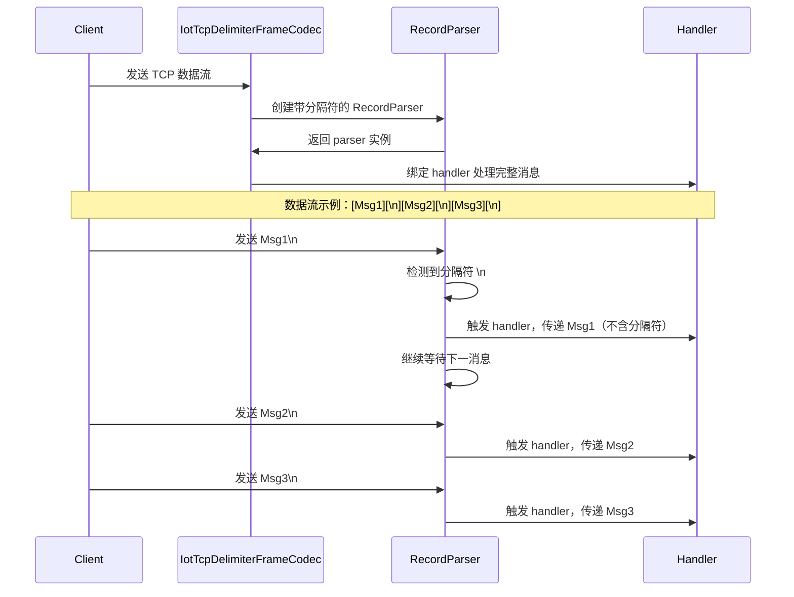
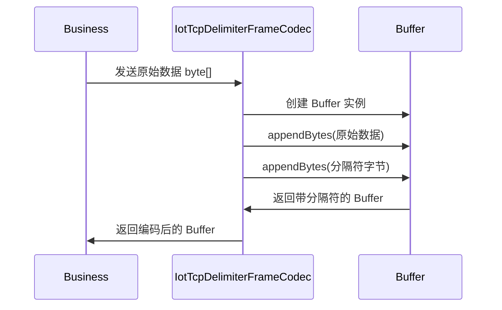

# IoT TCP 分隔符帧编解码器模块文档

## 1. 模块概述

`delimiter` 模块是 IoT 网关 TCP 协议栈中的核心编解码组件，负责实现基于**分隔符（Delimiter）**的 TCP 帧拆包与组包策略。该模块实现了 `IotTcpFrameCodec` 接口，是 IoT 网关 TCP 编解码器家族的重要组成部分。

在物联网设备通信场景中，TCP 流式传输需要将连续的数据流分割成独立的消息帧。`IotTcpDelimiterFrameCodec` 采用**分隔符识别**的方式，通过预设的分隔符（如换行符 `\n`、回车符 `\r`、回车换行 `\r\n` 或自定义字符串）来标记消息的边界，从而实现拆包和组包功能。

## 2. 架构设计

### 2.1 模块定位

```
┌─────────────────────────────────────────────────────────────────┐
│                    IoT 网关 TCP 协议栈                          │
├─────────────────────────────────────────────────────────────────┤
│  ┌─────────────┐    ┌─────────────┐    ┌─────────────┐          │
│  │  FIXED_LENGTH│    │   DELIMITER │    │ LENGTH_FIELD │          │
│  │ 编解码器     │    │ 编解码器    │    │ 编解码器     │          │
│  │ (固定长度)   │    │ (分隔符)    │    │ (长度字段)   │          │
│  └──────┬──────┘    └──────┬──────┘    └──────┬──────┘          │
│         │                 │                 │                   │
│         └─────────┬─────────┼─────────┬─────────┘               │
│                   │         │         │                         │
│           ┌───────▼───────┐ ┌─▼───────┐ ┌─▼───────┐               │
│           │ IotTcpFrameCodec│ │ IotTcp  │ │ IotTcp  │               │
│           │ 接口          │ │ 配置    │ │ 编解码│               │
│           └───────┬───────┘ └───────┬─┘ └───────┬─┘               │
│                   │                 │         │                   │
│           ┌───────▼───────┐ ┌───────▼───────┐ ┌─▼───────┐         │
│           │ IotTcpFrameCodecFactory │ │ 连接管理器   │ │ 业务处理 │         │
│           └───────────────┘ └───────────────┘ └─────────┘         │
└─────────────────────────────────────────────────────────────────┘
```

### 2.2 编解码器家族

IoT 网关 TCP 支持三种编解码策略，通过 `IotTcpCodecTypeEnum` 枚举统一管理：

| 编解码器类型 | 类名 | 适用场景 |
|-------------|------|---------|
| **FIXED_LENGTH** | `IotTcpFixedLengthFrameCodec` | 固定长度消息，如协议头固定、消息体长度固定的场景 |
| **DELIMITER** | `IotTcpDelimiterFrameCodec` | 分隔符结束的消息，如文本协议、日志协议等 |
| **LENGTH_FIELD** | `IotTcpLengthFieldFrameCodec` | 长度字段前缀的消息，如二进制协议、JSON 协议等 |

### 2.3 核心组件关系

```
┌─────────────────────┐      ┌──────────────────────┐
│ IotTcpDelimiterFrameCodec │◄─────┤ IotTcpFrameCodec   │
│ (实现类)           │      │ (接口)               │
└─────────────────────┘      └──────────────────────┘
        │                           │
        │ implements                │ defines
        ▼                           ▼
┌─────────────────────┐      ┌──────────────────────┐
│ IotTcpCodecTypeEnum │      │ RecordParser         │
│ (枚举类型)         │      │ (Vert.x 解析器)      │
└─────────────────────┘      └──────────────────────┘
        │                           │
        │ references                │ used by
        ▼                           ▼
┌─────────────────────┐      ┌──────────────────────┐
│ IotTcpConfig.CodecConfig │ ──►│ Buffer (Vert.x)   │
│ (配置类)           │      │ (字节缓冲区)         │
└─────────────────────┘      └──────────────────────┘
```

## 3. 核心功能详解

### 3.1 分隔符解析

`IotTcpDelimiterFrameCodec` 支持多种分隔符格式，包括标准转义字符和自定义字符串：

```java
// 分隔符字符串解析示例
String delimiter = "\\n";        // 解析为换行符 \n
delimiter = "\\r";              // 解析为回车符 \r
delimiter = "\\r\\n";          // 解析为回车换行 \r\n
delimiter = "\\t";             // 解析为制表符 \t
delimiter = "###";             // 自定义分隔符 "###"
```

解析过程：
1. 接收配置中的分隔符字符串
2. 转义字符替换：`\r\n` → `\r\n`，`\r` → `\r`，`\n` → `\n`，`\t` → `\t`
3. 转换为 UTF-8 字节数组，用于后续的二进制匹配

### 3.2 拆包（解码）流程



**关键特性：**
- 使用 Vert.x 的 `RecordParser.newDelimited()` 自动按分隔符拆分数据流
- 设置最大记录大小 `MAX_RECORD_SIZE = 65536`，防止 DoS 攻击（超大消息）
- 解析后的消息**不包含分隔符**，直接传递给上层业务处理
- 异常处理：解析失败时抛出 `RuntimeException`

### 3.3 组包（编码）流程



**编码示例：**
```java
// 原始数据：Hello World
// 分隔符：\n
// 编码结果：Buffer[Hello World\n]
```

### 3.4 安全机制

| 安全项 | 实现方式 | 说明 |
|--------|---------|------|
| **DoS 防护** | `MAX_RECORD_SIZE = 65536` | 限制单条消息最大 64KB，防止恶意发送超长数据 |
| **空值校验** | `Assert.notBlank(config.getDelimiter())` | 配置时分隔符不能为空 |
| **异常处理** | `exceptionHandler` | 捕获解析异常并抛出，避免静默失败 |

## 4. 配置说明

### 4.1 TCP 配置结构

```java
@Data
public class IotTcpConfig {
    private Integer maxConnections = 1000;           // 最大连接数
    private Long keepAliveTimeoutMs = 30000L;        // 心跳超时时间
    private CodecConfig codec;                     // 拆包配置
    
    @Data
    public static class CodecConfig {
        private String type;                       // 拆包类型：fixed_length / delimiter / length_field
        private String delimiter;                  // DELIVER 类型专用：分隔符字符串
        // 其他类型配置...
    }
}
```

### 4.2 分隔符配置示例

```yaml
# application.yml 示例
iot:
  tcp:
    codec:
      type: delimiter          # 使用分隔符编解码
      delimiter: "\n"          # 换行符作为分隔符
      # 或 delimiter: "\r\n"   # 回车换行
      # 或 delimiter: "###"    # 自定义分隔符
```

## 5. 使用场景

### 5.1 典型应用场景

1. **文本协议设备**：如串口设备发送文本日志，每行以 `\n` 结尾
2. **MQTT over TCP**：某些 MQTT 实现使用分隔符标记消息边界
3. **自定义协议**：业务方定义基于分隔符的简单协议
4. **日志采集**：从 TCP 流中采集日志数据，每行一条日志

### 5.2 与其他编解码器的对比

| 特性 | FIXED_LENGTH | DELIMITER | LENGTH_FIELD |
|------|-------------|-----------|-------------|
| **消息边界** | 固定长度 | 分隔符 | 长度字段 |
| **灵活性** | 低 | 中 | 高 |
| **解析复杂度** | 简单 | 简单 | 较复杂 |
| **适用场景** | 二进制固定包 | 文本协议 | 通用二进制协议 |
| **性能** | 高 | 高 | 中 |

## 6. 依赖关系

### 6.1 内部依赖

```
IotTcpDelimiterFrameCodec
├── IotTcpFrameCodec (接口)
├── IotTcpCodecTypeEnum (枚举)
├── IotTcpConfig (配置类)
├── Vert.x: Buffer, RecordParser, Handler
├── Hutool: StrUtil, Assert
└── Lombok: @Slf4j
```

### 6.2 外部依赖

- **IoT 网关模块**：`yudao-module-iot-gateway`
- **Vert.x 框架**：提供异步非阻塞 I/O 支持
- **Hutool 工具库**：提供字符串和断言工具
- **Lombok**：提供日志和简化代码

## 7. 扩展性设计

### 7.1 策略模式

`IotTcpFrameCodec` 接口采用**策略模式**，支持多种编解码策略的扩展：

```java
// 新增编解码器只需实现 IotTcpFrameCodec 接口
public class NewCodec implements IotTcpFrameCodec {
    @Override
    public IotTcpCodecTypeEnum getType() {
        return IotTcpCodecTypeEnum.NEW_TYPE; // 需添加到枚举
    }
    
    @Override
    public RecordParser createDecodeParser(Handler<Buffer> handler) {
        // 实现自定义解析逻辑
    }
    
    @Override
    public Buffer encode(byte[] data) {
        // 实现自定义编码逻辑
    }
}
```

### 7.2 工厂模式

`IotTcpFrameCodecFactory` 通过反射动态创建编解码器实例，支持运行时切换策略：

```java
public class IotTcpFrameCodecFactory {
    public static IotTcpFrameCodec create(IotTcpConfig.CodecConfig config) {
        IotTcpCodecTypeEnum type = IotTcpCodecTypeEnum.of(config.getType());
        return ReflectUtil.newInstance(type.getCodecClass(), config);
    }
}
```

## 8. 注意事项

1. **分隔符唯一性**：确保分隔符在消息内容中不会出现，否则会导致错误拆包
2. **编码一致性**：发送端和分隔符编码需保持一致（UTF-8）
3. **最大消息长度**：`MAX_RECORD_SIZE` 需根据实际业务场景调整，避免正常消息被截断
4. **异常处理**：生产环境建议将异常抛出改为更友好的日志记录和连接关闭策略
5. **性能考虑**：分隔符解析在大量连接下可能有性能开销，需进行压力测试

## 9. 参考文档

- [IoT 网关模块整体架构](./iot-gateway.md)
- [TCP 编解码器接口定义](IotTcpFrameCodec.md)
- [IoT 网关配置说明](./iot-gateway-config.md)
- [Vert.x RecordParser 官方文档](https://vertx.io/docs/vertx-core/java/#recordparser)
