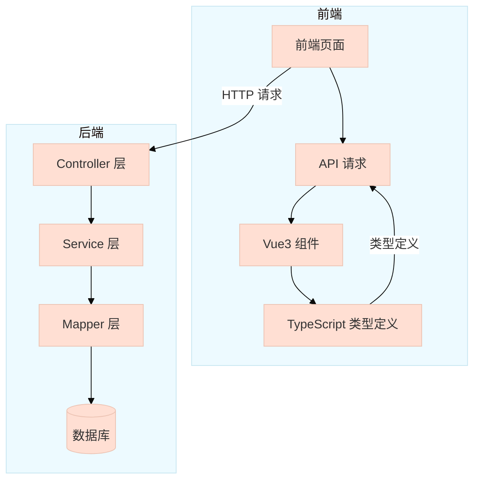
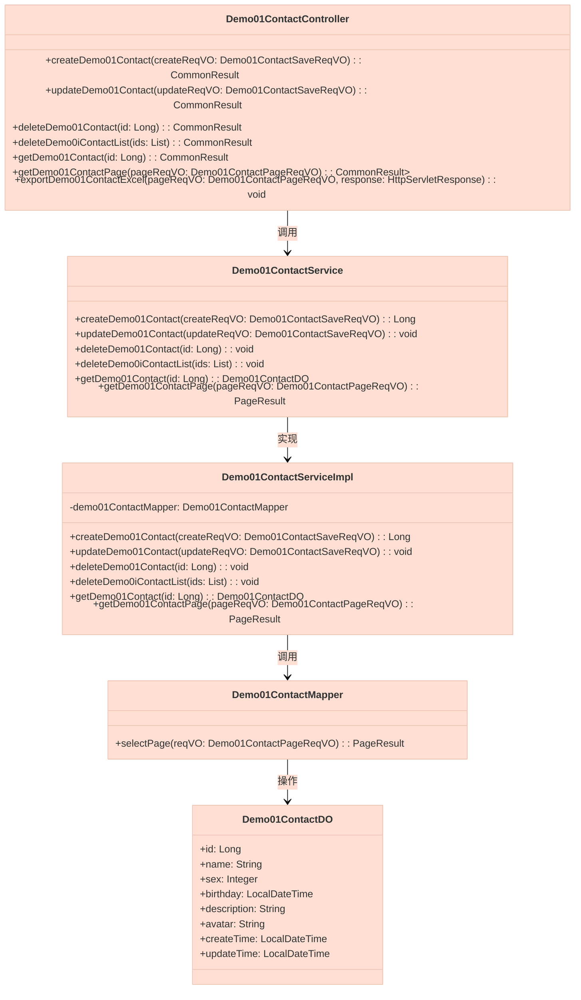
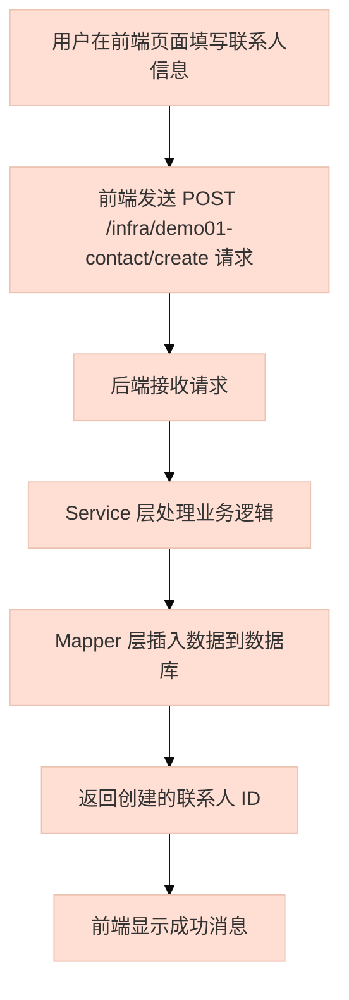
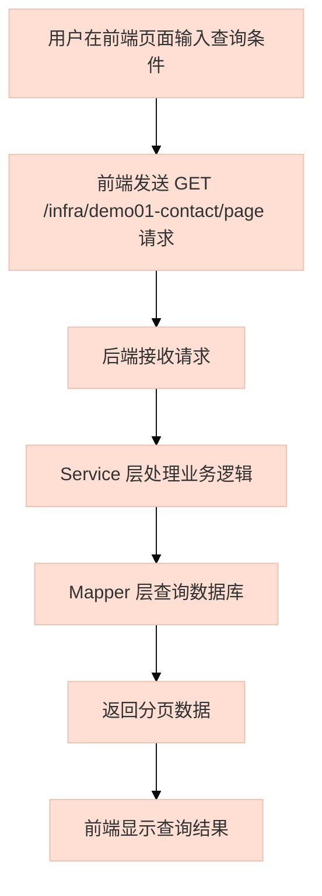

# demo01_2 模块文档

## 模块概述

`demo01_2` 模块是 Yudao 系统中的一个示例模块，主要用于演示如何构建一个完整的 CRUD 功能模块。该模块提供了联系人管理的基本功能，包括创建、更新、删除、查询和分页查询等操作。

该模块基于 Yudao 的基础架构，使用了 Spring Boot + MyBatis Plus + Vue3 的技术栈，展示了标准的后端开发模式和前后端交互方式。

## 架构设计

### 系统架构图



### 模块结构

```
demo01_2/
├── controller/            # 控制器层
│   └── admin/
│       └── demo/
│           └── demo01/
│               └── Demo01ContactController.java  # 示例联系人控制器
├── service/               # 服务层
│   └── demo/
│       └── demo01/
│           ├── Demo01ContactService.java         # 服务接口
│           └── Demo01ContactServiceImpl.java      # 服务实现
├── dal/                   # 数据访问层
│   ├── dataobject/
│   │   └── demo/
│   │       └── demo01/
│   │           └── Demo01ContactDO.java         # 数据对象
│   └── mysql/
│       └── demo/
│           └── demo01/
│               └── Demo01ContactMapper.java      # Mapper 接口
└── controller/admin/demo/demo01/vo/  # 视图对象
    ├── Demo01ContactRespVO.java      # 响应 VO
    ├── Demo01ContactSaveReqVO.java    # 创建/更新 VO
    └── Demo01ContactPageReqVO.java    # 分页查询 VO
```

### 核心组件关系图



## 数据模型

### 数据库表结构

```sql
CREATE TABLE yudao_demo01_contact (
    id BIGINT UNSIGNED NOT NULL AUTO_INCREMENT COMMENT '编号',
    name VARCHAR(64) NOT NULL DEFAULT '' COMMENT '名字',
    sex TINYINT NOT NULL DEFAULT 0 COMMENT '性别',
    birthday DATETIME NOT NULL COMMENT '出生年',
    description VARCHAR(512) NOT NULL DEFAULT '' COMMENT '简介',
    avatar VARCHAR(512) NOT NULL DEFAULT '' COMMENT '头像',
    create_time DATETIME NOT NULL COMMENT '创建时间',
    update_time DATETIME NOT NULL COMMENT '更新时间',
    PRIMARY KEY (id)
) COMMENT='示例联系人';
```

### 数据对象 (DO)

`Demo01ContactDO` 是数据库表 `yudao_demo01_contact` 的映射对象，包含以下字段：

| 字段名 | 类型 | 描述 | 示例 |
|--------|------|------|------|
| id | Long | 编号 | 1 |
| name | String | 名字 | 张三 |
| sex | Integer | 性别 | 1 |
| birthday | LocalDateTime | 出生年 | 1990-01-01 00:00:00 |
| description | String | 简介 | 你说的对 |
| avatar | String | 头像 | https://example.com/avatar.jpg |
| createTime | LocalDateTime | 创建时间 | 2023-01-01 10:00:00 |
| updateTime | LocalDateTime | 更新时间 | 2023-01-01 10:00:00 |

```java
@TableName("yudao_demo01_contact")
@KeySequence("yudao_demo01_contact_seq")
@Data
@EqualsAndHashCode(callSuper = true)
@ToString(callSuper = true)
@Builder
@NoArgsConstructor
@AllArgsConstructor
public class Demo01ContactDO extends BaseDO {
    @TableId
    private Long id;
    private String name;
    private Integer sex;
    private LocalDateTime birthday;
    private String description;
    private String avatar;
}
```

## API 接口

### 请求参数定义

#### Demo01ContactSaveReqVO (创建/更新请求)

```java
@Schema(description = "管理后台 - 示例联系人新增/修改 Request VO")
@Data
public class Demo01ContactSaveReqVO {
    @Schema(description = "编号", requiredMode = Schema.RequiredMode.REQUIRED, example = "21555")
    private Long id;

    @Schema(description = "名字", requiredMode = Schema.RequiredMode.REQUIRED, example = "张三")
    @NotEmpty(message = "名字不能为空")
    private String name;

    @Schema(description = "性别", requiredMode = Schema.RequiredMode.REQUIRED, example = "1")
    @NotNull(message = "性别不能为空")
    private Integer sex;

    @Schema(description = "出生年", requiredMode = Schema.RequiredMode.REQUIRED)
    @NotNull(message = "出生年不能为空")
    private LocalDateTime birthday;

    @Schema(description = "简介", requiredMode = Schema.RequiredMode.REQUIRED, example = "你说的对")
    @NotEmpty(message = "简介不能为空")
    private String description;

    @Schema(description = "头像")
    private String avatar;
}
```

#### Demo01ContactPageReqVO (分页查询请求)

```java
@Schema(description = "管理后台 - 示例联系人分页 Request VO")
@Data
public class Demo01ContactPageReqVO extends PageParam {
    @Schema(description = "名字", example = "张三")
    private String name;

    @Schema(description = "性别", example = "1")
    private Integer sex;

    @Schema(description = "创建时间")
    @DateTimeFormat(pattern = FORMAT_YEAR_MONTH_DAY_HOUR_MINUTE_SECOND)
    private LocalDateTime[] createTime;
}
```

#### Demo01ContactRespVO (响应)

```java
@Schema(description = "管理后台 - 示例联系人 Response VO")
@Data
@ExcelIgnoreUnannotated
public class Demo01ContactRespVO {
    @Schema(description = "编号", requiredMode = Schema.RequiredMode.REQUIRED, example = "21555")
    @ExcelProperty("编号")
    private Long id;

    @Schema(description = "名字", requiredMode = Schema.RequiredMode.REQUIRED, example = "张三")
    @ExcelProperty("名字")
    private String name;

    @Schema(description = "性别", requiredMode = Schema.RequiredMode.REQUIRED, example = "1")
    @ExcelProperty(value = "性别", converter = DictConvert.class)
    @DictFormat("system_user_sex")
    private Integer sex;

    @Schema(description = "出生年", requiredMode = Schema.RequiredMode.REQUIRED)
    @ExcelProperty("出生年")
    private LocalDateTime birthday;

    @Schema(description = "简介", requiredMode = Schema.RequiredMode.REQUIRED, example = "你说的对")
    @ExcelProperty("简介")
    private String description;

    @Schema(description = "头像")
    @ExcelProperty("头像")
    private String avatar;

    @Schema(description = "创建时间", requiredMode = Schema.RequiredMode.REQUIRED)
    @ExcelProperty("创建时间")
    private LocalDateTime createTime;
}
```

### API 端点

| 方法 | 路径 | 描述 | 权限 |
|------|------|------|------|
| POST | /infra/demo01-contact/create | 创建示例联系人 | infra:demo01-contact:create |
| PUT | /infra/demo01-contact/update | 更新示例联系人 | infra:demo01-contact:update |
| DELETE | /infra/demo01-contact/delete | 删除示例联系人 | infra:demo01-contact:delete |
| DELETE | /infra/demo01-contact/delete-list | 批量删除示例联系人 | infra:demo01-contact:delete |
| GET | /infra/demo01-contact/get | 获得示例联系人 | infra:demo01-contact:query |
| GET | /infra/demo01-contact/page | 获得示例联系人分页 | infra:demo01-contact:query |
| GET | /infra/demo01-contact/export-excel | 导出示例联系人 Excel | infra:demo01-contact:export |

### 详细接口说明

#### 1. 创建示例联系人

**请求：**
```http
POST /infra/demo01-contact/create
Content-Type: application/json

{
    "name": "张三",
    "sex": 1,
    "birthday": "1990-01-01T00:00:00",
    "description": "你说的对",
    "avatar": "https://example.com/avatar.jpg"
}
```

**响应：**
```json
{
    "code": 0,
    "data": 1
}
```

#### 2. 更新示例联系人

**请求：**
```http
PUT /infra/demo01-contact/update
Content-Type: application/json

{
    "id": 1,
    "name": "张三",
    "sex": 1,
    "birthday": "1990-01-01T00:00:00",
    "description": "你说的对",
    "avatar": "https://example.com/avatar.jpg"
}
```

**响应：**
```json
{
    "code": 0,
    "data": true
}
```

#### 3. 删除示例联系人

**请求：**
```http
DELETE /infra/demo01-contact/delete?id=1
```

**响应：**
```json
{
    "code": 0,
    "data": true
}
```

#### 4. 批量删除示例联系人

**请求：**
```http
DELETE /infra/demo01-contact/delete-list?ids=1,2,3
```

**响应：**
```json
{
    "code": 0,
    "data": true
}
```

#### 5. 获得示例联系人

**请求：**
```http
GET /infra/demo01-contact/get?id=1
```

**响应：**
```json
{
    "code": 0,
    "data": {
        "id": 1,
        "name": "张三",
        "sex": 1,
        "birthday": "1990-01-01T00:00:00",
        "description": "你说的对",
        "avatar": "https://example.com/avatar.jpg",
        "createTime": "2023-01-01T10:00:00"
    }
}
```

#### 6. 获得分页示例联系人

**请求：**
```http
GET /infra/demo01-contact/page?name=张三&sex=1&pageNo=1&pageSize=10
```

**响应：**
```json
{
    "code": 0,
    "data": {
        "list": [
            {
                "id": 1,
                "name": "张三",
                "sex": 1,
                "birthday": "1990-01-01T00:00:00",
                "description": "你说的对",
                "avatar": "https://example.com/avatar.jpg",
                "createTime": "2023-01-01T10:00:00"
            }
        ],
        "total": 1
    }
}
```

#### 7. 导出示例联系人 Excel

**请求：**
```http
GET /infra/demo01-contact/export-excel?name=张三&sex=1
```

**响应：**
文件下载，文件名为 `示例联系人.xls`

## 前端实现

### TypeScript 接口定义

```typescript
// yudao-ui/yudao-ui-admin-vue3/src/api/infra/demo/demo01/index.ts
export interface Demo01Contact {
  id: number // 编号
  name?: string // 名字
  sex?: number // 性别
  birthday?: string | Dayjs // 出生年
  description?: string // 简介
  avatar: string // 头像
}
```

### 前端组件

前端使用 Vue3 + TypeScript 开发，通过 axios 与后端 API 交互。

## 业务流程

### 创建联系人流程



### 查询联系人流程



## 安全与权限

### 权限控制

模块使用 Spring Security 进行权限控制，具体权限如下：

| 权限标识 | 描述 |
|----------|------|
| infra:demo01-contact:create | 创建示例联系人 |
| infra:demo01-contact:update | 更新示例联系人 |
| infra:demo01-contact:delete | 删除示例联系人 |
| infra:demo01-contact:query | 查询示例联系人 |
| infra:demo01-contact:export | 导出示例联系人 |

### 数据校验

- 使用 `@NotEmpty`、`@NotNull` 等注解进行参数校验
- 使用 `@Valid` 注解启用校验
- 在 Service 层进行业务逻辑校验

## 集成与扩展

### 集成其他模块

`demo01_2` 模块可以作为其他模块的参考示例，其他模块可以基于此模块进行扩展：

1. **复制模块结构**：可以复制 `demo01_2` 模块的结构，修改相关类名和表名
2. **扩展功能**：在 Service 层添加新的业务逻辑
3. **自定义查询**：在 Mapper 层添加自定义查询方法

### 扩展示例

如果需要扩展联系人功能，可以创建新的 VO 和 DTO：

```java
// 新增字段示例
@TableName("yudao_demo01_contact")
public class ExtendedDemo01ContactDO extends Demo01ContactDO {
    private String phone; // 新增字段
    private String email; // 新增字段
    // ...
}
```

## 最佳实践

1. **保持模块独立性**：确保模块功能的独立性，减少与其他模块的耦合
2. **使用统一的编码规范**：遵循 Yudao 的编码规范，保持代码风格一致
3. **充分利用基础设施**：使用 Yudao 提供的基础设施，如权限控制、数据校验、日志等
4. **完善的 API 文档**：为每个 API 接口提供详细的文档说明
5. **测试覆盖**：编写单元测试和集成测试，确保代码质量

## 总结

`demo01_2` 模块是一个典型的 CRUD 模块，展示了 Yudao 系统中模块开发的最佳实践。通过学习这个模块，开发者可以了解如何构建一个完整的后端模块，包括数据访问、业务逻辑、API 接口、权限控制等方面。

该模块的设计遵循了分层架构的原则，将业务逻辑、数据访问和 API 接口分离，使得代码更加清晰、易于维护和扩展。