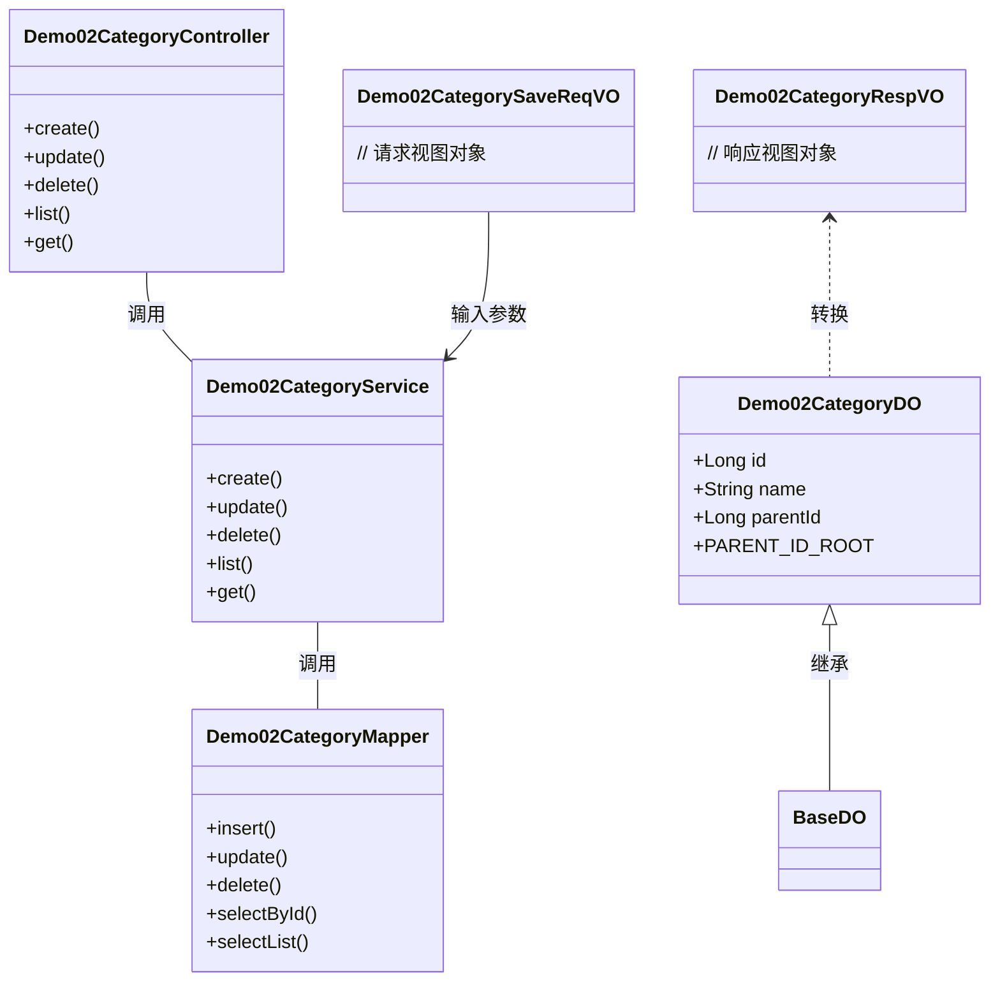
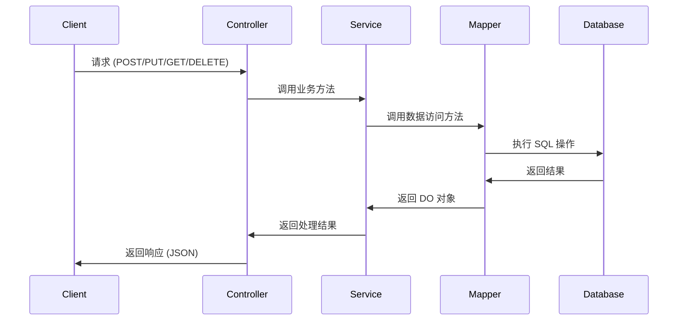
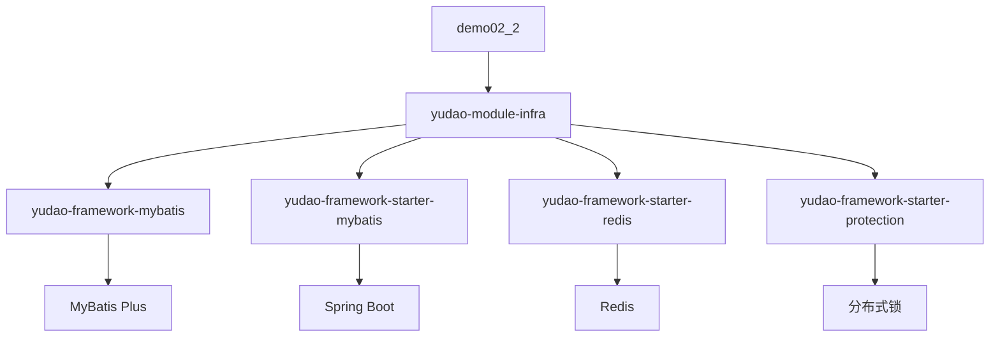
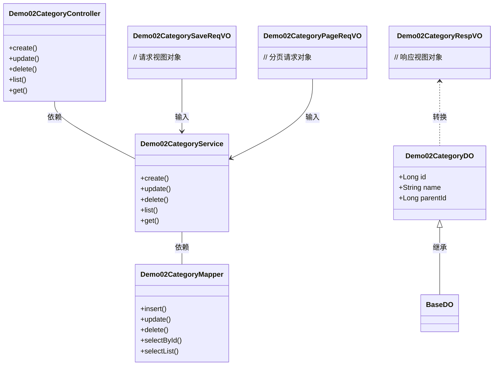
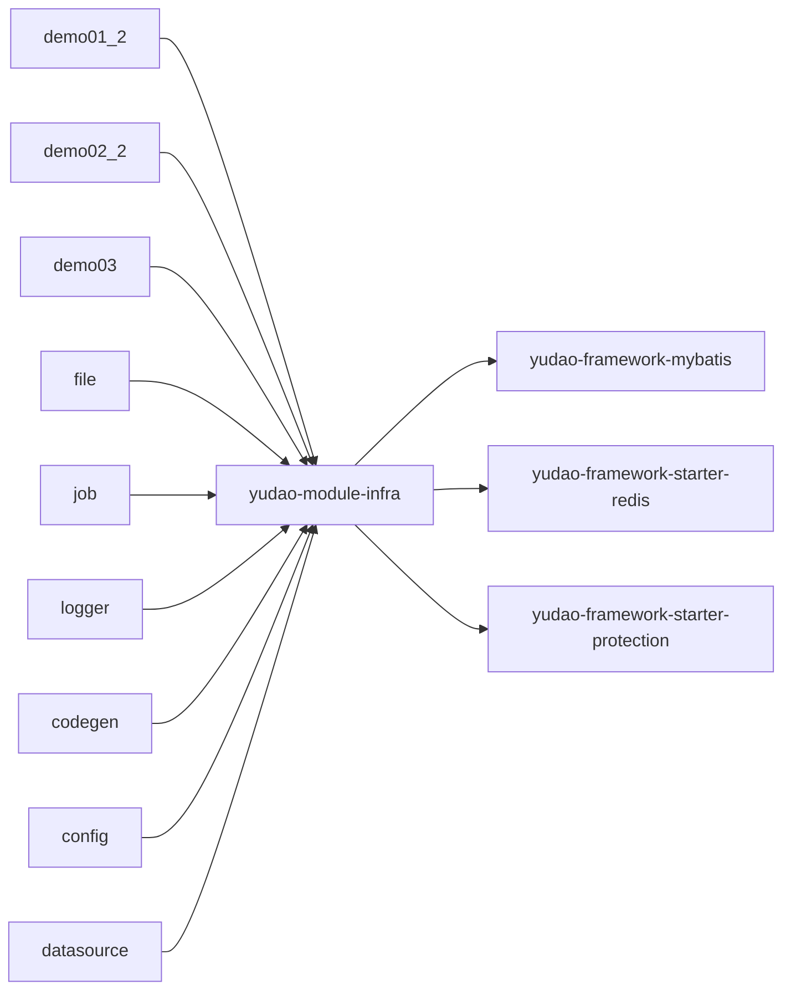

# demo02_2 模块文档

## 1. 模块概述

**demo02_2** 是 `yudao-module-infra` 基础设施模块中的一个演示模块，主要用于展示分层架构和 CRUD 操作的最佳实践。该模块实现了一个分类管理功能，包含父子级分类结构，是学习 Yudao 框架开发模式的典型示例。

模块核心功能包括：
- 分类数据的增删改查（CRUD）
- 父子级分类关系管理
- 分页查询
- 数据对象（DO）与视图对象（VO）的转换

## 2. 模块架构



## 3. 核心组件

### 3.1 Demo02CategoryDO（数据对象）

**文件路径：** `yudao-module-infra/src/main/java/cn/iocoder/yudao/module/infra/dal/dataobject/demo/demo02/Demo02CategoryDO.java`

**描述：** 数据库表 `yudao_demo02_category` 对应的数据对象，继承自 `BaseDO`，包含基础的时间戳字段。

```java
@TableName("yudao_demo02_category")
@KeySequence("yudao_demo02_category_seq")
@Data
@EqualsAndHashCode(callSuper = true)
@ToString(callSuper = true)
@Builder
@NoArgsConstructor
@AllArgsConstructor
public class Demo02CategoryDO extends BaseDO {
    
    public static final Long PARENT_ID_ROOT = 0L;
    
    @TableId
    private Long id;
    
    private String name;
    
    private Long parentId;
}
```

**字段说明：**

| 字段名 | 类型 | 说明 |
|--------|------|------|
| id | Long | 主键，自增 |
| name | String | 分类名称 |
| parentId | Long | 父级分类ID，0表示根节点 |

**常量：**
- `PARENT_ID_ROOT = 0L`：表示根分类的父ID

### 3.2 Demo02CategoryService（服务层）

**文件路径：** `yudao-module-infra/src/main/java/cn/iocoder/yudao/module/infra/service/demo/demo02/Demo02CategoryServiceImpl.java`

**描述：** 服务层接口实现类，负责业务逻辑处理，调用 Mapper 层进行数据操作。

**主要方法：**
- `create(Demo02CategorySaveReqVO reqVO)`：创建分类
- `update(Demo02CategorySaveReqVO reqVO)`：更新分类
- `delete(Long id)`：删除分类
- `list()`：获取分类列表
- `get(Long id)`：获取分类详情

### 3.3 Demo02CategoryController（控制器）

**文件路径：** `yudao-module-infra/src/main/java/cn/iocoder/yudao/module/infra/controller/admin/demo/demo02/Demo02CategoryController.java`

**描述：** RESTful API 控制器，接收前端请求，调用服务层处理，返回响应结果。

**API 接口：**

| HTTP 方法 | 端点 | 描述 |
|-----------|------|------|
| POST | /demo02/category/create | 创建分类 |
| PUT | /demo02/category/update | 更新分类 |
| DELETE | /demo02/category/delete/{id} | 删除分类 |
| GET | /demo02/category/list | 获取分类列表 |
| GET | /demo02/category/get/{id} | 获取分类详情 |

### 3.4 视图对象（VO）

#### Demo02CategorySaveReqVO（创建/更新请求）

**描述：** 用于创建和更新分类的请求参数对象。

```java
@Data
public class Demo02CategorySaveReqVO {
    private Long id;          // 更新时必填
    private String name;      // 分类名称
    private Long parentId;    // 父级分类ID
}
```

#### Demo02CategoryPageReqVO（分页查询请求）

**描述：** 用于分页查询分类的请求参数对象。

```java
@Data
public class Demo02CategoryPageReqVO {
    private String name;      // 分类名称（模糊查询）
    private Long parentId;    // 父级分类ID
    private Integer page;     // 页码
    private Integer size;     // 每页数量
}
```

#### Demo02CategoryRespVO（响应对象）

**描述：** 返回给前端的分类数据视图对象。

```java
@Data
public class Demo02CategoryRespVO {
    private Long id;
    private String name;
    private Long parentId;
    private Long parentIdName; // 父级分类名称（可选）
}
```

#### Demo02CategoryListReqVO（列表响应）

**描述：** 用于列表展示的响应对象。

```java
@Data
public class Demo02CategoryListReqVO {
    private Long id;
    private String name;
    private Long parentId;
}
```

## 4. 数据流



## 5. 依赖关系

### 5.1 模块依赖



### 5.2 类依赖关系



## 6. 配置说明

### 6.1 数据库配置

表名：`yudao_demo02_category`

主键自增序列：`yudao_demo02_category_seq`（适用于 Oracle、PostgreSQL、Kingbase、DB2、H2 等数据库）

### 6.2 MyBatis Plus 配置

```java
@TableName("yudao_demo02_category")
@KeySequence("yudao_demo02_category_seq")
public class Demo02CategoryDO extends BaseDO {
    // ...
}
```

### 6.3 权限配置

demo02_2 模块继承了 `yudao-framework-starter-biz-data-permission` 的数据权限配置，支持基于部门的数据权限控制。

## 7. 与其他模块的关系

### 7.1 与 infra 模块其他子模块的关系



### 7.2 与 UI 层的交互

UI 模块（`yudao-ui`）通过 API 调用 demo02_2 模块的接口：

```typescript
// yudao-ui/yudao-ui-admin-vue3/src/api/infra/demo/demo02/index.ts
// 包含以下 VO 类型：
// - Demo02CategoryListReqVO
// - Demo02CategorySaveReqVO  
// - Demo02CategoryRespVO
```

## 8. 最佳实践

### 8.1 分层架构遵循

1. **Controller 层**：只负责请求接收和响应返回，不包含业务逻辑
2. **Service 层**：处理业务逻辑，调用 Mapper 层
3. **Mapper 层**：只负责数据访问，不包含业务逻辑
4. **DO 层**：与数据库表结构一一对应
5. **VO 层**：与前端交互的数据对象

### 8.2 命名规范

- DO（Data Object）：数据对象，对应数据库表
- VO（View Object）：视图对象，用于前端展示
- ReqVO（Request View Object）：请求视图对象
- RespVO（Response View Object）：响应视图对象
- Service 实现类命名：`*ServiceImpl`
- Controller 命名：`*Controller`

### 8.3 注解使用

- `@TableName`：指定数据库表名
- `@KeySequence`：指定主键自增序列（适用于非 MySQL 数据库）
- `@TableId`：指定主键字段
- `@Data`：Lombok 注解，自动生成 getter/setter/toString/hashCode/build 方法
- `@EqualsAndHashCode(callSuper = true)`：继承父类的 equals 和 hashCode 方法
- `@ToString(callSuper = true)`：继承父类的 toString 方法

## 9. 扩展性设计

### 9.1 父子级分类支持

通过 `parentId` 字段实现分类的父子级关系，支持无限级分类。根节点的 `parentId` 为 `0`（`PARENT_ID_ROOT`）。

### 9.2 可扩展的业务逻辑

Service 层可以轻松扩展以下功能：
- 分类树形结构查询
- 分类移动（改变 parentId）
- 分类删除前的子分类处理
- 分类名称唯一性校验

### 9.3 缓存支持

通过继承 `yudao-framework-starter-redis`，可以轻松添加缓存策略，提高查询性能。

## 10. 测试建议

### 10.1 单元测试

- 测试创建分类（正常、重复名称、父分类不存在）
- 测试更新分类（正常、分类不存在）
- 测试删除分类（正常、有子分类的情况）
- 测试分页查询（正常、无数据、边界条件）
- 测试获取分类（正常、分类不存在）

### 10.2 集成测试

- 测试完整的 CRUD 流程
- 测试父子级关系查询
- 测试权限控制（如果有）

## 11. 参考文档

- [yudao-framework-mybatis 模块](mybatis.md) - MyBatis 基础配置
- [yudao-framework-starter-redis 模块](redis.md) - Redis 缓存支持
- [yudao-framework-starter-protection 模块](protection.md) - 分布式锁和限流
- [yudao-module-system 模块](system.md) - 系统管理模块（权限、用户等）
- [yudao-ui 模块](ui.md) - 前端 Vue3 项目
