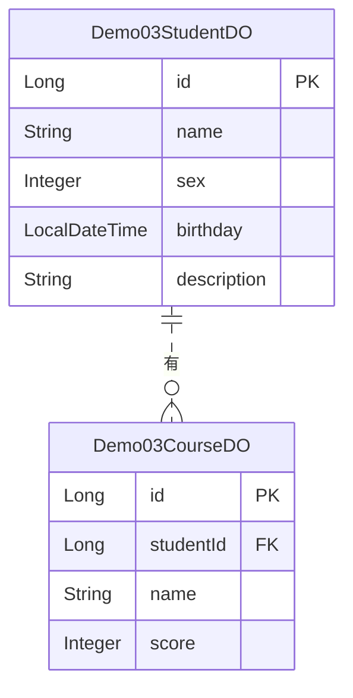

# demo03 模块文档

## 概述
demo03 模块是 yudao-module-infra 中的一个演示模块，用于展示学生和课程的基本数据模型。该模块包含两个核心实体：学生（Demo03StudentDO）和课程（Demo03CourseDO）。

## 架构概述
下图展示了 demo03 模块的数据模型架构：

## 核心组件

### Demo03StudentDO
学生数据对象，对应数据库表 `yudao_demo03_student`。

字段说明：
- id: 编号，主键
- name: 名字
- sex: 性别（对应系统用户性别枚举）
- birthday: 出生日期
- description: 简介

### Demo03CourseDO
学生课程数据对象，对应数据库表 `yudao_demo03_course`。

字段说明：
- id: 编号，主键
- studentId: 学生编号，外键关联到 Demo03StudentDO 的 id
- name: 课程名称
- score: 分数

## 与其他模块的关系
demo03 模块是一个独立的演示模块，目前没有与其他业务模块的直接依赖。它主要用于演示数据访问层的基本用法。

注意：由于本模块仅包含数据对象，控制器和服务层的实现（如 erp、inner、normal 目录下的控制器）不在本文档的讨论范围内。如果需要了解完整的 demo03 功能，请参考对应的控制器和服务实现。