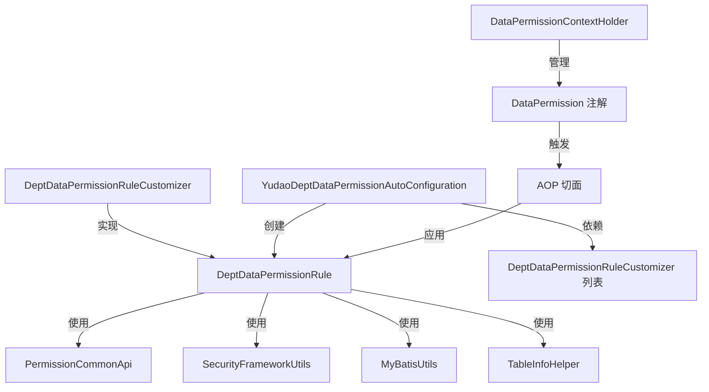
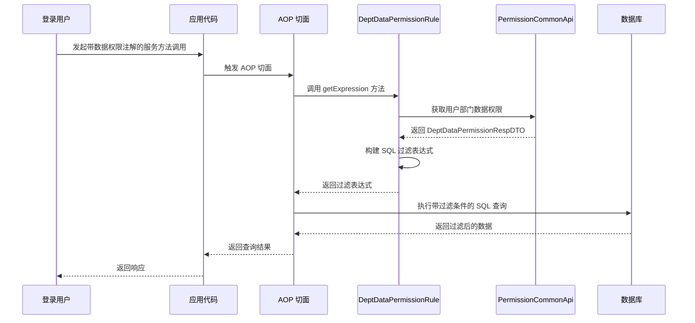

# Dept 模块文档

## 概述

Dept 模块是 Yudao 框架中数据权限功能的一部分，专门负责基于部门（Dept）的数据权限控制。通过该模块，系统可以根据当前登录用户所属的部门信息，自动在 SQL 查询中添加部门过滤条件，实现数据的隔离和访问控制。

该模块的核心是 `DeptDataPermissionRule` 类，它实现了 `DataPermissionRule` 接口，用于构建基于部门的数据权限表达式。同时，提供了 `DeptDataPermissionRuleCustomizer` 接口，允许开发者自定义部门数据权限规则的应用范围（即哪些表的哪些字段需要进行部门过滤）。

## 核心组件

### 1. DeptDataPermissionRuleCustomizer (接口)

- **位置**：`yudao-framework/yudao-spring-boot-starter-biz-data-permission/src/main/java/cn/iocoder/yudao/framework/datapermission/core/rule/dept/DeptDataPermissionRuleCustomizer.java`
- **职责**：定义了自定义部门数据权限规则的接口。通过实现此接口，开发者可以指定哪些实体类（或表）的哪些字段需要基于部门 ID 进行过滤，以及哪些字段需要基于用户 ID 进行过滤（当用户只能查看自己的数据时）。
- **关键方法**：
  - `void customize(DeptDataPermissionRule rule)`：用于自定义权限规则。在该方法中，开发者应调用 `rule.addDeptColumn(...)` 或 `rule.addUserColumn(...)` 来配置过滤规则。

### 2. DeptDataPermissionRule (类)

- **位置**：`yudao-framework/yudao-spring-boot-starter-biz-data-permission/src/main/java/cn/iocoder/yudao/framework/datapermission/core/rule/dept/DeptDataPermissionRule.java`
- **职责**：实现基于部门的数据权限规则。它根据当前登录用户的部门数据权限配置（包括是否查看全部数据、可查看的部门列表、是否只能查看自己的数据），动态生成 SQL 过滤条件。
- **工作原理**：
  1. 从当前登录用户的上下文中获取部门数据权限信息（`DeptDataPermissionRespDTO`）。
  2. 如果用户是管理员且拥有全部数据权限，则不添加任何过滤条件。
  3. 如果用户既不能查看任何部门也不能查看自己的数据，则返回一个永假条件（`WHERE null = null`）。
  4. 否则，根据配置的部门列表和用户是否可查看自己的数据，构建部门过滤条件（`dept_id IN (...)`）和用户过滤条件（`user_id = ?`），并将它们用 OR 连接（即 `WHERE (dept_id IN (...) OR user_id = ?)`）。
- **可配置项**：
  - 通过 `addDeptColumn` 方法指定实体类对应的表中用于部门过滤的字段名（默认为 `dept_id`）。
  - 通过 `addUserColumn` 方法指定实体类对应的表中用于用户过滤的字段名（默认为 `user_id`）。

### 3. YudaoDeptDataPermissionAutoConfiguration (类)

- **位置**：`yudao-framework/yudao-spring-boot-starter-biz-data-permission/src/main/java/cn/iocoder/yudao/framework/datapermission/config/YudaoDeptDataPermissionAutoConfiguration.java`
- **职责**：Spring Boot 自动配置类，用于在满足条件时自动创建 `DeptDataPermissionRule`  bean。
- **条件**：
  - 当类路径中存在 `LoginUser` 类时生效。
  - 当存在至少一个 `DeptDataPermissionRuleCustomizer` 实现类时生效。
- **工作流程**：
  1. 创建 `DeptDataPermissionRule` 实例，注入 `PermissionCommonApi` 依赖。
  2. 调用所有注入的 `DeptDataPermissionRuleCustomizer` 实例的 `customize` 方法，以完成规则的自定义配置。
  3. 将配置好的 `DeptDataPermissionRule` 作为 bean 注入到 Spring 容器中。

### 4. DataPermissionContextHolder (类)

- **位置**：`yudao-framework/yudao-spring-boot-starter-biz-data-permission/src/main/java/cn/iocoder/yudao/framework/datapermission/core/aop/DataPermissionContextHolder.java`
- **职责**：管理 `DataPermission` 注解的上下文，使用 `ThreadLocal` 存储当前线程的数据权限注解信息，支持嵌套调用。
- **关键方法**：
  - `static DataPermission get()`：获取当前线程的数据权限注解。
  - `static void add(DataPermission dataPermission)`：将数据权限注解压入栈中。
  - `static DataPermission remove()`：从栈中弹出并返回数据权限注解。
  - `static void clear()`：清除当前线程的数据权限上下文（主要用于单元测试）。

### 5. DataPermissionUtils (类)

- **位置**：`yudao-framework/yudao-spring-boot-starter-biz-data-permission/src/main/java/cn/iocoder/yudao/framework/datapermission/core/util/DataPermissionUtils.java`（未提供代码，但根据命名和上下文可知）
- **职责**：提供数据权限相关的工具方法，例如获取当前用户的数据权限信息、处理数据权限注解等。

## 架构与依赖

Dept 模块主要依赖于以下其他模块或组件：

- **系统模块**：通过 `PermissionCommonApi` 获取用户的部门数据权限信息。
- **安全模块**：通过 `SecurityFrameworkUtils` 获取当前登录用户信息。
- **MyBatis 框架**：通过 `MyBatisUtils` 构建数据库表和列的引用，以及通过 `TableInfoHelper` 获取实体类对应的表名。
- **Spring AOP**：数据权限注解的处理通常通过 AOP 切面实现（虽然未在提供的代码中直接看到，但结合 `DataPermissionContextHolder` 可知）。

### 模块关系图



## 数据流

以下是数据权限在查询执行过程中的数据流：



## 使用示例

### 步骤 1：创建自定义规则配置器

```java
@Component
public class MyDeptDataPermissionRuleCustomizer implements DeptDataPermissionRuleCustomizer {

    @Override
    public void customize(DeptDataPermissionRule rule) {
        // 配置用户表的 dept_id 字段进行部门过滤
        rule.addDeptColumn(UserDO.class);
        // 配置订单表的 user_id 字段进行用户过滤（当用户只能查看自己的订单时）
        rule.addUserColumn(OrderDO.class, "user_id");
        // 如果表的部门字段不是默认的 dept_id，可以自定义字段名
        // rule.addDeptColumn(PostDO.class, "dept_id");
    }
}
```

### 步骤 2：在需要数据权限控制的方法上添加注解

```java
@Service
public class UserService {

    @DataPermission
    public List<UserDO> getUserList(PageParam pageParam) {
        // 此方法的查询会自动添加部门数据权限过滤条件
        return userMapper.selectList(pageParam);
    }
}
```

### 步骤 3：确保 Spring Boot 自动配置生效

由于 `YudaoDeptDataPermissionAutoConfiguration` 会在存在 `DeptDataPermissionRuleCustomizer` 实现时自动生效，无需额外配置。

## 与其他模块的关系

Dept 模块是数据权限功能的一个具体实现。数据权限功能还包括基于角色、数据范围等其他维度的实现。Dept 模块专注于部门维度的数据权限控制。

在系统中，数据权限通常通过以下方式工作：
1. 用户登录后，系统根据用户角色和分配的数据权限获取其可访问的部门列表（或是否只能查看自己的数据）。
2. 这些信息被存储在登录用户的上下文中。
3. 当执行带有 `@DataPermission` 注解的方法时，AOP 切面会触发数据权限规则的生成。
4. `DeptDataPermissionRule` 根据用户的部门数据权限信息和自定义配置生成 SQL 过滤条件。
5. 过滤条件被自动拼接到原始 SQL 查询中，实现数据隔离。

## 注意事项

1. **字段名一致性**：使用 `DeptDataPermissionRule` 时，需要确保目标表中存在对应的部门字段（默认为 `dept_id`）或用户字段（默认为 `user_id`）。如果字段名不同，需通过 `addDeptColumn` 或 `addUserColumn` 方法进行自定义。
2. **性能考虑**：部门数据权限信息会被缓存在登录用户的上下文中，避免在同一次请求中重复获取。
3. **管理员特权**：系统管理员（`UserTypeEnum.ADMIN`）默认拥有全部数据权限，不会受部门过滤限制。
4. **自定义过滤逻辑**：如果需要更复杂的过滤逻辑（如同时使用部门和用户过滤），可以在 `DeptDataPermissionRuleCustomizer` 中同时调用 `addDeptColumn` 和 `addUserColumn`，规则内部会将它们用 OR 条件组合。

## 结论

Dept 模块为 Yudao 框架提供了灵活且强大的基于部门的数据权限控制机制。通过简单的配置和注解使用，开发者可以轻松在服务层实现数据访问控制，确保用户只能访问其被授权的数据。