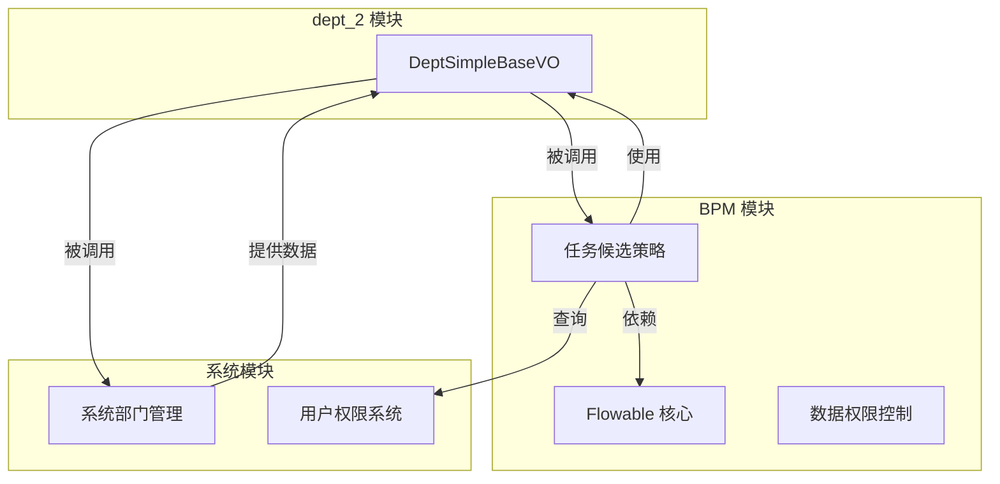
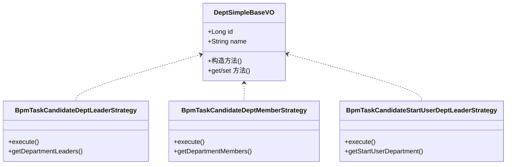
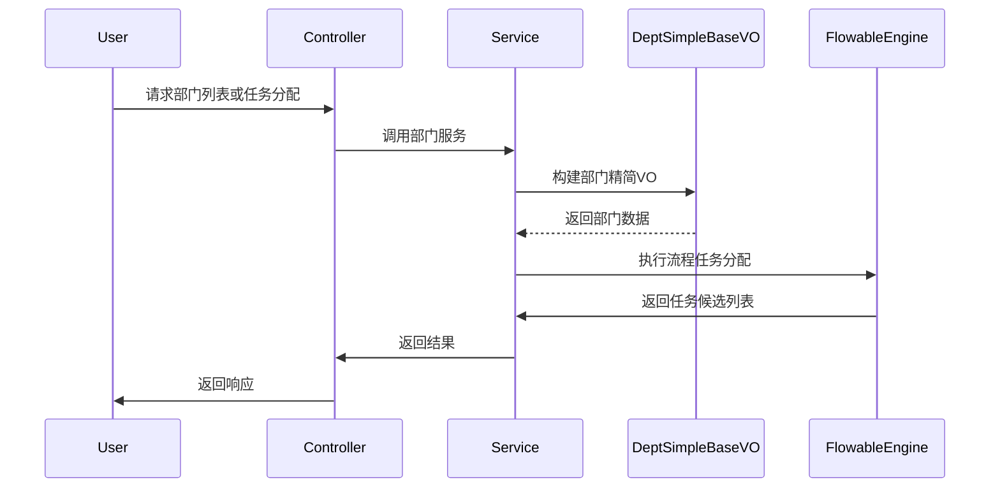

# dept_2 模块文档 - BPM 部门管理

## 1. 模块概述

dept_2 模块是 BPM（业务流程管理）模块中的部门管理子系统，主要负责提供部门相关的精简数据视图和流程任务中的部门策略支持。该模块与 Flowable 工作流引擎深度集成，实现了基于部门的任务候选分配策略，支持在 BPM 流程中根据部门结构进行任务分配和数据权限控制。

## 2. 核心功能

### 2.1 部门精简信息视图
提供部门的基础信息 VO（View Object），用于在前端展示和 API 响应中传输部门的基本信息，避免传输冗余数据。

### 2.2 部门任务分配策略
在 BPM 流程任务中，基于部门结构实现多种任务候选分配策略，包括：
- 部门领导分配策略
- 部门成员分配策略
- 启动用户部门领导分配策略

## 3. 架构设计

### 3.1 模块依赖关系



### 3.2 组件关系图



## 4. 核心组件说明

### 4.1 DeptSimpleBaseVO

**文件路径**: `yudao-module-bpm/src/main/java/cn/iocoder/yudao/module/bpm/controller/admin/base/dept/DeptSimpleBaseVO.java`

**类描述**: 部门精简信息视图对象，用于传输部门的基本信息（ID 和名称），不包含冗余字段，适用于前端展示和 API 响应。

**字段说明**:

| 字段名 | 类型 | 描述 | 是否必填 | 示例值 |
|--------|------|------|----------|--------|
| id | Long | 部门编号 | 是 | 1 |
| name | String | 部门名称 | 是 | 技术部 |

**使用场景**:
- 前端部门选择器下拉框
- 流程任务分配中的部门展示
- API 响应中的部门信息传输

**代码示例**:
```java
@Schema(description = "部门精简信息 VO")
@Data
public class DeptSimpleBaseVO {
    @Schema(description = "部门编号", requiredMode = Schema.RequiredMode.REQUIRED, example = "1")
    private Long id;
    
    @Schema(description = "部门名称", requiredMode = Schema.RequiredMode.REQUIRED, example = "技术部")
    private String name;
}
```

### 4.2 部门策略类（参考）

虽然 dept_2 模块主要提供 DeptSimpleBaseVO，但该 VO 被 BPM 模块中的多个部门策略类使用，这些策略类位于 `yudao-module-bpm/src/main/java/cn/iocoder/yudao/module/bpm/framework/flowable/core/candidate/strategy/dept/` 目录下：

- **BpmTaskCandidateDeptLeaderStrategy**: 部门领导任务候选策略，将任务分配给指定部门的领导
- **BpmTaskCandidateDeptMemberStrategy**: 部门成员任务候选策略，将任务分配给指定部门的成员
- **BpmTaskCandidateStartUserDeptLeaderStrategy**: 启动用户部门领导策略，将任务分配给流程启动用户的部门领导

## 5. 数据流图



## 6. API 接口说明

### 6.1 部门信息查询

**请求端点**: `GET /bpm/dept/simple`

**响应示例**:
```json
[
  {
    "id": 1,
    "name": "技术部"
  },
  {
    "id": 2,
    "name": "市场部"
  }
]
```

**说明**: 返回所有部门的精简信息，用于前端选择器展示。

## 7. 与其他模块的集成

### 7.1 与系统模块（system）集成

dept_2 模块的部门数据来源于系统模块的部门管理功能，通过 API 获取部门基础信息。系统模块负责部门的 CRUD 操作，dept_2 模块仅提供精简视图供 BPM 流程使用。

### 7.2 与 BPM 核心模块集成

dept_2 模块的 DeptSimpleBaseVO 被 BPM 核心模块中的任务候选策略类使用，在流程任务分配时作为部门信息的载体。

### 7.3 与 Flowable 引擎集成

通过 Flowable 的自定义任务候选策略，实现基于部门的智能任务分配，支持多种部门分配策略。

## 8. 扩展性设计

### 8.1 策略模式

部门任务分配策略采用策略模式设计，便于扩展新的部门分配策略。新增策略只需实现统一的策略接口，无需修改现有代码。

### 8.2 视图对象隔离

使用 DeptSimpleBaseVO 作为视图对象，隔离了内部数据模型和外部传输模型，便于后续扩展部门信息而不影响外部接口。

## 9. 参考文档

- [系统模块文档](system.md) - 部门管理基础功能
- [BPM 模块文档](bpm.md) - 业务流程管理核心功能
- [Flowable 集成文档](flowable.md) - Flowable 引擎集成说明

## 10. 维护说明

- 该模块主要提供部门精简视图，业务逻辑集中在 BPM 模块的策略类中
- 新增部门字段时，需同步更新 DeptSimpleBaseVO 和相关策略类
- 部门策略的扩展应遵循开闭原则，通过新增策略类实现
