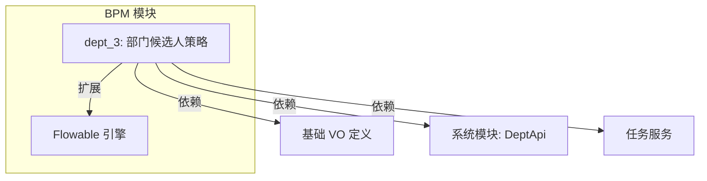
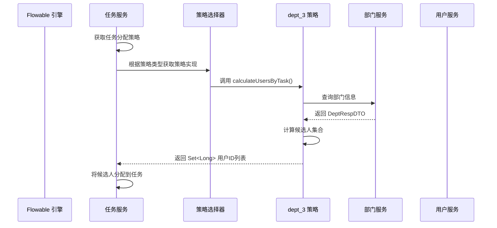
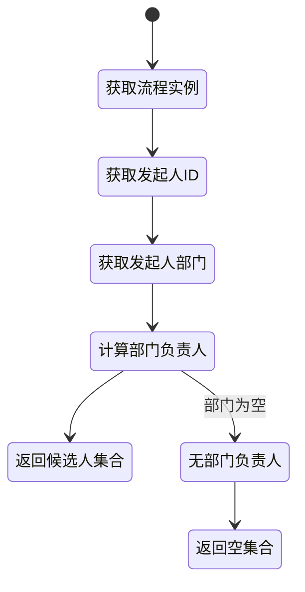
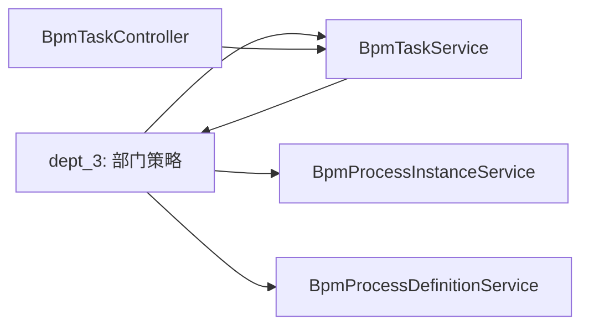

# dept_3 模块文档 - BPM 部门候选人策略

## 1. 模块概述

dept_3 模块是 BPM（业务流程管理）模块的核心组件之一，专注于**基于部门的任务候选人策略**。该模块实现了多种动态任务分配策略，根据组织架构和流程上下文自动确定任务的处理人员。

### 核心功能
- 支持多种部门层级候选人策略（部门负责人、部门成员等）
- 实现发起人自选和审批人自选机制
- 提供多级部门领导链的候选人计算
- 与 Flowable 引擎无缝集成，扩展任务分配能力

### 模块定位


## 2. 架构设计

### 2.1 整体架构
dept_3 模块采用策略模式设计，通过统一的 `BpmTaskCandidateStrategy` 接口实现多种候选人分配策略。

```mermaid
classDiagram
    class BpmTaskCandidateStrategy {
        <<interface>>
        +BpmTaskCandidateStrategyEnum getStrategy()
        +void validateParam(String param)
        +Set<Long> calculateUsers(String param)
        +Set<Long> calculateUsersByTask(DelegateExecution execution, String param)
        +Set<Long> calculateUsersByActivity(BpmnModel bpmnModel, String activityId, String param, Long startUserId, String processDefinitionId, Map<String, Object> processVariables)
    }

    class BpmTaskCandidateDeptLeaderStrategy {
        +getStrategy(): BpmTaskCandidateStrategyEnum
        +validateParam(String param): void
        +calculateUsers(String param): Set<Long>
    }

    class BpmTaskCandidateDeptMemberStrategy {
        +getStrategy(): BpmTaskCandidateStrategyEnum
        +validateParam(String param): void
        +calculateUsers(String param): Set<Long>
    }

    class BpmTaskCandidateStartUserDeptLeaderStrategy {
        +getStrategy(): BpmTaskCandidateStrategyEnum
        +validateParam(String param): void
        +calculateUsersByTask(DelegateExecution execution, String param): Set<Long>
        +calculateUsersByActivity(...): Set<Long>
        +getStartUserDept(Long startUserId, String param): Set<Long>
    }

    class BpmTaskCandidateStartUserDeptLeaderMultiStrategy {
        +getStrategy(): BpmTaskCandidateStrategyEnum
        +validateParam(String param): void
        +calculateUsersByTask(DelegateExecution execution, String param): Set<Long>
        +calculateUsersByActivity(...): Set<Long>
    }

    class BpmTaskCandidateDeptLeaderMultiStrategy {
        +getStrategy(): BpmTaskCandidateStrategyEnum
        +validateParam(String param): void
        +calculateUsers(String param): Set<Long>
    }

    class BpmTaskCandidateApproveUserSelectStrategy {
        +getStrategy(): BpmTaskCandidateStrategyEnum
        +isParamRequired(): boolean
        +calculateUsersByTask(DelegateExecution execution, String param): Set<Long>
        +calculateUsersByActivity(...): Set<Long>
    }

    class BpmTaskCandidateStartUserSelectStrategy {
        +getStrategy(): BpmTaskCandidateStrategyEnum
        +isParamRequired(): boolean
        +calculateUsersByTask(DelegateExecution execution, String param): Set<Long>
        +calculateUsersByActivity(...): Set<Long>
    }

    BpmTaskCandidateStrategy <|-- BpmTaskCandidateDeptLeaderStrategy
    BpmTaskCandidateStrategy <|-- BpmTaskCandidateDeptMemberStrategy
    BpmTaskCandidateStrategy <|-- BpmTaskCandidateStartUserDeptLeaderStrategy
    BpmTaskCandidateStrategy <|-- BpmTaskCandidateStartUserDeptLeaderMultiStrategy
    BpmTaskCandidateStrategy <|-- BpmTaskCandidateDeptLeaderMultiStrategy
    BpmTaskCandidateStrategy <|-- BpmTaskCandidateApproveUserSelectStrategy
    BpmTaskCandidateStrategy <|-- BpmTaskCandidateStartUserSelectStrategy
```



### 2.2 依赖关系
- **核心依赖**：
  - `BpmTaskCandidateStrategyEnum`：策略枚举定义
  - `DeptApi`：部门服务接口（来自系统模块）
  - `AdminUserApi`：用户服务接口（来自系统模块）
  - `BpmProcessInstanceService`：流程实例服务
  - `FlowableUtils`：Flowable 工具类

- **外部依赖**：
  - Flowable BPMN 引擎
  - Hutool 工具库
  - Guava 集合工具

## 3. 核心组件详解

### 3.1 策略接口：BpmTaskCandidateStrategy

所有候选人策略都实现该接口，定义了统一的计算规则：

```java
public interface BpmTaskCandidateStrategy {
    BpmTaskCandidateStrategyEnum getStrategy();  // 获取策略类型
    void validateParam(String param);            // 参数校验
    Set<Long> calculateUsers(String param);      // 计算候选人（无上下文）
    Set<Long> calculateUsersByTask(DelegateExecution execution, String param);  // 基于任务上下文
    Set<Long> calculateUsersByActivity(BpmnModel bpmnModel, String activityId, String param, Long startUserId, String processDefinitionId, Map<String, Object> processVariables);  // 基于活动上下文
}
```

### 3.2 部门负责人策略

#### BpmTaskCandidateDeptLeaderStrategy
- **策略类型**：`DEPT_LEADER`
- **功能**：指定部门的负责人作为候选人
- **参数格式**：部门 ID 列表（逗号分隔）
- **使用场景**：需要指定特定部门的负责人处理任务

#### BpmTaskCandidateStartUserDeptLeaderStrategy
- **策略类型**：`START_USER_DEPT_LEADER`
- **功能**：获取流程发起人的部门负责人
- **参数**：部门层级（正整数）
- **使用场景**：任务自动分配给发起人的直属上级

#### BpmTaskCandidateStartUserDeptLeaderMultiStrategy
- **策略类型**：`START_USER_DEPT_LEADER_MULTI`
- **功能**：获取发起人连续多级部门的负责人
- **参数**：部门层级（正整数）
- **使用场景**：需要多级审批链的场景

### 3.3 部门成员策略

#### BpmTaskCandidateDeptMemberStrategy
- **策略类型**：`DEPT_MEMBER`
- **功能**：获取部门的全体成员作为候选人
- **参数格式**：部门 ID 列表（逗号分隔）
- **使用场景**：部门内任意成员均可处理任务

#### BpmTaskCandidateDeptLeaderMultiStrategy
- **策略类型**：`MULTI_DEPT_LEADER_MULTI`
- **功能**：获取多个部门的多级部门负责人
- **参数格式**：`部门ID列表|层级`（如 `1,2,3|2`）
- **使用场景**：跨部门的多级审批

### 3.4 自选策略

#### BpmTaskCandidateApproveUserSelectStrategy
- **策略类型**：`APPROVE_USER_SELECT`
- **功能**：审批人在审批时选择下一个节点的审批人
- **参数**：无
- **使用场景**：需要灵活指定下一审批人的流程

#### BpmTaskCandidateStartUserSelectStrategy
- **策略类型**：`START_USER_SELECT`
- **功能**：发起人自选审批人
- **参数**：无
- **使用场景**：发起人需要指定特定人员处理任务

## 4. 数据流与交互流程

### 4.1 任务候选人计算流程


### 4.2 部门负责人策略执行流程


## 5. 配置与使用

### 5.1 策略注册
所有策略类通过 `@Component` 注解自动注册到 Spring 容器，策略枚举 `BpmTaskCandidateStrategyEnum` 定义了所有可用的策略类型：

```java
public enum BpmTaskCandidateStrategyEnum {
    DEPT_LEADER,                    // 部门负责人
    DEPT_MEMBER,                    // 部门成员
    START_USER_DEPT_LEADER,         // 发起人部门负责人
    START_USER_DEPT_LEADER_MULTI,   // 发起人多级部门负责人
    MULTI_DEPT_LEADER_MULTI,        // 多级部门负责人
    START_USER_SELECT,              // 发起人自选
    APPROVE_USER_SELECT             // 审批人自选
}
```

### 5.2 BPMN 配置示例
在 BPMN 流程图中，通过扩展属性配置候选人策略：

```xml
<userTask id="approveTask" name="审批">
    <extensionElements>
        <bpm:candidateStrategy>START_USER_DEPT_LEADER</bpm:candidateStrategy>
        <bpm:candidateParam>1</bpm:candidateParam> <!-- 层级1 -->
    </extensionElements>
</userTask>
```

## 6. 模块交互关系

### 6.1 与 BPM 模块其他组件的交互


### 6.2 与系统模块的交互
- **系统模块(dept_2)**：提供基础 VO 定义（如 `DeptSimpleBaseVO`）
- **系统模块(user)**：提供用户信息查询（`AdminUserApi`）
- **系统模块(dept)**：提供部门信息查询（`DeptApi`）

## 7. 扩展点

### 7.1 自定义策略
要实现新的候选人策略，需要：
1. 实现 `BpmTaskCandidateStrategy` 接口
2. 注册到 Spring 容器（`@Component`）
3. 在 `BpmTaskCandidateStrategyEnum` 中添加新的策略类型
4. 在 BPMN 配置中使用新的策略类型

### 7.2 参数扩展
策略的 `param` 参数可以根据具体需求扩展格式，例如：
- 部门策略：`"1,2,3"`（多个部门 ID）
- 层级策略：`"2"`（层级数）
- 复合策略：`"1,2|3"`（部门ID列表|层级）

## 8. 参考文档

- [BPM 模块主文档](../bpm.md)
- [系统模块文档](../system.md)
- [Flowable 引擎集成文档](../flowable-integration.md)
- [BpmTaskCandidateStrategyEnum 枚举说明](../enums/BpmTaskCandidateStrategyEnum.md)
