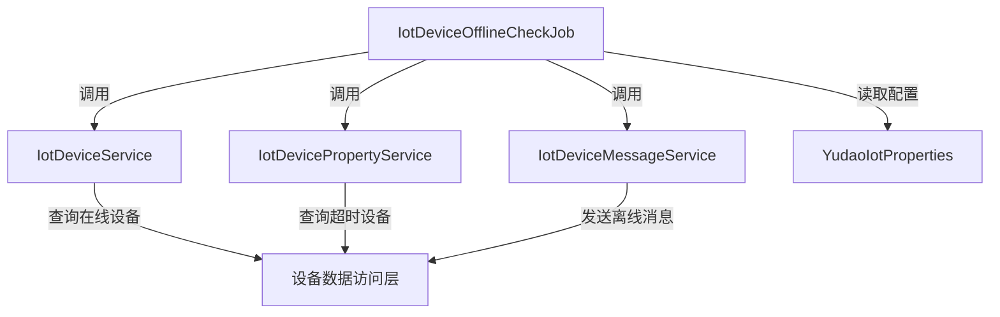
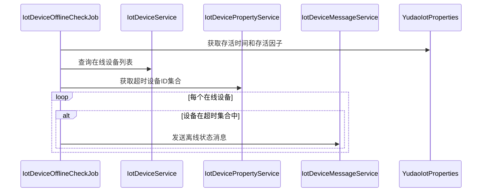

# IotDeviceOfflineCheckJob 模块文档

## 1. 模块概述

IotDeviceOfflineCheckJob 是 IoT 模块中的一个定时任务（Job），用于周期性检测和标记离线的 IoT 设备。该任务基于设备最后一次上报消息的时间判断设备是否离线，若超过配置的存活时间阈值则将设备状态更新为离线。

## 2. 架构设计

### 2.1 模块定位
IotDeviceOfflineCheckJob 属于 IoT 模块的作业调度层，负责设备状态的离线检测。它不直接处理设备通信，而是通过调用 IoT 服务层的接口来获取设备状态和发送状态更新消息。

### 2.2 核心依赖
该作业依赖以下服务组件：
- `YudaoIotProperties`: 提供 IoT 相关配置（如设备存活时间和存活因子）
- `IotDeviceService`: 查询设备列表和状态
- `IotDevicePropertyService`: 获取最近未上报的设备 ID 列表
- `IotDeviceMessageService`: 发送设备状态消息（特别是离线状态消息）

### 2.3 多租户支持
作业通过 `@TenantJob` 注解实现多租户隔离，确保在多租户环境中只处理当前租户的设备数据。

## 3. 核心功能

### 3.1 离线检测逻辑
1. 获取所有状态为“在线”的设备列表
2. 根据配置的存活时间和存活因子计算超时时间点
3. 查询在超时时间点之前未上报属性的设备 ID 集合
4. 对于在线设备中存在于超时集合的设备，通过发送离线状态消息将其标记为离线

### 3.2 关键方法
- `execute(String param)`: 作业的主要执行入口
- `getTimeoutTime()`: 计算超时时间点（当前时间减去存活时间乘以存活因子）

## 4. 与其他模块的交互

### 4.1 服务层交互

### 4.2 数据流

## 5. 配置说明

作业依赖以下配置项（通过 `YudaoIotProperties` 注入）：
- `keepAliveTime`: 设备存活基础时间（纳秒）
- `keepAliveFactor`: 存活时间倍数因子

实际超时时间 = `keepAliveTime` × `keepAliveFactor`

例如：若 `keepAliveTime` 为 30000000000 nanoseconds (30秒)，`keepAliveFactor` 为 1.5，则超时时间为 45秒。

## 6. 实现注意事项

### 6.1 为什么不直接更新设备状态？
代码注释说明：通过 `IotDeviceMessageService` 发送离线状态消息可以触发一系列后续处理（如日志记录、事件触发等），而直接更新状态可能绕过这些处理链路。

### 6.2 空列表处理
当没有在线设备时，作业直接返回空 JSON 数组，避免无谓的后续处理。

### 6.3 租户隔离
通过 `@TenantJob` 注解，作业在执行时会自动绑定当前租户上下文，确保只处理属于当前租户的设备数据。

## 7. 与相关模块的关联

- [IoT 设备服务](device_7.md): 提供设备状态查询和管理功能
- [IoT 设备属性服务](property_2.md): 负责设备属性的存储和查询
- [IoT 设备消息服务](message_11.md): 处理设备上报消息和状态转换
- [IoT 配置](config_51.md): 定义 IoT 模块的全局配置项

> 注：上述链接中的文档需在对应模块的文档文件中查看（如 device_7.md、property_2.md 等），本文档仅作关联说明，避免信息重复。