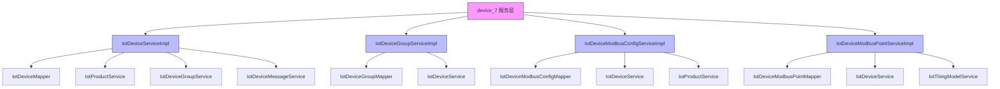

# device_7 模块文档

## 概述

device_7 模块是 Yudao 框架中 IoT (物联网) 模块的设备服务层实现。该模块提供了 IoT 设备的核心业务逻辑，包括设备管理、设备分组、Modbus 配置和点位管理等功能。

## 架构概述

device_7 模块位于 IoT 模块的服务层，负责处理与 IoT 设备相关的所有业务逻辑。它与以下组件进行交互：

- 数据访问层 (DAO)：通过 MyBatis Mapper 访问数据库
- 产品服务：获取产品信息以验证设备
- 设备组服务：管理设备分组
- 设备消息服务：发送和处理设备消息
- 物模型服务：验证物模型属性

## 子模块

device_7 模块可以进一步划分为以下子模块：

1. [设备管理服务](device_7_device.md) - 负责设备的创建、更新、删除、状态管理等核心功能
2. [设备分组服务](device_7_group.md) - 负责设备分组的创建、更新、删除和查询
3. [Modbus 配置服务](device_7_modbus_config.md) - 负责 Modbus 连接配置的管理
4. [Modbus 点位服务](device_7_modbus_point.md) - 负责 Modbus 点位配置的管理

## 功能说明

device_7 模块提供以下核心功能：

1. **设备生命周期管理**：设备的创建、更新、删除、查询和状态转换
2. **设备分组管理**：设备分组的创建、更新、删除和查询
3. **Modbus 配置管理**：Modbus 连接参数的配置和验证
4. **Modbus 点位管理**：Modbus 点位的创建、更新、删除和查询
5. **网关-子设备关系管理**：处理网关设备与子设备的绑定和解绑
6. **设备动态注册**：支持设备的自动注册和子设备的动态注册
7. **设备拓扑管理**：处理设备拓扑关系的变更通知

## 与其他模块的关系

device_7 模块主要与以下模块交互：

- [产品服务](device_7_product.md)：获取产品信息以验证设备属性
- [物模型服务](device_7_thingmodel.md)：验证物模型属性和数据点
- [设备消息服务](device_7_message.md)：发送和处理设备消息
- [缓存服务](device_7_cache.md)：通过 Redis 缓存设备信息以提高性能

有关这些相关模块的详细信息，请参考它们各自的文档。