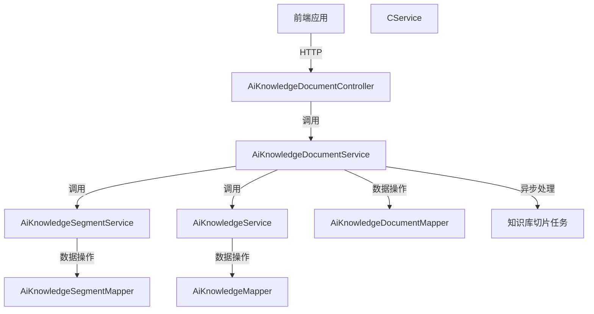
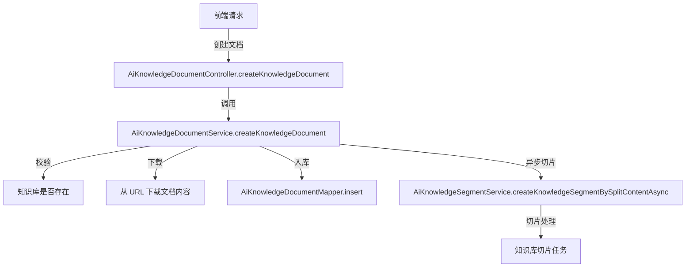
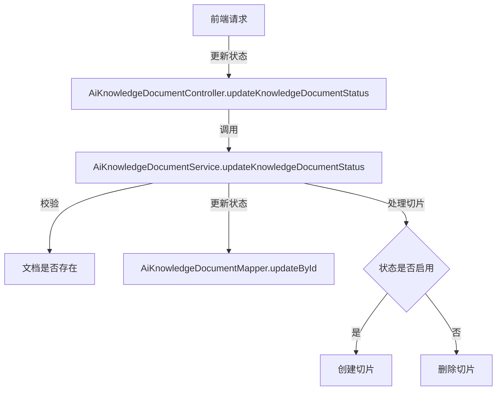

# AI 知识库文档模块

## 模块概述

AI 知识库文档模块是系统中用于管理和维护 AI 知识库文档的核心模块。该模块提供了文档的创建、更新、删除、状态管理以及分页查询等功能，支持文档的批量导入和异步切片处理，确保文档内容能够高效地被 AI 系统使用。

### 主要功能

- **文档管理**：支持单个和批量创建文档，文档内容从 URL 下载并解析。
- **文档状态管理**：支持启用/禁用文档状态，控制文档是否可被 AI 系统检索。
- **文档切片处理**：文档内容会被异步切片，以便 AI 系统高效检索和处理。
- **文档更新与删除**：支持文档的更新和删除操作，确保知识库的维护性和时效性。

### 核心组件

#### 1. 控制器层 (Controller)

**`AiKnowledgeDocumentController`**

- **功能**：提供 RESTful API 接口，处理文档的 CRUD 操作和状态管理。
- **主要方法**：
  - `getKnowledgeDocumentPage`：分页查询文档列表。
  - `getKnowledgeDocument`：获取单个文档详情。
  - `createKnowledgeDocument`：创建单个文档。
  - `createKnowledgeDocumentList`：批量创建文档。
  - `updateKnowledgeDocument`：更新文档信息。
  - `updateKnowledgeDocumentStatus`：更新文档状态。
  - `deleteKnowledgeDocument`：删除文档。

#### 2. 服务层 (Service)

**`AiKnowledgeDocumentService`**

- **功能**：实现文档的业务逻辑，包括文档的创建、更新、删除、状态管理和切片处理。
- **核心方法**：
  - `createKnowledgeDocument`：创建单个文档，包括下载文档内容、入库和异步切片。
  - `createKnowledgeDocumentList`：批量创建文档，支持并行处理。
  - `updateKnowledgeDocument`：更新文档信息，支持重新切片。
  - `updateKnowledgeDocumentStatus`：更新文档状态，控制切片的创建或删除。
  - `deleteKnowledgeDocument`：删除文档及其对应的切片。
  - `validateKnowledgeDocumentExists`：校验文档是否存在。
  - `readUrl`：从 URL 下载并解析文档内容。
  - `getKnowledgeDocumentList`：根据 ID 列表获取文档列表。
  - `getKnowledgeDocumentListByKnowledgeId`：根据知识库 ID 获取文档列表。
  - `deleteKnowledgeDocumentByKnowledgeId`：根据知识库 ID 删除所有文档及其切片。

#### 3. 数据访问层 (Mapper)

**`AiKnowledgeDocumentMapper`**

- **功能**：提供文档数据的 CRUD 操作，与数据库交互。
- **核心方法**：
  - `selectPage`：分页查询文档列表。
  - `selectById`：根据 ID 查询文档。
  - `insert`：插入文档记录。
  - `insertBatch`：批量插入文档记录。
  - `updateById`：更新文档记录。
  - `deleteById`：删除文档记录。
  - `selectListByKnowledgeId`：根据知识库 ID 查询文档列表。

---

## 架构设计

### 模块架构图



### 核心流程

#### 1. 文档创建流程



#### 2. 文档状态更新流程



---

## API 文档

### 1. 分页查询文档

**接口地址**：`GET /ai/knowledge/document/page`

**请求参数**：

| 参数名 | 类型 | 必填 | 说明 |
|--------|------|------|------|
| knowledgeId | Long | 否 | 知识库编号 |
| name | String | 否 | 文档名称 |
| pageNo | Integer | 是 | 页码 |
| pageSize | Integer | 是 | 每页数量 |

**响应示例**：

```json
{
  "code": 0,
  "data": {
    "list": [
      {
        "id": 1,
        "knowledgeId": 1,
        "name": "Java 开发手册",
        "url": "https://doc.iocoder.cn",
        "content": "Java 是一门面向对象的语言....",
        "contentLength": 2048,
        "tokens": 1024,
        "segmentMaxTokens": 512,
        "retrievalCount": 10,
        "status": 0,
        "createTime": "2023-10-01T12:00:00"
      }
    ],
    "total": 1
  },
  "msg": "操作成功"
}
```

### 2. 获取文档详情

**接口地址**：`GET /ai/knowledge/document/get`

**请求参数**：

| 参数名 | 类型 | 必填 | 说明 |
|--------|------|------|------|
| id | Long | 是 | 文档编号 |

**响应示例**：

```json
{
  "code": 0,
  "data": {
    "id": 1,
    "knowledgeId": 1,
    "name": "Java 开发手册",
    "url": "https://doc.iocoder.cn",
    "content": "Java 是一门面向对象的语言....",
    "contentLength": 2048,
    "tokens": 1024,
    "segmentMaxTokens": 512,
    "retrievalCount": 10,
    "status": 0,
    "createTime": "2023-10-01T12:00:00"
  },
  "msg": "操作成功"
}
```

### 3. 创建单个文档

**接口地址**：`POST /ai/knowledge/document/create`

**请求体**：

```json
{
  "knowledgeId": 1,
  "name": "Java 开发手册",
  "url": "https://doc.iocoder.cn",
  "segmentMaxTokens": 512
}
```

**响应示例**：

```json
{
  "code": 0,
  "data": 1,
  "msg": "操作成功"
}
```

### 4. 批量创建文档

**接口地址**：`POST /ai/knowledge/document/create-list`

**请求体**：

```json
{
  "knowledgeId": 1,
  "segmentMaxTokens": 512,
  "list": [
    {
      "name": "Java 开发手册",
      "url": "https://doc.iocoder.cn"
    },
    {
      "name": "Spring Boot 教程",
      "url": "https://spring.io/projects/spring-boot"
    }
  ]
}
```

**响应示例**：

```json
{
  "code": 0,
  "data": [1, 2],
  "msg": "操作成功"
}
```

### 5. 更新文档

**接口地址**：`PUT /ai/knowledge/document/update`

**请求体**：

```json
{
  "id": 1,
  "name": "Java 开发手册（更新版）",
  "segmentMaxTokens": 800
}
```

**响应示例**：

```json
{
  "code": 0,
  "data": true,
  "msg": "操作成功"
}
```

### 6. 更新文档状态

**接口地址**：`PUT /ai/knowledge/document/update-status`

**请求体**：

```json
{
  "id": 1,
  "status": 0
}
```

**响应示例**：

```json
{
  "code": 0,
  "data": true,
  "msg": "操作成功"
}
```

### 7. 删除文档

**接口地址**：`DELETE /ai/knowledge/document/delete`

**请求参数**：

| 参数名 | 类型 | 必填 | 说明 |
|--------|------|------|------|
| id | Long | 是 | 文档编号 |

**响应示例**：

```json
{
  "code": 0,
  "data": true,
  "msg": "操作成功"
}
```

---

## 数据库设计

### 表结构

#### `ai_knowledge_document` 文档表

| 字段名 | 类型 | 是否必填 | 默认值 | 说明 |
|--------|------|----------|--------|------|
| id | bigint | 是 | - | 文档编号（主键） |
| knowledge_id | bigint | 是 | - | 知识库编号（外键） |
| name | varchar(255) | 是 | - | 文档名称 |
| url | varchar(500) | 是 | - | 文档 URL |
| content | text | 是 | - | 文档内容 |
| content_length | int | 是 | - | 文档内容长度 |
| tokens | int | 是 | - | 文档 Token 数量 |
| segment_max_tokens | int | 是 | 512 | 分片最大 Token 数 |
| retrieval_count | int | 是 | 0 | 召回次数 |
| status | tinyint | 是 | 0 | 状态（0: 禁用, 1: 启用） |
| create_time | datetime | 是 | - | 创建时间 |

---

## 依赖关系

### 依赖的其他模块

- **知识库模块 (`AiKnowledgeService`)**：用于校验知识库是否存在。
- **文档切片模块 (`AiKnowledgeSegmentService`)**：用于文档内容的切片处理。

### 被依赖的其他模块

- **AI 知识库模块**：文档切片模块依赖本模块的数据。

---

## 异常处理

### 常见异常

| 异常代码 | 异常信息 | 说明 |
|----------|----------|------|
| KNOWLEDGE_DOCUMENT_NOT_EXISTS | 文档不存在 | 文档 ID 不存在时抛出 |
| KNOWLEDGE_DOCUMENT_FILE_EMPTY | 文档内容为空 | 下载的文档内容为空时抛出 |
| KNOWLEDGE_DOCUMENT_FILE_DOWNLOAD_FAIL | 文档下载失败 | 下载文档时出现异常 |
| KNOWLEDGE_DOCUMENT_FILE_READ_FAIL | 文档读取失败 | 解析文档内容时出现异常 |

---

## 最佳实践

### 1. 文档切片优化

- **分片大小**：根据 AI 模型的处理能力，合理设置 `segmentMaxTokens` 参数，避免切片过大或过小。
- **异步处理**：文档切片处理应异步进行，避免阻塞主流程。

### 2. 文档状态管理

- **启用/禁用**：在文档更新或维护时，及时更新状态，避免 AI 系统检索到过期或无效内容。

### 3. 批量操作

- **并行处理**：批量创建文档时，支持并行下载和切片处理，提高效率。

---

## 总结

AI 知识库文档模块是系统中用于管理和维护 AI 知识库文档的核心模块。通过提供完善的文档管理功能，包括创建、更新、删除、状态管理和切片处理，确保 AI 系统能够高效地检索和处理文档内容。模块设计遵循了分层架构原则，确保了代码的可维护性和扩展性。