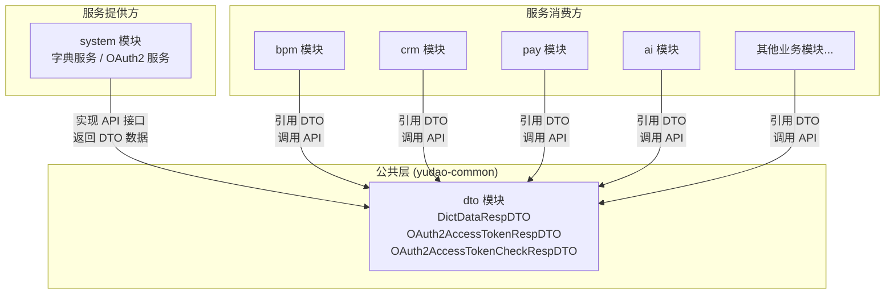
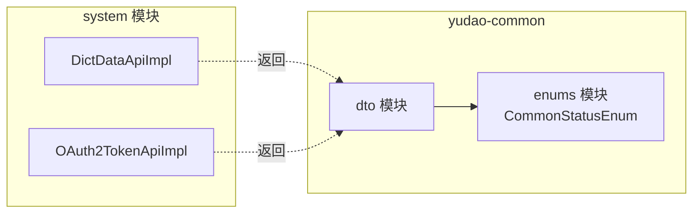
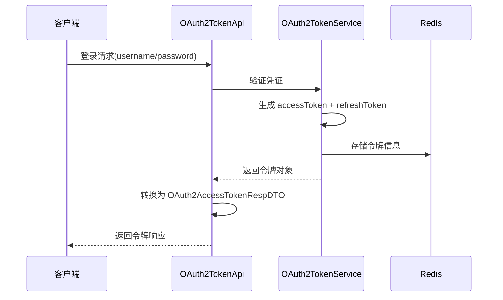
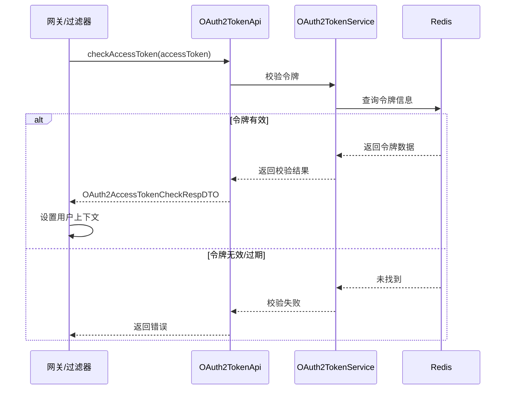
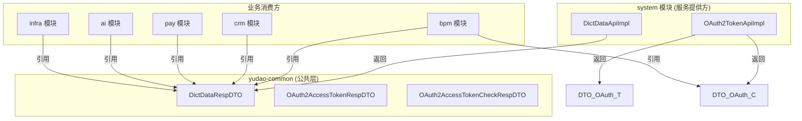

# DTO 模块文档

## 概述

DTO（Data Transfer Object）模块是 yudao 项目中 `yudao-common` 公共框架层的核心组成部分，位于 `cn.iocoder.yudao.framework.common.biz.system` 包下。该模块定义了系统间通信和模块间调用时使用的数据传输对象，主要用于：

- **字典数据传递**：在系统模块（system）与各业务模块之间传递字典数据
- **OAuth2 认证数据传递**：在认证服务与各业务模块之间传递访问令牌及校验结果

DTO 模块的设计遵循"最小化依赖"原则，所有 DTO 类均为纯数据载体（使用 Lombok `@Data` 注解），不包含业务逻辑，确保跨模块引用的轻量性和解耦性。

---

## 架构与依赖关系

### 模块定位

DTO 模块处于 yudao 框架的**公共基础设施层**，被上层业务模块广泛引用。其核心价值在于：

1. **解耦服务间通信**：各业务模块通过引用 `yudao-common` 中的 DTO 来消费 system 模块提供的服务，无需直接依赖 system 模块
2. **统一数据契约**：定义标准化的数据结构，确保服务提供方与消费方对数据格式达成一致



### 依赖关系图



---

## 核心组件详解

### 1. DictDataRespDTO — 字典数据响应 DTO

**包路径**：`cn.iocoder.yudao.framework.common.biz.system.dict.dto.DictDataRespDTO`

**用途**：用于在系统间传递字典数据信息。当业务模块通过 `DictDataApi` 接口查询字典数据时，system 模块返回此 DTO 对象。

**字段说明**：

| 字段 | 类型 | 说明 |
|------|------|------|
| `label` | `String` | 字典标签（显示名称） |
| `value` | `String` | 字典值（存储值） |
| `dictType` | `String` | 字典类型，用于区分不同字典分类 |
| `status` | `Integer` | 状态，枚举值参考 `CommonStatusEnum`（0=启用，1=禁用） |

**数据流**：

```mermaid
sequenceDiagram
    participant Biz as 业务模块
    participant API as DictDataApi
    participant Svc as DictDataService
    participant DB as 数据库

    Biz->>API: 查询字典数据(dictType)
    API->>Svc: 调用服务层
    Svc->>DB: 查询 dict_data 表
    DB-->>Svc: 返回数据行
    Svc-->>API: 返回 DictDataDO 列表
    API->>API: 转换为 DictDataRespDTO
    API-->>Biz: 返回 List&lt;DictDataRespDTO&gt;
```

**关联模块**：

- [system 模块](system.md) — `DictDataApiImpl` 实现字典数据查询接口，返回 `DictDataRespDTO`
- [enums 模块](enums.md) — `CommonStatusEnum` 定义了 `status` 字段的枚举值

---

### 2. OAuth2AccessTokenRespDTO — OAuth2 访问令牌响应

**DTO**：`cn.iocoder.yudao.framework.common.biz.system.oauth2.dto.OAuth2AccessTokenRespDTO`

**用途**：在 OAuth2 认证流程中，当客户端成功获取访问令牌后，系统返回该 DTO 对象，包含令牌信息及关联的用户信息。

**字段说明**：

| 字段 | 类型 | 说明 |
|------|------|------|
| `accessToken` | `String` | 访问令牌，用于 API 请求鉴权 |
| `refreshToken` | `String` | 刷新令牌，用于在访问令牌过期后获取新令牌 |
| `userId` | `Long` | 用户编号 |
| `userType` | `Integer` | 用户类型（区分管理端用户 / 会员用户等） |
| `expiresTime` | `LocalDateTime` | 令牌过期时间 |

**数据流**：



---

### 3. OAuth2AccessTokenCheckRespDTO — OAuth2 令牌校验响应

**DTO**：`cn.iocoder.yudao.framework.common.biz.system.oauth2.dto.OAuth2AccessTokenCheckRespDTO`

**用途**：当业务模块需要校验请求中的访问令牌时，通过 `OAuth2TokenApi` 接口进行校验，返回该响应对象包含校验通过后的用户上下文信息。

**字段说明**：

| 字段 | 类型 | 说明 |
|------|------|------|
| `userId` | `Long` | 用户编号 |
| `userType` | `Integer` | 用户类型 |
| `userInfo` | `Map<String, String>` | 用户扩展信息（如昵称、部门等） |
| `tenantId` | `Long` | 租户编号（多租户场景） |
| `scopes` | `List<String>` | 授权范围列表 |
| `expiresTime` | `LocalDateTime` | 令牌过期时间 |

**数据流**：



---

## 模块间交互全景



---

## 设计原则与最佳实践

### 1. 纯数据传输

所有 DTO 类仅包含数据字段和 getter/setter（通过 Lombok `@Data` 生成），不包含任何业务逻辑。这确保了：

- **序列化友好**：可安全地在 RPC 调用、消息队列等场景中序列化/反序列化
- **跨模块安全**：消费方不会意外引入服务提供方的业务逻辑

### 2. 与 VO 的区别

| 特性 | DTO（本模块） | VO（各业务模块） |
|------|-------------|-----------------|
| 位置 | `yudao-common` | 各业务模块的 `controller/vo` 包 |
| 用途 | 模块间 API 调用 | 前端展示/请求 |
| 注解 | 无 Spring 注解 | 常含 `@Schema`、`@NotNull` 等 |
| 引用方 | 所有业务模块 | 仅本模块 Controller |

### 3. 扩展指南

当需要新增跨模块 DTO 时：

1. 在 `yudao-common` 的 `biz/system/` 下按业务域创建子包
2. 定义纯数据 DTO 类，使用 `@Data` 注解
3. 在服务提供方（如 system 模块）的 API 实现中返回该 DTO
4. 在消费方模块中引用该 DTO 进行数据接收

---

## 相关文档

- [enums 模块](enums.md) — 定义了 DTO 中使用的枚举类型（如 `CommonStatusEnum`）
- [system 模块](system.md) — DTO 的主要服务提供方，包含字典服务和 OAuth2 服务
- [cache 模块](cache.md) — 字典数据缓存工具，与 `DictDataRespDTO` 配合使用
- [security 模块](security.md) — 安全框架，使用 `OAuth2AccessTokenCheckRespDTO` 进行令牌校验