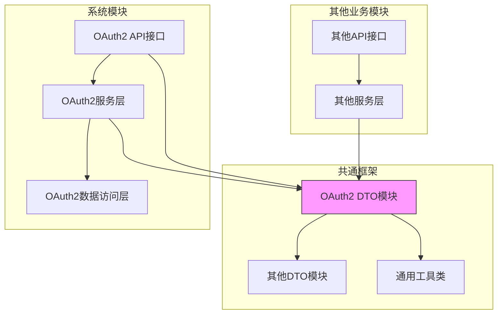
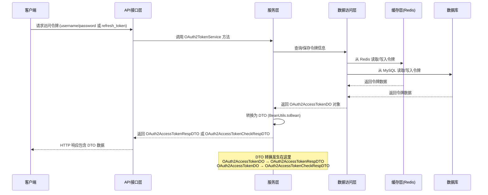
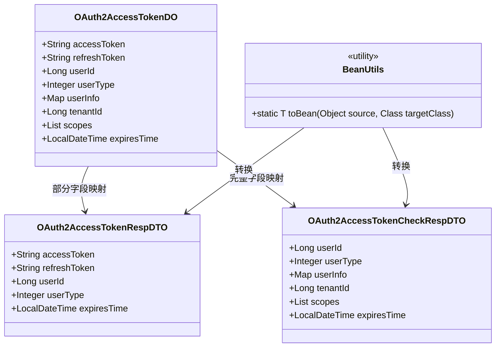

# OAuth2 访问令牌 DTO 模块

## 概述

`dto_2` 模块位于 `yudao-framework/yudao-common` 项目中，包含 OAuth2.0 认证流程中使用的数据传输对象 (DTO)。这些 DTO 负责在系统各层之间传输访问令牌相关的信息，确保数据在 API 接口、服务层和数据访问层之间的一致性和类型安全。

本模块包含两个核心 DTO 类：
1. `OAuth2AccessTokenRespDTO` - 用于表示 OAuth2.0 访问令牌的响应信息
2. `OAuth2AccessTokenCheckRespDTO` - 用于表示 OAuth2.0 访问令牌校验结果的响应信息

这些 DTO 是系统统一认证授权机制的重要组成部分，被广泛用于用户登录、令牌刷新、令牌验证等场景。

## 核心组件

### OAuth2AccessTokenRespDTO

`OAuth2AccessTokenRespDTO` 用于封装 OAuth2.0 访问令牌的基本信息，在成功获取或刷新访问令牌时返回给客户端。

```java
@Data
public class OAuth2AccessTokenRespDTO implements Serializable {
    /**
     * 访问令牌
     */
    private String accessToken;
    /**
     * 刷新令牌
     */
    private String refreshToken;
    /**
     * 用户编号
     */
    private Long userId;
    /**
     * 用户类型
     */
    private Integer userType;
    /**
     * 过期时间
     */
    private LocalDateTime expiresTime;
}
```

**字段说明：**
- `accessToken`: 用于访问受保护资源的访问令牌字符串
- `refreshToken`: 用于获取新访问令牌的刷新令牌字符串
- `userId`: 关联的用户编号
- `userType`: 用户类型（如管理员、会员等）
- `expiresTime`: 访问令牌的过期时间

### OAuth2AccessTokenCheckRespDTO

`OAuth2AccessTokenCheckRespDTO` 用于封装访问令牌校验的详细结果，在验证令牌有效性时返回。

```java
@Data
public class OAuth2AccessTokenCheckRespDTO implements Serializable {
    /**
     * 用户编号
     */
    private Long userId;
    /**
     * 用户类型
     */
    private Integer userType;
    /**
     * 用户信息
     */
    private Map<String, String> userInfo;
    /**
     * 租户编号
     */
    private Long tenantId;
    /**
     * 授权范围的数组
     */
    private List<String> scopes;
    /**
     * 过期时间
     */
    private LocalDateTime expiresTime;
}
```

**字段说明：**
- `userId`: 关联的用户编号
- `userType`: 用户类型
- `userInfo`: 用户附加信息（如昵称、部门ID等），用于构建 LoginUser 对象
- `tenantId`: 租户编号（多租户场景）
- `scopes`: 授权范围列表，表示令牌具有的访问权限
- `expiresTime`: 访问令牌的过期时间

## 架构设计

这些 DTO 位于系统的共享通用层 (`yudao-common`)，被多个业务模块引用，确保了 OAuth2.0 认证流程中的数据一致性。

### 模块依赖关系



### 在 OAuth2 认证流程中的位置



## 数据流说明

### 访问令牌获取流程

```mermaid
flowchart TD
    A[客户端请求获取访问令牌] --> B[API接收请求]
    B --> C[调用 OAuth2TokenService.createAccessToken()]
    C --> D[创建 OAuth2AccessTokenDO 对象]
    D --> E[保存到数据库和 Redis]
    E --> F[转换为 OAuth2AccessTokenRespDTO]
    F --> G[返回给客户端]
    
    style F fill:#bbf,stroke:#333
```

### 访问令牌校验流程

```mermaid
flowchart TD
    A[客户端携带令牌请求受保护资源] --> B[API接收请求]
    B --> C[调用 OAuth2TokenService.checkAccessToken()]
    C --> D[从 Redis 或数据库获取 OAuth2AccessTokenDO]
    D --> E[验证令牌是否过期]
    E --> F{是否有效?}
    F -->|否| G[抛出未授权异常]
    F -->|是| H[转换为 OAuth2AccessTokenCheckRespDTO]
    H --> I[返回给客户端]
    
    style H fill:#bbf,stroke:#333
```

## 与其他模块的关联

### 与系统模块的集成

这些 DTO 在 `yudao-module-system` 中被广泛使用：

1. **OAuth2TokenApiImpl**: 实现了 `OAuth2TokenCommonApi` 接口，使用这些 DTO 作为方法返回类型
2. **OAuth2TokenServiceImpl**: 业务实现层，在服务方法内部将 DO 转换为 DTO
3. **控制器层 VO**: 在开放接口中，这些 DTO 会进一步转换为 VO（如 `OAuth2OpenAccessTokenRespVO`）

### DTO 与 DO 的映射关系



## 使用场景

### 1. 用户登录获取令牌
当用户通过用户名/密码或社会化登录成功后，系统会：
1. 生成访问令牌和刷新令牌
2. 将令牌信息封装到 `OAuth2AccessTokenRespDTO`
3. 返回给客户端，客户端存储这些令牌用于后续请求

### 2. 令牌刷新
当访问令牌过期但刷新令牌仍然有效时：
1. 客户端使用刷新令牌请求新的访问令牌
2. 系统验证刷新令牌并生成新的访问令牌对
3. 返回新的 `OAuth2AccessTokenRespDTO`

### 3. 令牌校验
在访问受保护资源时：
1. 系统从请求头中提取访问令牌
2. 调用服务层校验令牌有效性
3. 如果有效，返回包含用户信息的 `OAuth2AccessTokenCheckRespDTO`
4. 系统根据此 DTO 构建登录用户上下文

### 4. 令牌撤销
当用户登出或令牌需要被撤销时：
1. 系统删除对应的访问令牌和刷新令牌
2. 返回被删除的访问令牌信息（封装在 `OAuth2AccessTokenRespDTO` 中）

## 最佳实践

### 1. 安全考虑
- 访问令牌和刷新令牌应通过安全渠道传输（HTTPS）
- 令牌应具有适当的过期时间以减少被盗用风险
- 刷新令牌应安全存储，防止泄露

### 2. 数据一致性
- DTO 应与对应的 DO 保持字段一致性
- 使用工具类型转换应使用统一的工具方法（如 BeanUtils）以减少错误
- 日期时间处理应考虑时区问题

### 3. 扩展性
- 如需添加新字段，应同时更新 DO 和相关 DTO
- 考虑使用版本控制机制以向后兼容
- 对于敏感信息，应在日志输出时进行脱敏处理

## 与类似模块的对比

与 `dto` 模块中的 `DictDataRespDTO` 相比：
- 相同点：都是使用 Lombok 的 `@Data` 注解生成 getter/setter，实现 `Serializable` 接口
- 不同点：`DictDataRespDTO` 用于字典数据传输，字段较简单；而 OAuth2 DTO 包含更复杂的认证授权信息
- 关联点：两者都位于共通框架中，被多个业务模块引用

## 结论

`dto_2` 模块为系统提供了统一、类型安全的 OAuth2.0 访问令牌数据传输机制。通过将这些 DTO 放在共通框架中，确保了：
1. 不同模块之间的数据一致性
2. 减少代码重复
3. 便于维护和扩展
4. 清晰的分层架构

这些 DTO 是系统安全认证体系的基础组成部分，正确理解和使用它们对于维护系统的安全性和可靠性至关重要。