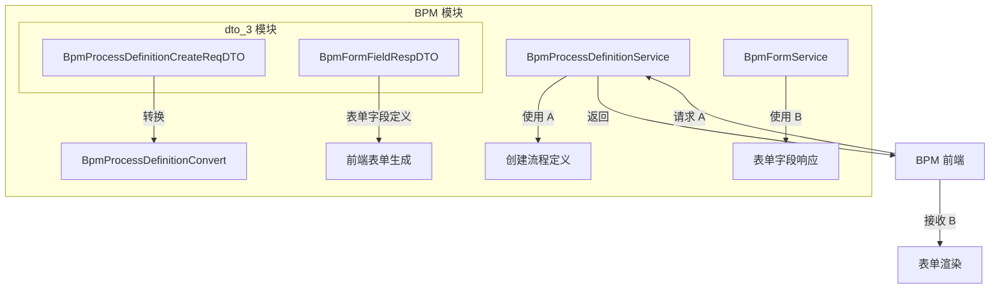
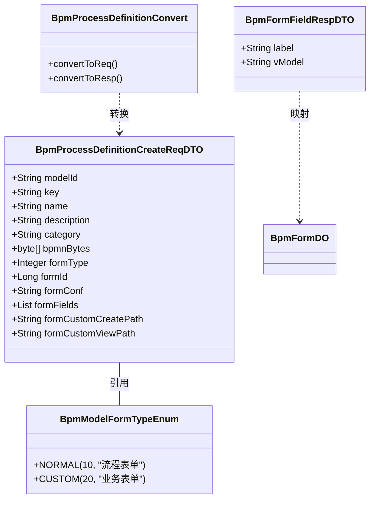
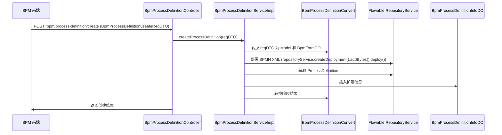
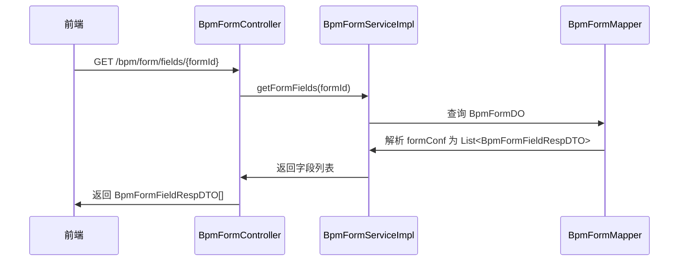

# DTO 模块文档 (dto_3)

## 1. 概述

`dto_3` 模块是 **BPM（业务流程管理）模块** 中的数据传输对象（DTO）子模块，位于 `yudao-module-bpm/src/main/java/cn/iocoder/yudao/module/bpm/service/definition/dto/` 目录下。该模块主要负责定义流程定义创建请求和表单字段响应的数据结构，为 BPM 流程定义服务提供统一的数据交换格式。

## 2. 架构概览



## 3. 核心组件说明

### 3.1 BpmProcessDefinitionCreateReqDTO

**文件路径**: `yudao-module-bpm/src/main/java/cn/iocoder/yudao/module/bpm/service/definition/dto/BpmProcessDefinitionCreateReqDTO.java`

**功能描述**: 流程定义创建请求 DTO，用于前端提交新流程定义时的数据封装。包含模型相关和表单相关两类配置信息。

#### 字段说明

| 字段名 | 类型 | 必填 | 说明 |
|--------|------|------|------|
| modelId | String | 是 | 流程模型的编号 |
| key | String | 是 | 流程标识（BPMN中的process id） |
| name | String | 是 | 流程名称 |
| description | String | 否 | 流程描述 |
| category | String | 是 | 流程分类 |
| bpmnBytes | byte[] | 是 | BPMN XML 二进制内容 |
| formType | Integer | 是 | 表单类型（参考 `BpmModelFormTypeEnum`） |
| formId | Long | 否 | 动态表单编号（仅当 `formType=1` 时有效） |
| formConf | String | 否 | 表单配置 JSON（仅当 `formType=1` 时有效） |
| formFields | List<String> | 否 | 表单项数组（仅当 `formType=1` 时有效） |
| formCustomCreatePath | String | 否 | 自定义表单创建路径（仅当 `formType=2` 时有效） |
| formCustomViewPath | String | 否 | 自定义表单查看路径（仅当 `formType=2` 时有效） |

#### 表单类型枚举

```java
public enum BpmModelFormTypeEnum implements ArrayValuable<Integer> {
    NORMAL(10, "流程表单"),      // 对应 BpmFormDO
    CUSTOM(20, "业务表单")       // 业务自己定义的表单，自己进行数据的存储
}
```

#### 使用场景

- 前端创建新流程定义时，将 BPMN XML 和表单配置打包发送
- 后端 `BpmProcessDefinitionServiceImpl#createProcessDefinition()` 方法接收此 DTO 进行流程部署
- 与 `BpmProcessDefinitionRespVO` 通过 MapStruct 进行转换

### 3.2 BpmFormFieldRespDTO

**文件路径**: `yudao-module-bpm/src/main/java/cn/iocoder/yudao/module/bpm/service/definition/dto/BpmFormFieldRespDTO.java`

**功能描述**: BPM 表单的 Field 表单项 Response DTO，用于描述表单字段的定义信息。该 DTO 遵循 [form-generator](https://github.com/JakHuang/form-generator) 项目的字段定义规范。

#### 字段说明

| 字段名 | 类型 | 说明 |
|--------|------|------|
| label | String | 表单标题（显示给用户的文字） |
| vModel | String | 表单字段的属性名（Vue.js 中的 v-model 绑定名），通过 `@JsonProperty("vModel")` 序列化为 JSON 键名 |

#### 使用场景

- 表单生成器返回表单字段定义列表
- 前端根据字段定义动态渲染表单组件
- 与 `BpmFormDO` 中的 `formFields` 字段进行映射转换

## 4. 模块依赖关系



### 依赖说明

1. **BpmModelFormTypeEnum**: `BpmProcessDefinitionCreateReqDTO` 中的 `formType` 字段引用此枚举，用于区分表单类型。
2. **BpmProcessDefinitionConvert**: 通过 MapStruct 自动生成的转换类，负责在 DTO、VO 和 DO 之间进行数据转换。
3. **BpmFormDO**: `BpmFormFieldRespDTO` 的字段定义与表单数据对象中的字段结构对应。

## 5. 数据流转流程

### 5.1 流程定义创建流程



### 5.2 表单字段响应流程



## 6. 与其他模块的关联

| 模块 | 关联说明 |
|------|----------|
| **BPM 模块 (定义层)** | `BpmProcessDefinitionCreateReqDTO` 用于创建流程定义，`BpmFormFieldRespDTO` 用于表单字段定义 |
| **BPM 模块 (表单服务)** | 表单配置信息通过 `BpmFormFieldRespDTO` 传递，与 `BpmFormService` 紧密相关 |
| **BPM 模块 (转换层)** | 通过 `BpmProcessDefinitionConvert` 将 DTO 转换为 VO/DO |
| **前端模块** | 前端使用这些 DTO 进行数据请求和响应处理，特别是流程定义创建和表单生成场景 |

## 7. 设计要点

1. **统一数据格式**: 通过 DTO 规范前后端数据交互格式，避免直接暴露 DO 结构。
2. **表单类型扩展**: 支持 `NORMAL`（流程表单）和 `CUSTOM`（业务表单）两种表单类型，提供灵活的表单配置能力。
3. **字段定义标准化**: `BpmFormFieldRespDTO` 遵循 form-generator 规范，确保与前端表单生成器兼容。
4. **注解驱动**: 使用 Lombok 的 `@Data` 自动生成 getter/setter，使用 Jackson 的 `@JsonProperty` 控制 JSON 序列化键名。
