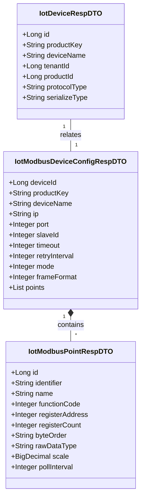
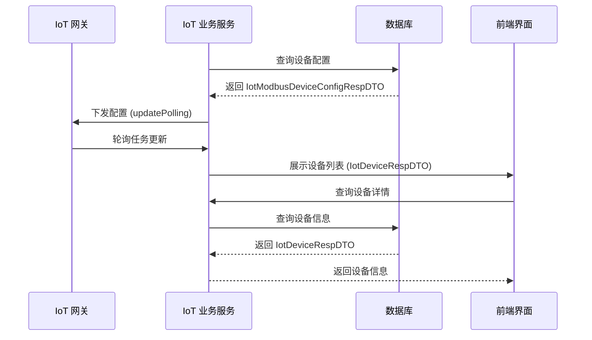
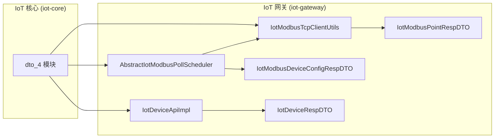
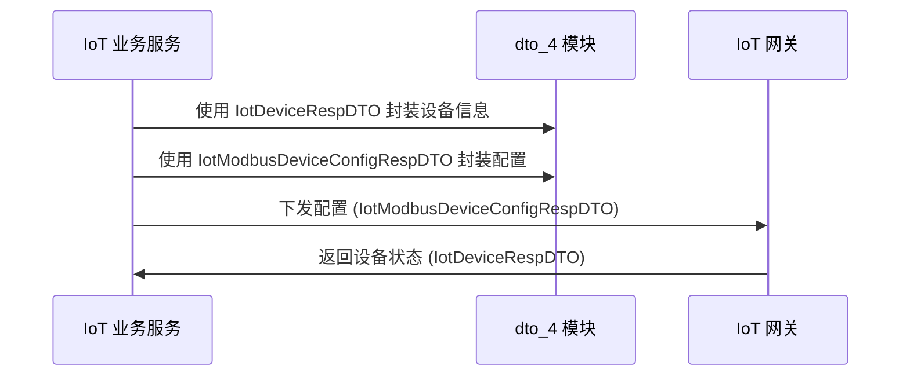

# IoT 核心模块 DTO 文档 (dto_4)

## 1. 模块概述

`dto_4` 模块是 **IoT 核心模块**（`yudao-module-iot-core`）中的数据传输对象（DTO）集合，主要用于在 IoT 系统的不同组件之间传递设备、Modbus 点位配置和设备配置信息。该模块位于 `yudao-module-iot-core/src/main/java/cn/iocoder/yudao/module/iot/core/biz/dto/` 路径下。

### 核心功能
- 定义设备信息的响应 DTO，用于设备信息查询和展示
- 定义 Modbus 点位配置的响应 DTO，用于 Modbus 通信的点位参数传递
- 定义 Modbus 设备配置的响应 DTO，用于设备连接配置和点位列表的封装

### 模块定位
```
┌─────────────────────────────────────────────────────────────┐
│                    IoT 核心模块 (iot-core)                   │
│  ┌───────────────────────────────────────────────────────┐  │
│  │                    DTO 层 (dto_4)                     │  │
│  │  ┌─────────────────────────────────────────────────┐  │  │
│  │  │ IotDeviceRespDTO       - 设备信息响应 DTO       │  │  │
│  │  │ IotModbusPointRespDTO  - Modbus 点位响应 DTO    │  │  │
│  │  │ IotModbusDeviceConfigRespDTO - Modbus 设备配置 │  │  │
│  │  │                        - 响应 DTO              │  │  │
│  │  └─────────────────────────────────────────────────┘  │  │
│  └───────────────────────────────────────────────────────┘  │
│  ┌───────────────────────────────────────────────────────┐  │
│  │ 业务层 (biz) ──> 网关层 (gateway) ──> 设备服务 (biz)   │  │
│  └───────────────────────────────────────────────────────┘  │
└─────────────────────────────────────────────────────────────┘
```

## 2. 架构设计

### 2.1 组件关系图



### 2.2 数据流向



## 3. 核心组件详解

### 3.1 IotDeviceRespDTO - 设备信息响应 DTO

**文件路径**: `yudao-module-iot-core/src/main/java/cn/iocoder/yudao/module/iot/core/biz/dto/IotDeviceRespDTO.java`

#### 3.1.1 类说明
用于封装设备的基本信息，在设备查询、设备详情展示等场景中使用。

#### 3.1.2 字段说明

| 字段名 | 类型 | 说明 |
|--------|------|------|
| id | Long | 设备编号 |
| productKey | String | 产品标识（物模型的 identifier） |
| deviceName | String | 设备名称 |
| tenantId | Long | 租户编号（多租户支持） |
| productId | Long | 产品编号 |
| protocolType | String | 协议类型（如 MQTT、CoAP 等） |
| serializeType | String | 序列化类型（如 JSON、Protobuf 等） |

#### 3.1.3 使用场景
- 设备列表展示
- 设备详情查询
- 设备认证接口返回
- 设备拓扑管理

### 3.2 IotModbusPointRespDTO - Modbus 点位配置 Response DTO

**文件路径**: `yudao-module-iot-core/src/main/java/cn/iocoder/yudao/module/iot/core/biz/dto/IotModbusPointRespDTO.java`

#### 3.2.1 类说明
用于封装 Modbus 通信中的点位配置信息，包括 Modbus 协议参数和数据转换配置。每个点位对应设备上的一个寄存器或线圈。

#### 3.2.2 字段说明

| 字段名 | 类型 | 说明 |
|--------|------|------|
| id | Long | 点位编号 |
| identifier | String | 属性标识符（物模型的 identifier） |
| name | String | 属性名称（物模型的 name） |
| functionCode | Integer | Modbus 功能码（FC01-04） |
| registerAddress | Integer | 寄存器起始地址 |
| registerCount | Integer | 寄存器数量 |
| byteOrder | String | 字节序（枚举 `IotModbusByteOrderEnum`） |
| rawDataType | String | 原始数据类型（枚举 `IotModbusRawDataTypeEnum`） |
| scale | BigDecimal | 缩放因子（用于数值转换） |
| pollInterval | Integer | 轮询间隔（毫秒） |

#### 3.2.3 Modbus 功能码说明
- **FC01**: 读线圈（Read Coils）
- **FC02**: 读离散输入（Read Discrete Inputs）
- **FC03**: 读保持寄存器（Read Holding Registers）
- **FC04**: 读输入寄存器（Read Input Registers）

#### 3.2.4 使用场景
- Modbus 设备点位配置管理
- 网关轮询任务配置
- 数据读取和写入操作

### 3.3 IotModbusDeviceConfigRespDTO - Modbus 设备配置 Response DTO

**文件路径**: `yudao-module-iot-core/src/main/java/cn/iocoder/yudao/module/iot/core/biz/dto/IotModbusDeviceConfigRespDTO.java`

#### 3.3.1 类说明
用于封装完整的 Modbus 设备配置信息，包括连接配置和点位配置列表。是 Modbus 设备通信的核心配置对象。

#### 3.3.2 字段说明

| 字段名 | 类型 | 说明 |
|--------|------|------|
| deviceId | Long | 设备编号 |
| productKey | String | 产品标识 |
| deviceName | String | 设备名称 |
| ip | String | Modbus 服务器 IP 地址 |
| port | Integer | Modbus 服务器端口 |
| slaveId | Integer | 从站地址（Slave ID） |
| timeout | Integer | 连接超时时间（毫秒） |
| retryInterval | Integer | 重试间隔（毫秒） |
| mode | Integer | 连接模式 |
| frameFormat | Integer | 数据帧格式 |
| points | List<IotModbusPointRespDTO> | 点位列表 |

#### 3.3.3 使用场景
- Modbus 设备轮询配置下发
- 网关设备连接配置
- 点位批量读取/写入操作

## 4. 模块交互关系

### 4.1 与网关模块的交互

`dto_4` 模块的 DTO 对象在 IoT 网关中用于设备轮询和 Modbus 通信：



**关键交互点**:
- `AbstractIotModbusPollScheduler.updatePolling(IotModbusDeviceConfigRespDTO config)`：更新设备轮询配置
- `IotModbusTcpClientUtils.read(..., IotModbusPointRespDTO point)`：读取指定点位数据
- `IotDeviceApiImpl.getDevice(...)`：获取设备信息（返回 `IotDeviceRespDTO`）

### 4.2 与业务服务层的交互



### 4.3 与其他模块的依赖关系

| 依赖模块 | 依赖关系 | 说明 |
|----------|----------|------|
| `iot-biz` | 使用 DTO | 业务服务层使用 DTO 进行数据传输 |
| `iot-gateway` | 使用 DTO | 网关层使用 DTO 进行设备轮询和通信 |
| `system` | 间接依赖 | 设备信息关联租户和用户系统 |

## 5. 设计模式分析

### 5.1 DTO 模式
`dto_4` 模块遵循典型的 **DTO（Data Transfer Object）模式**，用于在不同层之间传递数据，避免直接暴露实体类（DO）结构。

### 5.2 组合模式
`IotModbusDeviceConfigRespDTO` 组合了多个 `IotModbusPointRespDTO` 对象，形成 **组合关系**，表示一个设备包含多个点位。

### 5.3 配置模式
三个 DTO 共同构成了 **设备配置模式**，将设备基本信息、Modbus 连接配置和点位配置分离但又关联，便于灵活配置和管理。

## 6. 使用示例

### 6.1 获取设备信息示例

```java
// 通过 API 获取设备信息
CommonResult<IotDeviceRespDTO> result = iotDeviceApi.getDevice(getReqDTO);
IotDeviceRespDTO device = result.getData();
// device.getId(), device.getDeviceName(), device.getProductKey()
```

### 6.2 Modbus 设备轮询配置示例

```java
// 获取 Modbus 设备配置列表
CommonResult<List<IotModbusDeviceConfigRespDTO>> configList = 
    iotDeviceApi.getModbusDeviceConfigList(listReqDTO);

// 更新网关轮询配置
AbstractIotModbusPollScheduler scheduler = getScheduler();
for (IotModbusDeviceConfigRespDTO config : configList) {
    scheduler.updatePolling(config);
}
```

### 6.3 读取 Modbus 点位数据示例

```java
// 读取指定点位的 Modbus 数据
Future<int[]> result = IotModbusTcpClientUtils.read(
    connection, 
    slaveId, 
    point // IotModbusPointRespDTO 对象
);
```

## 7. 扩展性说明

### 7.1 新增点位类型
如需支持新的 Modbus 点位类型，只需：
1. 扩展 `IotModbusPointRespDTO` 字段
2. 更新 `IotModbusByteOrderEnum` 和 `IotModbusRawDataTypeEnum` 枚举
3. 在 `IotModbusTcpClientUtils` 中增加相应的数据处理逻辑

### 7.2 新增设备类型
如需支持新的设备类型，可通过：
1. 扩展 `IotDeviceRespDTO` 添加特定字段
2. 在业务层进行类型区分处理
3. 保持 DTO 的通用性，避免过度耦合

## 8. 相关文档

- [IoT 设备管理模块](iot_device.md) - 设备管理相关功能
- [Modbus 通信协议](modbus_protocol.md) - Modbus 协议详细说明
- [IoT 网关架构](iot_gateway_architecture.md) - 网关系统架构设计
