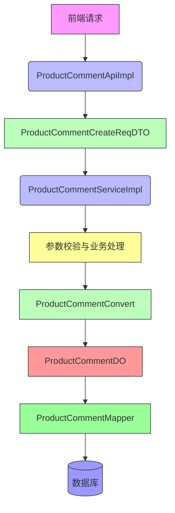

# ProductCommentCreateReqDTO 文档

## 概述

`ProductCommentCreateReqDTO` 是商品评价创建请求的数据传输对象（DTO），用于封装用户提交商品评价时所需的参数。该 DTO 位于 `yudao-module-mall/yudao-module-product` 模块中，具体路径为 `src/main/java/cn/iocoder/yudao/module/product/api/comment/dto/ProductCommentCreateReqDTO.java`。

该 DTO 负责在 API 层接收前端传递的评价数据，并通过服务层进行校验和处理，最终持久化到数据库中。它是商品评价功能的入口数据模型，确保评价数据的完整性和有效性。

## 核心字段及校验规则

| 字段名 | 类型 | 是否必填 | 描述 | 校验规则 |
|--------|------|----------|------|----------|
| skuId | Long | 是 | 商品 SKU 编号 | 不能为空 |
| orderId | Long | 否 | 订单编号 | 可选 |
| orderItemId | Long | 否 | 交易订单项编号 | 可选 |
| descriptionScores | Integer | 是 | 描述星级 (1-5 分) | 不能为空 |
| benefitScores | Integer | 是 | 服务星级 (1-5 分) | 不能为空 |
| content | String | 是 | 评论内容 | 不能为空 |
| picUrls | List<String> | 否 | 评论图片地址数组，以逗号分隔最多上传 9 张 | 可选，但数量限制 |
| anonymous | Boolean | 是 | 是否匿名 | 不能为空 |
| userId | Long | 是 | 评价人用户 ID | 不能为空 |

> **注意**：虽然 `orderId` 和 `orderItemId` 标记为非必填，但在服务层中会根据业务逻辑进行校验（例如，检查用户是否对该订单项已评价）。

## 架构与组件关系

`ProductCommentCreateReqDTO` 在商品评价功能中扮演着数据传输的角色，连接 API 层、服务层和数据持久化层。以下是其核心交互流程：

### 组件交互图



### 数据流转说明

1. **API 层接收**：前端通过 `/product/comment/create` 接口提交评价数据，由 `ProductCommentApiImpl` 接收并封装为 `ProductCommentCreateReqDTO` 对象。
2. **服务层处理**：`ProductCommentServiceImpl` 接收 DTO，执行以下操作：
   - 校验 SKU 是否存在及有效性（通过 `ProductSkuService`）。
   - 校验 SPU 是否存在及有效性（通过 `ProductSpuService`）。
   - 检查用户是否已对该订单项评价（避免重复评价）。
   - 获取用户详细信息（通过 `MemberUserApi`）。
   - 使用 `ProductCommentConvert` 将 DTO 转换为数据库对象 `ProductCommentDO`。
3. **数据持久化**：`ProductCommentMapper` 将 `ProductCommentDO` 插入数据库表 `product_comment`。

## 与其他模块的关联

- **商品模块**：依赖 `ProductSkuService` 和 `ProductSpuService` 来验证商品信息（详见 [sku模块](dto_7.md) 和 [spu模块](dto_8.md)）。
- **用户模块**：通过 `MemberUserApi` 获取用户昵称和头像等信息（详见 [用户模块](dto_20.md)）。
- **订单模块**：虽然当前 DTO 中未直接体现，但服务层会通过 `orderItemId` 关联订单项（详见 [交易模块](dto_15.md)）。

## 使用示例

以下是一个典型的评价创建请求示例：

```json
{
  "skuId": 12345,
  "orderId": 67890,
  "orderItemId": 54321,
  "descriptionScores": 5,
  "benefitScores": 5,
  "content": "商品质量很好，服务态度也很好，五星好评！",
  "picUrls": ["http://example.com/img1.jpg", "http://example.com/img2.jpg"],
  "anonymous": false,
  "userId": 10001
}
```

## 注意事项

1. **图片数量限制**：虽然 DTO 中未直接限制 `picUrls` 的数量，但服务层或数据库字段可能有限制（通常为 9 张），建议前端严格控制。
2. **星级范围**：描述星级和服务星级应在 1-5 之间，虽然 DTO 中未加范围校验，但业务层建议添加此验证。
3. **匿名评价**：当 `anonymous` 为 true 时，用户昵称和头像将不被展示，但服务层仍会记录真实用户 ID 用于防刷等目的。
4. **订单关联**：为了防止用户对同一订单项重复评价，服务层会检查 `userId` 和 `orderItemId` 的组合是否已存在。

## 依赖说明

本 DTO 依赖以下字段进行业务闭环：
- `skuId`：关联商品 SKU 信息
- `userId`：关联用户基础信息
- `orderItemId`：用于防重复评价的关键字段

> **提示**：如需了解商品 SKU、SPU 的详细定义，请参考 [sku模块文档](dto_7.md) 和 [spu模块文档](dto_8.md)。如需了解用户信息结构，请参考 [用户模块文档](dto_20.md)。

## 更新历史

| 版本 | 日期 | 描述 |
|------|------|------|
| V1.0 | 2023-10-01 | 初始版本，创建 ProductCommentCreateReqDTO |
| V1.1 | 2023-11-15 | 添加字段注释和校验注解 |