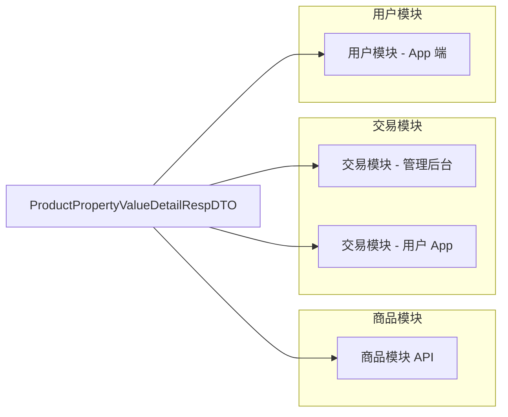

# dto_6 模块文档 - 商品属性值明细 DTO

## 1. 模块概述

`dto_6` 模块是 **商品模块（Product Module）** 中的核心数据传输对象（DTO）模块，主要负责在 API 层传递商品属性值的明细数据。该模块定义了 `ProductPropertyValueDetailRespDTO` 类，用于在系统内部和对外接口中传输商品属性项及其对应属性值的详细信息。

该模块属于 **yudao-module-mall/yudao-module-product** 商品模块的 API 层，遵循统一的 DTO 设计规范，与系统其他模块的数据传输对象保持一致的结构和命名规范。

## 2. 核心组件

### 2.1 ProductPropertyValueDetailRespDTO

**文件路径：** `yudao-module-mall/yudao-module-product/src/main/java/cn/iocoder/yudao/module/product/api/property/dto/ProductPropertyValueDetailRespDTO.java`

**类说明：** 商品属性项的明细 Response DTO，用于在 API 层返回商品属性值的详细信息。

```java
@Data
public class ProductPropertyValueDetailRespDTO {

    /**
     * 属性的编号
     */
    private Long propertyId;

    /**
     * 属性的名称
     */
    private String propertyName;

    /**
     * 属性值的编号
     */
    private Long valueId;

    /**
     * 属性值的名称
     */
    private String valueName;

}
```

**字段说明：**

| 字段名 | 类型 | 说明 |
|--------|------|------|
| propertyId | Long | 属性项的编号，关联 `ProductPropertyDO` |
| propertyName | String | 属性项的名称（如"颜色"、"尺寸"等） |
| valueId | Long | 属性值的编号，关联 `ProductPropertyValueDO` |
| valueName | String | 属性值的名称（如"红色"、"L码"等） |

## 3. 架构关系

### 3.1 模块层级关系

```
yudao-module-mall (商城模块)
└── yudao-module-product (商品模块)
    └── api (API 层)
        └── property (属性相关)
            └── dto (数据传输对象)
                └── ProductPropertyValueDetailRespDTO.java
```

### 3.2 组件交互关系

```mermaid
classDiagram
    class ProductPropertyValueDO {
        +Long id
        +Long propertyId
        +String name
        +String remark
    }
    class ProductPropertyDO {
        +Long id
        +String name
        +String remark
    }
    class ProductPropertyValueDetailRespDTO {
        +Long propertyId
        +String propertyName
        +Long valueId
        +String valueName
    }

    ProductPropertyValueDO --|+ ProductPropertyDO : propertyId 关联
    ProductPropertyValueDetailRespDTO <-- ProductPropertyValueDO : 映射
    ProductPropertyValueDetailRespDTO <-- ProductPropertyDO : 映射
```

### 3.3 跨模块引用关系

`ProductPropertyValueDetailRespDTO` 被多个模块引用，形成统一的数据传输标准：



## 4. 相关组件

### 4.1 数据对象（DO）

| 组件 | 文件路径 | 说明 |
|------|----------|------|
| ProductPropertyDO | `yudao-module-mall/yudao-module-product/src/main/java/cn/iocoder/yudao/module/product/dal/dataobject/property/ProductPropertyDO.java` | 商品属性项数据对象 |
| ProductPropertyValueDO | `yudao-module-mall/yudao-module-product/src/main/java/cn/iocoder/yudao/module/product/dal/dataobject/property/ProductPropertyValueDO.java` | 商品属性值数据对象 |

### 4.2 视图对象（VO）

| 组件 | 文件路径 | 说明 |
|------|----------|------|
| ProductPropertyValueDetailRespVO | `yudao-module-mall/yudao-module-trade/src/main/java/cn/iocoder/yudao/module/trade/controller/admin/base/product/property/ProductPropertyValueDetailRespVO.java` | 管理后台商品属性值明细 VO |
| AppProductPropertyValueDetailRespVO | `yudao-module-mall/yudao-module-product/src/main/java/cn/iocoder/yudao/module/controller/app/property/vo/value/AppProductPropertyValueDetailRespVO.java` | 用户 App 商品属性值明细 VO |
| AppProductPropertyValueDetailRespVO | `yudao-module-mall/yudao-module-trade/src/main/java/cn/iocoder/yudao/module/trade/controller/app/base/property/AppProductPropertyValueDetailRespVO.java` | 用户 App 商品属性值明细 VO（交易模块） |

### 4.3 请求对象（ReqVO）

| 组件 | 文件路径 | 说明 |
|------|----------|------|
| ProductPropertyValuePageReqVO | `yudao-module-mall/yudao-module-product/src/main/java/cn/iocoder/yudao/module/product/controller/admin/property/vo/value/ProductPropertyValuePageReqVO.java` | 商品属性值分页查询请求 |
| ProductPropertyValueSaveReqVO | `yudao-module-mall/yudao-module-product/src/main/java/cn/iocoder/yudao/module/product/controller/admin/property/vo/value/ProductPropertyValueSaveReqVO.java` | 商品属性值保存请求 |

## 5. 使用场景

### 5.1 商品属性查询

在商品详情页面，需要展示商品的属性项及其对应的属性值，通过 `ProductPropertyValueDetailRespDTO` 返回属性明细数据：

```
用户请求商品详情 → 商品服务查询属性项和属性值 → 转换为 DTO → 返回给前端
```

### 5.2 订单详情展示

在订单详情页面，需要展示购买商品的属性信息（如颜色、尺寸等），通过该 DTO 传递属性值明细：

```
用户查看订单 → 订单服务获取商品属性信息 → 转换为 DTO → 返回给前端展示
```

### 5.3 商品管理后台

在商品管理后台，管理员查看商品属性值列表时，使用该 DTO 返回属性值明细数据：

```
管理员访问属性列表 → 商品服务查询属性值 → 转换为 DTO → 返回给前端表格展示
```

## 6. 设计规范

### 6.1 命名规范

- DTO 类名采用 `模块名 + 业务名 + 操作 + RespDTO` 的命名方式
- 属性名采用小驼峰命名法
- 字段注释使用 `/** 字段说明 */` 格式

### 6.2 数据结构

- 所有 ID 字段使用 `Long` 类型
- 所有文本字段使用 `String` 类型
- 使用 Lombok 的 `@Data` 注解自动生成 getter/setter/toString/hashCode 方法

### 6.3 跨模块一致性

该 DTO 在多个模块中保持一致的结构，确保数据在不同系统间传输时格式统一：

- 商品模块 API 层
- 交易模块管理后台
- 交易模块用户 App
- 用户模块 App 端

## 7. 依赖关系

### 7.1 直接依赖

- Lombok（`@Data` 注解）
- Java 标准库（Long、String 等基础类型）

### 7.2 间接依赖

- 商品模块的 DO 层（ProductPropertyDO、ProductPropertyValueDO）
- 交易模块的 VO 层（ProductPropertyValueDetailRespVO、AppProductPropertyValueDetailRespVO）
- 系统通用工具类（BeanUtils 等用于对象转换）

## 8. 扩展性说明

该 DTO 设计简洁，仅包含属性值的基本信息，便于扩展：

1. **新增字段**：如需扩展属性值的更多信息（如排序、图片等），可直接在 DTO 中添加字段
2. **多端适配**：管理后台和 App 端使用不同的 VO 类，但底层 DTO 保持一致，便于多端数据同步
3. **版本兼容**：采用响应式 DTO 设计，向后兼容，新增字段不会影响现有调用方

## 9. 参考文档

- [商品模块文档](product.md) - 商品模块整体架构
- [交易模块文档](trade.md) - 交易模块商品属性使用
- [系统通用 DTO 规范](system.md) - 系统级 DTO 设计规范
- [Lombok 使用指南](lombok.md) - Lombok 注解使用说明
