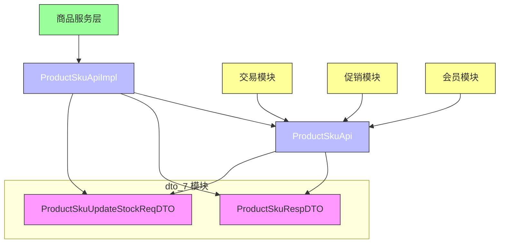
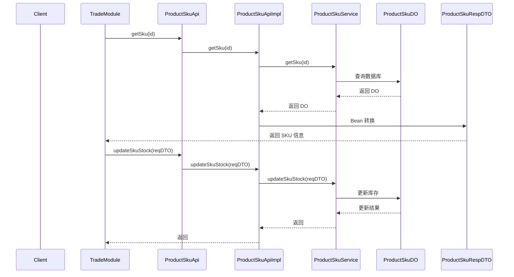
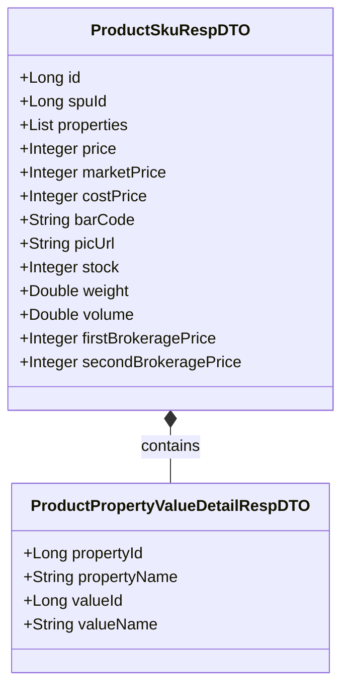
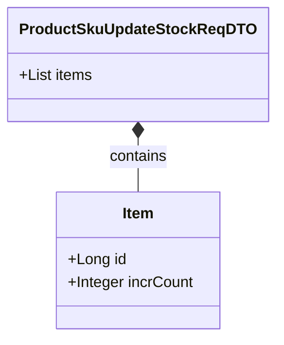
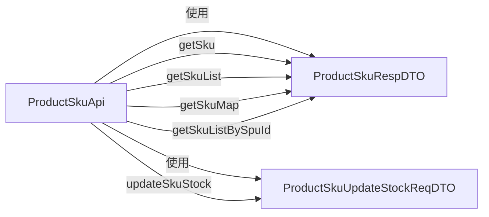
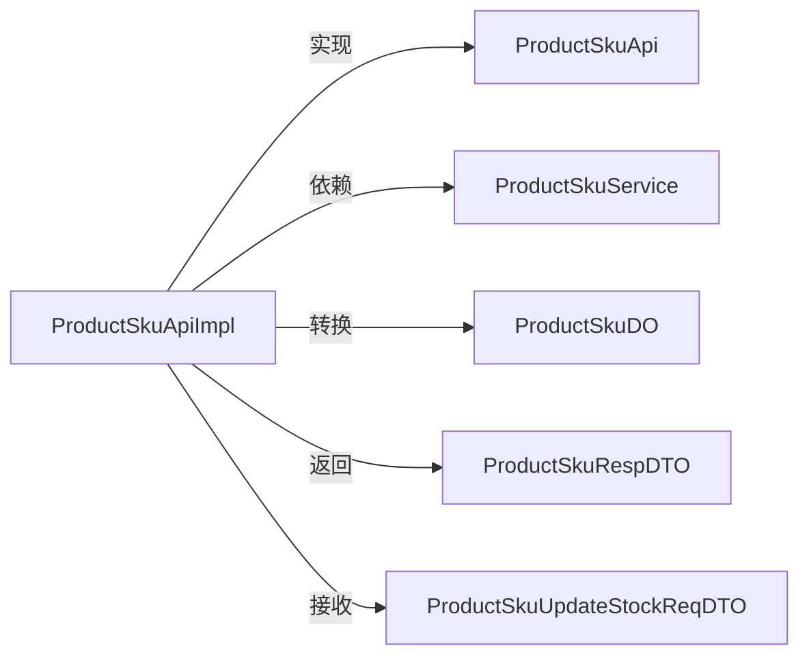

# dto_7 模块文档 - 商品 SKU DTO

## 1. 模块概述

**dto_7** 模块是 `yudao-module-mall/yudao-module-product`（商品模块）中的核心数据传输对象（DTO）模块，专注于商品 SKU（Stock Keeping Unit）相关的数据封装。该模块定义了 SKU 查询响应和库存更新请求的 DTO 结构，为商品模块与其他模块（如交易、促销、会员等）之间的 API 交互提供统一的数据契约。

### 模块定位

```
┌─────────────────────────────────────────────────────────────┐
│              yudao-module-mall (商城模块)                   │
│  ┌───────────────────────────────────────────────────────┐  │
│  │  yudao-module-product (商品模块)                      │  │
│  │  ┌─────────────────────────────────────────────────┐  │  │
│  │  │  api/sku/ (SKU API 层)                          │  │  │
│  │  │  ┌─────────────────────────────────────────────┐  │  │  │
│  │  │  │  dto/ (DTO 模块 - dto_7)                    │  │  │  │
│  │  │  │  ├─ ProductSkuRespDTO.java                 │  │  │  │  │
│  │  │  │  └─ ProductSkuUpdateStockReqDTO.java       │  │  │  │  │
│  │  │  │                                             │  │  │  │
│  │  │  │  ├─ ProductSkuApi.java (接口)              │  │  │  │  │
│  │  │  │  └─ ProductSkuApiImpl.java (实现)         │  │  │  │  │
│  │  │  └─────────────────────────────────────────────┘  │  │  │
│  │  └─────────────────────────────────────────────────┘  │  │
│  └───────────────────────────────────────────────────────┘  │
└─────────────────────────────────────────────────────────────┘
```

### 核心功能

- **SKU 信息查询响应**：`ProductSkuRespDTO` 封装 SKU 的完整信息，包括属性、价格、库存、条形码等
- **SKU 库存更新请求**：`ProductSkuUpdateStockReqDTO` 支持批量 SKU 库存增减操作
- **跨模块数据传递**：作为商品模块对外暴露的 API 接口，供交易、促销、会员等模块调用

---

## 2. 架构设计

### 2.1 模块依赖关系



### 2.2 数据流向



---

## 3. 核心组件说明

### 3.1 ProductSkuRespDTO - SKU 信息响应 DTO

**文件路径**：`yudao-module-mall/yudao-module-product/src/main/java/cn/iocoder/yudao/module/product/api/sku/dto/ProductSkuRespDTO.java`

**用途**：用于 SKU 信息查询的响应数据封装，作为商品模块对外 API 的返回结果。



**字段说明**：

| 字段名 | 类型 | 说明 | 单位 |
|--------|------|------|------|
| id | Long | SKU 编号（自增主键） | - |
| spuId | Long | SPU 编号（关联商品） | - |
| properties | List<属性详情> | 属性数组（如颜色、尺寸等） | - |
| price | Integer | 销售价格 | 分 |
| marketPrice | Integer | 市场价 | 分 |
| costPrice | Integer | 成本价 | 分 |
| barCode | String | SKU 条形码 | - |
| picUrl | String | 图片地址 | - |
| stock | Integer | 库存数量 | 个 |
| weight | Double | 商品重量 | kg |
| volume | Double | 商品体积 | m³ |
| firstBrokeragePrice | Integer | 一级分销佣金 | 分 |
| secondBrokeragePrice | Integer | 二级分销佣金 | 分 |

### 3.2 ProductSkuUpdateStockReqDTO - SKU 库存更新请求 DTO

**文件路径**：`yudao-module-mall/yudao-module-product/src/main/java/cn/iocoder/yudao/module/product/api/sku/dto/ProductSkuUpdateStockReqDTO.java`

**用途**：用于 SKU 库存批量更新的请求数据封装，支持同时增加或扣减多个 SKU 的库存。



**字段说明**：

- **items**：`List<Item>` SKU 更新列表，每个 Item 包含 SKU ID 和库存变化量

**Item 内部类**：

| 字段名 | 类型 | 说明 | 约束 |
|--------|------|------|------|
| id | Long | SKU 编号 | 不能为空 |
| incrCount | Integer | 库存变化数量 | 不能为空<br>正数：增加库存<br>负数：扣减库存 |

**使用示例**：
```java
// 扣减 SKU 库存
ProductSkuUpdateStockReqDTO reqDTO = new ProductSkuUpdateStockReqDTO();
ProductSkuUpdateStockReqDTO.Item item = new ProductSkuUpdateStockReqDTO.Item();
item.setId(1001L);
item.setIncrCount(-10);  // 扣减 10 个库存
reqDTO.setItems(List.of(item));

productSkuApi.updateSkuStock(reqDTO);
```

---

## 4. 模块交互关系

### 4.1 与 ProductSkuApi 的关系

`ProductSkuApi` 接口定义了 SKU 相关的 API 方法，直接使用本模块的 DTO 作为参数和返回值：



### 4.2 与 ProductSkuApiImpl 的关系

`ProductSkuApiImpl` 是接口的具体实现，负责将数据库 DO 对象转换为 DTO：



### 4.3 跨模块调用关系

根据模块树分析，多个模块会调用 `ProductSkuApi` 接口获取 SKU 信息：

| 模块 | 调用场景 | 说明 |
|------|----------|------|
| **trade** (交易模块) | 订单创建时获取 SKU 信息 | 通过 `ProductSkuApi` 查询 SKU 价格和库存 |
| **promotion** (促销模块) | 促销活动中的 SKU 关联 | 获取 SKU 详情用于促销计算 |
| **member** (会员模块) | 会员购买记录 | 记录购买 SKU 信息 |
| **bpm** (流程模块) | 审批流程中的商品校验 | 验证 SKU 有效性 |

---

## 5. 设计模式分析

### 5.1 DTO 模式

本模块遵循典型的 **DTO（Data Transfer Object）** 模式，用于在不同层之间传输数据：

- **响应 DTO** (`ProductSkuRespDTO`)：封装查询结果，避免直接暴露数据库 DO 结构
- **请求 DTO** (`ProductSkuUpdateStockReqDTO`)：封装请求参数，支持批量操作和验证

### 5.2 内部类模式

`ProductSkuUpdateStockReqDTO` 使用内部类 `Item` 来表示 SKU 更新项，体现了 **内部类模式**，将相关的数据结构封装在外部类内部，提高代码的可读性和维护性。

### 5.3 接口隔离原则

`ProductSkuApi` 接口将 SKU 的查询和库存更新操作分离，遵循 **接口隔离原则**，便于不同模块按需调用。

---

## 6. 使用场景示例

### 6.1 查询 SKU 信息

```java
// 调用方：交易模块
ProductSkuRespDTO sku = productSkuApi.getSku(skuId);
if (sku.getStock() >= orderQuantity) {
    // 继续下单流程
}
```

### 6.2 批量更新库存

```java
// 调用方：订单支付完成后
ProductSkuUpdateStockReqDTO reqDTO = new ProductSkuUpdateStockReqDTO();
List<ProductSkuUpdateStockReqDTO.Item> items = new ArrayList<>();

for (OrderItem orderItem : order.getItems()) {
    ProductSkuUpdateStockReqDTO.Item item = new ProductSkuUpdateStockReqDTO.Item();
    item.setOrderSkuId(orderItem.getSkuId());
    item.setIncrCount(-orderItem.getCount());  // 扣减库存
    items.add(item);
}
reqDTO.setItems(items);
productSkuApi.updateSkuStock(reqDTO);
```

### 6.3 按 SPU 查询所有 SKU

```java
// 调用方：商品详情页
List<ProductSkuRespDTO> skus = productSkuApi.getSkuListBySpuId(spuIds);
```

---

## 7. 相关模块参考

| 模块 | 文档 | 说明 |
|------|------|------|
| [yudao-module-product](yudao-module-product.md) | 商品模块主文档 | 包含 SKU 的完整业务逻辑 |
| [yudao-module-trade](yudao-module-trade.md) | 交易模块 | 调用 SKU API 进行订单处理 |
| [yudao-module-promotion](yudao-module-promotion.md) | 促销模块 | SKU 关联促销活动 |
| [yudao-module-system](yudao-module-system.md) | 系统模块 | 用户权限和基础数据 |

---

## 8. 版本信息

| 版本 | 日期 | 作者 | 说明 |
|------|------|------|------|
| 1.0 | 2022-08-26 | LeeYan9 | 初始版本，创建 ProductSkuRespDTO 和 ProductSkuUpdateStockReqDTO |
| 1.1 | 2022-09-06 | LeeYan9 | 完善 ProductSkuApiImpl 实现 |
