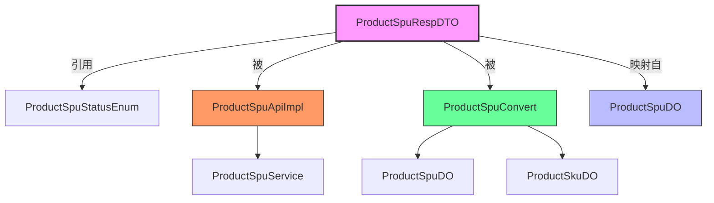
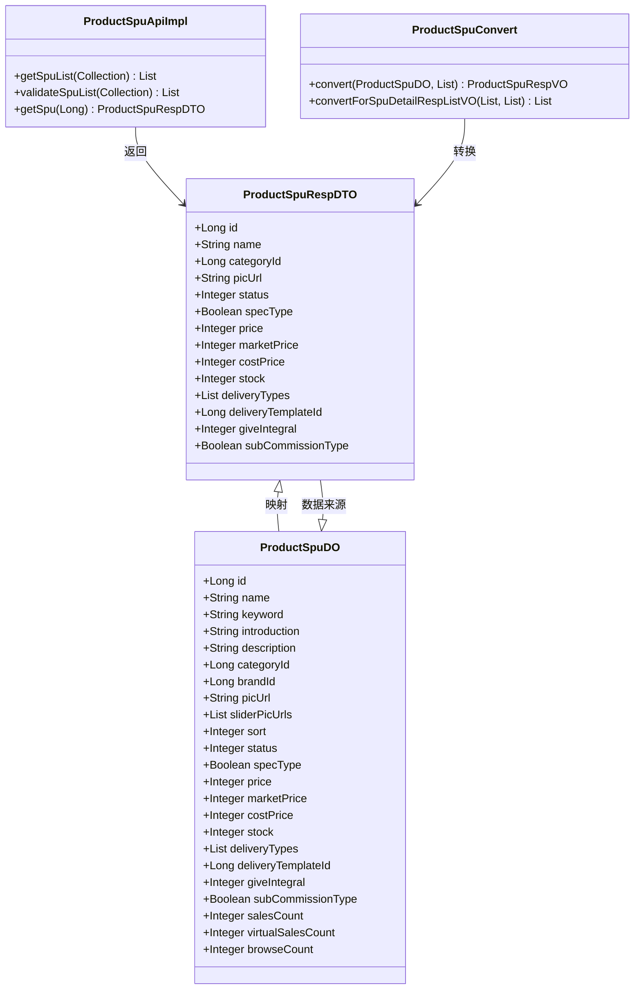
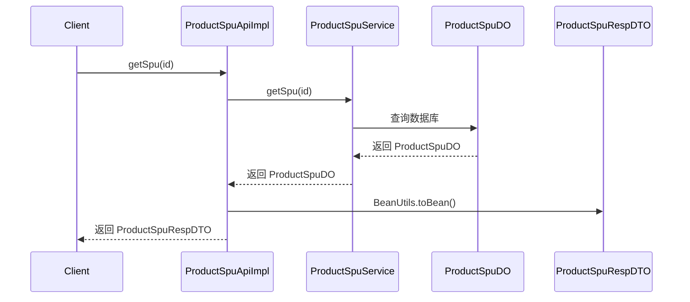

# Product SPU Response DTO (ProductSpuRespDTO)

## 概述

`ProductSpuRespDTO` 是商品 SPU（Standard Product Unit，标准产品单元）的响应数据传输对象，用于在系统内部和外部 API 之间传递商品 SPU 的详细信息。该 DTO 位于 `yudao-module-mall/yudao-module-product` 模块中，是商品管理系统（Mall/Product Module）的核心数据模型之一。

SPU 是商品信息的最小抽象单元，代表一类具有相同规格属性的商品。例如，"iPhone 15" 是一个 SPU，而不同颜色、存储容量的版本则是 SKU（Stock Keeping Unit）。

## 模块结构

```
yudao-module-mall/
└── yudao-module-product/
    ├── api/
    │   └── spu/
    │       └── dto/
    │           └── ProductSpuRespDTO.java  ← 本模块核心组件
    ├── controller/
    │   └── admin/
    │       └── spu/
    │           └── ProductSpuController.java
    ├── service/
    │   └── spu/
    │       └── ProductSpuServiceImpl.java
    ├── convert/
    │   └── spu/
    │       └── ProductSpuConvert.java
    └── dal/
        └── dataobject/
            └── spu/
                └── ProductSpuDO.java
```

## 核心组件

### ProductSpuRespDTO

```java
@Data
public class ProductSpuRespDTO {
    // ========== 主键 ==========
    private Long id;

    // ========== 基本信息 ==========
    private String name;              // 商品名称
    private Long categoryId;          // 商品分类编号
    private String picUrl;            // 商品封面图
    private Integer status;           // 商品状态 (枚举: ProductSpuStatusEnum)

    // ========== SKU 相关字段 ==========
    private Boolean specType;         // 规格类型 (false-单规格, true-多规格)
    private Integer price;            // 价格，单位：分
    private Integer marketPrice;      // 市场价，单位：分
    private Integer costPrice;        // 成本价，单位：分
    private Integer stock;            // 库存

    // ========== 物流相关字段 ==========
    private List<Integer> deliveryTypes;  // 配送方式数组 (对应 DeliveryTypeEnum)
    private Long deliveryTemplateId;      // 物流配置模板编号

    // ========== 营销相关字段 ==========
    private Integer giveIntegral;         // 赠送积分

    // ========== 分销相关字段 ==========
    private Boolean subCommissionType;    // 分销类型 (false-默认, true-自行设置)
}
```

### 字段说明

| 字段名 | 类型 | 说明 | 关联 |
|--------|------|------|------|
| id | Long | 商品 SPU 编号，自增主键 | - |
| name | String | 商品名称 | - |
| categoryId | Long | 商品分类编号 | `ProductCategoryDO` |
| picUrl | String | 商品封面图 | - |
| status | Integer | 商品状态 | `ProductSpuStatusEnum` |
| specType | Boolean | 规格类型 | false=单规格, true=多规格 |
| price | Integer | 价格（单位：分） | - |
| marketPrice | Integer | 市场价（单位：分） | - |
| costPrice | Integer | 成本价（单位：分） | - |
| stock | Integer | 库存 | 基于 SKU 库存求和 |
| deliveryTypes | List<Integer> | 配送方式数组 | `DeliveryTypeEnum` |
| deliveryTemplateId | Long | 物流配置模板编号 | `TradeDeliveryExpressTemplateDO` |
| giveIntegral | Integer | 赠送积分 | - |
| subCommissionType | Boolean | 分销类型 | false=默认, true=自行设置 |

## 依赖关系

### 架构依赖图



### 组件依赖关系



## 使用场景

### 1. API 服务层

`ProductSpuApiImpl` 是 SPU 的 API 实现类，提供对外暴露的 SPU 查询接口：

```java
@Service
@Validated
public class ProductSpuApiImpl implements ProductSpuApi {

    @Resource
    private ProductSpuService spuService;

    @Override
    public List<ProductSpuRespDTO> getSpuList(Collection<Long> ids) {
        List<ProductSpuDO> spus = spuService.getSpuList(ids);
        return BeanUtils.toBean(spus, ProductSpuRespDTO.class);
    }

    @Override
    public List<ProductSpuRespDTO> validateSpuList(Collection<Long> ids) {
        List<ProductSpuDO> spus = spuService.validateSpuList(ids);
        return BeanUtils.toBean(spus, ProductSpuRespDTO.class);
    }

    @Override
    public ProductSpuRespDTO getSpu(Long id) {
        ProductSpuDO spu = spuService.getSpu(id);
        return BeanUtils.toBean(spu, ProductSpuRespDTO.class);
    }
}
```

### 2. 数据转换层

`ProductSpuConvert` 负责将 DO（数据对象）转换为 VO（视图对象）和 DTO：

```java
@Mapper
public interface ProductSpuConvert {
    ProductSpuConvert INSTANCE = Mappers.getMapper(ProductSpuConvert.class);

    ProductSpuPageReqVO convert(AppProductSpuPageReqVO bean);

    default ProductSpuRespVO convert(ProductSpuDO spu, List<ProductSkuDO> skus) {
        ProductSpuRespVO spuVO = BeanUtils.toBean(spu, ProductSpuRespVO.class);
        spuVO.setSkus(BeanUtils.toBean(skus, ProductSkuRespVO.class));
        return spuVO;
    }
}
```

### 3. 前端调用

前端通过 API 接口获取 SPU 信息，使用 `ProductSpuRespDTO` 进行数据展示：

```typescript
// Vue 前端示例
import { getProductSpu } from '@/api/mall/product/spu'

const { data: spu } = await getProductSpu(spuId)
// spu 类型为 ProductSpuRespDTO
console.log(spu.name)  // 商品名称
console.log(spu.price) // 价格（分）
```

## 相关模块

| 模块 | 文件 | 说明 |
|------|------|------|
| **商品 DO** | `ProductSpuDO.java` | 数据库实体对象，包含更多字段（如销量、浏览量等） |
| **商品 API** | `ProductSpuApiImpl.java` | 对外暴露的 SPU 查询接口实现 |
| **商品转换** | `ProductSpuConvert.java` | DO/VO/DTO 之间的转换映射 |
| **商品服务** | `ProductSpuServiceImpl.java` | SPU 业务逻辑处理 |
| **商品控制器** | `ProductSpuController.java` | 管理后台 SPU 操作接口 |
| **前端 API** | `AppProductSpuController.java` | 移动端 SPU 查询接口 |

## 状态枚举

`ProductSpuRespDTO` 中的 `status` 字段使用 `ProductSpuStatusEnum` 枚举，对应的字典类型为 `product_spu_status`：

```java
// DictTypeConstants.java
public interface DictTypeConstants {
    String PRODUCT_SPU_STATUS = "product_spu_status";
}
```

常见状态值包括：
- `0`: 下架
- `1`: 上架
- `2`: 审核中

## 与其他模块的交互

### 1. 与 SKU 模块交互

SPU 包含多个 SKU，通过 `ProductSpuConvert` 将 SPU 和 SKU 信息合并：

```java
default ProductSpuRespVO convert(ProductSpuDO spu, List<ProductSkuDO> skus) {
    ProductSpuRespVO spuVO = BeanUtils.toBean(spu, ProductSpuRespVO.class);
    spuVO.setSkus(BeanUtils.toBean(skus, ProductSkuRespVO.class));
    return spuVO;
}
```

### 2. 与分类模块交互

`categoryId` 字段关联商品分类：



### 3. 与物流模块交互

`deliveryTemplateId` 字段关联物流模板配置，`deliveryTypes` 字段关联配送方式枚举。

## 设计要点

1. **字段精简**：`ProductSpuRespDTO` 相比 `ProductSpuDO` 字段更少，只包含 API 响应需要的字段，不包含统计字段（销量、浏览量等）。

2. **单位统一**：价格字段统一使用"分"作为单位，避免前端处理小数。

3. **枚举引用**：状态字段引用枚举类型，保证数据一致性。

4. **列表类型**：使用 `List<Integer>` 存储配送方式，支持多值选择。

5. **API 优先**：该 DTO 主要用于 API 响应，前端展示使用 `ProductSpuRespVO`（包含 SKU 列表的更详细视图）。

## 参考文档

- [商品模块文档](product_module.md)
- [SPU 与 SKU 概念说明](product_spu_sku.md)
- [数据转换层设计](convert_layer.md)
- [API 设计规范](api_design.md)
