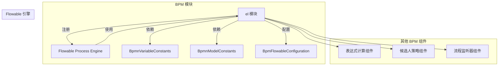
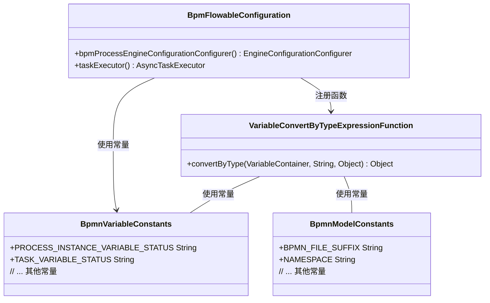

# EL 模块文档 (Expression Language Module)

## 1. 模块概述

`el` 模块是 BPM 模块中 Flowable 框架的扩展组件，主要用于提供自定义的 EL（Expression Language）函数，支持在流程表达式中进行变量类型转换等操作。该模块位于 `yudao-module-bpm/src/main/java/cn/iocoder/yudao/module/bpm/framework/flowable/core/el/` 路径下。

在 Flowable 工作流引擎中，EL 表达式常用于条件判断、任务分配、流程控制等场景。本模块通过扩展 Flowable 的函数注册机制，为 BPM 业务场景提供便捷的变量处理能力。

## 2. 架构关系



## 3. 核心组件

### 3.1 VariableConvertByTypeExpressionFunction

**文件路径**: `yudao-module-bpm/src/main/java/cn/iocoder/yudao/module/bpm/framework/flowable/core/el/VariableConvertByTypeExpressionFunction.java`

**功能描述**: 根据流程变量的类型，对表达式参数进行类型转换。这是一个 Flowable 自定义函数，可以在 BPMN 流程表达式中通过 `${convertByType(varName, value)} ` 的方式调用。

```java
@Deprecated // TODO @芋艿：兼容老版本，预计 27 年删除；
@Component
public class VariableConvertByTypeExpressionFunction extends AbstractFlowableVariableExpressionFunction {

    public VariableConvertByTypeExpressionFunction() {
        super("convertByType");
    }

    public static Object convertByType(VariableContainer variableContainer, String variableName, Object parmaValue) {
        Object variable = variableContainer.getVariable(variableName);
        if (variable != null && parmaValue != null) {
            // 如果值不是字符串类型，流程变量的类型是字符串，把值转成字符串
            if (!(parmaValue instanceof String) && variable instanceof String ) {
                return parmaValue.toString();
            }
        }
        return parmaValue;
    }

}
```

**关键逻辑**:
- 从 `VariableContainer` 中获取指定名称的流程变量
- 如果流程变量是字符串类型，而传入的参数不是字符串，则将参数转换为字符串
- 否则直接返回原参数

**使用场景**: 在流程表达式中，当需要确保参数类型与流程变量类型一致时使用。例如在条件表达式中传递参数时，避免类型不匹配导致的表达式解析错误。

**注意**: 该函数已标记为 `@Deprecated`，仅用于兼容旧版本，计划在 2027 年移除。

### 3.2 BpmnVariableConstants

**文件路径**: `yudao-module-bpm/src/main/java/cn/iocoder/yudao/module/bpm/framework/flowable/core/enums/BpmnVariableConstants.java`

**功能描述**: 定义流程实例和任务相关的常量变量名，供 EL 表达式和其他流程逻辑使用。

```java
public class BpmnVariableConstants {
    // 流程实例变量常量
    public static final String PROCESS_INSTANCE_VARIABLE_STATUS = "PROCESS_STATUS";
    public static final String PROCESS_INSTANCE_VARIABLE_REASON = "PROCESS_REASON";
    public static final String PROCESS_INSTANCE_VARIABLE_START_USER_ID = "PROCESS_START_USER_ID";
    
    // 任务变量常量
    public static final String TASK_VARIABLE_STATUS = "TASK_STATUS";
    public static final String TASK_VARIABLE_REASON = "TASK_REASON";
}
```

### 3.3 BpmnModelConstants

**文件路径**: `yudao-module-bpm/src/main/java/cn/iocoder/yudao/module/bpm/framework/flowable/core/enums/BpmnModelConstants.java`

**功能描述**: 定义 BPMN 模型相关的常量，包括命名空间、扩展属性等，用于流程模型的解析和扩展。

```java
public interface BpmnModelConstants {
    String BPMN_FILE_SUFFIX = ".bpmn";
    String NAMESPACE = "http://flowable.org/bpmn";
    String USER_TASK_CANDIDATE_STRATEGY = "candidateStrategy";
    String USER_TASK_CANDIDATE_PARAM = "candidateParam";
    // ... 其他常量
}
```

## 4. 配置与注册

### 4.1 BpmFlowableConfiguration

**文件路径**: `yudao-module-bpm/src/main/java/cn/iocoder/yudao/module/bpm/framework/flowable/config/BpmFlowableConfiguration.java`

该配置类负责注册 Flowable 引擎的自定义函数委托，包括 EL 模块中的函数：

```java
@Bean
public EngineConfigurationConfigurer<SpringProcessEngineConfiguration> bpmProcessEngineConfigurationConfigurer(
        ObjectProvider<FlowableEventListener> listeners,
        ObjectProvider<FlowableFunctionDelegate> customFlowableFunctionDelegates,
        BpmActivityBehaviorFactory bpmActivityBehaviorFactory) {
    return configuration -> {
        // 注册监听器
        configuration.setEventListeners(ListUtil.toList(listeners.iterator()));
        // 设置 ActivityBehaviorFactory
        configuration.setActivityBehaviorFactory(bpmActivityBehaviorFactory);
        // 注册自定义函数（包括 VariableConvertByTypeExpressionFunction）
        configuration.setCustomFlowableFunctionDelegates(ListUtil.toList(customFlowableFunctionDelegates.stream().iterator()));
    };
}
```

通过 `customFlowableFunctionDelegates` 参数，Spring 会自动注入所有实现了 `FlowableFunctionDelegate` 接口的 Bean（包括 `VariableConvertByTypeExpressionFunction`），并在 Flowable 引擎启动时完成注册。

## 5. 模块依赖关系



## 6. 与其他模块的交互

### 6.1 与表达式计算模块

`el` 模块中的函数被 BPM 模块的其他表达式计算组件使用，例如：

- `BpmTaskAssignLeaderExpression`: 在计算候选人时可能使用流程变量
- `BpmTaskAssignStartUserExpression`: 类似地使用流程变量

### 6.2 与监听器模块

流程监听器（如 `BpmProcessInstanceEventListener`、`BpmTaskEventListener`）在执行逻辑时，可能需要通过 EL 表达式访问流程变量，此时会用到 `el` 模块提供的函数。

### 6.3 与任务模块

任务相关操作（如任务分配、任务审核）中经常需要使用表达式来判断条件，`el` 模块提供的函数为这些表达式提供了类型转换支持。

## 7. 使用示例

在 BPMN 流程定义的条件表达式中，可以使用 `convertByType` 函数：

```xml
<!-- 示例：在条件表达式中使用 convertByType -->
<sequenceFlow id="flow1" sourceRef="userTask1" targetRef="userTask2">
    <conditionExpression xsi:type="tFormalExpression">
        ${convertByType('PROCESS_STATUS', status) == 'APPROVED'}
    </conditionExpression>
</sequenceFlow>
```

上述表达式中，`convertByType` 函数会将 `status` 参数转换为字符串类型（如果流程变量 `PROCESS_STATUS` 是字符串类型），然后进行比较。

## 8. 注意事项

1. **弃用警告**: `VariableConvertByTypeExpressionFunction` 已标记为 deprecated，建议在新项目中避免使用，或寻找替代方案。

2. **类型转换逻辑**: 该函数仅在特定条件下进行类型转换（目标变量为字符串且参数非字符串时），其他情况下直接返回原值。

3. **性能考虑**: 在高频调用的流程表达式中使用自定义函数可能会影响性能，建议谨慎使用。

4. **兼容性**: 由于该函数是为兼容旧版本而保留的，未来版本中可能会移除，需要提前做好迁移准备。

## 9. 参考文档

- [BPM 模块文档](bpm.md)
- [Flowable 官方文档](https://flowable.org/docs/)
- [BpmnVariableConstants](bpmn-constants.md)
- [BpmnModelConstants](bpmn-model-constants.md)