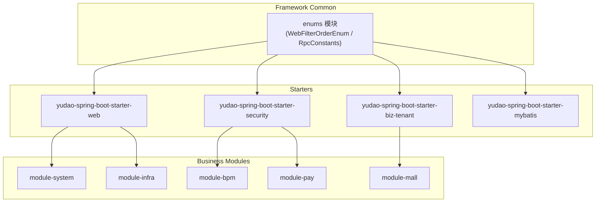
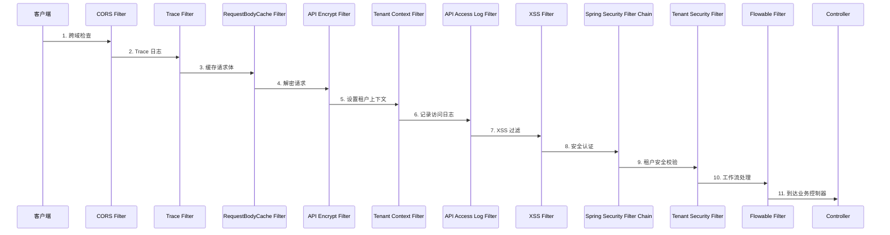
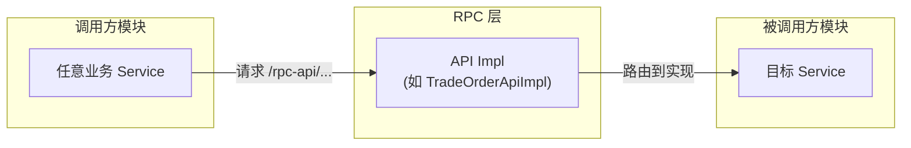

# 枚举与常量模块 (enums)

## 概述

`enums` 模块位于 `yudao-framework/yudao-common` 基础公共模块中，是框架最底层的枚举与常量定义模块。该模块提供了全局通用的枚举、常量接口，被所有业务模块（system、infra、bpm、crm、pay 等）共享引用。

其主要功能包括：

- **Web 过滤器顺序定义**：通过 `WebFilterOrderEnum` 统一管控全系统 Servlet Filter 的执行顺序，避免不同 Starter 之间的过滤器冲突。
- **RPC 调用前缀定义**：通过 `RpcConstants` 定义 RPC API 的统一请求前缀 `/rpc-api`，保障内部服务调用的路由一致性。

---

## 核心组件

### 1. WebFilterOrderEnum

**文件路径**：`yudao-framework/yudao-common/src/main/java/cn/iocoder/yudao/framework/common/enums/WebFilterOrderEnum.java`

**说明**：该接口定义了一组 `int` 常量，用于控制 Spring Boot Web 应用中各 `Filter` 的执行优先级。数值越小优先级越高（越先执行）。

| 常量名 | 顺序值 | 说明 |
|--------|--------|------|
| `CORS_FILTER` | `Integer.MIN_VALUE` | 跨域过滤器，最早执行 |
| `TRACE_FILTER` | `CORS_FILTER + 1` | Trace 日志过滤器 |
| `REQUEST_BODY_CACHE_FILTER` | `Integer.MIN_VALUE + 500` | 请求体缓存过滤器，用于多次读取 Body |
| `API_ENCRYPT_FILTER` | `REQUEST_BODY_CACHE_FILTER + 1` | API 加密/解密过滤器 |
| `TENANT_CONTEXT_FILTER` | `-104` | 多租户上下文过滤器，需在 ApiAccessLogFilter 之前 |
| `API_ACCESS_LOG_FILTER` | `-103` | API 访问日志过滤器，需在 RequestBodyCacheFilter 之后 |
| `XSS_FILTER` | `-102` | XSS 防跨站脚本过滤器，需在 RequestBodyCacheFilter 之后 |
| `TENANT_SECURITY_FILTER` | `-99` | 多租户安全过滤器，需在 Spring Security 过滤器（-100）之后 |
| `FLOWABLE_FILTER` | `-98` | Flowable 工作流过滤器，需在 Spring Security 之后 |
| `DEMO_FILTER` | `Integer.MAX_VALUE` | 演示模式过滤器，最后执行 |

**设计意图**：将过滤器顺序集中管理，使各 Starter（如 `yudao-spring-boot-starter-web`、`yudao-spring-boot-starter-security`、`yudao-spring-boot-starter-biz-tenant` 等）在注册 Filter 时统一引用该枚举，避免硬编码导致的顺序混乱。

### 2. RpcConstants

**文件路径**：`yudao-framework/yudao-common/src/main/java/cn/iocoder/yudao/framework/common/enums/RpcConstants.java`

**说明**：该接口定义了 RPC（Remote Procedure Call）相关的全局常量。

| 常量名 | 值 | 说明 |
|--------|-----|------|
| `RPC_API_PREFIX` | `/rpc-api` | 所有内部 RPC 接口的统一 URL 前缀 |

**设计意图**：将 RPC 前缀独立定义为常量，确保各模块（如 `BpmProcessInstanceApiImpl`、`TradeOrderApiImpl`、`PayOrderApiImpl` 等）在暴露内部 API 时使用统一的前缀路径，便于网关或安全层统一拦截与鉴权。

---

## 架构图

### 模块定位与依赖关系

### WebFilterOrderEnum 过滤器链执行顺序

### RPC 调用链路

---

## 与其他模块的关联

| 引用方 | 引用目的 |
|--------|----------|
| `yudao-spring-boot-starter-web` | 使用 `WebFilterOrderEnum` 注册 CORS、RequestBodyCache、XSS、API Encrypt 等 Filter 的顺序 |
| `yudao-spring-boot-starter-security` | 使用 `WebFilterOrderEnum` 确保 Spring Security 前后的自定义 Filter 顺序正确 |
| `yudao-spring-boot-starter-biz-tenant` | 使用 `WebFilterOrderEnum.TENANT_CONTEXT_FILTER` 和 `TENANT_SECURITY_FILTER` 注册租户相关 Filter |
| `yudao-spring-boot-starter-biz-data-permission` | 间接使用 Filter 顺序机制确保数据权限过滤器在正确位置执行 |
| 所有业务模块（system、bpm、pay、mall 等） | 使用 `RpcConstants.RPC_API_PREFIX` 定义内部 API 的 RequestMapping 路径 |

---

## 相关文档

- [Web 模块配置文档](config_23.md) - 了解 Web 自动配置如何注册各 Filter
- [安全模块配置文档](config_17.md) - 了解 Spring Security 过滤器链的配置
- [多租户模块配置文档](config_2.md) - 了解租户上下文和安全过滤器的注册
- [加密模块配置文档](config_20.md) - 了解 API 加密过滤器的使用
- [XSS 模块配置文档](config_24.md) - 了解 XSS 过滤器的使用

> **提示**：`WebFilterOrderEnum` 和 `RpcConstants` 属于框架基础设施级枚举，被所有模块依赖。如需了解各业务模块自身定义的枚举（如 `DictTypeConstants`、`LogRecordConstants`），请参见对应模块的文档。
