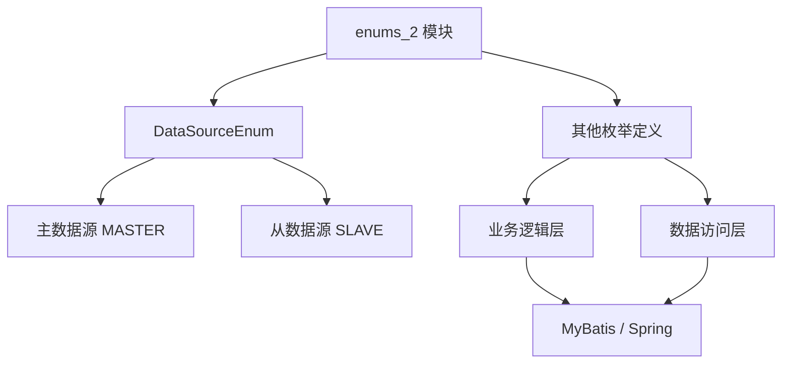

# enums_2 模块文档

## 概述

`enums_2` 模块是 Yudao 框架中的一个核心模块，主要用于管理和定义系统中使用的枚举类型。该模块通过提供统一的枚举管理机制，确保系统中枚举的定义和使用的一致性，同时提高代码的可维护性和可读性。

### 模块功能

1. **枚举定义管理**：提供了一个集中的地方来定义和管理系统中使用的所有枚举类型。
2. **枚举值统一**：确保枚举值在整个系统中的一致性，避免重复定义和冲突。
3. **枚举工具类**：提供了一些工具类和方法，方便开发者在业务逻辑中使用枚举。
4. **与其他模块的集成**：与 MyBatis、Spring Boot 等框等集成，支持枚举的自动映射和持久化。

### 模块结构

```
enums_2/
├── core/
│   └── DataSourceEnum.java  # 数据源枚举定义
└── ...
```

---

## 架构设计

### 核心组件

#### 1. DataSourceEnum

**文件位置**：
```
yudao-framework/yudao-spring-boot-starter-mybatis/src/main/java/cn/iocoder/yudao/framework/datasource/core/enums/DataSourceEnum.java
```

**功能描述**：
`DataSourceEnum` 是一个接口，用于定义系统中使用的数据源枚举。它提供了两个常量：
- `MASTER`：主数据源，用于读写操作。
- `SLAVE`：从数据源，用于只读操作。

**代码实现**：
```java
package cn.iocoder.yudao.framework.datasource.core.enums;

/**
 * 对应于多数据源中不同数据源配置
 *
 * 通过在方法上，使用 {@link com.baomidou.dynamic.datasource.annotation.DS} 注解，设置使用的数据源。
 * 注意，默认是 {@link #MASTER} 数据源
 *
 * 对应官方文档为 http://dynamic-datasource.com/guide/customize/Annotation.html
 */
public interface DataSourceEnum {

    /**
     * 主库，推荐使用 {@link com.baomidou.dynamic.datasource.annotation.Master} 注解
     */
    String MASTER = "master";
    /**
     * 从库，推荐使用 {@link com.baomidou.dynamic.datasource.annotation.Slave} 注解
     */
    String SLAVE = "slave";

}
```

**使用场景**：
- 在使用多数据源时，通过 `@DS` 注解指定使用的数据源。例如：
  ```java
  @Service
  @DS(DataSourceEnum.MASTER) // 指定使用主数据源
  public class UserService {
      // ...
  }
  ```

---

### 架构图



---

## API 说明

### DataSourceEnum

| 方法/属性 | 类型 | 描述 | 示例 |
|-----------|------|------|------|
| `MASTER` | String | 主数据源标识 | `DataSourceEnum.MASTER` |
| `SLAVE` | String | 从数据源标识 | `DataSourceEnum.SLAVE` |

---

## 与其他模块的关系

### 1. MyBatis 模块
- **关系**：`enums_2` 模块与 MyBatis 模块紧密集成，用于处理数据源的选择和切换。
- **依赖**：`enums_2` 模块提供的 `DataSourceEnum` 枚举被 MyBatis 动态数据源模块用于注解驱动的数据源切换。
- **参考文档**：[MyBatis 动态数据源文档](http://dynamic-datasource.com/guide/customize/Annotation.html)

### 2. Spring Boot 模块
- **关系**：`enums_2` 模块与 Spring Boot 的自动配置机制集成，确保枚举的定义和使用符合 Spring Boot 的规范。
- **依赖**：通过 Spring Boot 的自动配置，`enums_2` 模块可以自动注册和管理枚举类型。

---

## 使用示例

### 1. 定义数据源选择

在服务类中使用 `@DS` 注解指定数据源：

```java
package cn.iocoder.yudao.module.system.service.user;

import cn.iocoder.yudao.framework.datasource.core.enums.DataSourceEnum;
import com.baomidou.dynamic.datasource.annotation.DS;
import org.springframework.stereotype.Service;

@Service
@DS(DataSourceEnum.MASTER) // 指定使用主数据源
public class AdminUserServiceImpl implements AdminUserService {

    @Override
    public AdminUserDO getUserById(Long id) {
        // ... 业务逻辑
    }
}
```

### 2. 在 Mapper 中使用数据源

在 Mapper 接口中，可以通过 `@DS` 注解指定数据源：

```java
package cn.iocoder.yudao.module.system.dal.mysql.user;

import cn.iocoder.yudao.framework.datasource.core.enums.DataSourceEnum;
import cn.iocoder.yudao.module.system.dal.dataobject.user.AdminUserDO;
import com.baomidou.dynamic.datasource.annotation.DS;
import com.baomidou.mybatisplus.core.mapper.BaseMapper;
import org.apache.ibatis.annotations.Mapper;

@Mapper
@DS(DataSourceEnum.MASTER) // 指定使用主数据源
public interface AdminUserMapper extends BaseMapper<AdminUserDO> {
    // ...
}
```

---

## 最佳实践

1. **统一枚举管理**：
   - 将系统中所有的枚举定义集中在 `enums_2` 模块中，避免分散定义。
   - 使用统一的命名规范，例如 `枚举类名 + Enum` 后缀。

2. **枚举值设计**：
   - 枚举值应当简洁明了，便于理解和维护。
   - 为每个枚举值提供详细的注释，说明其用途和使用场景。

3. **与数据库集成**：
   - 在数据库设计中，使用枚举值的字符串表示，避免使用数字或其他不明确的标识。
   - 通过 MyBatis 的类型处理器（TypeHandler）将枚举值与数据库字段进行映射。

4. **与前端交互**：
   - 在 API 接口中，将枚举值返回给前端时，可以通过枚举类的 `name()` 或 `toString()` 方法返回枚举值的字符串表示。
   - 前端可以根据枚举值进行相应的业务逻辑处理。

---

## 常见问题与解决方案

### 1. 枚举值冲突

**问题**：在系统中定义了多个枚举类，但发现枚举值冲突。

**解决方案**：
- 确保每个枚举类的值在其定义的上下文中是唯一的。
- 可以通过在枚举值前加上枚举类名前缀来避免冲突，例如：`USER_STATUS_ENABLED`。

### 2. 枚举与数据库映射问题

**问题**：枚举值在数据库中存储为字符串，但在查询时无法正确映射回枚举对象。

**解决方案**：
- 使用 MyBatis 的 `TypeHandler` 来处理枚举与数据库字段的映射。
- 例如：
  ```java
  @MappedTypes(AdminUserStatusEnum.class)
  public class AdminUserStatusTypeHandler extends BaseTypeHandler<AdminUserStatusEnum> {
      // ... 实现枚举与数据库字段的转换逻辑
  }
  ```

### 3. 枚举在分布式环境下的同步

**问题**：在分布式环境下，不同节点上的枚举定义可能不一致。

**解决方案**：
- 将枚举定义集中存储在一个共享的模块中，例如 `enums_2` 模块。
- 确保所有节点使用相同版本的 `enums_2` 模块。
- 通过 CI/CD 流程确保枚举定义的同步。

---

## 总结

`enums_2` 模块为 Yudao 框架提供了统一的枚举管理机制，确保系统中枚举的定义和使用的一致性。通过与 MyBatis、Spring Boot 等框架的无缝集成，该模块简化了枚举的定义和使用，提高了代码的可维护性和可读性。开发者可以通过遵循本文档中的最佳实践和使用示例，高效地使用 `enums_2` 模块来管理系统中的枚举类型。