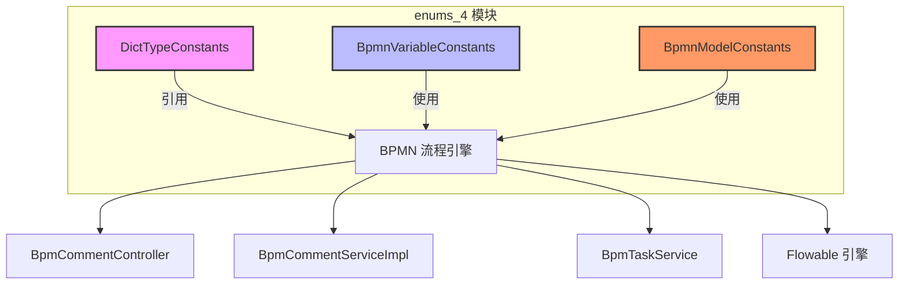
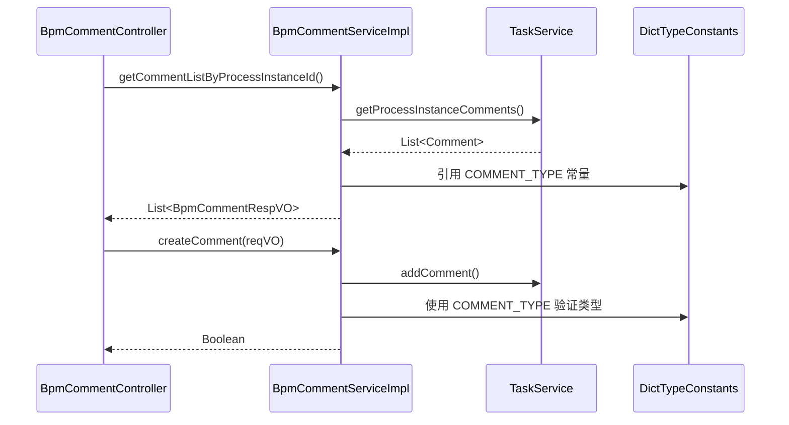
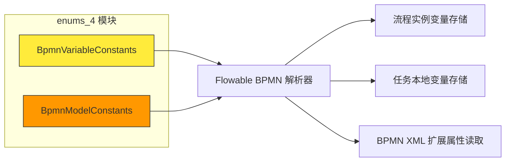

# enums_4 模块文档

## 概述

`enums_4` 模块是 BPM（业务流程管理）模块中的核心枚举常量定义包，位于 `yudao-module-bpm/src/main/java/cn/iocoder/yudao/module/bpm/enums/` 目录下。该模块集中定义了 BPM 流程引擎相关的各种枚举常量和配置参数，为整个 BPM 模块提供统一的常量引用，避免硬编码值，提高代码的可维护性和可读性。

本模块主要包含以下三个核心组件：

| 组件名 | 文件路径 | 说明 |
|--------|----------|------|
| DictTypeConstants | `DictTypeConstants.java` | 字典类型常量定义 |
| BpmnVariableConstants | `BpmnVariableConstants.java` | 流程实例和任务变量常量定义 |
| BpmnModelConstants | `BpmnModelConstants.java` | BPMN 模型扩展属性常量定义 |

## 架构关系



## 核心组件详解

### 1. DictTypeConstants - 字典类型常量

**文件路径**: `yudao-module-bpm/src/main/java/cn/iocoder/yudao/module/bpm/enums/DictTypeConstants.java`

该类定义了 BPM 模块中使用的字典类型常量，主要用于数据字典的分类标识。

```java
public interface DictTypeConstants {

    String COMMENT_TYPE = "bpm_comment_type";

}
```

- **COMMENT_TYPE**: `"bpm_comment_type"` - 评论类型的字典键值，用于区分不同类型的评论（如系统评论、用户评论等）。该常量在 `BpmCommentController` 和 `BpmCommentServiceImpl` 中被使用，配合字典服务实现评论类型的下拉选择和展示。

**使用场景**:
- 在 UI 界面中获取评论类型选项列表
- 在数据库表中存储评论类型时作为分类标识
- 与系统其他模块的字典管理功能集成

### 2. BpmnVariableConstants - 流程变量常量

**文件路径**: `yudao-module-bpm/src/main/java/cn/iocoder/yudao/module/bpm/framework/flowable/core/enums/BpmnVariableConstants.java`

该类定义了 Flowable 流程引擎中流程实例和任务级别的变量命名规范，分为流程实例变量和任务变量两大类。

#### 流程实例变量

| 常量名 | 值 | 说明 |
|--------|-----|------|
| PROCESS_INSTANCE_VARIABLE_STATUS | `"PROCESS_STATUS"` | 流程实例的状态变量 |
| PROCESS_INSTANCE_VARIABLE_REASON | `"PROCESS_REASON"` | 流程实例的理由变量（如审批不通过的原因） |
| PROCESS_INSTANCE_VARIABLE_START_USER_SELECT_ASSIGNEES | `"PROCESS_START_USER_SELECT_ASSIGNEES"` | 发起用户选择的审批人 Map |
| PROCESS_INSTANCE_VARIABLE_APPROVE_USER_SELECT_ASSIGNEES | `"PROCESS_APPROVE_USER_SELECT_ASSIGNEES"` | 审批人选择的审批人 Map |
| PROCESS_INSTANCE_VARIABLE_START_USER_ID | `"PROCESS_START_USER_ID"` | 流程发起用户 ID |
| PROCESS_INSTANCE_VARIABLE_RETURN_FLAG | `"RETURN_FLAG_%s"` | 判断流程实例节点是否驳回的标记（格式带节点 ID） |
| PROCESS_INSTANCE_VARIABLE_NEED_SIMULATE_TASK_IDS | `"NEED_SIMULATE_TASK_IDS"` | 退回操作需要预测的任务 ID 集合 |
| PROCESS_INSTANCE_SKIP_EXPRESSION_ENABLED | `"_FLOWABLE_SKIP_EXPRESSION_ENABLED"` | 是否跳过表达式标志 |
| PROCESS_INSTANCE_VARIABLE_SKIP_START_USER_NODE | `"PROCESS_SKIP_START_USER_NODE"` | 是否跳过发起人节点标志 |
| PROCESS_START_TIME | `"PROCESS_START_TIME"` | 流程开始时间（非存储变量） |
| PROCESS_DEFINITION_NAME | `"PROCESS_DEFINITION_NAME"` | 流程定义名称 |

#### 任务变量

| 常量名 | 值 | 说明 |
|--------|-----|------|
| TASK_VARIABLE_STATUS | `"TASK_STATUS"` | 任务状态变量 |
| TASK_VARIABLE_REASON | `"TASK_REASON"` | 任务理由变量（如审批通过/不通过的理由） |
| TASK_SIGN_PIC_URL | `"TASK_SIGN_PIC_URL"` | 任务签名图片 URL |

**使用场景**:
- 在流程监听器中读取/设置流程变量
- 在任务处理业务逻辑中获取上下文信息
- 实现自定义的流程分支逻辑
- 记录审批意见和理由

### 3. BpmnModelConstants - BPMN 模型扩展属性常量

**文件路径**: `yudao-module-bpm/src/main/java/cn/iocoder/yudao/module/bpm/framework/flowable/core/enums/BpmnModelConstants.java`

该类定义了 BPMN 流程模型中扩展属性的命名规范，这些属性通过 BPMN 文件的 ExtensionElement 进行自定义配置，用于实现 Flowable 引擎的扩展功能。

#### 基础常量

| 常量名 | 值 | 说明 |
|--------|-----|------|
| BPMN_FILE_SUFFIX | `".bpmn"` | BPMN 文件后缀 |
| NAMESPACE | `"http://flowable.org/bpmn"` | BPMN 命名空间 |

#### UserTask 扩展属性

| 常量名 | 值 | 说明 |
|--------|-----|------|
| USER_TASK_CANDIDATE_STRATEGY | `"candidateStrategy"` | 候选人策略标记 |
| USER_TASK_CANDIDATE_PARAM | `"candidateParam"` | 候选人参数标记 |
| USER_TASK_APPROVE_TYPE | `"approveType"` | 审批类型标记 |
| USER_TASK_APPROVE_METHOD | `"approveMethod"` | 审批方式标记 |

#### 边界事件和超时处理

| 常量名 | 值 | 说明 |
|--------|-----|------|
| BOUNDARY_EVENT_TYPE | `"boundaryEventType"` | 边界事件类型标记 |
| USER_TASK_TIMEOUT_HANDLER_TYPE | `"timeoutHandlerType"` | 用户任务超时执行动作标记 |

#### 特殊处理标记

| 常量名 | 值 | 说明 |
|--------|-----|------|
| USER_TASK_ASSIGN_START_USER_HANDLER_TYPE | `"assignStartUserHandlerHandlerType"` | 审批人与发起人相同时的处理类型 |
| USER_TASK_ASSIGN_EMPTY_HANDLER_TYPE | `"assignEmptyHandlerType"` | 空处理类型 |
| USER_TASK_ASSIGN_USER_IDS | `"assignEmptyUserIds"` | 空处理的指定用户数组 |
| USER_TASK_REJECT_HANDLER_TYPE | `"rejectHandlerType"` | 拒绝处理类型 |
| USER_TASK_REJECT_RETURN_TASK_ID | `"rejectReturnTaskId"` | 拒绝后退回的任务 ID |

#### Child Process 扩展

| 常量名 | 值 | 说明 |
|--------|-----|------|
| CHILD_PROCESS_MULTI_INSTANCE_SOURCE_TYPE | `"childProcessMultiInstanceSourceType"` | 多实例来源类型标记 |

#### 表单权限扩展

| 常量名 | 值 | 说明 |
|--------|-----|------|
| FORM_FIELD_PERMISSION_ELEMENT | `"fieldsPermission"` | 字段权限元素标记 |
| FORM_FIELD_PERMISSION_ELEMENT_FIELD_ATTRIBUTE | `"field"` | 表单字段属性 |
| FORM_FIELD_PERMISSION_ELEMENT_PERMISSION_ATTRIBUTE | `"permission"` | 表单权限属性 |

#### 按钮设置扩展

| 常量名 | 值 | 说明 |
|--------|-----|------|
| BUTTON_SETTING_ELEMENT | `"buttonsSetting"` | 操作按钮设置元素 |
| BUTTON_SETTING_ELEMENT_ID_ATTRIBUTE | `"id"` | 按钮编号属性 |
| BUTTON_SETTING_ELEMENT_DISPLAY_NAME_ATTRIBUTE | `"displayName"` | 按钮显示名称属性 |
| BUTTON_SETTING_ELEMENT_ENABLE_ATTRIBUTE | `"enable"` | 按钮启用属性 |

#### 触发器扩展

| 常量名 | 值 | 说明 |
|--------|-----|------|
| TRIGGER_TYPE | `"triggerType"` | 触发器类型标记 |
| TRIGGER_PARAM | `"triggerParam"` | 触发器参数标记 |

#### 节点标识

| 常量名 | 值 | 说明 |
|--------|-----|------|
| START_EVENT_NODE_ID | `"StartEvent"` | Start Event 节点 ID |
| START_USER_NODE_ID | `"StartUserNode"` | 发起人节点 ID |

#### 其他配置标记

| 常量名 | 值 | 说明 |
|--------|-----|------|
| SIGN_ENABLE | `"signEnable"` | 是否需要签名 |
| REASON_REQUIRE | `"reasonRequire"` | 审批意见是否必填 |
| NODE_TYPE | `"nodeType"` | 节点类型（审批节点/办理节点） |

**使用场景**:
- 在 BPMN 解析器中读取扩展属性配置
- 在流程设计器中保存自定义配置到 BPMN XML
- 在运行时根据扩展属性执行特定逻辑
- 实现审批节点的自定义行为（如自动审批、条件分支等）

## 模块交互关系

### 与 BPM 评论模块的交互



### 与 Flowable 引擎的交互



## 使用示例

### 1. 在 Controller 中使用 DictTypeConstants

```java
// BpmCommentController.java
@GetMapping("/list-by-process-instance-id")
public CommonResult<List<BpmCommentRespVO>> getCommentListByProcessInstanceId(
        @RequestParam("processInstanceId") String processInstanceId) {
    // 使用 DictTypeConstants.COMMENT_TYPE 进行类型过滤
    List<Comment> commentList = commentService.getCommentListByProcessInstanceId(processInstanceId);
    // ...
}
```

### 2. 在 Service 中使用 BpmnVariableConstants

```java
// BpmCommentServiceImpl.java
public void createComment(String taskId, String processInstanceId, BpmCommentTypeEnum type, Object... params) {
    // 使用 BpmnVariableConstants.PROCESS_INSTANCE_VARIABLE_REASON 设置流程变量
    taskService.addComment(taskId, processInstanceId, type.getType(), type.formatComment(params));
}
```

### 3. 在 BPMN 解析中使用 BpmnModelConstants

```java
// 伪代码示例 - BPMN 解析器
if (userTask.hasExtensionElement(BpmnModelConstants.USER_TASK_CANDIDATE_STRATEGY)) {
    String strategy = userTask.getExtensionElement(BpmnModelConstants.USER_TASK_CANDIDATE_STRATEGY);
    // 根据候选人策略执行不同的任务分配逻辑
}
```

## 与其他模块的关系

| 模块 | 依赖关系 | 说明 |
|------|----------|------|
| bpm 模块 | 直接依赖 | 本模块的核心使用者，用于流程变量管理和 BPMN 扩展 |
| system 模块 | 间接依赖 | 通过 DictTypeConstants 与系统字典模块集成 |
| ai 模块 | 间接依赖 | AI 模块也有自己的 DictTypeConstants，遵循相同的设计模式 |
| crm 模块 | 间接依赖 | CRM 模块同样使用字典类型常量 |

## 总结

`enums_4` 模块作为 BPM 模块的基础支撑层，提供了以下核心价值：

1. **统一常量管理**: 集中定义所有流程相关的常量，避免魔法值和硬编码
2. **命名规范**: 为流程变量和 BPMN 扩展属性提供标准化的命名前缀和格式
3. **可扩展性**: 通过清晰的常量定义，便于后续添加新的流程变量或扩展属性
4. **可维护性**: 当需要修改常量值时，只需在此处修改，无需遍历全项目

该模块虽然代码量不大，但在整个 BPM 流程引擎中扮演着至关重要的角色，是连接 Flowable 引擎与业务逻辑的桥梁。
