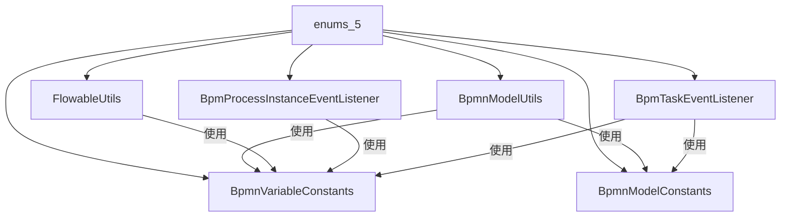

# enums_5 模块文档

## 模块概述

`enums_5` 模块是 BPM（业务流程管理）模块中 Flowable 引擎的核心常量定义模块，位于 `yudao-module-bpm/src/main/java/cn/iocoder/yudao/module/bpm/framework/flowable/core/enums/` 路径下。该模块主要定义了 BPMN 流程变量和 BPMN XML 模型相关的常量，为整个 BPM 流程引擎提供统一的常量引用，避免硬编码字符串，提高代码的可维护性和可读性。

## 模块结构

```
enums_5/
├── BpmnVariableConstants.java  // BPMN 流程变量常量
└── BpmnModelConstants.java     // BPMN 模型扩展元素常量
```

## 核心组件

### 1. BpmnVariableConstants

**文件路径：** `yudao-module-bpm/src/main/java/cn/iocoder/yudao/module/bpm/framework/flowable/core/enums/BpmnVariableConstants.java`

**功能描述：** 定义 BPMN 流程实例（Process Instance）和任务（Task）中使用的变量键名常量。这些常量用于在流程执行过程中存储和获取流程状态、审批原因、审批人选择等关键信息。

### 2. BpmnModelConstants

**文件路径：** `yudao-module-bpm/src/main/java/cn/iocoder/yudao/module/bpm/framework/flowable/core/enums/BpmnModelConstants.java`

**功能描述：** 定义 BPMN XML 模型中扩展元素（Extension Element）和扩展属性（Extension Attribute）的常量名称。这些常量用于在 BPMN 文件中存储自定义的审批策略、表单权限、按钮设置等扩展配置。

---

## BpmnVariableConstants 详细说明

该常量类定义了流程实例和任务级别的变量键名，分为两个主要部分：

### 流程实例变量（Process Instance Variables）

| 常量名 | 说明 |
|--------|------|
| `PROCESS_INSTANCE_VARIABLE_STATUS` | 流程实例的状态变量 |
| `PROCESS_INSTANCE_VARIABLE_REASON` | 流程实例的审批原因（如不通过理由） |
| `PROCESS_INSTANCE_VARIABLE_START_USER_SELECT_ASSIGNEES` | 发起用户选择的审批人 Map |
| `PROCESS_INSTANCE_VARIABLE_APPROVE_USER_SELECT_ASSIGNEES` | 审批人选择的下一个节点审批人 Map |
| `PROCESS_INSTANCE_VARIABLE_START_USER_ID` | 流程发起用户 ID |
| `PROCESS_INSTANCE_VARIABLE_RETURN_FLAG` | 判断流程实例变量节点是否驳回的标记（格式：`RETURN_FLAG_{节点 id}`） |
| `PROCESS_INSTANCE_VARIABLE_NEED_SIMULATE_TASK_IDS` | 退回操作时需要预测的任务节点 ID 集合 |
| `PROCESS_INSTANCE_SKIP_EXPRESSION_ENABLED` | 是否跳过表达式（用于自动审批） |
| `PROCESS_INSTANCE_VARIABLE_SKIP_START_USER_NODE` | 判断是否跳过发起人节点 |
| `PROCESS_START_TIME` | 流程开始时间（非存储变量，用于格式化场景） |
| `PROCESS_DEFINITION_NAME` | 流程定义名称 |

### 任务变量（Task Variables）

| 常量名 | 说明 |
|--------|------|
| `TASK_VARIABLE_STATUS` | 任务状态 |
| `TASK_VARIABLE_REASON` | 任务审批原因 |
| `TASK_SIGN_PIC_URL` | 任务签名图片 URL |

**使用示例：**
```java
// 在流程实例中设置状态
processVariables.put(BpmnVariableConstants.PROCESS_INSTANCE_VARIABLE_STATUS, status);

// 在任务中获取审批原因
String reason = (String) task.getTaskLocalVariables().get(BpmnVariableConstants.TASK_VARIABLE_REASON);
```

---

## BpmnModelConstants 详细说明

该接口定义了 BPMN XML 模型中各种扩展元素和属性的常量名称，主要用于在 BPMN 文件中存储自定义配置。

### BPMN 基础常量

| 常量名 | 说明 |
|--------|------|
| `BPMN_FILE_SUFFIX` | BPMN 文件后缀 `.bpmn` |
| `NAMESPACE` | BPMN 命名空间 `http://flowable.org/bpmn` |

### UserTask 扩展属性

| 常量名 | 说明 |
|--------|------|
| `USER_TASK_CANDIDATE_STRATEGY` | 候选人策略扩展属性 |
| `USER_TASK_CANDIDATE_PARAM` | 候选人参数扩展属性 |
| `USER_TASK_APPROVE_TYPE` | 审批类型扩展属性 |
| `USER_TASK_APPROVE_METHOD` | 审批方式扩展属性 |
| `USER_TASK_TIMEOUT_HANDLER_TYPE` | 用户任务超时执行动作 |
| `USER_TASK_ASSIGN_START_USER_HANDLER_TYPE` | 审批人与发起人相同时的处理类型 |
| `USER_TASK_ASSIGN_EMPTY_HANDLER_TYPE` | 用户任务空处理类型 |
| `USER_TASK_ASSIGN_USER_IDS` | 空处理的指定用户编号数组 |
| `USER_TASK_REJECT_HANDLER_TYPE` | 用户任务拒绝处理类型 |
| `USER_TASK_REJECT_RETURN_TASK_ID` | 拒绝后退回的任务 ID |

### 边界事件扩展属性

| 常量名 | 说明 |
|--------|------|
| `BOUNDARY_EVENT_TYPE` | 边界事件类型 |

### 子流程多实例来源

| 常量名 | 说明 |
|--------|------|
| `CHILD_PROCESS_MULTI_INSTANCE_SOURCE_TYPE` | 多实例来源类型 |

### 表单字段权限

| 常量名 | 说明 |
|--------|------|
| `FORM_FIELD_PERMISSION_ELEMENT` | 表单字段权限元素 |
| `FORM_FIELD_PERMISSION_ELEMENT_FIELD_ATTRIBUTE` | 表单字段属性 |
| `FORM_FIELD_PERMISSION_ELEMENT_PERMISSION_ATTRIBUTE` | 表单权限属性 |

### 操作按钮设置

| 常量名 | 说明 |
|--------|------|
| `BUTTON_SETTING_ELEMENT` | 操作按钮设置元素 |
| `BUTTON_SETTING_ELEMENT_ID_ATTRIBUTE` | 按钮编号 |
| `BUTTON_SETTING_ELEMENT_DISPLAY_NAME_ATTRIBUTE` | 按钮显示名称 |
| `BUTTON_SETTING_ELEMENT_ENABLE_ATTRIBUTE` | 按钮是否启用 |

### 触发器

| 常量名 | 说明 |
|--------|------|
| `TRIGGER_TYPE` | 触发器类型 |
| `TRIGGER_PARAM` | 触发器参数 |

### 节点特殊标记

| 常量名 | 说明 |
|--------|------|
| `START_EVENT_NODE_ID` | StartEvent 节点 ID |
| `START_USER_NODE_ID` | 发起人节点 ID |
| `SIGN_ENABLE` | 是否需要签名 |
| `REASON_REQUIRE` | 审批意见是否必填 |
| `NODE_TYPE` | 节点类型（区分审批节点/办理节点） |

---

## 模块关系与依赖

### 依赖关系图



### 核心依赖模块

| 模块 | 依赖说明 |
|------|----------|
| **BPMN 模型工具类** (`BpmnModelUtils`) | 大量使用 `BpmnModelConstants` 中的扩展元素名称来添加/解析 BPMN 模型的自定义属性 |
| **Flowable 工具类** (`FlowableUtils`) | 使用 `BpmnVariableConstants` 来访问流程实例和任务的变量 |
| **流程实例监听器** (`BpmProcessInstanceEventListener`) | 使用 `BpmnVariableConstants` 获取流程实例状态和原因 |
| **任务监听器** (`BpmTaskEventListener`) | 使用 `BpmnVariableConstants` 获取任务状态、原因和签名 URL |

### 跨模块引用

- **BPM 模块其他组件**：`BpmnModelConstants` 被 `BpmnModelUtils`、`FlowableUtils`、`BpmTaskEventListener` 等多个核心组件引用
- **UI 层**：通过 API 返回的 BPMN 模型数据中包含了这些扩展属性的值
- **其他模块**：如 CRM、ERP 等模块在集成 BPM 流程时也会间接使用这些常量

---

## 使用场景示例

### 场景 1：设置审批节点候选人策略

```java
// 在 BPMN 模型中添加候选人策略扩展属性
BpmnModelUtils.addCandidateElements(
    BpmTaskCandidateStrategyEnum.DEPT_LEADER.getValue(), 
    userTask,
    flowElement
);
// 底层调用：addExtensionElement(element, BpmnModelConstants.USER_TASK_CANDIDATE_STRATEGY, strategy.toString())
```

### 场景 2：获取流程实例状态

```java
// 从流程实例变量中获取状态
Integer status = FlowableUtils.getProcessInstanceStatus(processInstance);
// 底层调用：processVariables.get(BpmnVariableConstants.PROCESS_INSTANCE_VARIABLE_STATUS)
```

### 场景 3：获取任务审批原因

```java
// 从任务局部变量中获取审批原因
String reason = FlowableUtils.getTaskReason(task);
// 底层调用：task.getTaskLocalVariables().get(BpmnVariableConstants.TASK_VARIABLE_REASON)
```

### 场景 4：解析 BPMN 扩展元素

```java
// 解析用户任务的审批类型
Integer approveType = BpmnModelUtils.parseApproveType(userTask);
// 底层调用：parseExtensionElement(userTask, BpmnModelConstants.USER_TASK_APPROVE_TYPE)
```

---

## 设计要点

1. **常量集中管理**：所有 BPMN 相关的字符串常量集中定义，避免多处硬编码，便于统一维护
2. **命名规范**：采用 `PASCAL_CASE` 命名风格，前缀清晰区分变量（`VARIABLE`）和模型（`MODEL`）相关常量
3. **扩展性强**：通过扩展元素（Extension Element）机制，可以在标准 BPMN 基础上灵活添加自定义属性
4. **与 Flowable 深度集成**：常量命名与 Flowable 引擎的变量命名规范保持一致，便于与原生 Flowable 功能对接

## 相关文档

- [BPM 模块主文档](bpm.md) - BPM 模块整体架构和功能说明
- [BpmnModelUtils 工具类](bpmn_model_utils.md) - BPMN 模型操作工具类文档
- [Flowable 工具类](flowable_utils.md) - Flowable 引擎工具类文档
- [监听器机制](listener.md) - BPM 事件监听器实现说明
