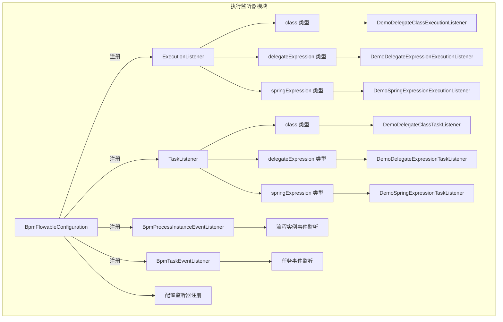
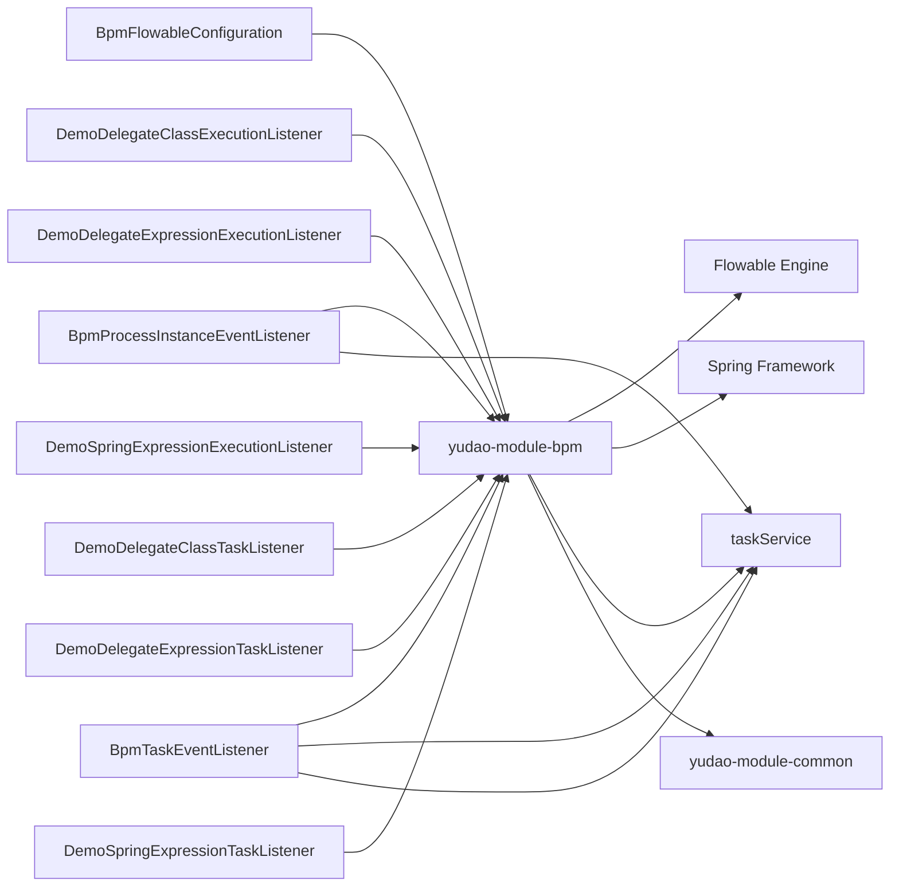

# 执行监听器模块 (Execution Listener Module)

## 1. 概述

执行监听器模块是 BPM 模块中负责处理 Flowable 流程引擎事件监听的核心组件，主要提供对 Flowable 流程引擎执行过程中各种事件的监听和扩展能力。该模块通过实现不同类型的监听器（ExecutionListener、TaskListener），在流程实例、任务等关键生命周期节点进行业务逻辑的自定义处理。

**核心功能：**
- 支持三种类型的 ExecutionListener：class、delegateExpression、springExpression
- 提供 TaskListener 的事件监听机制  
- 封装了流程实例和任务的生命周期事件监听
- 为开发者提供示例代码，便于快速上手自定义监听器

## 2. 架构概览



### 2.1 组件关系说明

- **ExecutionListener**：监听流程执行过程中的事件（如活动开始/结束）
- **TaskListener**：监听任务相关的事件（如任务创建、分配、完成）
- **BpmProcessInstanceEventListener**：监听流程实例级别的事件（创建、完成、取消）
- **BpmTaskEventListener**：监听任务级别的事件（创建、分配、完成、超时等）
- **BpmFlowableConfiguration**：配置 Flowable 引擎，注册各类监听器

## 3. 核心功能详解

### 3.1 ExecutionListener 类型

ExecutionListener 用于监听流程执行中的事件，支持三种注册方式：

#### 3.1.1 class 类型

通过直接指定 Java 类的方式注册，该类需要实现 `JavaDelegate` 接口。

**示例：** `DemoDelegateClassExecutionListener`

```java
@Slf4j
public class DemoDelegateClassExecutionListener implements JavaDelegate {
    @Override
    public void execute(DelegateExecution execution) {
        log.info("[execute][execution({}) 被调用！变量有：{}]", 
                execution.getId(), execution.getCurrentFlowableListener().getFieldExtensions());
    }
}
```

**特点：**
- 不需要注册到 Spring 容器
- 直接实现 `JavaDelegate` 接口
- 在 BPMN 配置中通过 `class` 属性指定类名

#### 3.1.2 delegateExpression 类型

通过 Spring Bean 的表达式方式注册，需要实现 `JavaDelegate` 接口并注册到 Spring 容器中。

**示例：** `DemoDelegateExpressionExecutionListener`

```java
@Component
@Slf4j
public class DemoDelegateExpressionExecutionListener implements JavaDelegate {
    @Override
    public void execute(DelegateExecution execution) {
        log.info("[execute][execution({}) 被调用！变量有：{}]", 
                execution.getId(), execution.getCurrentFlowableListener().getFieldExtensions());
    }
}
```

**特点：**
- 必须使用 `@Component` 注解注册到 Spring 容器
- 实现 `JavaDelegate` 接口
- 在 BPMN 配置中通过 `delegateExpression` 属性指定 Spring Bean 名称

#### 3.1.3 springExpression 类型

通过 Spring Expression 直接编写表达式，无需实现任何接口，但需要注册到 Spring 容器。

**示例：** `DemoSpringExpressionExecutionListener`

```java
@Component
@Slf4j
public class DemoSpringExpressionExecutionListener {
    public void execute(DelegateExecution execution) {
        log.info("[execute][execution({}) 被调用！变量有：{}]", 
                execution.getId(), execution.getCurrentFlowableListener().getFieldExtensions());
    }
}
```

**特点：**
- 必须使用 `@Component` 注解注册到 Spring 容器
- 不需要实现任何接口
- 方法名固定为 `execute`，参数为 `DelegateExecution`
- 在 BPMN 配置中通过 `expression` 属性指定 Spring Expression

### 3.2 TaskListener 类型

TaskListener 用于监听任务相关的事件，同样支持三种注册方式，与 ExecutionListener 类似，只是接口从 `JavaDelegate` 变为 `TaskListener`，方法从 `execute` 变为 `notify`。

**示例：** `DemoDelegateClassTaskListener`

```java
@Slf4j
public class DemoDelegateClassTaskListener implements TaskListener {
    @Override
    public void notify(DelegateTask delegateTask) {
        log.info("[execute][task({}) 被调用]", delegateTask.getId());
    }
}
```

### 3.3 系统级事件监听器

除了用户自定义的监听器外，系统还提供了内置的事件监听器，用于处理流程引擎的关键事件。

#### 3.3.1 BpmProcessInstanceEventListener

监听流程实例级别的事件，包括：
- PROCESS_CREATED：流程实例创建
- PROCESS_COMPLETED：流程实例完成
- PROCESS_CANCELLED：流程实例取消

**处理逻辑：**
- 流程创建时调用 `processInstanceService.processProcessInstanceCreated()`
- 流程完成时调用 `processInstanceService.processProcessInstanceCompleted()`
- 流程取消时检查是否为正常结束，如果是则也调用完成处理方法

#### 3.3.2 BpmTaskEventListener

监听任务级别的事件，包括：
- TASK_CREATED：任务创建
- TASK_ASSIGNED：任务分配
- TASK_COMPLETED：任务完成
- ACTIVITY_CANCELLLD：活动取消
- TIMER_FIRED：定时器触发（用于处理超时）

**特殊处理：**
- 定时器触发时专门处理 BoundaryEvent 的超时场景，包括用户任务超时、延迟器超时、子流程超时等
- 活动取消时遍历历史活动实例，处理未关联 taskId 的任务取消

### 3.4 配置中心 BpmFlowableConfiguration

负责 Flowable 引擎的配置，主要职责：

1. **线程池配置**：创建 `applicationTaskExecutor` Bean，供 Flowable 异步任务使用
2. **监听器注册**：通过 `EngineConfigurationConfigurer` 注册所有 FlowableEventListener
3. **自定义工厂设置**：设置 `BpmActivityBehaviorFactory`，用于自定义审批人逻辑
4. **函数委托注册**：注册自定义的 Flowable 函数

## 4. 使用指南

### 4.1 自定义 ExecutionListener

#### 方案一：class 类型

1. 创建类实现 `JavaDelegate` 接口
2. 在 BPMN XML 中配置：

```xml
<executionListener event="start" class="com.example.MyExecutionListener"/>
```

#### 方案二：delegateExpression 类型

1. 创建类实现 `JavaDelegate` 接口，并使用 `@Component` 注解
2. 在 BPMN XML 中配置：

```xml
<executionListener event="start" delegate-expression="${myExecutionListener}"/>
```

#### 方案三：springExpression 类型

1. 创建类，方法名为 `execute`，参数为 `DelegateExecution`，使用 `@Component` 注解
2. 在 BPMN XML 中配置：

```xml
<executionListener event="start" expression="#myBean.execute(execution)"/>
```

### 4.2 自定义 TaskListener

使用方式与 ExecutionListener 类似，只是实现 `TaskListener` 接口，重写 `notify(DelegateTask delegateTask)` 方法。

### 4.3 监听流程实例事件

如果需要监听流程实例的生命周期事件，可以继承 `AbstractFlowableEngineEventListener`，注册到 `BpmFlowableConfiguration` 中，或者直接参考 `BpmProcessInstanceEventListener` 的实现。

## 5. 依赖关系



## 6. 参考文档

- [BPM 模块主文档](bpm.md)
- [Flowable 官方文档](https://www.flowable.org/docs/userguide/index.html)
- [Spring Expression 语言参考](https://docs.spring.io/spring-framework/docs/current/javadoc-api/org/springframework/expression/spel/package-summary.html)
