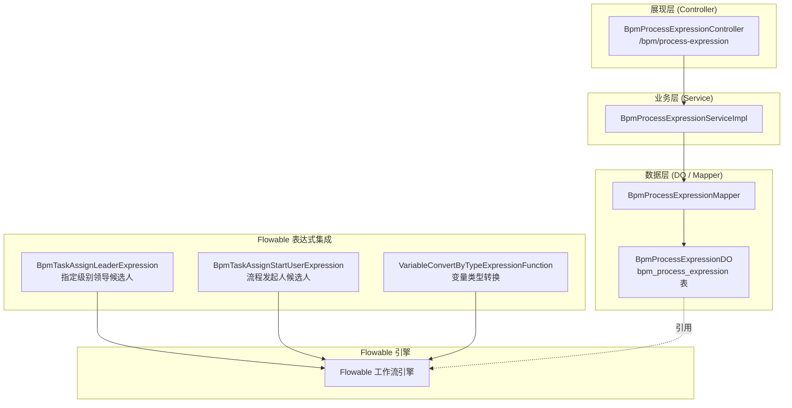
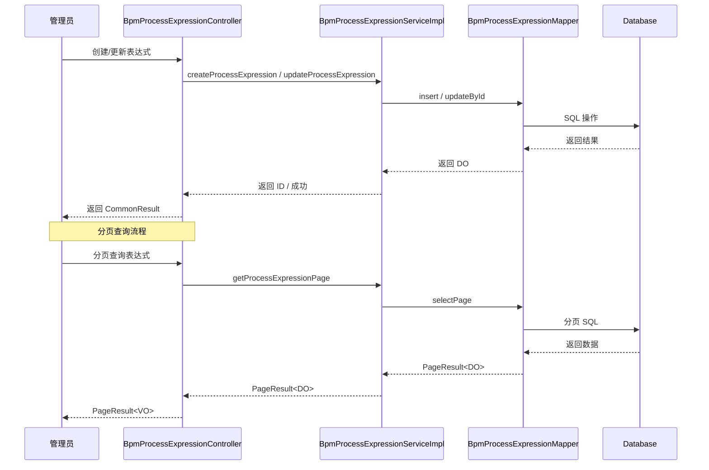
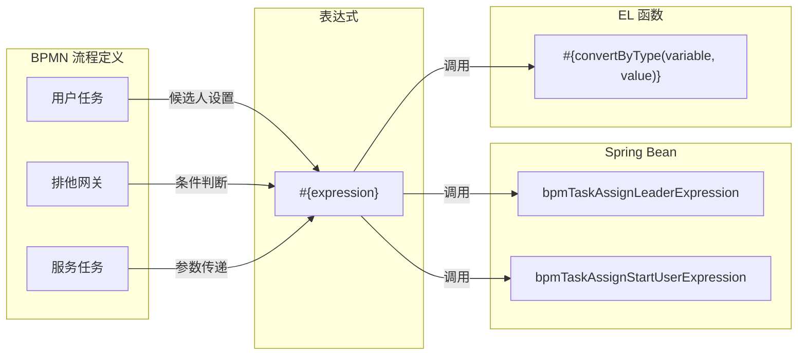

# 流程表达式（Expression）模块

## 概述

流程表达式（Expression）模块是 BPM（业务流程管理）系统中的重要组成部分，位于 `yudao-module-bpm` 模块内。它提供了一套完整的流程表达式管理功能，允许开发者和流程设计者在 Flowable 工作流引擎中定义、管理和使用自定义表达式。

表达式在 BPM 系统中主要用于：
- **任务候选人计算**：动态计算任务的审批人、抄送人等
- **条件路由判断**：在排他网关（Exclusive Gateway）中根据表达式结果决定流程走向
- **变量转换**：在流程执行过程中对流程变量进行类型转换或值处理
- **服务任务参数**：为服务任务（Service Task）提供动态参数

## 架构概览

## 模块组成

### 1. 表达式管理（Expression Management）

提供流程表达式的 CRUD（创建、读取、更新、删除）管理能力，包括分页查询、状态管理等基础功能。

- **Controller**: `BpmProcessExpressionController` — 对外 RESTful API 接口
- **Service**: `BpmProcessExpressionServiceImpl` — 业务逻辑实现
- **DO**: `BpmProcessExpressionDO` — 数据实体，映射 `bpm_process_expression` 数据表
- **VOs**:
  - `BpmProcessExpressionSaveReqVO` — 新增/修改请求 VO
  - `BpmProcessExpressionPageReqVO` — 分页查询请求 VO
  - `BpmProcessExpressionRespVO` — 响应 VO

详细文档请参考：[expression_management](expression_management.md)

### 2. 候选人表达式（Candidate Expression）

提供在 Flowable 流程模型中使用的自定义 Spring Bean 表达式，用于动态计算任务的候选人（审批人、抄送人等）。

- **`BpmTaskAssignLeaderExpression`** — 根据指定组织级别计算领导审批人（已废弃，建议使用策略类替代）
- **`BpmTaskAssignStartUserExpression`** — 返回流程发起人作为审批候选人（已废弃，建议使用策略类替代）

详细文档请参考：[expression_candidate](expression_candidate.md)

### 3. EL 自定义函数（Custom EL Function）

为 Flowable 表达式语言提供自定义函数扩展，增强表达式的处理能力。

- **`VariableConvertByTypeExpressionFunction`** — 变量类型转换函数（已废弃，预计 2027 年删除）

详细文档请参考：[expression_el](expression_el.md)

## 数据模型

### bpm_process_expression 表结构

| 字段名 | 类型 | 说明 |
|--------|------|------|
| id | bigint | 编号（主键） |
| name | varchar | 表达式名字 |
| status | tinyint | 表达式状态（0=禁用，1=启用） |
| expression | varchar | 表达式内容 |
| create_time | datetime | 创建时间 |
| update_time | datetime | 更新时间 |
| creator | varchar | 创建者 |
| updater | varchar | 更新者 |
| deleted | bit | 是否删除 |

## 相关依赖模块

本模块依赖于以下 Yudao 基础设施模块：

| 模块名称 | 说明 |
|---------|------|
| [yudao-common](yudao_common.md) | 提供通用工具类、枚举、分页参数等基础能力 |
| [yudao-mybatis](yudao_mybatis.md) | 提供 MyBatis 扩展，包括 BaseMapperX、数据加密等 |
| [yudao-security](yudao_security.md) | 提供安全认证与权限控制（@PreAuthorize） |
| [yudao-flowable](yudao_flowable.md) | 提供 Flowable 工作流引擎集成配置 |

此外，还通过内部 API 调用以下模块：
- **`system-api`**: 通过 `AdminUserApi` 获取用户信息、通过 `DeptApi` 获取部门信息
- **`bpm-api`**: 通过 `BpmProcessInstanceService` 获取流程实例信息

## 数据流

## 与 Flowable 引擎集成

流程表达式通常以 `#{expression}` 的形式在 BPMN 流程定义中使用，Flowable 引擎在执行时会解析这些表达式并调用对应的 Spring Bean 或自定义 EL 函数。
