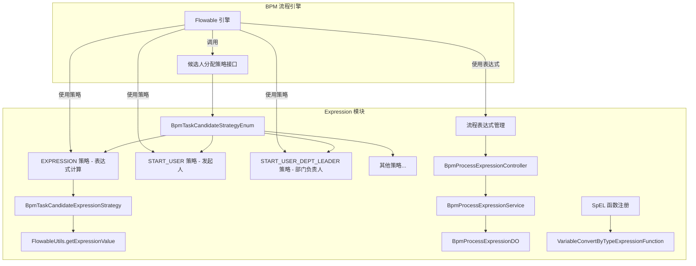

# Expression 模块文档（流程表达式候选分配）

## 1. 概述

Expression 模块是 BPM（业务流程管理）系统中的核心组件，负责在流程执行过程中动态计算任务候选人的分配策略。该模块基于 Flowable 引擎扩展，提供了多种灵活的候选人分配方式，支持通过 SpEL（Spring Expression Language）表达式、部门层级、发起人角色等多种规则来动态确定任务的审批人。

**核心功能：**
- 支持自定义 SpEL 表达式动态计算候选人
- 提供预定义的候选人分配策略（如发起人、部门负责人等）
- 支持流程表达式的 CRUD 管理与绑定
- 为 BPM 流程的任务分配提供灵活的扩展机制

## 2. 架构概览



## 3. 核心组件与功能

### 3.1 表达式候选分配策略 (`BpmTaskCandidateExpressionStrategy`)

这是 Expression 模块的核心组件，实现了通过 SpEL 表达式动态计算任务候选人的功能。

**职责：**
- 解析并执行 SpEL 表达式，返回用户 ID 集合
- 支持在任务节点和活动节点两种场景下执行表达式
- 优雅处理表达式执行中的异常（如变量不存在的情况）

**关键方法：**
- `calculateUsersByTask(DelegateExecution execution, String param)`：在任务执行时计算候选人
- `calculateUsersByActivity(...)`：在活动预测阶段计算候选人（用于流程模拟）

**使用示例：**
```java
// 表达式可以是任意合法的 SpEL，例如：
// ${userId}  // 直接引用流程变量
// T(cn.iocoder.yudao.module.bpm.framework.flowable.core.util.BpmnModelUtils).getDeptLeader(execution, 1)
// userApi.getUserById(processVariables.get("assigneeId"))
```

### 3.2 预定义候选人策略

除了自定义表达式外，系统还提供了多个预定义的候选人策略，这些策略位于 `candidate/strategy` 目录下：

| 策略类 | 策略枚举 | 说明 |
|--------|----------|------|
| `BpmTaskCandidateStartUserStrategy` | `START_USER` | 分配给流程发起人 |
| `BpmTaskCandidateStartUserDeptLeaderStrategy` | `START_USER_DEPT_LEADER` | 分配给发起人所在部门的 Leader（可指定层级） |
| `BpmTaskAssignLeaderExpression` (已废弃) | `EXPRESSION` | 旧版表达式实现，建议使用策略模式替代 |
| `BpmTaskAssignStartUserExpression` (已废弃) | `EXPRESSION` | 旧版表达式实现，建议使用策略模式替代 |

### 3.3 流程表达式管理 (`BpmProcessExpression`)

系统提供了独立的流程表达式管理功能，允许管理员在后台配置和存储 SpEL 表达式，供流程定义中引用。

**数据对象 `BpmProcessExpressionDO`：**
```java
@Data
@TableName("bpm_process_expression")
public class BpmProcessExpressionDO extends BaseDO {
    private Long id;           // 编号
    private String name;       // 表达式名字
    private Integer status;    // 表达式状态
    private String expression; // 表达式内容
}
```

**管理端 API：**
- `POST /bpm/process-expression/create` - 创建流程表达式
- `PUT /bpm/process-expression/update` - 更新流程表达式
- `DELETE /bpm/process-expression/delete` - 删除流程表达式
- `GET /bpm/process-expression/get` - 获得流程表达式
- `GET /bpm/process-expression/page` - 分页查询流程表达式

### 3.4 SpEL 函数扩展 (`VariableConvertByTypeExpressionFunction`)

系统注册了一个名为 `convertByType` 的 SpEL 函数，用于在表达式中进行类型转换，兼容老版本代码。

**功能：**
- 当参数值不是字符串类型且流程变量是字符串时，将参数值转换为字符串
- 主要用于表达式中变量的类型适配

**注册方式：** 作为 Spring Bean 自动注册到 Flowable 的表达式环境。

### 3.5 常量定义 (`BpmnVariableConstants`)

定义了流程实例和任务中使用的标准变量名，便于在表达式中引用：

```java
public class BpmnVariableConstants {
    public static final String PROCESS_INSTANCE_VARIABLE_STATUS = "PROCESS_STATUS";     // 流程状态
    public static final String PROCESS_INSTANCE_VARIABLE_REASON = "PROCESS_REASON";     // 流程理由
    public static final String PROCESS_INSTANCE_VARIABLE_START_USER_ID = "PROCESS_START_USER_ID"; // 发起人ID
    public static final String TASK_VARIABLE_STATUS = "TASK_STATUS";                  // 任务状态
    public static final String TASK_VARIABLE_REASON = "TASK_REASON";                  // 任务理由
    // ... 更多常量
}
```

## 4. 模块关系

### 4.1 与 BPM 主模块的关系

Expression 模块深度集成于 BPM 模块，主要与以下组件协作：

- **`BpmProcessDefinitionController`**：流程定义配置时可引用表达式
- **`BpmTaskController`**：任务查询和办理时使用候选人策略
- **`BpmProcessInstanceService`**：获取流程实例信息以计算候选人
- **`DeptApi` / `AdminUserApi`**：获取部门和用户信息（用于部门负责人策略）

### 4.2 与其他系统的依赖

| 依赖模块 | 依赖项 | 用途 |
|----------|--------|------|
| `system` 模块 | `DeptApi`, `AdminUserApi` | 获取部门和用户信息 |
| `common` 模块 | `CollectionUtils`, `SetUtils`, `NumberUtils` | 工具类辅助 |
| `flowable` 引擎 | `DelegateExecution`, `ProcessInstance` | 流程上下文访问 |

## 5. 使用流程

### 5.1 创建并使用自定义表达式

1. **创建表达式**：通过 `/bpm/process-expression/create` 接口保存 SpEL 表达式
2. **配置流程定义**：在 BPMN 流程图的属性中引用表达式 ID 或直接编写表达式
3. **流程执行**：当任务节点到达时，Expression 策略自动解析并执行表达式
4. **获取候选人**：表达式返回的用户 ID 集合即为该任务的候选人

### 5.2 使用预定义策略

在流程定义中选择预定义的候选人策略（如 `START_USER` 或 `START_USER_DEPT_LEADER`），无需编写表达式即可直接使用。

## 6. 代码结构

```
src/main/java/cn/iocoder/yudao/module/bpm/framework/flowable/core/candidate/├── expression/│   ├── BpmTaskAssignLeaderExpression.java      # 废弃的示例表达式
│   └── BpmTaskAssignStartUserExpression.java         # 废弃的示例表达式
│
├── strategy/│   ├── other/│   │   └── BpmTaskCandidateExpressionStrategy.java   # 表达式策略核心实现
│   │
│   ├── user/│   │   └── BpmTaskCandidateStartUserStrategy.java              # 发起人策略
│   │
│   └── dept/       ├── BpmTaskCandidateStartUserDeptLeaderStrategy.java      # 部门负责人策略
│                       └── ... (其他部门策略)
│
├── el/│   └── VariableConvertByTypeExpressionFunction.java                # SpEL 函数扩展
│
└── enums/│   └── BpmnVariableConstants.java                                # 流程变量常量
```

## 7. 注意事项

1. **废弃的表达式类**：`BpmTaskAssignLeaderExpression` 和 `BpmTaskAssignStartUserExpression` 仅为历史示例，实际开发请使用对应的策略类（`BpmTaskCandidateStartUserDeptLeaderStrategy` 等）。

2. **表达式安全性**：SpEL 表达式可能执行任意 Java 代码，请确保表达式来源可信，避免注入攻击。

3. **性能考虑**：复杂的表达式可能会影响流程性能，建议保持表达式简洁高效。

4. **预测模式限制**：在 `calculateUsersByActivity` 方法中，如果表达式包含 `execution` 或不存在的流程变量会抛出异常，此时会忽略异常（即不做流程预测）。

5. **变量作用域**：表达式中可以访问的流程变量包括 `execution`（流程执行上下文）、`processVariables`（流程变量映射）等，具体参考 Flowable 文档。
