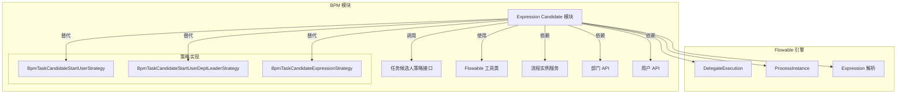
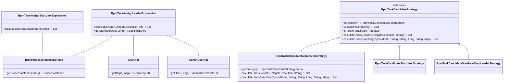
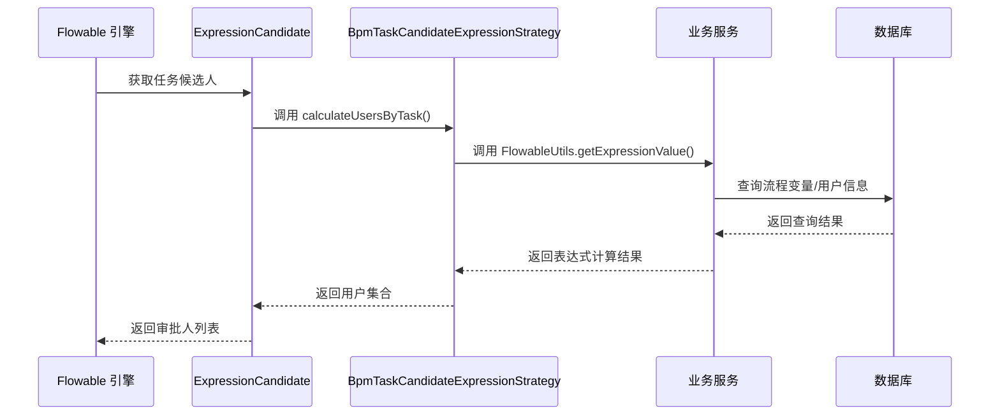
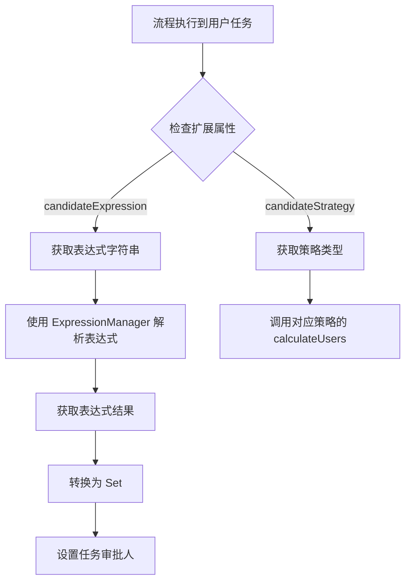

# Expression Candidate Module (表达式候选人模块)

## 概述

Expression Candidate 模块是 BPM 模块中用于动态计算任务审批候选人的核心组件。它允许开发者通过表达式（Expression）的方式，在流程执行时动态计算哪些用户有资格审批某个任务。

该模块主要提供两种基于表达式的候选人计算策略：
- **BpmTaskAssignLeaderExpression**：分配给发起人所在部门的 Leader 审批
- **BpmTaskAssignStartUserExpression**：直接分配给流程发起人

> ⚠️ 注意：这两个类目前标记为 `@Deprecated`，仅作为表达式示例。推荐使用基于策略模式的实现，如 `BpmTaskCandidateStartUserDeptLeaderStrategy` 和 `BpmTaskCandidateStartUserStrategy`。

## 架构设计

### 模块关系图



### 核心组件关系



## 核心组件详解

### 1. BpmTaskAssignLeaderExpression

**功能**：计算指定层级的部门 Leader 作为任务审批候选人。

**使用场景**：需要按部门层级分配审批任务，例如：
- 一级审批：发起人所在部门的直接 Leader
- 二级审批：发起人所在部门的上级部门的 Leader

**代码示例**：
```java
public Set<Long> calculateUsers(DelegateExecution execution, int level) {
    Assert.isTrue(level > 0, "level 必须大于 0");
    // 获得流程发起人
    ProcessInstance processInstance = processInstanceService.getProcessInstance(execution.getProcessInstanceId());
    Long startUserId = NumberUtils.parseLong(processInstance.getStartUserId());
    
    // 按层级向上查找部门
    DeptRespDTO dept = null;
    for (int i = 0; i < level; i++) {
        if (dept == null) {
            dept = getStartUserDept(startUserId);
            if (dept == null) return emptySet();
        } else {
            DeptRespDTO parentDept = deptApi.getDept(dept.getParentId());
            if (parentDept == null) break;
            dept = parentDept;
        }
    }
    return dept.getLeaderUserId() != null ? asSet(dept.getLeaderUserId()) : emptySet();
}
```

### 2. BpmTaskAssignStartUserExpression

**功能**：直接将任务分配给流程发起人。

**使用场景**：简单的回退审批场景，需要发起人重新处理。

**代码示例**：
```java
public Set<Long> calculateUsers(ExecutionEntityImpl execution) {
    ProcessInstance processInstance = processInstanceService.getProcessInstance(execution.getProcessInstanceId());
    Long startUserId = NumberUtils.parseLong(processInstance.getStartUserId());
    return SetUtils.asSet(startUserId);
}
```

### 3. BpmTaskCandidateExpressionStrategy（推荐替代方案）

**功能**：通过 SpEL 表达式动态计算审批人，是最灵活的候选人策略。

**使用方式**：在 BPMN 用户任务的扩展属性中设置 `candidateExpression` 表达式。

**代码示例**：
```java
public Set<Long> calculateUsersByTask(DelegateExecution execution, String param) {
    Object result = FlowableUtils.getExpressionValue(execution, param);
    return CollectionUtils.toLinkedHashSet(Long.class, result);
}

public Set<Long> calculateUsersByActivity(BpmnModel bpmnModel, String activityId, String param,
                                          Long startUserId, String processDefinitionId, Map<String, Object> processVariables) {
    Map<String, Object> variables = processVariables == null ? new HashMap<>() : processVariables;
    Object result = FlowableUtils.getExpressionValue(variables, param);
    return CollectionUtils.toLinkedHashSet(Long.class, result);
}
```

**SpEL 表达式示例**：
```
// 直接返回用户 ID 集合
{1001, 1002}

// 调用方法获取审批人
#myService.getApproveUsers(execution)

// 基于条件判断
execution.getVariable("amount") > 10000 ? {1001} : {1002}
```

## 数据流分析

### 任务候选人计算流程



### 表达式解析流程



## 配置与扩展

### BPMN 扩展属性配置

在 BPMN 文件中，通过扩展元素配置候选人策略：

```xml
<userTask id="approveTask" name="审批">
    <extensionElements>
        <bpm:candidateStrategy>EXPRESSION</bpm:candidateStrategy>
        <bpm:candidateExpression>${#myService.getApproveUsers(execution)}</bpm:candidateExpression>
    </extensionElements>
</userTask>
```

### 策略枚举

```java
public enum BpmTaskCandidateStrategyEnum {
    START_USER,              // 发起人
    START_USER_DEPT_LEADER,  // 发起人部门 Leader
    EXPRESSION,              // 表达式
    ROLE,                    // 角色
    GROUP,                   // 组
    USER,                    // 用户
    DEPT_MEMBER,             // 部门成员
    DEPT_LEADER,             // 部门 Leader
    // ... 其他策略
}
```

## 与相关模块的集成

### 1. 与 System 模块集成

通过 `AdminUserApi` 和 `DeptApi` 获取用户和部门信息：

```java
@Resource
private AdminUserApi adminUserApi;

@Resource
private DeptApi deptApi;

DeptRespDTO dept = deptApi.getDept(startUser.getDeptId());
```

### 2. 与 BPM 核心模块集成

- **BpmProcessInstanceService**：获取流程实例信息
- **FlowableUtils**：Flowable 工具类，提供表达式解析等辅助方法
- **BpmnVariableConstants**：流程变量常量定义

### 3. 与 UI 层集成

前端通过 API 获取流程表达式配置，并在 BPMN 编辑器中展示候选人设置：

```typescript
// 前端示例
interface ProcessExpressionVO {
    expression: string;
    strategy: string;
    param: string;
}
```

## 最佳实践

### 1. 推荐使用策略模式而非表达式类

由于 `BpmTaskAssignLeaderExpression` 和 `BpmTaskAssignStartUserExpression` 已废弃，建议使用策略实现：

```java
// ✅ 推荐：使用策略模式
@Component
public class BpmTaskCandidateStartUserDeptLeaderStrategy implements BpmTaskCandidateStrategy {
    // 实现逻辑
}

// ❌ 不推荐：使用表达式类（已废弃）
@Component
@Deprecated
public class BpmTaskAssignLeaderExpression {
    // 实现逻辑
}
```

### 2. 表达式策略的使用注意事项

- **性能考虑**：表达式在每次任务创建时都会执行，避免复杂计算
- **安全性**：表达式中不要包含敏感操作，确保只读访问
- **可维护性**：复杂逻辑应放在服务方法中，表达式只调用方法
- **租户支持**：表达式需考虑多租户隔离，通过 `TenantUtils` 获取租户上下文

### 3. 错误处理

在 `calculateUsersByActivity` 方法中，对于预测未运行节点时的表达式异常会特殊处理：

```java
try {
    Object result = FlowableUtils.getExpressionValue(variables, param);
    return CollectionUtils.toLinkedHashSet(Long.class, result);
} catch (FlowableException ex) {
    if (ex.getCause() != null && ex.getCause() instanceof PropertyNotFoundException) {
        return Sets.newHashSet(); // 预测时忽略不存在的变量
    }
    log.error("[calculateUsersByActivity][表达式({}) 变量({}) 解析报错", param, variables, ex);
    throw ex;
}
```

## 常见问题

### Q1: 表达式中如何访问流程变量？

通过 `execution.getVariable("varName")` 或 `variables.get("varName")` 获取：

```java
// 表达式示例
execution.getVariable("amount") > 10000 ? #adminUserApi.getUser(1001) : #adminUserApi.getUser(1002)
```

### Q2: 如何动态调整部门层级？

通过 `param` 参数传递层级信息，策略类会解析该参数：

```java
// param = "2" 表示向上查找 2 层
int level = Integer.parseInt(param);
```

### Q3: 表达式不支持哪些操作？

- 不支持修改流程状态
- 不支持执行写操作（建议只读）
- 不支持访问敏感系统信息

## 参考文档

- [BPM 模块文档](bpm.md) - BPM 模块整体架构
- [策略模式文档](strategy.md) - 任务候选人策略实现
- [Flowable 官方文档](https://flowable.org/) - Flowable 引擎表达式支持
- [System 模块文档](system.md) - 用户和部门 API 接口
