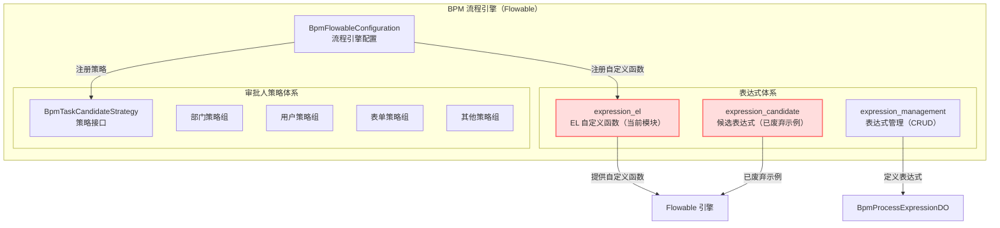
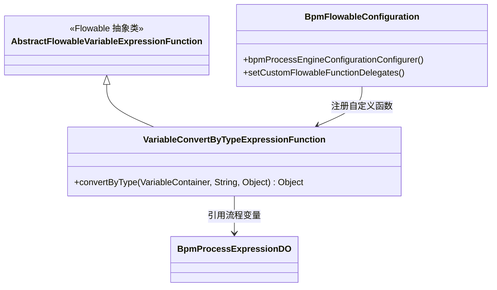
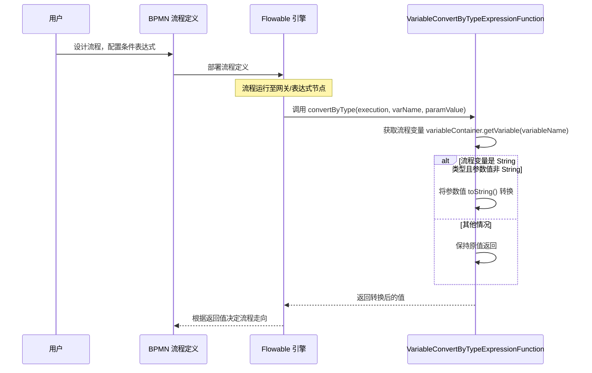
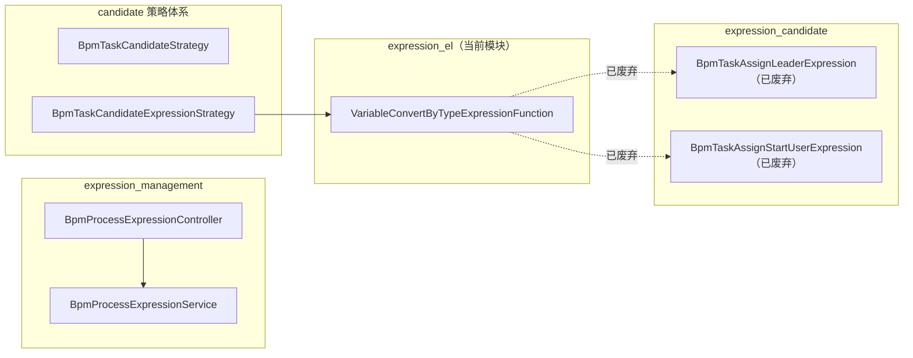

# 表达式 EL 模块（expression_el）

## 概述

`expression_el` 模块是 RuoYi-Vue-Plus BPM 工作流引擎中 **Flowable EL（表达式语言）自定义函数** 的实现模块。它基于 Flowable 的 `AbstractFlowableVariableExpressionFunction` 抽象类，提供在流程表达式（如网关条件、任务监听器表达式）中可直接调用的自定义函数。

当前模块的核心功能是：

- **根据流程变量类型自动转换参数值**：`VariableConvertByTypeExpressionFunction` 提供 `convertByType` 函数，可根据流程变量的实际类型，将传入的参数值转换为匹配的类型。

> ⚠️ **注意**：该组件已标记为 `@Deprecated`（自代码标注起），预计在 2027 年移除。当前的审批候选人计算已统一迁移到 `BpmTaskCandidateStrategy` 策略模式实现。

## 架构位置

`expression_el` 模块在 BPM 工作流引擎中的位置如下：



## 组件关系



## 核心组件说明

### 1. VariableConvertByTypeExpressionFunction

**文件路径**: `yudao-module-bpm/src/main/java/cn/iocoder/yudao/module/bpm/framework/flowable/core/el/VariableConvertByTypeExpressionFunction.java`

**作用**：将流程 EL 表达式中的参数值，根据流程变量的实际类型进行类型转换。

**注册方式**：
- 通过 `@Component` 注解自动注册为 Spring Bean
- 在 `BpmFlowableConfiguration` 中，通过 `bpmProcessEngineConfigurationConfigurer()` 方法，将自定义函数委托注册到 Flowable 引擎的 `SpringProcessEngineConfiguration` 中：
  ```java
  configuration.setCustomFlowableFunctionDelegates(
      ListUtil.toList(customFlowableFunctionDelegates.stream().iterator())
  );
  ```

**函数签名**：
```java
public static Object convertByType(VariableContainer variableContainer, String variableName, Object parmaValue)
```

| 参数 | 类型 | 说明 |
|------|------|------|
| `variableContainer` | `VariableContainer` | Flowable 的变量容器，包含当前流程的所有变量 |
| `variableName` | `String` | 流程变量的名称 |
| `parmaValue` | `Object` | 需要转换的参数值 |

**转换逻辑**：
1. 从 `variableContainer` 中获取指定名称（`variableName`）的流程变量
2. 如果流程变量不为空且参数值不为空：
   - 如果参数值**不是**字符串类型，但流程变量是字符串类型 → 将参数值通过 `toString()` 转为字符串
3. 其他情况保持原值返回

**使用场景**（在 BPMN XML 中，通常在条件表达式中使用）：
```
${convertByType(execution, 'days', 5)}
```

### 2. 关联组件

| 组件 | 文件路径 | 关系说明 |
|------|---------|---------|
| `BpmFlowableConfiguration` | `bpm/framework/flowable/config/BpmFlowableConfiguration.java` | 流程引擎配置类，负责注册自定义函数到 Flowable |
| `BpmProcessExpressionDO` | `bpm/dal/dataobject/definition/BpmProcessExpressionDO.java` | 流程表达式数据对象，持久化表达式定义 |
| `BpmProcessExpressionServiceImpl` | `bpm/service/definition/BpmProcessExpressionServiceImpl.java` | 表达式管理服务，提供 CRUD 操作 |

## 数据流



## 与相关模块的集成

### 与其他 BPM 模块的联系



### 相关文档参考

- [表达式管理模块](expression_management.md) — 表达式的 CRUD 管理界面与后台服务
- [表达式候选人模块](expression_candidate.md) — 候选表达式的实现示例（已废弃）
- [BPM 流程引擎配置](../bpm_flowable_config.md) — `BpmFlowableConfiguration` 的完整配置说明

## 配置说明

自定义函数通过 `BpmFlowableConfiguration` 注册到 Flowable 引擎，无需独立配置。`VariableConvertByTypeExpressionFunction` 作为 Spring Bean 被自动扫描并加载。

```java
// BpmFlowableConfiguration 中的注册逻辑
@Bean
public EngineConfigurationConfigurer<SpringProcessEngineConfiguration> bpmProcessEngineConfigurationConfigurer(
        ObjectProvider<FlowableEventListener> listeners,
        ObjectProvider<FlowableFunctionDelegate> customFlowableFunctionDelegates,
        BpmActivityBehaviorFactory bpmActivityBehaviorFactory) {
    return configuration -> {
        // ... 其他配置
        configuration.setCustomFlowableFunctionDelegates(
            ListUtil.toList(customFlowableFunctionDelegates.stream().iterator())
        );
    };
}
```

## 废弃说明

`VariableConvertByTypeExpressionFunction` 已标记为 `@Deprecated`，原因如下：

1. **类型转换不再需要**：Flowable 引擎后续版本已经内置了类型转换能力
2. **表达式函数被策略模式替代**：审批人计算已从 EL 表达式迁移到 `BpmTaskCandidateStrategy` 策略模式
3. **维护负担**：无调用方的代码徒增维护成本

> 🗓️ 预计移除时间：2027 年（代码注释标注）
