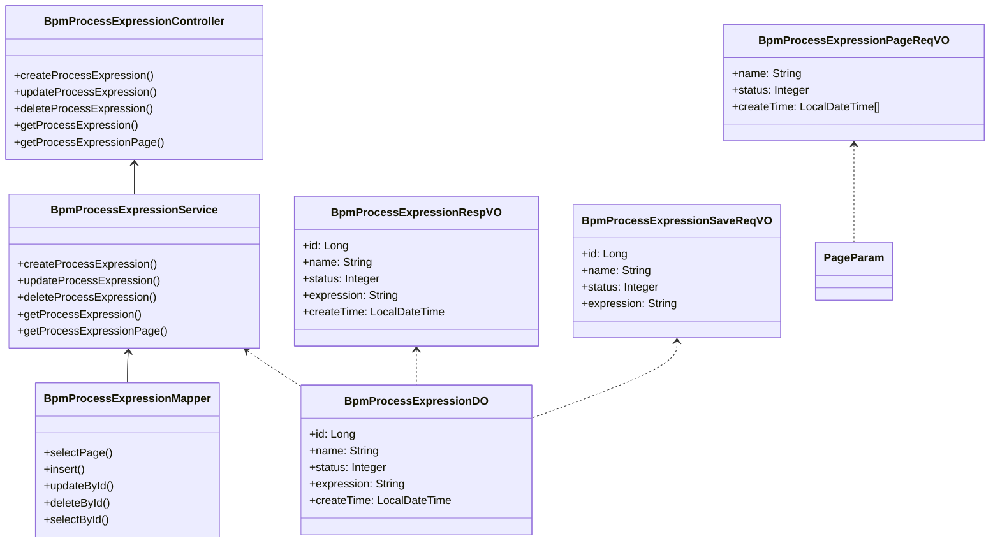
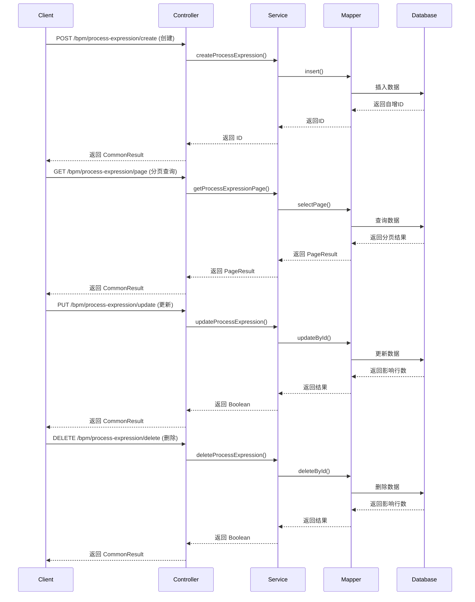

# 表达式管理模块 (expression_management)

## 1. 概述

表达式管理模块是 BPM（业务流程管理）系统中的核心组件，用于管理流程表达式（Process Expression）。流程表达式在 BPM 流程中用于动态计算任务候选人、条件判断、数据转换等逻辑，是实现流程灵活性的关键机制。

该模块提供了流程表达式的 CRUD（创建、读取、更新、删除）操作，支持通过 REST API 进行统一管理，并与 BPM 流程定义、流程实例等模块紧密集成。

## 2. 架构设计

### 2.1 模块组成

表达式管理模块采用标准的分层架构，包含以下核心组件：

```
┌─────────────────────────────────────────────────────────┐
│                    表达式管理模块                        │
├─────────────────────────────────────────────────────────┤
│  ┌─────────────┐  ┌─────────────┐  ┌─────────────┐      │
│  │   Controller│  │     VO      │  │   Service   │      │
│  │ (API 层)    │  │ (视图层)    │  │ (业务层)    │      │
│  └──────┬──────┘  └──────┬──────┘  └──────┬──────┘      │
│         │                │                │             │
│         ▼                ▼                ▼             │
│  ┌─────────────────────────────────────────────────┐   │
│  │              数据访问层 (DAL)                    │   │
│  │  ┌─────────────┐  ┌─────────────────────────┐    │   │
│  │  │     DO      │  │        Mapper           │    │   │
│  │  │ (数据对象)  │  │ (数据映射)              │    │   │
│  │  └─────────────┘  └─────────────────────────┘    │   │
│  └─────────────────────────────────────────────────┘   │
└─────────────────────────────────────────────────────────┘
```

### 2.2 组件关系图



### 2.3 数据流图



## 3. 核心组件说明

### 3.1 数据对象 (DO)

**BpmProcessExpressionDO** - 流程表达式数据对象

```java
@TableName("bpm_process_expression")
@Data
@EqualsAndHashCode(callSuper = true)
@ToString(callSuper = true)
@Builder
@NoArgsConstructor
@AllArgsConstructor
public class BpmProcessExpressionDO extends BaseDO {
    /** 编号 */
    @TableId
    private Long id;
    
    /** 表达式名字 */
    private String name;
    
    /** 表达式状态 */
    private Integer status;
    
    /** 表达式内容 */
    private String expression;
}
```

- 继承自 `BaseDO`，包含创建时间、更新时间等通用字段
- 表名：`bpm_process_expression`
- 主键：`id`，使用序列生成（适用于 Oracle、PostgreSQL 等数据库）

### 3.2 视图对象 (VO)

**BpmProcessExpressionRespVO** - 响应视图对象

用于 API 响应，包含表达式的所有信息，支持 Excel 导出（通过 `@ExcelProperty` 注解）。

**BpmProcessExpressionSaveReqVO** - 保存请求对象

用于创建和更新操作，包含必填字段校验（`@NotEmpty`、`@NotNull`）。

**BpmProcessExpressionPageReqVO** - 分页请求对象

继承自 `PageParam`，支持分页查询条件：
- `name`：表达式名字模糊查询
- `status`：状态枚举校验（`@InEnum`）
- `createTime`：时间范围查询

### 3.3 服务层 (Service)

**BpmProcessExpressionService** - 服务接口

定义了流程表达式的核心业务方法：
- `createProcessExpression()`：创建新表达式
- `updateProcessExpression()`：更新现有表达式（存在性校验）
- `deleteProcessExpression()`：删除表达式（存在性校验）
- `getProcessExpression()`：根据 ID 获取表达式
- `getProcessExpressionPage()`：分页查询表达式

**BpmProcessExpressionServiceImpl** - 服务实现

- 使用 `BeanUtils` 进行 VO 与 DO 的转换
- 使用 `processExpressionMapper` 执行数据库操作
- 包含存在性校验逻辑，抛出 `PROCESS_EXPRESSION_NOT_EXISTS` 错误码（1_009_014_000）

### 3.4 数据访问层 (Mapper)

**BpmProcessExpressionMapper** - 数据映射接口

继承自 `BaseMapperX`，扩展了分页查询方法：
- `selectPage()`：支持按名字、状态、创建时间范围的条件查询
- 默认排序：按 ID 降序

### 3.5 控制器 (Controller)

**BpmProcessExpressionController** - REST API 控制器

提供标准的 RESTful 接口：
- `POST /bpm/process-expression/create`：创建表达式
- `PUT /bpm/process-expression/update`：更新表达式
- `DELETE /bpm/process-expression/delete`：删除表达式
- `GET /bpm/process-expression/get`：获取单个表达式
- `GET /bpm/process-expression/page`：分页查询表达式

所有接口均包含权限校验（`@PreAuthorize`）和 Swagger 文档注解。

## 4. 错误码

表达式管理模块使用以下错误码：

| 错误码 | 错误信息 | 说明 |
|--------|----------|------|
| 1_009_014_000 | 流程表达式不存在 | 在更新、删除、获取操作时，如果表达式 ID 不存在则抛出此错误 |

## 5. 依赖关系

表达式管理模块与以下模块存在依赖关系：

### 5.1 上游依赖

| 模块 | 依赖说明 |
|------|----------|
| **yudao-framework-common** | 提供基础工具类（BeanUtils、PageParam、CommonResult 等） |
| **yudao-module-bpm** | 与流程定义、流程实例模块集成，表达式被流程监听器、任务候选人策略等使用 |
| **yudao-module-system** | 权限系统（SS 权限注解）、用户数据 |

### 5.2 下游依赖

| 模块 | 依赖说明 |
|------|----------|
| **yudao-module-bpm (candidate/expression)** | 表达式被任务候选人策略（如 `BpmTaskAssignLeaderExpression`）引用 |
| **yudao-module-bpm (listener/el)** | 表达式被流程监听器（如 `DemoSpringExpressionExecutionListener`）使用 |
| **yudao-ui-admin-vue3** | 前端 API 调用，提供流程表达式管理界面 |

## 6. 使用场景

### 6.1 流程监听器表达式

在 BPM 流程定义中，可以使用表达式作为监听器的执行逻辑：

```java
// 示例：Spring 表达式监听器
@ExecutionListener(event = ExecutionListener.EVENTNAME_END, expression = "${myExpressionBean.doSomething()}")
```

### 6.2 任务候选人表达式

在用户任务中，可以使用表达式动态计算候选人：

```java
// 示例：表达式候选人策略
@InclusiveGateway
@UserTask(candidateExpression = "${myExpressionBean.getAssignees()}")
```

### 6.3 条件表达式

在网关中使用表达式作为条件判断：

```java
// 示例：条件网关
@ExclusiveGateway(outgoingFlows = {
    @Flow(condition = "${myExpressionBean.checkCondition()}")
})
```

## 7. API 文档

### 7.1 创建流程表达式

- **请求方法**：POST
- **请求路径**：`/bpm/process-expression/create`
- **请求体**：`BpmProcessExpressionSaveReqVO`
- **权限**：`bpm:process-expression:create`
- **响应**：`CommonResult<Long>`（返回新创建的 ID）

### 7.2 更新流程表达式

- **请求方法**：PUT
- **请求路径**：`/bpm/process-expression/update`
- **请求体**：`BpmProcessExpressionSaveReqVO`（需包含 ID）
- **权限**：`bpm:process-expression:update`
- **响应**：`CommonResult<Boolean>`

### 7.3 删除流程表达式

- **请求方法**：DELETE
- **请求路径**：`/bpm/process-expression/delete`
- **参数**：`id`（Long）
- **权限**：`bpm:process-expression:delete`
- **响应**：`CommonResult<Boolean>`

### 7.4 获取流程表达式

- **请求方法**：GET
- **请求路径**：`/bpm/process-expression/get`
- **参数**：`id`（Long）
- **权限**：`bpm:process-expression:query`
- **响应**：`CommonResult<BpmProcessExpressionRespVO>`

### 7.5 分页查询流程表达式

- **请求方法**：GET
- **请求路径**：`/bpm/process-expression/page`
- **参数**：`BpmProcessExpressionPageReqVO`（分页参数 + 查询条件）
- **权限**：`bpm:process-expression:query`
- **响应**：`CommonResult<PageResult<BpmProcessExpressionRespVO>>`

## 8. 前端集成

前端 API 文件（Vue 3）：
- `yudao-ui/yudao-ui-admin-vue3/src/api/bpm/processExpression/index.ts`
- 提供 `ProcessExpressionVO` 类型定义
- 与后端 API 对应，实现流程表达式管理页面

## 9. 扩展点

### 9.1 自定义表达式函数

通过 `VariableConvertByTypeExpressionFunction` 可以扩展表达式中的变量类型转换功能。

### 9.2 自定义候选人策略

通过实现 `BpmTaskCandidateExpressionStrategy` 可以自定义基于表达式的候选人分配策略。

### 9.3 自定义监听器

通过实现 `ExecutionListener` 接口并使用表达式引用，可以自定义流程监听逻辑。

## 10. 注意事项

1. **表达式安全性**：表达式内容直接执行，需确保表达式来源可信，避免注入攻击
2. **状态管理**：表达式状态使用枚举值，需与前端保持一致
3. **依赖清理**：删除表达式前需检查是否被流程监听器或任务策略引用
4. **性能优化**：大量表达式查询时，建议添加索引优化（如 `name`、`status` 字段）
