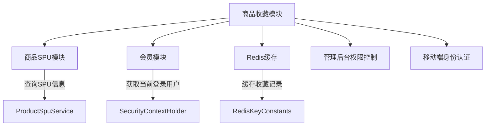
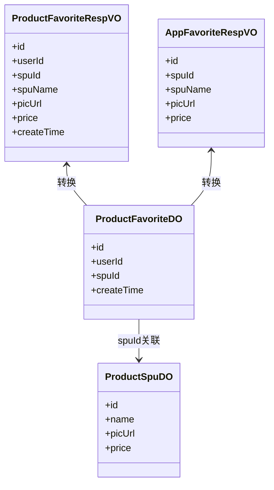
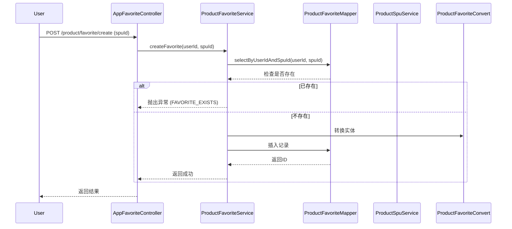
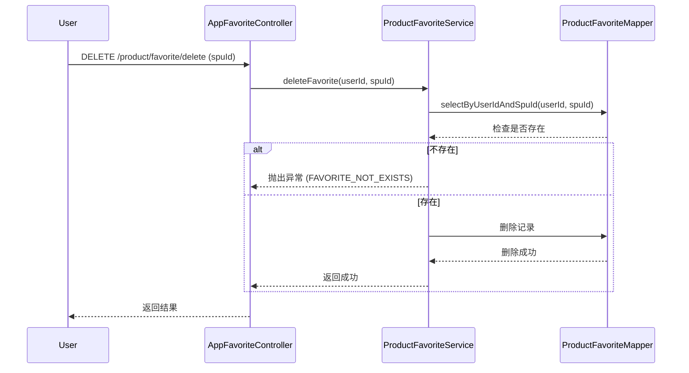
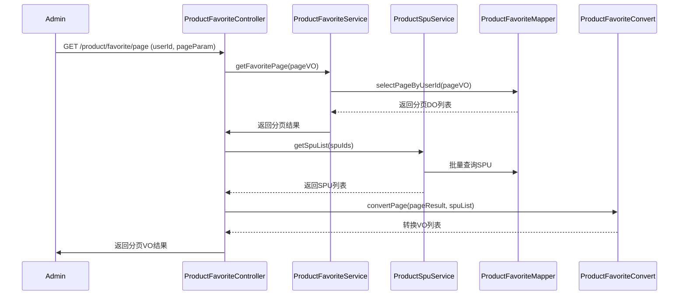

# 商品收藏模块 (Product Favorite Module)

## 1. 模块概述

商品收藏模块是商城模块（Product Module）中的核心功能之一，为用户提供商品收藏/取消收藏、收藏列表查询、收藏数量统计等功能。该模块同时支持管理后台和移动端（App）两种访问方式，实现了完整的商品收藏业务闭环。

模块主要职责包括：
- 用户收藏商品（添加收藏）
- 用户取消收藏商品
- 查询用户收藏的商品列表（分页）
- 检查商品是否已被收藏
- 统计用户收藏的商品总数
- 管理后台查看和管理用户收藏记录

## 2. 架构设计

### 2.1 系统架构

```
┌─────────────────────────────────────────────────────────────────┐
│                        用户层                                   │
│  ┌─────────────┐    ┌─────────────┐                            │
│  │ 管理后台    │    │   移动端 App  │                            │
│  │ (Web Admin) │    │   (Mobile App)│                            │
│  └──────┬──────┘    └──────┬──────┘                            │
│         │                   │                                   │
│         ▼                   ▼                                   │
│  ┌─────────────────────────────────────────────────────────┐   │
│  │ 商品收藏控制器层 (Controller Layer)                     │   │
│  │  ├─ ProductFavoriteController (管理后台)              │   │
│  │  └─ AppFavoriteController (移动端)                    │   │
│  └──────────────┬──────────────────────────────────────────┘   │
│                 │                                               │
│                 ▼                                               │
│  ┌─────────────────────────────────────────────────────────┐   │
│  │ 服务层 (Service Layer)                                  │   │
│  │  └─ ProductFavoriteServiceImpl                          │   │
│  └──────────────┬──────────────────────────────────────────┘   │
│                 │                                               │
│                 ▼                                               │
│  ┌─────────────────────────────────────────────────────────┐   │
│  │ 数据访问层 (DAO Layer)                                  │   │
│  │  └─ ProductFavoriteMapper                               │   │
│  └──────────────┬──────────────────────────────────────────┘   │
│                 │                                               │
│                 ▼                                               │
│  ┌─────────────────────────────────────────────────────────┐   │
│  │ 数据库 (Database)                                       │   │
│  │  └─ product_favorite 表                                 │   │
│  └─────────────────────────────────────────────────────────┘   │
```

### 2.2 模块依赖关系



**依赖说明：**
- **商品SPU模块**：获取商品SPU详细信息（名称、图片、价格等）
- **会员模块**：获取当前登录用户ID，验证用户身份
- **Redis缓存**：用于缓存部分高频访问的收藏数据（通过RedisKeyConstants配置）
- **权限系统**：管理后台操作需要`product:favorite:query`权限

## 3. 核心组件

### 3.1 数据对象 (DO)

#### `ProductFavoriteDO` - 商品收藏实体

```java
@TableId
private Long id;                    // 主键ID
private Long userId;                // 用户编号，关联MemberUserDO
private Long spuId;                 // 商品SPU编号，关联ProductSpuDO
```

**数据库表结构：** `product_favorite`

| 字段名 | 类型 | 说明 |
|--------|------|------|
| id | BIGINT | 主键，自增 |
| user_id | BIGINT | 用户ID |
| spu_id | BIGINT | 商品SPUID |
| create_time | DATETIME | 创建时间 |
| update_time | DATETIME | 更新时间 |

### 3.2 视图对象 (VO)

#### 管理后台VO

| VO类 | 用途 |
|------|------|
| `ProductFavoritePageReqVO` | 管理后台分页查询请求参数（包含userId） |
| `ProductFavoriteRespVO` | 管理后台分页查询响应结果（继承自ProductSpuRespVO，包含userId、spuId） |

#### 移动端VO

| VO类 | 用途 |
|------|------|
| `AppFavoriteReqVO` | 单个收藏操作请求（spuId） |
| `AppFavoriteBatchReqVO` | 批量收藏操作请求（spuIds列表） |
| `AppFavoritePageReqVO` | 移动端分页查询请求 |
| `AppFavoriteRespVO` | 移动端收藏响应结果（包含商品详细信息） |

### 3.3 服务接口 (Service)

#### `ProductFavoriteService` 核心方法

| 方法名 | 参数 | 返回值 | 说明 |
|--------|------|--------|------|
| `createFavorite` | userId, spuId | Long | 添加收藏，重复则抛出异常 |
| `deleteFavorite` | userId, spuId | void | 取消收藏 |
| `getFavoritePage` | userId, reqVO | PageResult<ProductFavoriteDO> | 分页查询收藏列表 |
| `getFavorite` | userId, spuId | ProductFavoriteDO | 获取单个收藏记录 |
| `getFavoriteCount` | userId | Long | 统计收藏数量 |

### 3.4 转换器 (Convert)

#### `ProductFavoriteConvert` 转换关系



**转换逻辑：**
1. `convert(userId, spuId)`：DO转实体
2. `convertPage(pageResult, spuList)`：分页DO转VO，同时关联SPU信息
3. `convertList(favorites, spus)`：批量转换，关联SPU信息
4. `convert(spu, favorite)`：DO与SPU合并转换为AppFavoriteRespVO

### 3.5 控制器 (Controller)

#### 管理后台控制器 - `ProductFavoriteController`

| 请求路径 | 请求方法 | 说明 | 权限要求 |
|----------|----------|------|----------|
| `/product/favorite/page` | GET | 获取商品收藏分页 | `product:favorite:query` |

**处理流程：**
1. 接收分页查询参数 `ProductFavoritePageReqVO`
2. 调用服务层获取收藏分页数据
3. 根据收藏列表中的spuId批量查询SPU信息
4. 使用转换器将DO+SPU数据转换为VO
5. 返回分页结果

#### 移动端控制器 - `AppFavoriteController`

| 请求路径 | 请求方法 | 说明 |
|----------|----------|------|
| `/product/favorite/create` | POST | 添加商品收藏 |
| `/product/favorite/delete` | DELETE | 取消商品收藏 |
| `/product/favorite/page` | GET | 获取商品收藏分页 |
| `/product/favorite/exits` | GET | 检查商品是否已收藏 |
| `/product/favorite/get-count` | GET | 获取收藏数量 |

**处理流程示例（添加收藏）：**
1. 从请求体获取 `AppFavoriteReqVO`（包含spuId）
2. 通过Security上下文获取当前登录用户ID
3. 调用 `productFavoriteService.createFavorite(userId, spuId)`
4. 检查是否已存在收藏记录，存在则抛出异常
5. 插入新收藏记录，返回ID

## 4. 业务流程

### 4.1 添加收藏流程



### 4.2 取消收藏流程



### 4.3 查询收藏列表流程（管理后台）



## 5. API 接口说明

### 5.1 管理后台接口

#### 5.1.1 获取商品收藏分页

- **请求地址**：`GET /product/favorite/page`
- **请求参数**：
  - `userId` (Long, 可选)：用户编号
  - `pageNum` (Integer, 必填)：页码
  - `pageSize` (Integer, 必填)：每页数量
- **响应结果**：
  ```json
  {
    "code": 200,
    "message": "成功",
    "data": {
      "list": [
        {
          "id": 1,
          "userId": 1001,
          "spuId": 100,
          "spuName": "示例商品",
          "picUrl": "https://example.com/pic.jpg",
          "price": 100,
          "createTime": "2024-01-01 12:00:00"
        }
      ],
      "total": 100
    }
  }
  ```

### 5.2 移动端接口

#### 5.2.1 添加商品收藏

- **请求地址**：`POST /product/favorite/create`
- **请求参数**：
  ```json
  {
    "spuId": 100
  }
  ```
- **响应结果**：
  ```json
  {
    "code": 200,
    "message": "成功",
    "data": 1  // 收藏ID
  }
  ```

#### 5.2.2 取消商品收藏

- **请求地址**：`DELETE /product/favorite/delete`
- **请求参数**：
  ```json
  {
    "spuId": 100
  }
  ```
- **响应结果**：
  ```json
  {
    "code": 200,
    "message": "成功",
    "data": true
  }
  ```

#### 5.2.3 获取商品收藏分页

- **请求地址**：`GET /product/favorite/page`
- **请求参数**：
  - `pageNum` (Integer, 必填)：页码
  - `pageSize` (Integer, 必填)：每页数量
- **响应结果**：
  ```json
  {
    "code": 200,
    "message": "成功",
    "data": {
      "list": [
        {
          "id": 1,
          "spuId": 100,
          "spuName": "示例商品",
          "picUrl": "https://example.com/pic.jpg",
          "price": 100
        }
      ],
      "total": 100
    }
  }
  ```

#### 5.2.4 检查商品是否已收藏

- **请求地址**：`GET /product/favorite/exits`
- **请求参数**：
  ```json
  {
    "spuId": 100
  }
  ```
- **响应结果**：
  ```json
  {
    "code": 200,
    "message": "成功",
    "data": true  // 已收藏返回true，否则false
  }
  ```

#### 5.2.5 获取收藏数量

- **请求地址**：`GET /product/favorite/get-count`
- **响应结果**：
  ```json
  {
    "code": 200,
    "message": "成功",
    "data": 5  // 收藏数量
  }
  ```

## 6. 异常处理

| 异常类型 | 触发场景 | 处理方式 |
|----------|----------|----------|
| `FAVORITE_EXISTS` | 重复添加已收藏的商品 | 抛出异常，返回错误信息 |
| `FAVORITE_NOT_EXISTS` | 取消不存在的收藏 | 抛出异常，返回错误信息 |

## 7. 与其他模块的交互

### 7.1 商品模块 (Product Module)

- **依赖**：`ProductSpuService` 获取SPU详细信息
- **交互方式**：通过SPUID批量查询商品列表，用于在收藏列表中展示商品信息

### 7.2 会员模块 (Member Module)

- **依赖**：用户身份认证服务
- **交互方式**：通过Security上下文获取当前登录用户ID

### 7.3 权限系统 (Security Module)

- **依赖**：权限校验注解 `@PreAuthorize`
- **交互方式**：管理后台接口需要 `product:favorite:query` 权限

### 7.4 Redis模块 (Redis Module)

- **依赖**：RedisKeyConstants定义缓存键
- **交互方式**：可能用于缓存热门收藏数据或减少数据库查询（具体实现需查看RedisKeyConstants）

## 8. 数据库设计

### 8.1 product_favorite 表

```sql
CREATE TABLE `product_favorite` (
  `id` BIGINT NOT NULL AUTO_INCREMENT PRIMARY KEY,
  `user_id` BIGINT NOT NULL COMMENT '用户ID',
  `spu_id` BIGINT NOT NULL COMMENT '商品SPUID',
  `create_time` DATETIME NOT NULL DEFAULT CURRENT_TIMESTAMP COMMENT '创建时间',
  `update_time` DATETIME NOT NULL DEFAULT CURRENT_TIMESTAMP ON UPDATE CURRENT_TIMESTAMP COMMENT '更新时间',
  UNIQUE KEY `idx_user_spu` (`user_id`, `spu_id`),
  KEY `idx_spu` (`spu_id`)
) ENGINE=InnoDB DEFAULT CHARSET=utf8mb4 COMMENT='商品收藏表';
```

**索引说明：**
- 主键：id
- 唯一索引：(userId, spuId) - 防止同一用户重复收藏同一商品
- 普通索引：spuId - 加快按商品查询速度

## 9. 测试要点

1. **收藏功能**：正常添加收藏、重复添加收藏（应抛出异常）
2. **取消收藏**：正常取消收藏、取消不存在的收藏（应抛出异常）
3. **分页查询**：空结果、多页结果、边界条件
4. **权限控制**：未授权用户访问管理后台接口
5. **移动端接口**：未登录用户访问、不同用户数据隔离
6. **性能测试**：大量收藏数据下的查询性能

## 1. 扩展建议

1. **批量收藏/取消收藏**：支持一次操作多个商品
2. **收藏排序**：按创建时间、商品名称等排序
3. **收藏标签**：为用户收藏的商品添加自定义标签
4. **收藏统计报表**：按商品分类统计收藏数据
5. **消息通知**：收藏商品降价时通知用户
