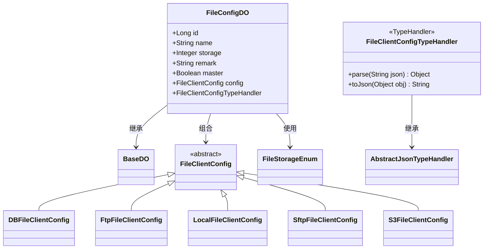
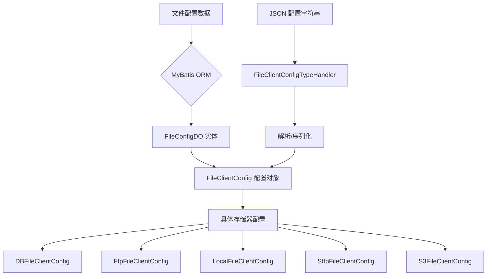

# FileConfigDO 模块文档

## 模块概述

FileConfigDO 是 Yudao 框架基础设施模块中的文件配置数据对象，用于存储和管理不同类型的文件存储配置。该模块支持多种文件存储方式，包括数据库、FTP、本地文件系统、SFTP 和 Amazon S3 等。

通过使用自定义的 MyBatis 类型处理器（FileClientConfigTypeHandler），该实现能够灵活地处理不同文件存储客户端的配置序列化和反序列化，同时保持向后兼容性。

## 核心功能

1. **多存储器支持**：支持数据库、FTP、本地文件系统、SFTP 和 S3 五种文件存储方式
2. **主配置标识**：通过 `master` 字段标识是否为默认的主文件配置
3. **灵活配置管理**：使用 JSON 格式存储不同存储器的特定配置参数
4. **租户隔离忽略**：通过 `@TenantIgnore` 注解实现跨租户共享的文件配置
5. **向后兼容性**：自定义类型处理器支持解析旧版本的配置类名

## 架构设计

### 类关系图



### 数据流图



## 详细设计

### FileConfigDO 字段说明

| 字段名 | 类型 | 说明 |
|--------|------|------|
| id | Long | 配置编号，数据库自增主键 |
| name | String | 配置名称，用于标识不同的文件存储配置 |
| storage | Integer | 存储器类型，对应 FileStorageEnum 枚举值 |
| remark | String | 配置备注信息 |
| master | Boolean | 是否为主配置，系统默认使用主配置进行文件上传 |
| config | FileClientConfig | 存储器具体配置，通过自定义类型处理器进行 JSON 序列化/反序列化 |

### FileClientConfigTypeHandler 实现细节

自定义类型处理器负责在数据库和 Java 对象之间转换 FileClientConfig 配置：

1. **解析过程**（JSON → Java 对象）：
   - 首先尝试使用标准的 JsonUtils 解析为 FileClientConfig
   - 如果失败，则尝试解析 `@class` 字段以确定具体的配置类型
   - 支持的类型包括：DBFileClientConfig、FtpFileClientConfig、LocalFileClientConfig、SftpFileClientConfig、S3FileClientConfig
   - 提供向后兼容性处理，能够识别旧版本的全限定类名

2. **序列化过程**（Java 对象 → JSON）：
   - 直接使用 JsonUtils 将 FileClientConfig 对象转换为 JSON 字符串

### 存储器类型枚举 (FileStorageEnum)

虽然未在当前文件中显示，但 FileConfigDO.storage 字段引用了 FileStorageEnum 枚举，通常包含以下值：
- DB (0): 数据库存储
- FTP (1): FTP 存储
- LOCAL (2): 本地文件系统存储
- SFTP (3): SFTP 存储
- S3 (4): Amazon S3 存储

## 系统集成

### 与其他模块的关系

FileConfigDO 模块主要与以下系统组件交互：

1. **文件服务模块**：通过 FileServiceImpl 使用 FileConfigDO 来确定文件上传和下载的存储位置
2. **租户框架**：通过 @TenantIgnore 注解实现文件配置的跨租户共享特性
3. **MyBatis 框架**：通过自定义类型处理器与 MyBatis 集成，实现透明的配置持久化

### 使用场景

1. **文件上传**：系统根据主配置（master=true）或指定的配置ID选择合适的存储器进行文件上传
2. **文件下载**：通过文件关联的配置ID找到对应的存储器配置进行文件检索
3. **配置管理**：通过后台接口管理不同的文件存储配置，支持动态添加、修改和删除
4. **多存储器策略**：根据业务需求将不同类型的文件存储到不同的存储介质中（例如：图片存储到S3，文档存储到数据库）

## 配置示例

### 数据库存储配置
```json
{
  "@class": "DBFileClientConfig",
  "tableName": "sys_file",
  "blobColumnName": "content"
}
```

### FTP 存储配置
```json
{
  "@class": "FtpFileClientConfig",
  "host": "ftp.example.com",
  "port": 21,
  "username": "ftpuser",
  "password": "ftppass",
  "basePath": "/upload",
  "urlPrefix": "http://cdn.example.com/upload"
}
```

### 本地文件系统存储配置
```json
{
  "@class": "LocalFileClientConfig",
  "basePath": "/var/uploads",
  "urlPrefix": "http://localhost:8080/upload"
}
```

### SFTP 存储配置
```json
{
  "@class": "SftpFileClientConfig",
  "host": "sftp.example.com",
  "port": 22,
  "username": "sftpuser",
  "password": "sftppass",
  "basePath": "/upload",
  "urlPrefix": "http://cdn.example.com/upload"
}
```

### Amazon S3 存储配置
```json
{
  "@class": "S3FileClientConfig",
  "endpoint": "s3.amazonaws.com",
  "accessKey": "your-access-key",
  "secretKey": "your-secret-key",
  "bucketName": "my-bucket",
  "urlPrefix": "https://my-bucket.s3.amazonaws.com"
}
```

## 最佳实践

1. **主配置设置**：建议在系统中只设置一个主配置（master=true），用于默认的文件操作
2. **配置命名**：使用具有描述性的名称来标识不同的存储配置，如 "prod-s3-images", "dev-local-documents" 等
3. **安全考虑**：对于包含敏感信息的配置（如密码、访问密钥），确保使用适当的加密机制或环境变量
4. **性能优化**：根据文件访问模式选择合适的存储器，例如频繁访问的静态资源使用 CDN 友好的存储器
5. **监控与日志**：为不同的存储器配置启用适当的监控和日志，以便及时发现和解决存储问题

## 依赖关系

FileConfigDO 模块依赖于以下核心组件：
- [BaseDO](../yudao-framework/yudao-common/src/main/java/cn/iocoder/yudao/framework/mybatis/core/dataobject/BaseDO.md)：基础数据对象类
- [FileClientConfig](../yudao-module-infra/src/main/java/cn/iocoder/yudao/module/infra/framework/file/core/client/FileClientConfig.java)：文件客户端配置抽象基类
- [FileStorageEnum](../yudao-module-infra/src/main/java/cn/iocoder/yudao/module/infra/framework/file/core/enums/FileStorageEnum.md)：文件存储类型枚举

## 结论

FileConfigDO 模块为 Yudao 框架提供了灵活且可扩展的文件存储配置管理解决方案。通过支持多种存储器类型和提供向后兼容性的自定义类型处理器，该模块使得系统能够根据不同的业务需求和部署环境轻松切换和管理文件存储策略。其设计充分考虑了可扩展性、维护性和系统集成的便利性，是框架基础设施层的重要组成部分。