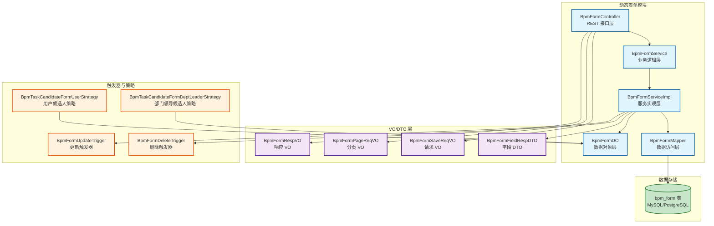
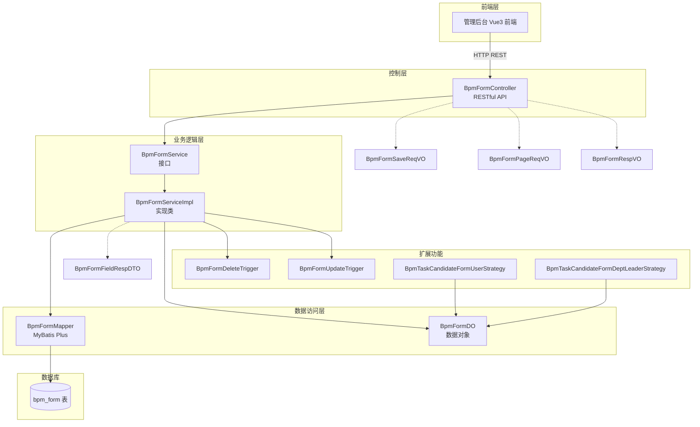
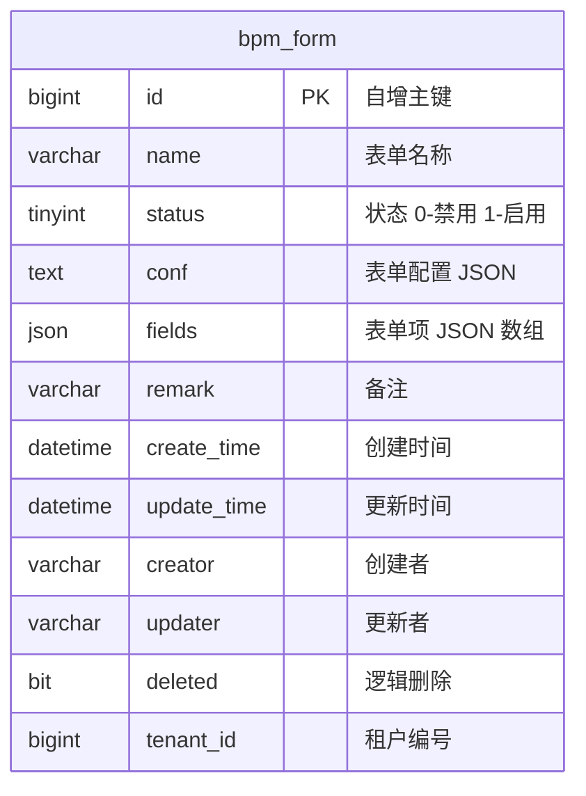
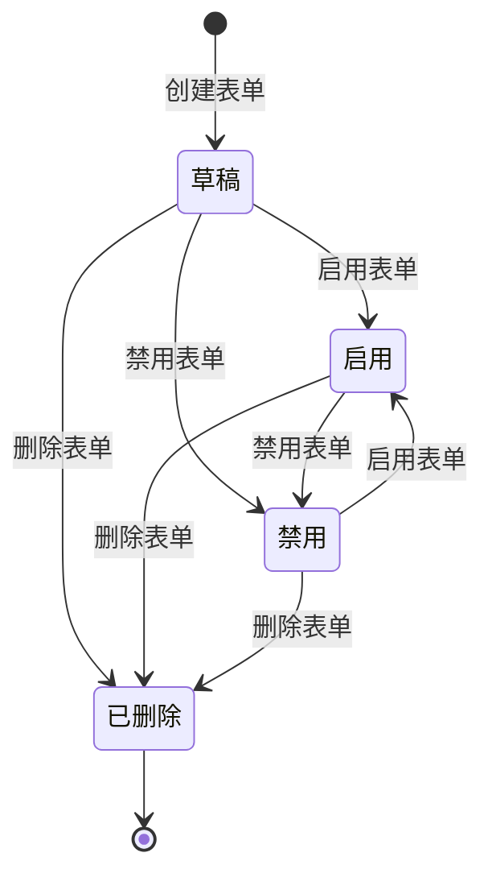
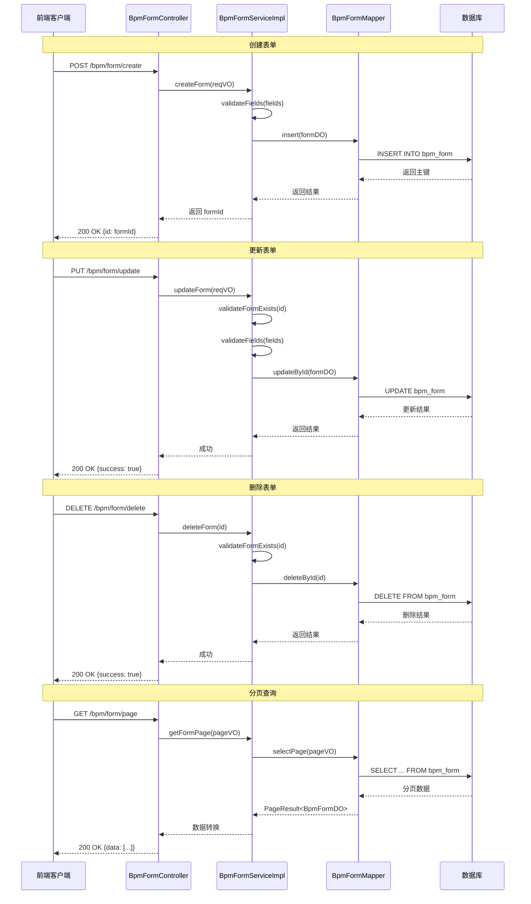
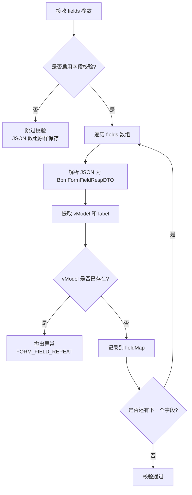
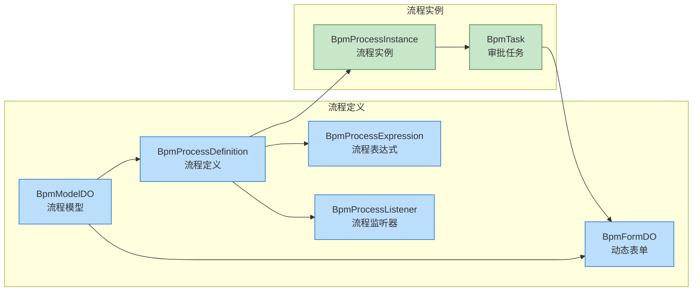
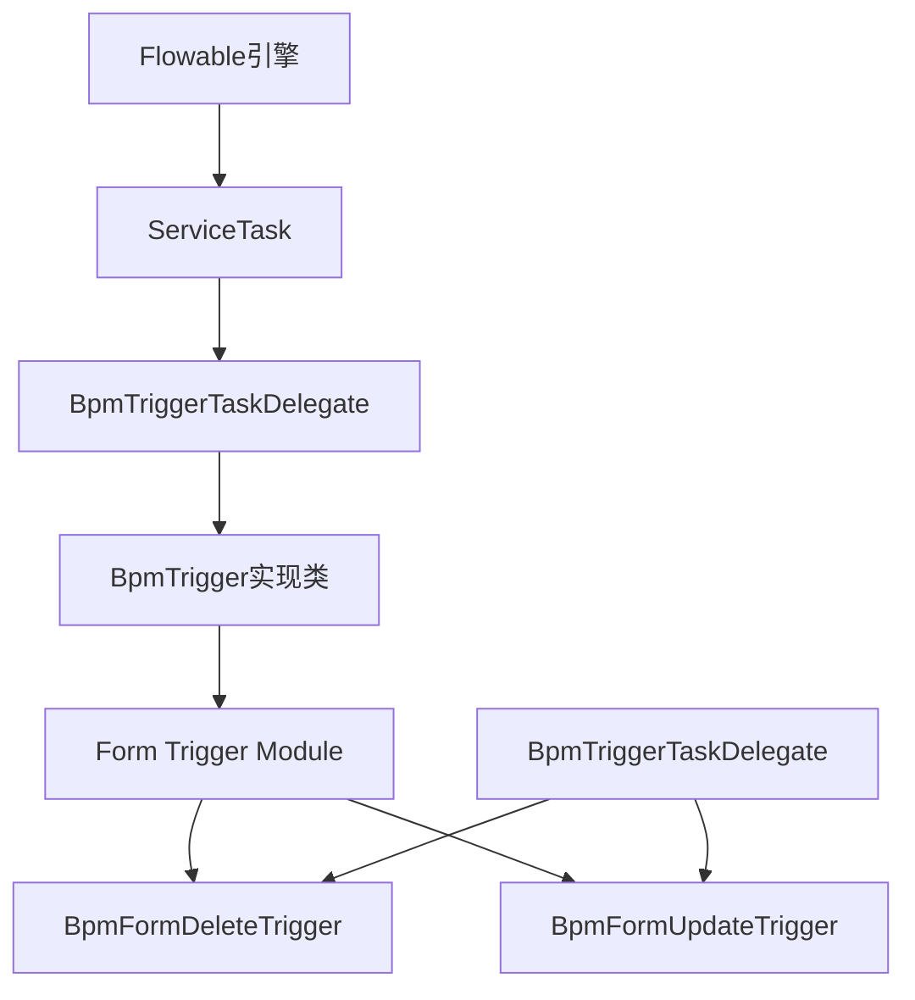
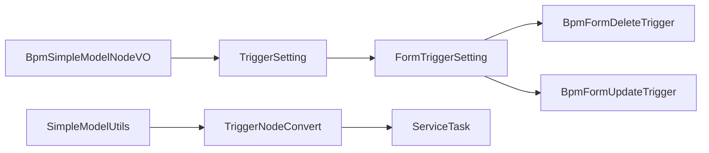

# 动态表单管理模块 (Form Module)

## 概述

动态表单管理模块是 **BPM（业务流程管理）** 系统中的核心基础组件之一，负责管理流程定义中使用的**动态表单**。该模块提供了表单的完整生命周期管理能力，包括表单的创建、更新、删除、查询和分页等功能，支持通过 JSON 配置的方式定义表单的结构、字段和校验规则，从而实现无需编码即可自定义流程表单的能力。

动态表单模块使得业务人员可以通过可视化表单设计器（基于 [form-generator](https://github.com/JakHuang/form-generator)）创建表单，并将其关联到流程模型的节点上，实现流程任务中的数据采集与展示。

### 核心功能

- **表单 CRUD 操作**：支持表单的创建、更新、删除、查询
- **表单字段管理**：通过 JSON 数组存储表单项配置
- **表单配置管理**：通过 JSON 字符串存储表单整体布局配置
- **表单状态管理**：支持启用/禁用表单状态
- **字段唯一性校验**：确保表单字段的 `vModel` 不重复
- **流程表单触发器**：支持在流程执行过程中动态更新或删除表单数据
- **表单内候选人策略**：基于表单字段动态计算任务审批人

---

## 架构设计

### 模块组成

动态表单模块采用标准的分层架构，包含以下核心组件：



### 分层架构



---

## 核心组件说明

### 1. 控制器层 (BpmFormController)

**文件位置**: `yudao-module-bpm/src/main/java/cn/iocoder/yudao/module/bpm/controller/admin/definition/BpmFormController.java`

动态表单的 REST 控制器，基础路径为 `/bpm/form`。所有接口均通过 Spring Security 进行权限控制，使用 `@PreAuthorize` 注解校验操作权限。

| 方法 | URL | 权限 | 说明 |
|------|-----|------|------|
| `createForm` | `POST /bpm/form/create` | `bpm:form:create` | 创建动态表单 |
| `updateForm` | `PUT /bpm/form/update` | `bpm:form:update` | 更新动态表单 |
| `deleteForm` | `DELETE /bpm/form/delete` | `bpm:form:delete` | 删除动态表单 |
| `getForm` | `GET /bpm/form/get` | `bpm:form:query` | 查询单个表单详情 |
| `getFormSimpleList` | `GET /bpm/form/list-all-simple` | 无（公开） | 获取精简列表（仅 id、name） |
| `getFormPage` | `GET /bpm/form/page` | `bpm:form:query` | 分页查询表单列表 |

### 2. 请求/响应 VO

#### BpmFormSaveReqVO

**文件位置**: `yudao-module-bpm/src/main/java/cn/iocoder/yudao/module/bpm/controller/admin/definition/vo/form/BpmFormSaveReqVO.java`

表单创建/更新的请求 VO，同时用于创建和更新操作（更新时通过 `id` 字段区分）。

| 字段 | 类型 | 必填 | 说明 |
|------|------|------|------|
| `id` | `Long` | 否 | 表单编号，更新时必填，创建时不填 |
| `name` | `String` | 是 | 表单名称 |
| `conf` | `String` | 是 | 表单的全局配置（JSON 字符串） |
| `fields` | `List<String>` | 是 | 表单项数组（JSON 字符串数组） |
| `status` | `Integer` | 是 | 表单状态，参见 `CommonStatusEnum` 枚举 |
| `remark` | `String` | 否 | 备注 |

#### BpmFormPageReqVO

**文件位置**: `yudao-module-bpm/src/main/java/cn/iocoder/yudao/module/bpm/controller/admin/definition/vo/form/BpmFormPageReqVO.java`

分页查询请求 VO，继承自 `PageParam`。

| 字段 | 类型 | 必填 | 说明 |
|------|------|------|------|
| `name` | `String` | 否 | 表单名称（模糊查询） |
| `pageNo` | `Integer` | 否（继承） | 页码，默认 1 |
| `pageSize` | `Integer` | 否（继承） | 每页条数，默认 10 |
| `sort` | `String` | 否（继承） | 排序字段 |
| `order` | `String` | 否（继承） | 排序方向（asc/desc） |

#### BpmFormRespVO

**文件位置**: `yudao-module-bpm/src/main/java/cn/iocoder/yudao/module/bpm/controller/admin/definition/vo/form/BpmFormRespVO.java`

表单的响应 VO，包含所有字段及创建时间。

| 字段 | 类型 | 说明 |
|------|------|------|
| `id` | `Long` | 表单编号 |
| `name` | `String` | 表单名称 |
| `conf` | `String` | 表单配置（JSON） |
| `fields` | `List<String>` | 表单项数组（JSON 字符串数组） |
| `status` | `Integer` | 表单状态 |
| `remark` | `String` | 备注 |
| `createTime` | `LocalDateTime` | 创建时间 |

### 3. 数据对象 (BpmFormDO)

**文件位置**: `yudao-module-bpm/src/main/java/cn/iocoder/yudao/module/bpm/dal/dataobject/definition/BpmFormDO.java`

表单数据库实体，映射表 `bpm_form`。

| 字段 | 类型 | 数据库列 | 说明 |
|------|------|---------|------|
| `id` | `Long` | `id` | 主键编号，自增 |
| `name` | `String` | `name` | 表单名称 |
| `status` | `Integer` | `status` | 表单状态（0-禁用，1-启用） |
| `conf` | `String` | `conf` | 表单配置 JSON |
| `fields` | `List<String>` | `fields` | 表单项数组，使用 Jackson JSON 类型处理器 |
| `remark` | `String` | `remark` | 备注 |
| `createTime` | `LocalDateTime` | `create_time` | 创建时间（继承自 BaseDO） |
| `updateTime` | `LocalDateTime` | `update_time` | 更新时间（继承自 BaseDO） |
| `creator` | `String` | `creator` | 创建者（继承自 BaseDO） |
| `updater` | `String` | `updater` | 更新者（继承自 BaseDO） |
| `deleted` | `Boolean` | `deleted` | 逻辑删除（继承自 BaseDO） |
| `tenantId` | `Long` | `tenant_id` | 租户编号（继承自 BaseDO，多租户场景） |

### 4. 服务层 (BpmFormService & BpmFormServiceImpl)

**服务接口**: `yudao-module-bpm/src/main/java/cn/iocoder/yudao/module/bpm/service/definition/BpmFormService.java`

**服务实现**: `yudao-module-bpm/src/main/java/cn/iocoder/yudao/module/bpm/service/definition/BpmFormServiceImpl.java`

服务接口定义了表单管理的核心操作，包括：

| 方法 | 说明 |
|------|------|
| `createForm()` | 创建动态表单 |
| `updateForm()` | 更新动态表单 |
| `deleteForm()` | 删除动态表单 |
| `getForm()` | 根据 ID 获取表单 |
| `getFormList()` | 获取表单列表 |
| `getFormPage()` | 分页查询表单 |
| `getFormMap()` | 批量获取表单 Map |

**字段校验逻辑** (`validateFields`): 服务层会对传入的 `fields` 数组进行校验，解析每个 JSON 字符串为 `BpmFormFieldRespDTO`，检查 `vModel` 属性是否重复，防止表单字段冲突。当前实现中该校验逻辑被临时跳过（TODO 注释），以兼容 Vue3 新版表单设计器。

### 5. 字段 DTO (BpmFormFieldRespDTO)

**文件位置**: `yudao-module-bpm/src/main/java/cn/iocoder/yudao/module/bpm/service/definition/dto/BpmFormFieldRespDTO.java`

内部使用的字段校验 DTO，用于解析 `fields` 数组中的 JSON 字符串。

| 字段 | 类型 | 说明 |
|------|------|------|
| `label` | `String` | 表单字段的显示标题 |
| `vModel` | `String` | 表单字段的属性名（自定义），使用 `@JsonProperty("vModel")` 映射 JSON |

### 6. 表单触发器 (Form Trigger)

**文件位置**: `yudao-module-bpm/src/main/java/cn/iocoder/yudao/module/bpm/service/task/trigger/form/`

触发器模块负责在流程执行过程中对流程表单数据进行动态更新和删除操作。

| 触发器 | 说明 |
|--------|------|
| `BpmFormDeleteTrigger` | 删除流程表单数据触发器 |
| `BpmFormUpdateTrigger` | 更新流程表单数据触发器 |

### 7. 表单内候选人策略 (Form Candidate Strategy)

**文件位置**: `yudao-module-bpm/src/main/java/cn/iocoder/yudao/module/bpm/framework/flowable/core/candidate/strategy/form/`

该模块专门处理基于表单字段的候选人计算策略。

| 策略 | 说明 |
|------|------|
| `BpmTaskCandidateFormUserStrategy` | 基于表单内的用户字段计算候选人 |
| `BpmTaskCandidateFormDeptLeaderStrategy` | 基于表单内的部门字段计算指定层级的部门负责人 |

---

## 数据模型

### bpm_form 表结构



`fields` 字段使用 `Jackson3TypeHandler` 类型处理器，将数据库中的 JSON 数据自动转换为 `List<String>` 类型。

---

## 业务流程

### 表单生命周期



### 表单 CRUD 流程



### 字段校验流程



---

## 权限配置

| 权限标识 | 对应操作 | 说明 |
|---------|---------|------|
| `bpm:form:create` | 创建表单 | POST /bpm/form/create |
| `bpm:form:update` | 更新表单 | PUT /bpm/form/update |
| `bpm:form:delete` | 删除表单 | DELETE /bpm/form/delete |
| `bpm:form:query` | 查询表单 | GET /bpm/form/get 和 GET /bpm/form/page |

`getFormSimpleList` 接口（GET /bpm/form/list-all-simple）未配置权限注解，允许所有已认证用户访问，用于流程模型配置时的表单下拉选择。

---

## 与其他模块的集成

### 在 BPM 流程中的位置



- **流程模型 (BpmModelDO)**：流程模型可以绑定表单定义，在发起流程时展示对应的申请表单
- **流程任务 (BpmTask)**：审批任务可以引用表单数据，供审批人查看表单内容
- **流程表达式 (BpmProcessExpression)**：流程表达式可用于条件判断和候选人计算
- **流程监听器 (BpmProcessListener)**：监听器可在流程事件发生时触发自定义逻辑

### 与 Flowable 引擎集成



### 与简单模型配置集成



---

## 扩展与配置

### 表单设计器

表单的 `conf` 和 `fields` 字段存储的内容由 [form-generator](https://github.com/JakHuang/form-generator) 可视化设计器生成，可通过管理后台前端集成该设计器实现拖拽式表单设计。

### 字段类型处理器

`fields` 字段使用 `Jackson3TypeHandler` 实现 JSON 到 `List<String>` 的自动转换，确保数据库存储的是标准 JSON 格式。

### 多租户支持

`BpmFormDO` 继承 `BaseDO`，包含 `tenantId` 字段，天然支持多租户数据隔离。

### 触发器配置示例

```json
// 删除触发器配置示例
[
  {
    "conditionType": 1,
    "conditionExpression": "${approvalStatus == 'APPROVED'}",
    "deleteFields": ["tempApprover", "tempApproveTime"]
  }
]

// 更新触发器配置示例
[
  {
    "conditionType": 2,
    "conditionGroups": {
      "and": true,
      "conditions": [
        {
          "and": false,
          "rules": [
            {"leftSide": "${day}", "opCode": ">", "rightSide": 3}
          ]
        }
      ]
    },
    "updateFormFields": {
      "status": "overdue",
      "reminder": true
    }
  }
]
```

### 候选人策略配置示例

```json
// 用户字段策略配置
{
  "nodeId": "approve_1",
  "candidateStrategy": 50,          // FORM_USER
  "candidateParam": "approverUser"  // 对应表单字段名
}

// 部门领导策略配置
{
  "nodeId": "approve_2",
  "candidateStrategy": 51,          // FORM_DEPT_LEADER
  "candidateParam": "applyDept|2"   // 部门字段 + 层级
}
```

---

## 相关文档

- [bpm_module_overview](bpm_module_overview.md) — BPM 模块总体概述
- [process_definition](process_definition.md) — 流程定义管理
- [model_controller](model_controller.md) — 流程模型管理
- [bpm_form_service](bpm_form_service.md) — 动态表单服务层详细说明
- [form_trigger](form_trigger.md) — 表单触发器模块
- [form_candidate](form_candidate.md) — 表单内候选人策略模块
- [candidate_strategy](candidate_strategy.md) — 候选人策略体系总览
- [dept_candidate](dept_candidate.md) — 部门候选人策略
- [user_candidate](user_candidate.md) — 用户/角色/岗位候选人策略

---

## 最佳实践

1. **表单命名规范**：表单名称应清晰表达业务含义，便于流程设计时识别
2. **状态管理**：使用状态字段控制表单的启用/禁用，避免删除已关联的表单
3. **字段唯一性**：确保表单字段的 `vModel` 不重复，避免流程变量冲突
4. **触发器条件**：为触发器配置合理的条件表达式，避免不必要的表单变量更新
5. **候选人策略**：根据业务需求选择合适的候选人策略，表单内用户字段策略适合固定审批人，部门领导策略适合按组织架构审批
6. **性能优化**：分页查询时使用 `BpmFormPageReqVO` 限制返回数据量，避免大数据量查询影响性能
