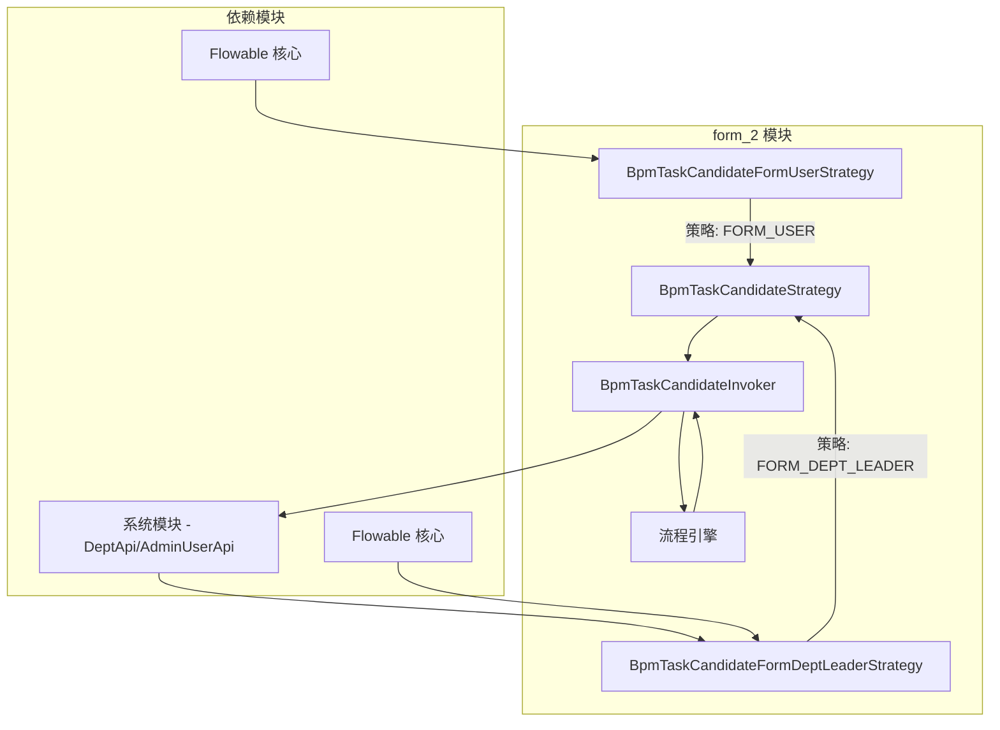
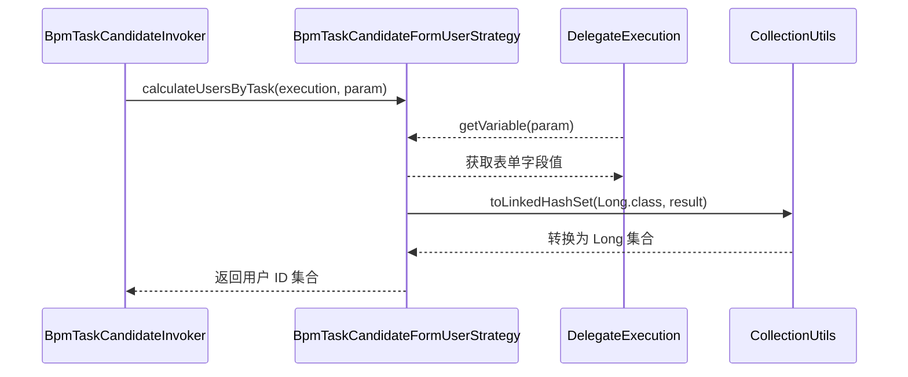
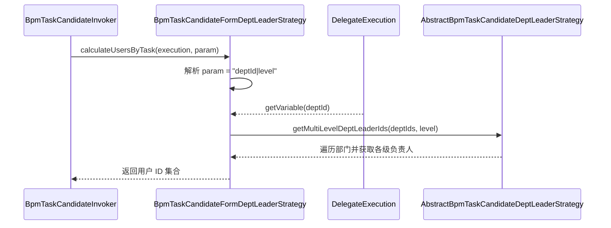
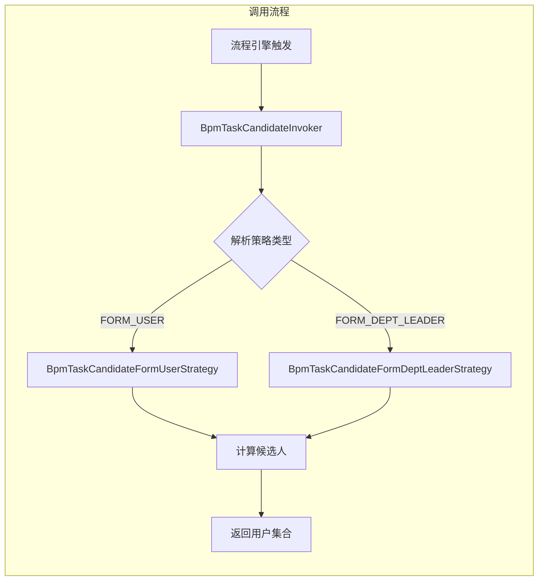
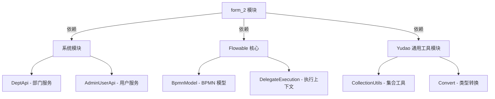

# Form 2 模块文档

## 1. 模块概述

`form_2` 模块是 BPM（业务流程管理）模块中 **基于表单的任务候选人策略** 实现部分。它提供了两种基于表单字段的动态任务分配策略：

- **表单内用户字段**：从流程表单中获取用户 ID 列表，作为任务候选人
- **表单内部门负责人**：从流程表单中获取部门 ID，并基于部门层级关系计算部门负责人作为任务候选人

该模块是 Flowable 工作流引擎在 Yudao 平台上的扩展，实现了灵活的动态任务分配机制，使得审批流程可以根据表单内容动态决定审批人。

## 2. 架构概览



### 核心组件关系

1. **`BpmTaskCandidateStrategy`** - 策略接口，定义任务候选人计算的规范
2. **`BpmTaskCandidateFormUserStrategy`** - 表单内用户字段策略实现
3. **`BpmTaskCandidateFormDeptLeaderStrategy`** - 表单内部门负责人策略实现
4. **`BpmTaskCandidateInvoker`** - 策略调用者，负责根据流程定义动态选择策略
5. **`BpmTaskCandidateStrategyEnum`** - 策略枚举，包含 `FORM_USER` 和 `FORM_DEPT_LEADER` 策略

## 3. 核心功能详解

### 3.1 表单内用户字段策略 (`BpmTaskCandidateFormUserStrategy`)

#### 功能描述
从流程表单中获取用户 ID 列表，作为任务的候选人。适用于需要在表单中直接指定审批人的场景。

#### 参数格式
- **参数**：表单字段名称（如 `assigneeUserIds`）
- **要求**：不能为空，且值为 Long 类型的集合

#### 实现逻辑



#### 关键代码

```java
@Override
public Set<Long> calculateUsersByTask(DelegateExecution execution, String param) {
    Object result = execution.getVariable(param);
    return CollectionUtils.toLinkedHashSet(Long.class, result);
}

@Override
public Set<Long> calculateUsersByActivity(BpmnModel bpmnModel, String activityId,
                                          String param, Long startUserId, String processDefinitionId,
                                          Map<String, Object> processVariables) {
    Object result = processVariables == null ? null : processVariables.get(param);
    return CollectionUtils.toLinkedHashSet(Long.class, result);
}
```

### 3.2 表单内部门负责人策略 (`BpmTaskCandidateFormDeptLeaderStrategy`)

#### 功能描述
从流程表单中获取部门 ID，并根据指定的部门层级计算部门负责人作为任务候选人。适用于需要按部门层级审批的场景。

#### 参数格式
- **格式**：`部门字段名|层级`（例如：`deptId|2`）
- **说明**：
  - 第一部分：表单中部门字段的名称
  - 第二部分：需要向上查找的部门层级数（1 表示当前部门负责人，2 表示部门负责人及其上级负责人）

#### 实现逻辑



#### 关键代码

```java
@Override
public void validateParam(String param) {
    String[] params = param.split("\\|");
    Assert.isTrue(params.length == 2, "参数格式不匹配");
    Assert.notEmpty(param, "表单内部门字段不能为空");
    int level = Integer.parseInt(params[1]);
    Assert.isTrue(level > 0, "部门层级必须大于 0");
}

@Override
public Set<Long> calculateUsersByTask(DelegateExecution execution, String param) {
    String[] params = param.split("\\|");
    Object result = execution.getVariable(params[0]);
    int level = Integer.parseInt(params[1]);
    return super.getMultiLevelDeptLeaderIds(Convert.toList(Long.class, result), level);
}
```

### 3.3 策略调用流程

`BpmTaskCandidateInvoker` 是策略的调用中心，它维护了一个策略映射表，根据流程定义中配置的策略类型动态调用对应的策略实现：



## 4. 策略枚举

`BpmTaskCandidateStrategyEnum` 定义了所有支持的候选人策略，其中 `form_2` 模块实现了以下两个策略：

| 策略枚举值 | 策略编号 | 描述 |
|-----------|---------|------|
| `FORM_USER` | 50 | 表单内用户字段 |
| `FORM_DEPT_LEADER` | 51 | 表单内部门负责人 |

## 5. 模块依赖关系



### 5.1 外部依赖

1. **系统模块 (`yudao-module-system`)**:
   - `DeptApi`：获取部门信息及部门负责人
   - `AdminUserApi`：获取用户信息，用于过滤禁用用户

2. **Flowable 引擎**:
   - `DelegateExecution`：流程执行上下文，用于获取流程变量
   - `BpmnModel`：BPMN 模型，用于活动级别的候选人计算

3. **Yudao 通用工具**:
   - `CollectionUtils`：集合转换工具
   - `Convert`：类型转换工具
   - `Assert`：断言工具

## 6. 使用场景示例

### 6.1 场景一：表单指定审批人

**需求**：在请假申请表单中，申请人可以指定一个审批人。

**配置**：
- 表单字段：`assigneeUserIds`（用户 ID 列表）
- 任务候选人策略：`FORM_USER`
- 参数：`assigneeUserIds`

**流程**：
1. 用户提交请假单，在表单中选择审批人
2. 流程引擎在 UserTask 节点触发时，调用 `BpmTaskCandidateFormUserStrategy`
3. 策略从 `execution.getVariable("assigneeUserIds")` 获取用户 ID 列表
4. 返回的列表作为该任务的候选人

### 6.2 场景二：多级部门审批

**需求**：报销申请需要部门负责人和上级部门负责人两级审批。

**配置**：
- 表单字段：`deptId`（部门 ID）
- 任务候选人策略：`FORM_DEPT_LEADER`
- 参数：`deptId|2`（表示当前部门及上一级部门的负责人）

**流程**：
1. 用户提交报销单，选择所属部门
2. 流程引擎在 UserTask 节点触发时，调用 `BpmTaskCandidateFormDeptLeaderStrategy`
3. 策略解析参数，获取部门 ID 和层级
4. 调用 `getMultiLevelDeptLeaderIds` 方法，遍历部门并获取各级负责人
5. 返回的负责人集合作为候选人

## 7. 与其他模块的关系

| 模块 | 关系说明 |
|------|---------|
| **BPM 核心模块** | `form_2` 是 BPM 模块的一部分，与任务候选人策略框架紧密集成 |
| **系统模块** | 依赖 `DeptApi` 和 `AdminUserApi` 获取部门和用户信息 |
| **Flowable 引擎** | 扩展 Flowable 的任务候选人计算机制 |
| **表单定义模块** | 策略参数引用表单字段，与表单定义联动 |

## 8. 总结

`form_2` 模块通过实现 `BpmTaskCandidateStrategy` 接口，为 BPM 流程提供了基于表单字段的动态任务分配能力。它支持两种核心策略：

1. **FORM_USER**：直接从表单获取用户列表，适用于指定审批人场景
2. **FORM_DEPT_LEADER**：从表单获取部门并计算多级负责人，适用于层级审批场景

该模块的设计遵循策略模式，易于扩展新的候选人计算策略，同时与 Flowable 引擎无缝集成，为复杂的业务流程审批提供了灵活的解决方案。
