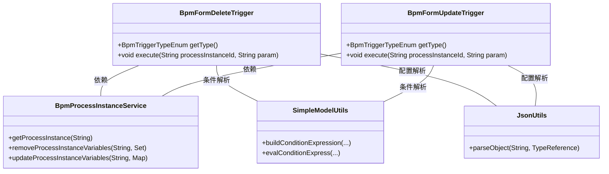
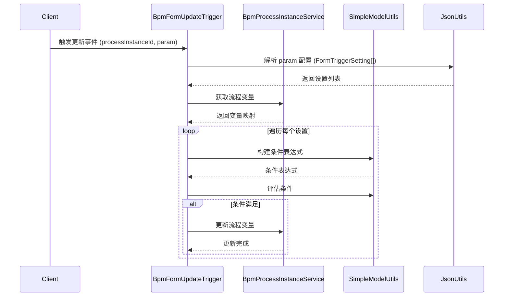
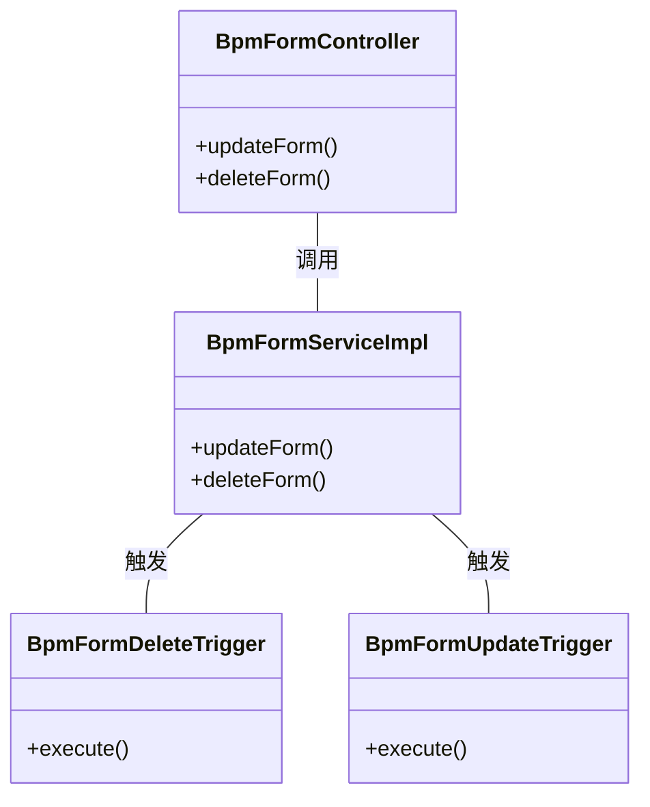

# BPM 表单触发器模块 (form_3) 文档

## 1. 模块概述

**BPM 表单触发器模块**是业务流（BPM）模块中的一个子模块，负责在流程表单数据发生变化时触发相应的业务逻辑。该模块实现了两种主要的表单触发器：

- **表单删除触发器** (`BpmFormDeleteTrigger`)：当流程中的表单数据被删除时，根据配置删除指定的流程变量。
- **表单更新触发器** (`BpmFormUpdateTrigger`)：当流程中的表单数据被更新时，根据配置更新指定的流程变量。

该模块与 BPM 模块的其他组件紧密协作，包括流程实例服务、流程变量管理、条件表达式解析等，实现了流程表单数据的动态管理。

## 2. 架构概览

### 2.1 模块位置

```
yudao-module-bpm/
└── service/
    └── task/
        └── trigger/
            ├── form/                  # form_3 模块（当前）
            │   ├── BpmFormDeleteTrigger.java
            │   └── BpmFormUpdateTrigger.java
            └── http/
                ├── BpmHttpCallbackTrigger.java
                └── BpmSyncHttpRequestTrigger.java
```

### 2.2 组件关系图



### 2.3 触发器执行流程

#### 表单删除触发器流程

```mermaid
sequenceDiagram
    participant Client
    participant BpmFormDeleteTrigger
    participant BpmProcessInstanceService
    participant SimpleModelUtils
    participant JsonUtils

    Client->>BpmFormDeleteTrigger: 触发删除事件 (processInstanceId, param)
    BpmFormDeleteTrigger->>JsonUtils: 解析 param 配置 (FormTriggerSetting[])
    JsonUtils-->>BpmFormDeleteTrigger: 返回设置列表
    BpmFormDeleteTrigger->>BpmProcessInstanceService: 获取流程变量
    BpmProcessInstanceService-->>BpmFormDeleteTrigger: 返回变量映射
    loop 遍历每个设置
        BpmFormDeleteTrigger->>SimpleModelUtils: 构建条件表达式
        SimpleModelUtils-->>BpmFormDeleteTrigger: 条件表达式
        BpmFormDeleteTrigger->>SimpleModelUtils: 评估条件
        alt 条件满足
            BpmFormDeleteTrigger: 收集要删除的字段
        end
    end
    BpmFormDeleteTrigger->>BpmProcessInstanceService: 删除流程变量
    BpmProcessInstanceService-->>BpmFormDeleteTrigger: 删除完成
```

#### 表单更新触发器流程



## 3. 核心组件说明

### 3.1 BpmFormDeleteTrigger - 表单删除触发器

**功能描述**：在流程表单数据被删除时，根据配置删除指定的流程变量。

**主要方法**：

| 方法名 | 描述 |
|--------|------|
| `getType()` | 返回触发器类型 `BpmTriggerTypeEnum.FORM_DELETE` |
| `execute(String processInstanceId, String param)` | 执行删除操作，解析配置并删除指定字段 |

**执行逻辑**：
1. 解析 `param` 参数中的 `FormTriggerSetting` 列表（JSON 格式）
2. 获取当前流程实例的流程变量
3. 遍历每个设置项，检查条件表达式（如果配置了条件）
4. 如果条件满足，收集需要删除的字段
5. 调用 `BpmProcessInstanceService.removeProcessInstanceVariables()` 删除指定字段

**配置示例**：
```json
[
  {
    "deleteFields": ["field1", "field2"],
    "conditionType": "EQUALS",
    "conditionExpression": "status",
    "conditionGroups": [
      {
        "field": "status",
        "operator": "EQUALS",
        "value": "cancelled"
      }
    ]
  }
]
```

### 3.2 BpmFormUpdateTrigger - 表单更新触发器

**功能描述**：在流程表单数据被更新时，根据配置更新指定的流程变量。

**主要方法**：

| 方法名 | 描述 |
|--------|------|
| `getType()` | 返回触发器类型 `BpmTriggerTypeEnum.FORM_UPDATE` |
| `execute(String processInstanceId, String param)` | 执行更新操作，解析配置并更新指定字段 |

**执行逻辑**：
1. 解析 `param` 参数中的 `FormTriggerSetting` 列表（JSON 格式）
2. 获取当前流程实例的流程变量
3. 遍历每个设置项，检查条件表达式（如果配置了条件）
4. 如果条件满足，调用 `BpmProcessInstanceService.updateProcessInstanceVariables()` 更新指定字段

**配置示例**：
```json
[
  {
    "updateFormFields": {
      "status": "updated",
      "updateTime": "2024-01-01T00:00:00"
    },
    "conditionType": "NOT_EQUALS",
    "conditionExpression": "status",
    "conditionGroups": [
      {
        "field": "status",
        "operator": "EQUALS",
        "value": "completed"
      }
    ]
  }
]
```

### 3.3 FormTriggerSetting - 触发器设置

**属性**：

| 属性名 | 类型 | 描述 |
|--------|------|------|
| `deleteFields` | `Set<String>` | 需要删除的字段名列表（仅用于删除触发器） |
| `updateFormFields` | `Map<String, Object>` | 需要更新的字段及其值（仅用于更新触发器） |
| `conditionType` | `String` | 条件类型（如 EQUALS、NOT_EQUALS 等） |
| `conditionExpression` | `String` | 条件表达式 |
| `conditionGroups` | `List<ConditionGroup>` | 条件组列表 |

## 4. 依赖组件

### 4.1 BpmProcessInstanceService - 流程实例服务

**功能**：提供流程实例相关的操作，包括获取流程变量、删除流程变量、更新流程变量等。

**关键方法**：
- `getProcessInstance(String processInstanceId)`：获取流程实例信息
- `removeProcessInstanceVariables(String processInstanceId, Set<String> fieldNames)`：删除指定流程变量
- `updateProcessInstanceVariables(String processInstanceId, Map<String, Object> variables)`：更新流程变量

### 4.2 SimpleModelUtils - 简单模型工具类

**功能**：提供流程模型相关的工具方法，包括条件表达式的构建和评估。

**关键方法**：
- `buildConditionExpression(String conditionType, String expression, List groups)`：构建条件表达式字符串
- `evalConditionExpress(Map<String, Object> variables, String expression)`：评估条件表达式

### 4.3 JsonUtils - JSON 工具类

**功能**：提供 JSON 序列化和反序列化的工具方法。

**关键方法**：
- `parseObject(String text, TypeReference<T> typeReference)`：将 JSON 字符串解析为指定类型的对象

## 5. 模块集成

### 5.1 与 BPM 表单模块的集成

`form_3` 模块与 BPM 表单模块（`form`）紧密集成，当表单数据发生删除或更新操作时，会触发相应的触发器：



### 5.2 与流程定义模块的集成

表单触发器通常与流程定义中的简单模型节点配置相关联，在流程执行过程中根据节点配置触发相应的操作。

## 6. 使用场景

### 6.1 场景一：流程取消时清理相关数据

当流程被取消时，需要删除与流程相关的临时表单数据：

1. 用户在流程管理界面取消流程
2. 触发 `BpmFormDeleteTrigger`
3. 触发器检查流程状态是否为 "cancelled"
4. 如果条件满足，删除临时变量如 `tempData`、`cache` 等

### 6.2 场景二：表单更新时同步状态

当表单数据更新后，需要同步更新流程中的状态变量：

1. 用户更新流程表单中的某些字段
2. 触发 `BpmFormUpdateTrigger`
3. 触发器检查更新前的状态
4. 如果条件满足，更新流程变量如 `status`、`updateTime` 等

## 7. 配置说明

触发器的配置通过 `param` 参数传递，是一个 JSON 数组，每个元素是一个 `FormTriggerSetting` 对象。配置可以包含：

- **无条件执行**：不设置条件，直接执行删除或更新操作
- **有条件执行**：设置条件表达式，只有满足条件时才执行操作
- **多条件组合**：通过条件组实现 AND/OR 逻辑

## 8. 错误处理

触发器在执行过程中会记录错误日志，主要错误包括：

- 配置为空：记录错误日志并返回
- 条件解析失败：记录错误日志并跳过该设置项
- 变量删除/更新失败：由 `BpmProcessInstanceService` 处理并抛出异常

## 9. 相关模块

| 模块名 | 描述 | 关联文件 |
|--------|------|----------|
| `form` | BPM 表单定义和管理 | `BpmFormController`, `BpmFormServiceImpl`, `BpmFormDO` |
| `task` | BPM 任务管理 | `BpmTaskController`, `BpmTaskServiceImpl` |
| `process` | BPM 流程实例管理 | `BpmProcessInstanceController`, `BpmProcessInstanceServiceImpl` |
| `candidate` | 表单候选人策略 | `BpmTaskCandidateFormUserStrategy`, `BpmTaskCandidateFormDeptLeaderStrategy` |
