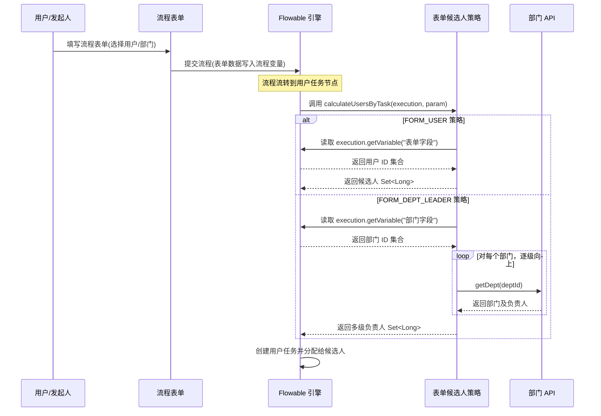
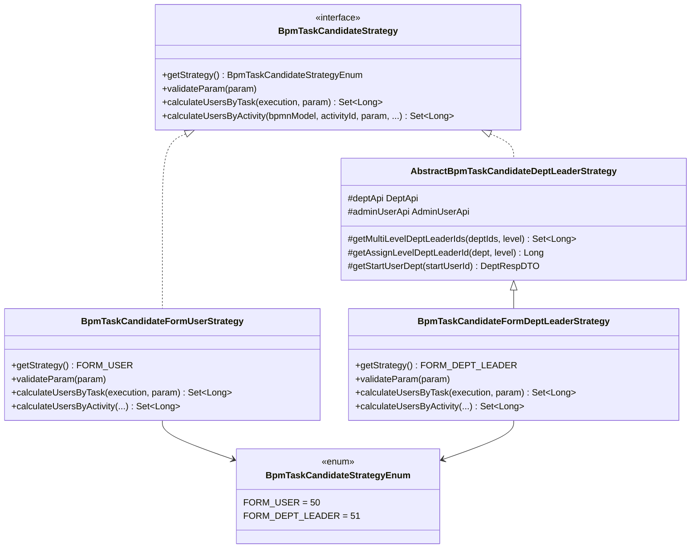

# 表单内候选人策略模块 (form_candidate)

## 概述

本模块是 **Yudao BPM 工作流** 中任务候选人策略体系的一部分，专门负责处理 **表单字段驱动** 的候选人计算策略。它允许流程设计者在配置用户任务节点时，引用流程表单中的字段值（如用户字段、部门字段）来动态确定任务的审批人。

该模块包含两个核心策略实现：

- **`BpmTaskCandidateFormUserStrategy`**：基于表单内的**用户字段**计算候选人。
- **`BpmTaskCandidateFormDeptLeaderStrategy`**：基于表单内的**部门字段**计算指定层级的部门负责人作为候选人。

> 相关文档：请参阅 [candidate_strategy](candidate_strategy.md) 了解完整的候选人策略体系总览。

---

## 架构位置

本模块属于 BPM 工作流引擎中 `flowable` 集成层的候选人策略子模块，位于：

```
yudao-module-bpm
 └── framework/flowable/core/candidate
      ├── strategy
      │    ├── form          ← 当前模块 (form_candidate)
      │    │    ├── BpmTaskCandidateFormUserStrategy.java
      │    │    └── BpmTaskCandidateFormDeptLeaderStrategy.java
      │    ├── user
      │    ├── dept
      │    └── other
      ├── BpmTaskCandidateStrategy.java          (接口)
      └── BpmTaskCandidateInvoker.java            (调用器)
```

---

## 核心接口

所有候选人策略均实现 `BpmTaskCandidateStrategy` 接口：

| 方法 | 说明 |
|------|------|
| `getStrategy()` | 返回策略枚举类型 |
| `validateParam(param)` | 校验策略参数合法性 |
| `calculateUsersByTask(execution, param)` | 根据运行时执行任务计算候选人 |
| `calculateUsersByActivity(bpmnModel, activityId, param, startUserId, processDefinitionId, processVariables)` | 根据流程模型 Activity 计算候选人（用于未执行节点预览） |

> 详见 [candidate_strategy](candidate_strategy.md) 中关于 `BpmTaskCandidateStrategy` 接口的说明。

---

## 策略枚举

本模块对应 `BpmTaskCandidateStrategyEnum` 中的两个策略类型：

| 枚举值 | ID | 描述 | 实现类 |
|--------|----|------|--------|
| `FORM_USER` | 50 | 表单内用户字段 | `BpmTaskCandidateFormUserStrategy` |
| `FORM_DEPT_LEADER` | 51 | 表单内部门负责人 | `BpmTaskCandidateFormDeptLeaderStrategy` |

---

## 实现类详解

### 1. BpmTaskCandidateFormUserStrategy

**功能**：从流程变量中读取指定表单字段的值，该字段应为用户 ID（支持单个或多个用户），将其解析为候选人集合。

**参数格式**：`<表单字段名>`，例如 `approverUser`

**计算逻辑**：
1. 从 `DelegateExecution` 的流程变量中根据参数 `param` 获取值
2. 将结果转换为 `LinkedHashSet<Long>` 格式的用户 ID 集合

```java
// 核心逻辑示意
Object result = execution.getVariable(param);
return CollectionUtils.toLinkedHashSet(Long.class, result);
```

**适用场景**：
- 流程表单中设计了一个"审批人选择"的用户字段
- 用户在提交流程时指定具体审批人
- 表单中的多选用户字段（可指定多个审批人）

---

### 2. BpmTaskCandidateFormDeptLeaderStrategy

**功能**：从流程变量中读取指定的部门字段值，根据配置的部门层级，获取该部门及其上级部门的负责人作为候选人。

**参数格式**：`<部门字段名>|<层级>`，例如 `applyDept|2`

- 左侧：表单内部门字段名（对应流程变量中的部门 ID 或部门 ID 列表）
- 右侧：部门层级（正整数，1 表示取该部门的负责人，2 表示取该部门的上级部门负责人，以此类推）

**计算逻辑**：
1. 解析参数，获得部门字段名和层级
2. 从流程变量中读取部门 ID 列表
3. 调用父类 `AbstractBpmTaskCandidateDeptLeaderStrategy.getMultiLevelDeptLeaderIds()` 方法
4. 对每个部门，向上递归查找指定层级的负责人，收集所有非空负责人 ID

**层级说明**（通过 `AbstractBpmTaskCandidateDeptLeaderStrategy` 实现）：

```mermaid
graph TD
    subgraph 部门层级示意
        Dept_root["集团 (CEO: user_1)"] 
        Dept_dept["部门 (负责人: user_2)"]
        Dept_group["小组 (负责人: user_3)"]
        
        Dept_root --> Dept_dept
        Dept_dept --> Dept_group
    end
    
    subgraph level=1 时取部门负责人
        l1["Dept_group → user_3"]
    end
    
    subgraph level=2 时取连续两级负责人
        l2["Dept_group → user_3<br>→ user_2"]
    end
    
    subgraph level=3 时取连续三级负责人
        l3["Dept_group → user_3<br>→ user_2<br>→ user_1"]
    end
```

**继承关系**：

```
BpmTaskCandidateStrategy (接口)
 └── AbstractBpmTaskCandidateDeptLeaderStrategy (抽象类)
      ├── BpmTaskCandidateDeptLeaderStrategy (固定部门)
      ├── BpmTaskCandidateDeptLeaderMultiStrategy (多级部门)
      ├── BpmTaskCandidateStartUserDeptLeaderStrategy (发起人部门)
      ├── BpmTaskCandidateStartUserDeptLeaderMultiStrategy (发起人多级部门)
      └── BpmTaskCandidateFormDeptLeaderStrategy ← 当前实现
```

> 详见 [dept_candidate](dept_candidate.md) 了解部门相关候选人策略。

**适用场景**：
- 表单中设计了一个"所属部门"的部门选择字段
- 需要根据该部门动态确定审批链上的负责人
- 例如：报销金额 ≤ 5000 元时，取部门负责人（level=1）；> 5000 元时，取上级部门负责人（level=2）

---

## 数据流



---

## 组件依赖关系



---

## 与表单模块的协作

本模块与 [form](form.md) 表单模块紧密配合。流程设计器中的节点配置示例如下：

```json
// 节点候选人配置示例（简化）
{
  "nodeId": "approve_1",
  "candidateStrategy": 50,          // FORM_USER
  "candidateParam": "approverUser"  // 对应表单字段名
}
```

```json
{
  "nodeId": "approve_2",
  "candidateStrategy": 51,          // FORM_DEPT_LEADER
  "candidateParam": "applyDept|2"   // 部门字段 + 层级
}
```

当表单数据变更时，与之关联的触发器 [form_trigger](form_trigger.md) 会同步更新流程变量，确保候选人计算的准确性。

---

## 扩展指南

### 新增表单内候选人策略

如需添加新的表单内候选人策略（例如"表单内岗位字段"），可参考以下步骤：

1. 在 `BpmTaskCandidateStrategyEnum` 中添加新的策略枚举（如 `FORM_POST = 52`）
2. 实现 `BpmTaskCandidateStrategy` 接口或继承相应的抽象类
3. 使用 `@Component` 注解注册到 Spring 容器
4. 在流程设计器的候选人策略选择中配置使用

```java
@Component
public class BpmTaskCandidateFormPostStrategy implements BpmTaskCandidateStrategy {
    
    @Override
    public BpmTaskCandidateStrategyEnum getStrategy() {
        return BpmTaskCandidateStrategyEnum.FORM_POST; // 假设新增
    }
    
    @Override
    public void validateParam(String param) {
        Assert.notEmpty(param, "表单内岗位字段不能为空");
    }
    
    @Override
    public Set<Long> calculateUsersByTask(DelegateExecution execution, String param) {
        Object result = execution.getVariable(param);
        // 根据岗位 ID 查找对应用户
        return postApi.getPostUserIds(Convert.toList(Long.class, result));
    }
}
```

---

## 相关模块参考

| 模块 | 说明 |
|------|------|
| [candidate_strategy](candidate_strategy.md) | 候选人策略体系总览 |
| [dept_candidate](dept_candidate.md) | 部门候选人策略（含抽象基类说明） |
| [user_candidate](user_candidate.md) | 用户/角色/岗位候选人策略 |
| [form](form.md) | 流程表单模块 |
| [form_trigger](form_trigger.md) | 表单触发器（表单数据变更同步） |
