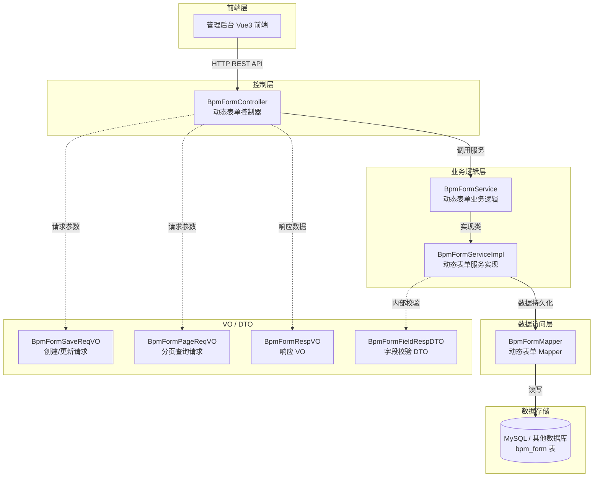
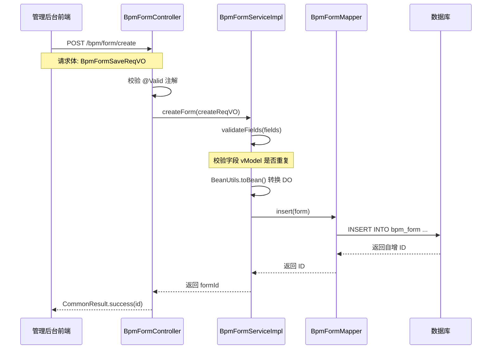
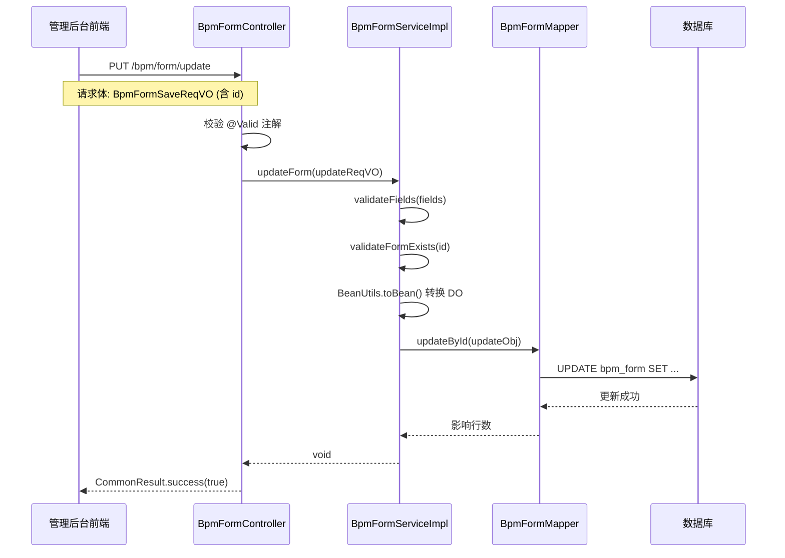
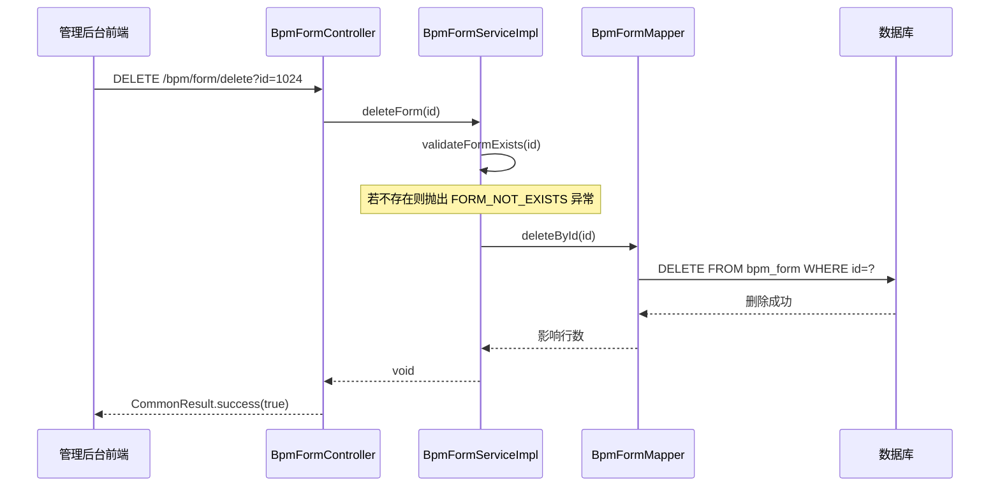
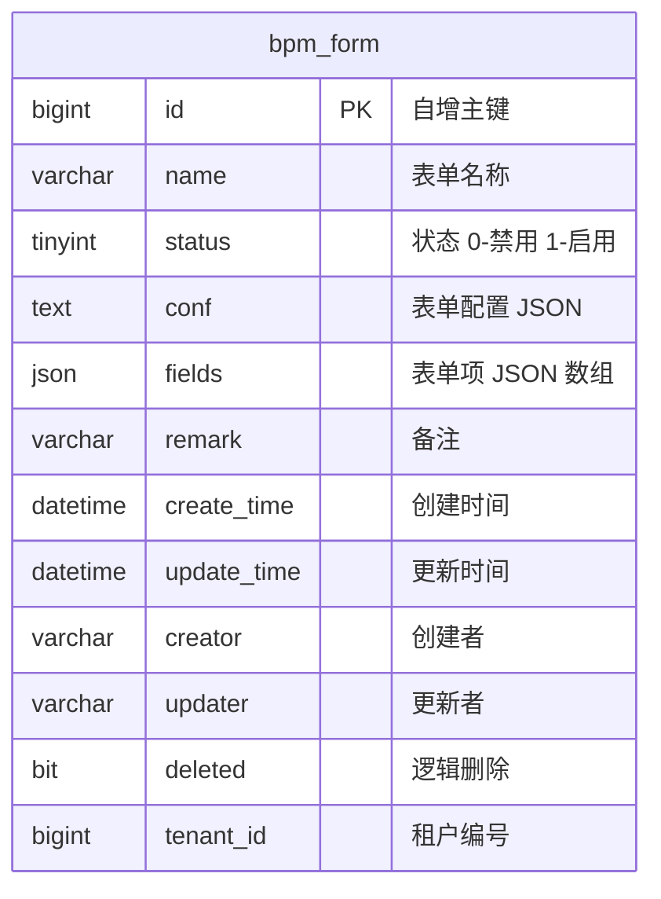
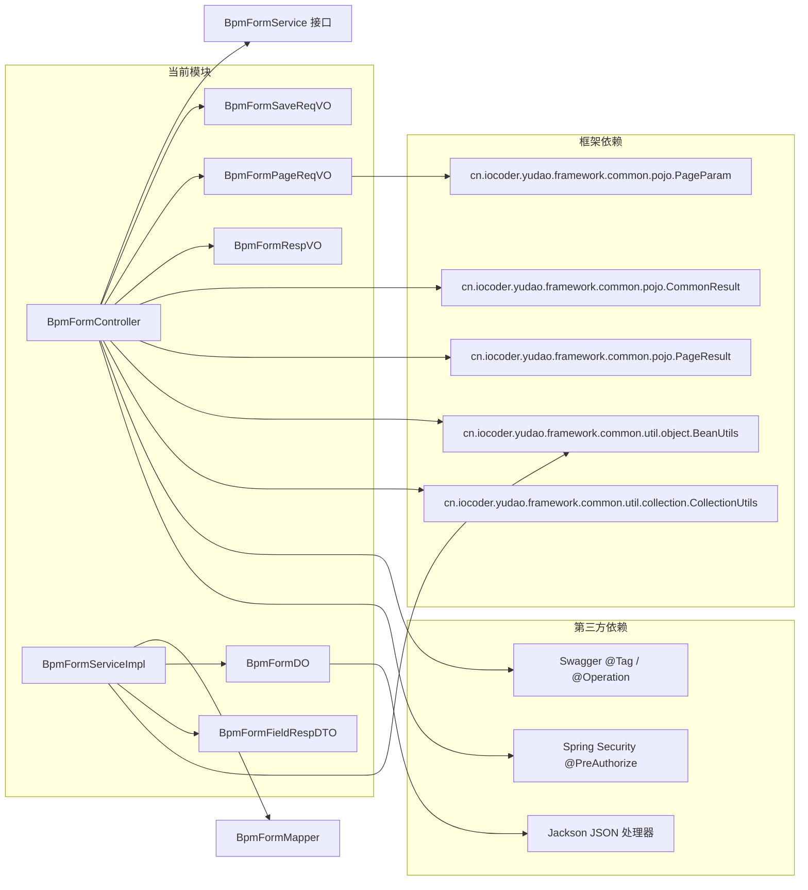

# 动态表单管理模块 (BpmFormController)

## 概述

动态表单管理模块是 BPM（Business Process Management，业务流程管理）系统中的核心基础模块之一，负责管理流程定义中使用的**动态表单**。该模块提供了表单的增删改查（CRUD）功能，支持通过 JSON 配置的方式定义表单的结构、字段和校验规则，从而实现无需编码即可自定义流程表单的能力。

动态表单模块使得业务人员可以通过可视化表单设计器（基于 [form-generator](https://github.com/JakHuang/form-generator)）创建表单，并将其关联到流程模型的节点上，实现流程任务中的数据采集与展示。

BpmFormController 以 RESTful API 的形式对外暴露服务接口，供管理后台前端（Vue3）调用。

---

## 架构图

---

## 核心流程

### 1. 表单创建流程

### 2. 表单更新流程

### 3. 表单删除流程

---

## 组件说明

### 1. BpmFormController

**文件位置**: `yudao-module-bpm/src/main/java/cn/iocoder/yudao/module/bpm/controller/admin/definition/BpmFormController.java`

动态表单的 REST 控制器，基础路径为 `/bpm/form`。所有接口均通过 Spring Security 进行权限控制，使用 `@PreAuthorize` 注解校验操作权限。

| 方法 | URL | 权限 | 说明 |
|------|-----|------|------|
| `createForm` | `POST /create` | `bpm:form:create` | 创建动态表单 |
| `updateForm` | `PUT /update` | `bpm:form:update` | 更新动态表单 |
| `deleteForm` | `DELETE /delete` | `bpm:form:delete` | 删除动态表单 |
| `getForm` | `GET /get` | `bpm:form:query` | 查询单个表单详情 |
| `getFormSimpleList` | `GET /list-all-simple` 或 `/simple-list` | 无（公开接口） | 获取精简列表（仅 id、name） |
| `getFormPage` | `GET /page` | `bpm:form:query` | 分页查询表单列表 |

### 2. BpmFormSaveReqVO

**文件位置**: `yudao-module-bpm/src/main/java/cn/iocoder/yudao/module/bpm/controller/admin/definition/vo/form/BpmFormSaveReqVO.java`

表单创建/更新的请求 VO，同时用于创建和更新操作（更新时通过 `id` 字段区分）。

| 字段 | 类型 | 必填 | 说明 |
|------|------|------|------|
| `id` | `Long` | 否 | 表单编号，更新时必填，创建时不填 |
| `name` | `String` | 是 | 表单名称 |
| `conf` | `String` | 是 | 表单的全局配置（JSON 字符串） |
| `fields` | `List<String>` | 是 | 表单项数组（JSON 字符串数组） |
| `status` | `Integer` | 是 | 表单状态，参见 `CommonStatusEnum` 枚举 |
| `remark` | `String` | 否 | 备注 |

### 3. BpmFormRespVO

**文件位置**: `yudao-module-bpm/src/main/java/cn/iocoder/yudao/module/bpm/controller/admin/definition/vo/form/BpmFormRespVO.java`

表单的响应 VO，包含所有字段及创建时间。

| 字段 | 类型 | 说明 |
|------|------|------|
| `id` | `Long` | 表单编号 |
| `name` | `String` | 表单名称 |
| `conf` | `String` | 表单配置（JSON） |
| `fields` | `List<String>` | 表单项数组（JSON 字符串数组） |
| `status` | `Integer` | 表单状态 |
| `remark` | `String` | 备注 |
| `createTime` | `LocalDateTime` | 创建时间 |

### 4. BpmFormPageReqVO

**文件位置**: `yudao-module-bpm/src/main/java/cn/iocoder/yudao/module/bpm/controller/admin/definition/vo/form/BpmFormPageReqVO.java`

分页查询请求 VO，继承自 `PageParam`。

| 字段 | 类型 | 必填 | 说明 |
|------|------|------|------|
| `name` | `String` | 否 | 表单名称（模糊查询） |
| `pageNo` | `Integer` | 否（继承） | 页码，默认 1 |
| `pageSize` | `Integer` | 否（继承） | 每页条数，默认 10 |
| `sort` | `String` | 否（继承） | 排序字段 |
| `order` | `String` | 否（继承） | 排序方向（asc/desc） |

### 5. BpmFormDO

**文件位置**: `yudao-module-bpm/src/main/java/cn/iocoder/yudao/module/bpm/dal/dataobject/definition/BpmFormDO.java`

表单数据库实体，映射表 `bpm_form`。

| 字段 | 类型 | 数据库列 | 说明 |
|------|------|---------|------|
| `id` | `Long` | `id` | 主键编号，自增 |
| `name` | `String` | `name` | 表单名称 |
| `status` | `Integer` | `status` | 表单状态 |
| `conf` | `String` | `conf` | 表单配置 JSON |
| `fields` | `List<String>` | `fields` | 表单项数组，使用 Jackson JSON 类型处理器 |
| `remark` | `String` | `remark` | 备注 |
| `createTime` | `LocalDateTime` | `create_time` | 创建时间（继承自 BaseDO） |
| `updateTime` | `LocalDateTime` | `update_time` | 更新时间（继承自 BaseDO） |
| `creator` | `String` | `creator` | 创建者（继承自 BaseDO） |
| `updater` | `String` | `updater` | 更新者（继承自 BaseDO） |
| `deleted` | `Boolean` | `deleted` | 逻辑删除（继承自 BaseDO） |
| `tenantId` | `Long` | `tenant_id` | 租户编号（继承自 BaseDO，多租户场景） |

### 6. BpmFormServiceImpl

**文件位置**: `yudao-module-bpm/src/main/java/cn/iocoder/yudao/module/bpm/service/definition/BpmFormServiceImpl.java`

业务逻辑实现类，主要功能：

- **createForm**: 创建表单，包含字段重复校验
- **updateForm**: 更新表单，校验表单存在性及字段重复
- **deleteForm**: 删除表单，校验表单存在性
- **getForm**: 根据 ID 查询单个表单
- **getFormList**: 查询所有表单列表（支持按 ID 集合查询）
- **getFormPage**: 分页查询表单

**字段校验逻辑** (`validateFields`):
服务层会对传入的 `fields` 数组进行校验，解析每个 JSON 字符串为 `BpmFormFieldRespDTO`，检查 `vModel` 属性是否重复，防止表单字段冲突。当前实现中该校验逻辑被临时跳过（TODO 注释），以兼容 Vue3 新版表单设计器。

### 7. BpmFormFieldRespDTO

**文件位置**: `yudao-module-bpm/src/main/java/cn/iocoder/yudao/module/bpm/service/definition/dto/BpmFormFieldRespDTO.java`

内部使用的字段校验 DTO，用于解析 `fields` 数组中的 JSON 字符串。

| 字段 | 类型 | 说明 |
|------|------|------|
| `label` | `String` | 表单字段的显示标题 |
| `vModel` | `String` | 表单字段的属性名（自定义），使用 `@JsonProperty("vModel")` 映射 JSON |

---

## 数据模型

### bpm_form 表结构

`fields` 字段使用 `Jackson3TypeHandler` 类型处理器，将数据库中的 JSON 数据自动转换为 `List<String>` 类型。

---

## 权限配置

| 权限标识 | 对应操作 | 说明 |
|---------|---------|------|
| `bpm:form:create` | 创建表单 | POST /bpm/form/create |
| `bpm:form:update` | 更新表单 | PUT /bpm/form/update |
| `bpm:form:delete` | 删除表单 | DELETE /bpm/form/delete |
| `bpm:form:query` | 查询表单 | GET /bpm/form/get 和 GET /bpm/form/page |

`getFormSimpleList` 接口（GET /bpm/form/list-all-simple）未配置权限注解，允许所有已认证用户访问，用于流程模型配置时的表单下拉选择。

---

## 依赖关系

---

## 相关文档

- [bpm_module_overview](bpm_module_overview.md) — BPM 模块总体概述
- [process_definition](process_definition.md) — 流程定义管理
- [model_controller](model_controller.md) — 流程模型管理
- [bpm_form_service](bpm_form_service.md) — 动态表单服务层详细说明

---

## 扩展与配置

- **表单设计器**: 表单的 `conf` 和 `fields` 字段存储的内容由 [form-generator](https://github.com/JakHuang/form-generator) 可视化设计器生成，可通过管理后台前端集成该设计器实现拖拽式表单设计。
- **字段类型处理器**: `fields` 字段使用 `Jackson3TypeHandler` 实现 JSON 到 `List<String>` 的自动转换，确保数据库存储的是标准 JSON 格式。
- **多租户支持**: `BpmFormDO` 继承 `BaseDO`，包含 `tenantId` 字段，天然支持多租户数据隔离。
