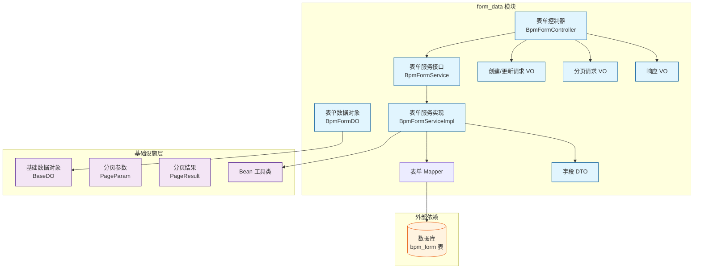
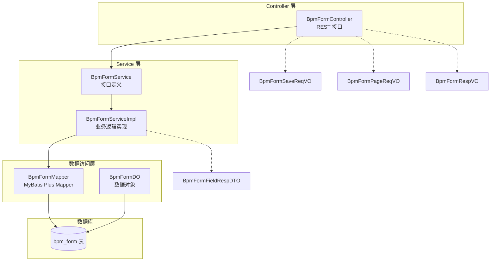
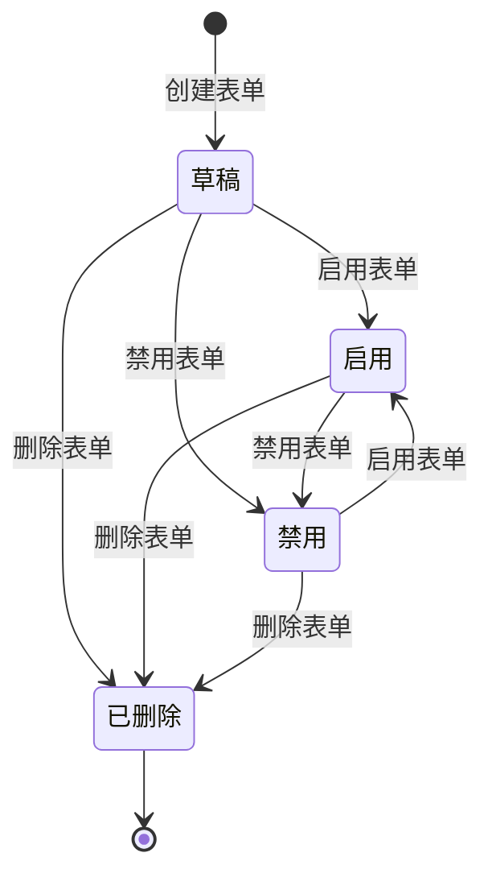
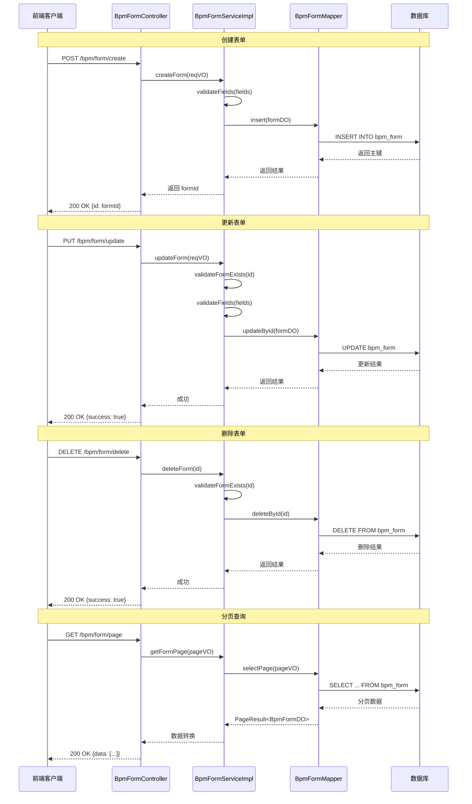
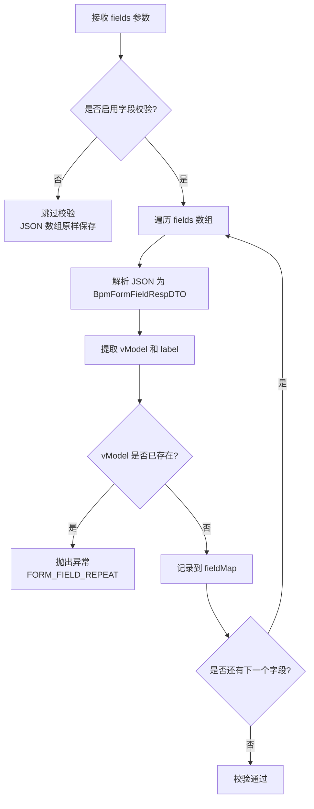
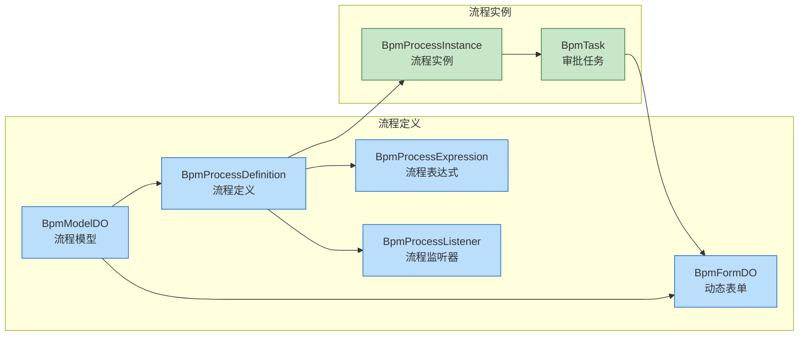

# 动态表单模块 (form_data)

## 概述

动态表单模块（`form_data`）是 BPM（Business Process Management，业务流程管理）工作流系统中的核心子模块，负责管理表单定义。它提供了一套完整的表单定义生命周期管理能力，包括表单的创建、更新、删除、查询和分页等功能。

该模块基于 [form-generator](https://github.com/JakHuang/form-generator) 生成的 JSON 配置，支持动态生成工作流申请表单，使流程定义能够灵活绑定不同的表单配置，从而实现无需编码即可调整表单字段的业务需求。

### 核心功能

- **表单 CRUD 操作**：支持表单的创建、更新、删除、查询
- **表单字段管理**：通过 JSON 数组存储表单项配置
- **表单配置管理**：通过 JSON 字符串存储表单整体布局配置
- **表单状态管理**：支持启用/禁用表单状态
- **字段唯一性校验**：确保表单字段的 `vModel` 不重复

---

## 架构设计

### 模块依赖关系



### 分层架构



---

## 核心组件说明

### 1. 数据对象 (BpmFormDO)

`BpmFormDO` 是表单定义的数据对象，映射数据库中的 `bpm_form` 表。

**表结构说明：**

| 字段名 | 类型 | 说明 |
|--------|------|------|
| `id` | Long | 主键编号 |
| `name` | String | 表单名称 |
| `status` | Integer | 状态（启用/禁用） |
| `conf` | String | 表单布局配置（JSON 字符串） |
| `fields` | List\<String\> | 表单项数组（JSON 字符串数组） |
| `remark` | String | 备注说明 |
| `createTime` | LocalDateTime | 创建时间（继承自 `BaseDO`） |
| `updateTime` | LocalDateTime | 更新时间（继承自 `BaseDO`） |
| `creator` | String | 创建者（继承自 `BaseDO`） |
| `updater` | String | 更新者（继承自 `BaseDO`） |
| `deleted` | Boolean | 是否删除（继承自 `BaseDO`） |
| `tenantId` | Long | 租户编号（继承自 `BaseDO`） |

> 参考：[基础数据对象(BaseDO)]([yudao-common].md)

### 2. 服务接口 (BpmFormService)

服务接口定义了表单管理的核心操作，包括：

| 方法 | 说明 |
|------|------|
| `createForm()` | 创建动态表单 |
| `updateForm()` | 更新动态表单 |
| `deleteForm()` | 删除动态表单 |
| `getForm()` | 根据 ID 获取表单 |
| `getFormList()` | 获取表单列表 |
| `getFormPage()` | 分页查询表单 |
| `getFormMap()` | 批量获取表单 Map |

### 3. 服务实现 (BpmFormServiceImpl)

服务实现层包含以下核心业务逻辑：

- **字段唯一性校验**：在创建和更新时，校验 `fields` 数组中各字段的 `vModel` 是否存在重复，避免字段冲突
- **存在性校验**：在更新和删除操作前，验证表单 ID 是否存在
- **数据转换**：使用 `BeanUtils` 在 VO 和 DO 之间进行转换

### 4. 控制器 (BpmFormController)

控制器提供了 RESTful API 接口：

| 端点 | 方法 | 权限 | 说明 |
|------|------|------|------|
| `/bpm/form/create` | POST | `bpm:form:create` | 创建表单 |
| `/bpm/form/update` | PUT | `bpm:form:update` | 更新表单 |
| `/bpm/form/delete` | DELETE | `bpm:form:delete` | 删除表单 |
| `/bpm/form/get` | GET | `bpm:form:query` | 获取表单详情 |
| `/bpm/form/list-all-simple` | GET | 无 | 获取精简列表（用于下拉框） |
| `/bpm/form/simple-list` | GET | 无 | 同 `list-all-simple` 别名 |
| `/bpm/form/page` | GET | `bpm:form:query` | 分页查询表单 |

### 5. 请求响应 VO

- **BpmFormSaveReqVO**：创建/更新表单的请求参数，包含表单编号、名称、配置、字段、状态和备注
- **BpmFormPageReqVO**：分页查询请求参数，继承 `PageParam`，可按表单名称筛选
- **BpmFormRespVO**：表单响应参数，包含所有表单字段及创建时间

### 6. 字段 DTO (BpmFormFieldRespDTO)

用于解析表单项中的字段信息：

| 字段 | 说明 |
|------|------|
| `label` | 表单字段的显示标题 |
| `vModel` | 表单字段的属性名，可自定义 |

---

## 业务流程

### 表单生命周期



### 表单 CRUD 流程



### 字段校验流程



---

## 数据库设计

### bpm_form 表

```sql
CREATE TABLE `bpm_form` (
    `id` bigint(20) NOT NULL AUTO_INCREMENT COMMENT '编号',
    `name` varchar(100) NOT NULL COMMENT '表单名称',
    `status` tinyint(4) NOT NULL COMMENT '表单状态（0:禁用 1:启用）',
    `conf` text COMMENT '表单的配置（JSON 字符串）',
    `fields` text COMMENT '表单项的数组（JSON 字符串数组）',
    `remark` varchar(500) DEFAULT NULL COMMENT '备注',
    `create_time` datetime NOT NULL DEFAULT CURRENT_TIMESTAMP COMMENT '创建时间',
    `update_time` datetime NOT NULL DEFAULT CURRENT_TIMESTAMP ON UPDATE CURRENT_TIMESTAMP COMMENT '更新时间',
    `creator` varchar(64) DEFAULT NULL COMMENT '创建者',
    `updater` varchar(64) DEFAULT NULL COMMENT '更新者',
    `deleted` tinyint(1) NOT NULL DEFAULT '0' COMMENT '是否删除（0:正常 1:已删除）',
    `tenant_id` bigint(20) NOT NULL DEFAULT '0' COMMENT '租户编号',
    PRIMARY KEY (`id`) USING BTREE
) ENGINE=InnoDB DEFAULT CHARSET=utf8mb4 COMMENT='BPM 工作流的表单定义';
```

---

## 与其他模块的集成

### 在 BPM 流程中的位置



- **流程模型 (BpmModelDO)**：流程模型可以绑定表单定义，在发起流程时展示对应的申请表单
- **流程任务 (BpmTask)**：审批任务可以引用表单数据，供审批人查看表单内容
- 更多信息请参考：[表单服务模块]([form_service].md)、[流程定义模块]([definition].md)

---

## 配置与扩展

### 权限配置

表单模块的权限点如下：

| 权限标识 | 说明 |
|----------|------|
| `bpm:form:create` | 创建表单 |
| `bpm:form:update` | 更新表单 |
| `bpm:form:delete` | 删除表单 |
| `bpm:form:query` | 查询表单 |

> 参考：[权限配置(SecurityConfiguration)]([security_config].md)

### 数据权限

表单数据支持多租户隔离，通过 `tenant_id` 字段实现租户级别的数据隔离。

> 参考：[多租户配置(YudaoTenantAutoConfiguration)]([tenant_config].md)
