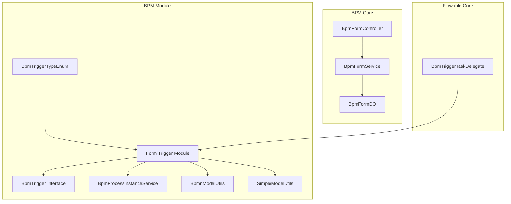
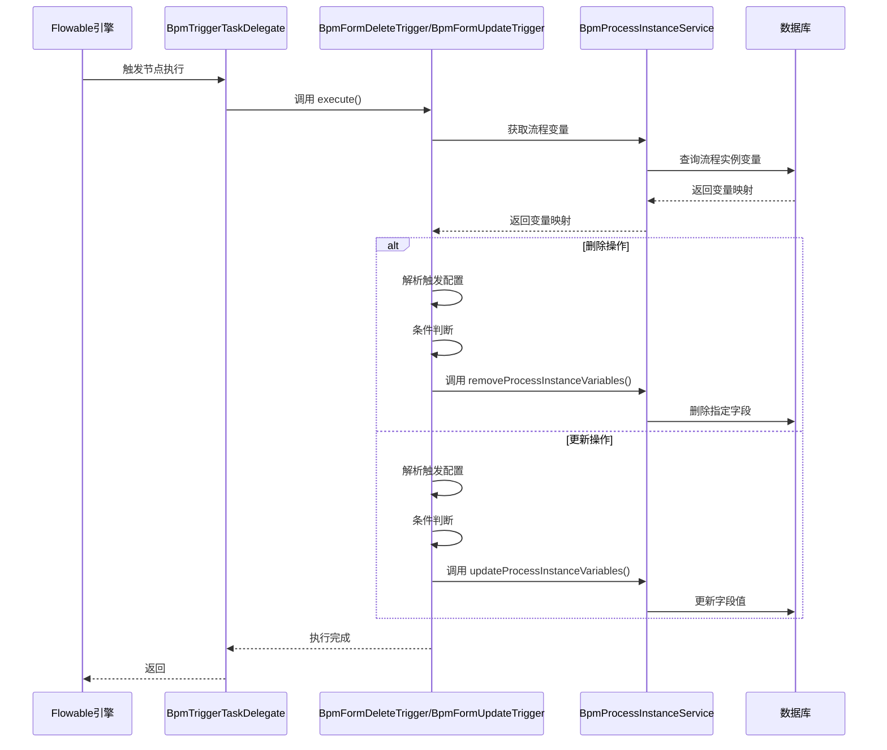
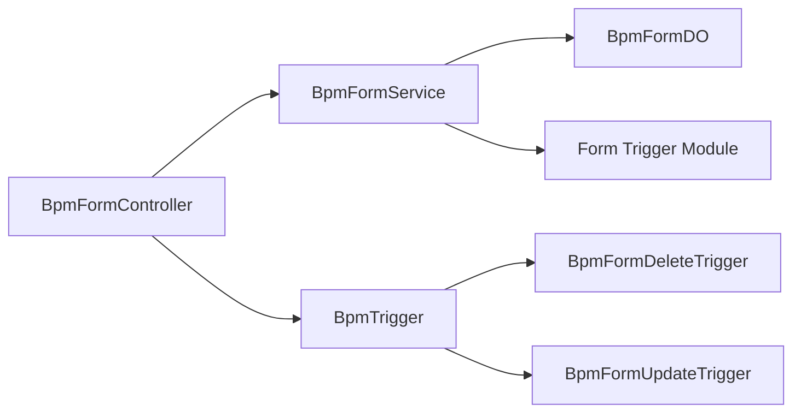
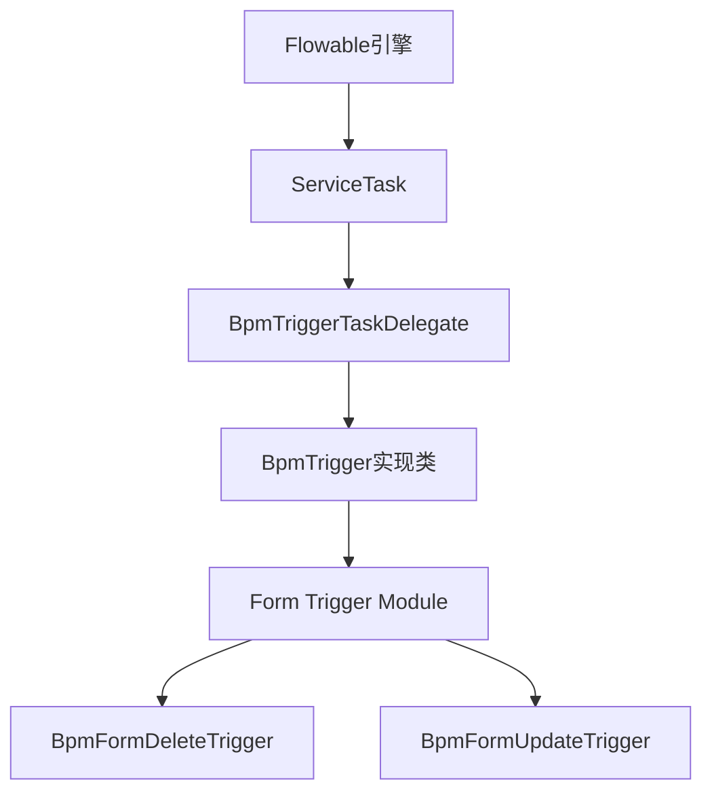
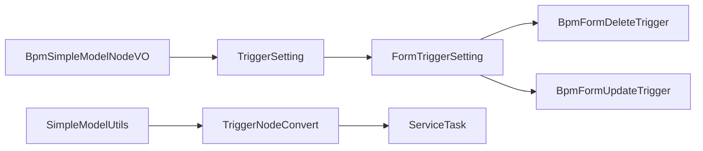

# Form Trigger Module Documentation

## 概述

Form Trigger 模块是 BPM（业务流程管理）模块中的核心组件，负责在流程执行过程中对流程表单数据进行动态更新和删除操作。该模块通过触发器机制，允许开发者在流程节点执行时根据条件修改或清除流程变量中的表单数据，从而实现更灵活的业务逻辑控制。

## 核心功能

- **表单数据更新**：在流程执行过程中动态更新流程表单字段值
- **表单数据删除**：根据条件删除流程表单中的特定字段
- **条件判断支持**：支持基于流程变量的条件表达式，决定是否执行更新/删除操作
- **批量操作支持**：支持同时配置多个触发设置，批量处理表单字段

## 架构设计

### 模块关系图



### 组件关系说明

| 组件 | 职责 | 关联模块 |
|------|------|----------|
| `BpmFormDeleteTrigger` | 删除流程表单数据触发器 | BPM、Flowable |
| `BpmFormUpdateTrigger` | 更新流程表单数据触发器 | BPM、Flowable |
| `BpmTrigger` | 触发器接口定义 | BPM |
| `BpmTriggerTypeEnum` | 触发器类型枚举 | BPM |
| `FormTriggerSetting` | 触发器设置VO | BPM |
| `BpmProcessInstanceService` | 流程实例服务 | BPM |
| `BpmnModelUtils` | BPMN模型工具类 | Flowable |
| `SimpleModelUtils` | 简单模型工具类 | Flowable |

## 核心组件详解

### 1. BpmTrigger 接口

```java
public interface BpmTrigger {
    BpmTriggerTypeEnum getType();
    void execute(String processInstanceId, String param);
}
```

所有触发器必须实现该接口，定义触发器类型和执行逻辑。

### 2. BpmTriggerTypeEnum 枚举

定义了所有支持的触发器类型：

```java
public enum BpmTriggerTypeEnum implements ArrayValuable<Integer> {
    HTTP_REQUEST(1, "发起 HTTP 请求"),
    HTTP_CALLBACK(2, "接收 HTTP 回调"),
    FORM_UPDATE(10, "更新流程表单数据"),
    FORM_DELETE(11, "删除流程表单数据");
    
    private final Integer type;
    private final String desc;
}
```

### 3. FormTriggerSetting 触发器设置

```java
@Data
@Schema(description = "流程表单触发器设置")
public static class FormTriggerSetting {
    
    @Schema(description = "条件类型")
    private Integer conditionType;
    
    @Schema(description = "条件表达式")
    private String conditionExpression;
    
    @Schema(description = "条件组")
    private ConditionGroups conditionGroups;
    
    @Schema(description = "修改的表单字段")
    private Map<String, Object> updateFormFields;
    
    @Schema(description = "删除表单字段")
    private Set<String> deleteFields;
}
```

- **conditionType**：条件类型（表达式或规则）
- **conditionExpression**：条件表达式（如 `${day>3}`）
- **conditionGroups**：条件组，支持复杂规则组合
- **updateFormFields**：要更新的表单字段映射（key-value）
- **deleteFields**：要删除的字段名集合

### 4. BpmFormDeleteTrigger

删除流程表单数据触发器，执行流程：

1. **解析配置**：从 `param` 参数解析 `FormTriggerSetting` 列表
2. **获取流程变量**：从 `BpmProcessInstanceService` 获取当前流程实例的变量
3. **收集待删除字段**：遍历设置，根据条件判断是否需要删除字段
4. **执行删除**：调用 `removeProcessInstanceVariables` 删除指定字段

```java
@Component
@Slf4j
public class BpmFormDeleteTrigger implements BpmTrigger {
    
    @Resource
    private BpmProcessInstanceService processInstanceService;

    @Override
    public BpmTriggerTypeEnum getType() {
        return BpmTriggerTypeEnum.FORM_DELETE;
    }

    @Override
    public void execute(String processInstanceId, String param) {
        // 1. 解析配置
        List<FormTriggerSetting> settings = JsonUtils.parseObject(param, new TypeReference<>());
        
        // 2. 获取流程变量
        Map<String, Object> processVariables = processInstanceService.getProcessInstance(processInstanceId).getProcessVariables();
        
        // 3. 收集待删除字段
        Set<String> deleteFields = new HashSet<>();
        settings.forEach(setting -> {
            if (CollUtil.isEmpty(setting.getDeleteFields())) return;
            
            // 条件判断
            boolean isFieldDeletedNeeded = true;
            if (setting.getConditionType() != null) {
                String conditionExpression = SimpleModelUtils.buildConditionExpression(
                    setting.getConditionType(), setting.getConditionExpression(), setting.getConditionGroups());
                isFieldDeletedNeeded = BpmnModelUtils.evalConditionExpress(processVariables, conditionExpression);
            }
            
            if (isFieldDeletedNeeded) {
                deleteFields.addAll(setting.getDeleteFields());
            }
        });
        
        // 4. 执行删除
        if (CollUtil.isNotEmpty(deleteFields)) {
            processInstanceService.removeProcessInstanceVariables(processInstanceId, deleteFields);
        }
    }
}
```

### 5. BpmFormUpdateTrigger

更新流程表单数据触发器，执行流程：

1. **解析配置**：从 `param` 参数解析 `FormTriggerSetting` 列表
2. **获取流程变量**：获取当前流程实例的变量
3. **更新字段**：遍历设置，根据条件判断后调用 `updateProcessInstanceVariables` 更新表单字段

```java
@Component
@Slf4j
public class BpmFormUpdateTrigger implements BpmTrigger {
    
    @Resource
    private BpmProcessInstanceService processInstanceService;

    @Override
    public BpmTriggerTypeEnum getType() {
        return BpmTriggerTypeEnum.FORM_UPDATE;
    }

    @Override
    public void execute(String processInstanceId, String param) {
        // 1. 解析配置
        List<FormTriggerSetting> settings = JsonUtils.parseObject(param, new TypeReference<>());
        
        // 2. 获取流程变量
        Map<String, Object> processVariables = processInstanceService.getProcessInstance(processInstanceId).getProcessVariables();
        
        // 3. 更新字段
        for (FormTriggerSetting setting : settings) {
            if (CollUtil.isEmpty(setting.getUpdateFormFields())) continue;
            
            // 条件判断
            boolean isFormUpdateNeeded = true;
            if (setting.getConditionType() != null) {
                String conditionExpression = SimpleModelUtils.buildConditionExpression(
                    setting.getConditionType(), setting.getConditionExpression(), setting.getConditionGroups());
                isFormUpdateNeeded = BpmnModelUtils.evalConditionExpress(processVariables, conditionExpression);
            }
            
            if (isFormUpdateNeeded) {
                processInstanceService.updateProcessInstanceVariables(processInstanceId, setting.getUpdateFormFields());
            }
        }
    }
}
```

## 数据流分析

### 触发器执行流程图



### 条件表达式解析流程

```mermaid
graph TD
    A[触发器配置] --> B{是否有条件类型？}
    B -- 无条件 --> C[直接执行操作]
    B -- 有条件 --> D[构建条件表达式]
    D --> E[SimpleModelUtils.buildConditionExpression()]
    E --> F{条件类型？}
    F -- EXPRESSION --> G[直接使用表达式]
    F -- RULE --> H[解析条件组]
    H --> I[生成EL表达式]
    I --> J[BpmnModelUtils.evalConditionExpress()]
    J --> K[评估流程变量]
    K --> L{条件满足？}
    L -- 是 --> M[执行操作]
    L -- 否 --> N[跳过操作]
```

## 使用场景

### 场景1：审批通过后清理临时字段

在审批节点完成后，删除流程中临时使用的表单字段，保持流程变量整洁：

```json
[
  {
    "conditionType": 1,
    "conditionExpression": "${approvalStatus == 'APPROVED'}",
    "deleteFields": ["tempApprover", "tempApproveTime"]
  }
]
```

### 场景2：根据条件更新表单状态

根据流程变量动态更新表单字段：

```json
[
  {
    "conditionType": 2,
    "conditionGroups": {
      "and": true,
      "conditions": [
        {
          "and": false,
          "rules": [
            {"leftSide": "${day}", "opCode": ">", "rightSide": 3}
          ]
        }
      ]
    },
    "updateFormFields": {
      "status": "overdue",
      "reminder": true
    }
  }
]
```

### 场景3：多条件组合触发

多个触发设置组合，实现复杂业务逻辑：

```json
[
  {
    "deleteFields": ["tempData"],
    "updateFormFields": {"processed": true}
  },
  {
    "conditionType": 1,
    "conditionExpression": "${amount > 10000}",
    "updateFormFields": {"needReview": true}
  }
]
```

## 与其他模块的集成

### 与 BPM 表单模块集成



### 与 Flowable 引擎集成



### 与简单模型配置集成



## API 说明

### 触发器注册

触发器通过 Spring `@Component` 注解自动注册，实现 `BpmTrigger` 接口即可。

### 触发器配置参数

触发器通过 `param` 参数传递配置，格式为 JSON 数组：

```json
[
  {
    "conditionType": 1,
    "conditionExpression": "${day>3}",
    "conditionGroups": {},
    "updateFormFields": {"status": "completed"},
    "deleteFields": ["tempField"]
  }
]
```

### 条件类型说明

| 类型 | 值 | 说明 |
|------|-----|------|
| EXPRESSION | 1 | 直接使用条件表达式 |
| RULE | 2 | 使用条件组规则 |

## 注意事项

1. **条件表达式语法**：使用 SpEL 表达式语法，流程变量可通过 `${variableName}` 访问
2. **空值处理**：配置为空时会记录错误日志并返回
3. **批量操作**：支持多个触发设置，按顺序执行
4. **事务性**：触发器操作在流程事务范围内，与流程变量操作保持一致性
5. **性能考虑**：大量字段操作可能影响流程性能，建议按需删除/更新

## 参考文档

- [BPM Module](bpm.md) - BPM 模块整体文档
- [Flowable Integration](flowable.md) - Flowable 引擎集成文档
- [BpmTrigger Interface](bpm_trigger.md) - 触发器接口定义
- [Simple Model](simple_model.md) - 简单模型配置文档
