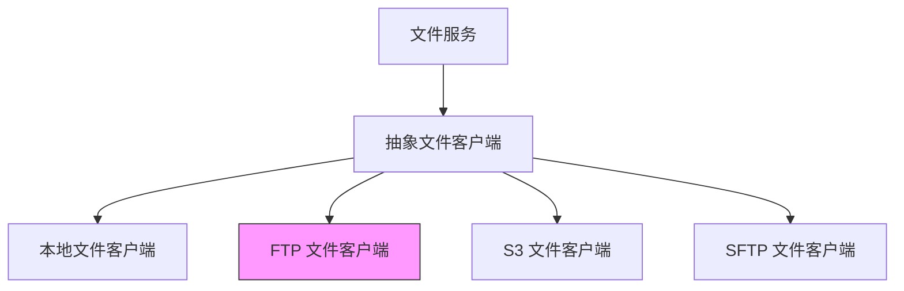
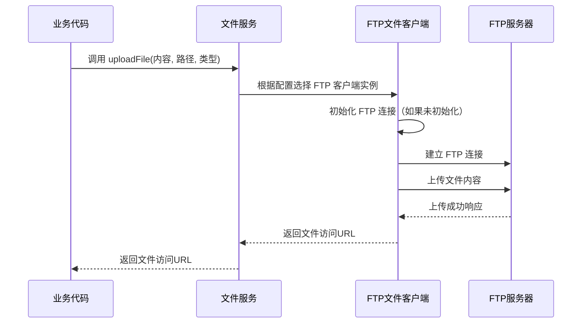

# FTP 文件客户端模块

## 概述

FTP 文件客户端模块提供了基于 FTP 协议的文件存储实现，是 yudao-module-infra 中文件客户端体系的一部分。该模块通过实现 `AbstractFileClient` 抽象类，提供了文件上传、下载和删除等操作的具体实现。

## 架构概述

FTP 文件客户端模块主要由两个核心组件组成：
- `FtpFileClient`：实现了 FTP 文件操作的具体逻辑
- `FtpFileClientConfig`：定义了 FTP 客户端的配置参数

该模块遵循策略模式，通过不同的文件客户端实现（如本地、FTP、S3、SFTP等）来支持多种文件存储方式。

以下是 FTP 文件客户端在文件存储体系中的位置示意图：

## 核心组件

### FtpFileClient

`FtpFileClient` 类继承自 `AbstractFileClient<FtpFileClientConfig>`，实现了文件客户端的核心操作方法：
- `upload`：将字节数组内容上传到指定的 FTP 路径
- `delete`：删除指定路径的文件
- `getContent`：获取指定路径文件的内容

该类使用 Hutool 的 FTP 工具类进行底层操作，并在初始化时根据配置创建 FTP 连接对象。为了处理可能的连接超时，在每次操作前会检查并重新连接（如果必要）。

### FtpFileClientConfig

`FtpFileClientConfig` 类定义了 FTP 客户端所需的配置参数，包括：
- `basePath`：基础路径，用于拼接完整的文件路径
- `domain`：自定义域名，用于生成文件的访问URL
- `host`：FTP 服务器主机地址
- `port`：FTP 服务器端口
- `username`：登录用户名
- `password`：登录密码
- `mode`：连接模式（如 ACTIVE 或 PASSIVE），对应 `cn.hutool.extra.ftp.FtpMode` 的字符串表示

所有配置项均通过 JSR-303 注解进行非空和格式校验。

## 与其他模块的关系

FTP 文件客户端模块是文件存储体系中的一个具体实现，它依赖于：
- [文件客户端抽象类](file.md)：定义了文件客户端的统一接口
- [文件服务](file_service.md)：负责根据配置选择和管理不同的文件客户端实现

有关文件存储体系的总体设计，请参考 [文件存储模块文档](file.md)。

## 数据流示例

以下是上传文件的典型数据流：

## 配置说明

在使用 FTP 文件客户端时，需要在系统配置中提供以下信息：
- FTP 服务器的主机地址和端口
- 登录用户名和密码
- 文件存储的基础路径
- 用于生成访问URL的自定义域名
- 连接模式（ACTIVE 或 PASSIVE）

这些配置通常通过 `FtpFileClientConfig` 类的实例进行注入。

## 注意事项

1. 确保 FTP 服务器允许匿名访问或提供的用户名具有足够的权限进行文件上传、下载和删除操作。
2. 基础路径 (`basePath`) 应该是 FTP 服务器上已存在且可写的目录。
3. 为了提高性能，FTP 连接会被复用，并在检测到超时时自动重新连接。
4. 当前实现不支持 FTP over TLS/SSL（FTPS），如需安全传输请考虑使用 SFTP 文件客户端。