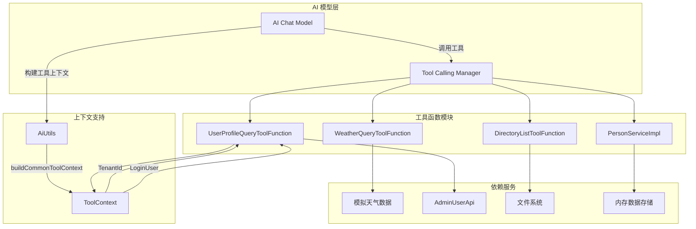

# 工具函数模块 (Function Module)

## 1. 概述

**工具函数模块**是 AI 模块（yudao-module-ai）的核心组成部分，提供了一系列可供 AI 模型调用的外部工具函数。这些工具函数使 AI 模型能够执行特定任务、查询外部数据或访问系统功能，从而扩展 AI 模型的能力边界。

模块遵循 Spring AI 的 Tool 规范，通过 `@Component` 注解注册为 Spring Bean，并提供标准化的请求/响应数据结构。工具函数支持多租户上下文和登录用户上下文感知，确保在 SaaS 架构下的数据隔离和安全性。

## 2. 架构概览



### 核心组件关系

- **AI 模型**通过 Spring AI 的 `ToolCallingManager` 调用注册的工具函数
- **工具函数**实现 `Function` 或 `BiFunction` 接口，接收请求参数并返回响应结果
- **ToolContext** 提供租户 ID 和登录用户信息，支持多租户和权限控制
- **AiUtils** 工具类负责构建通用的 ToolContext，包含当前租户和登录用户信息

## 3. 核心功能

### 3.1 天气查询工具 (WeatherQueryToolFunction)

**功能描述**：查询指定城市的天气信息。这是一个示例工具，实际应用中应替换为真实天气 API 调用。

**请求参数**：
| 字段 | 类型 | 必填 | 描述 |
|------|------|------|------|
| city | String | 是 | 城市名称，例如：北京、上海、广州 |

**响应结构**：
```json
{
  "city": "北京",
  "weatherInfo": {
    "temperature": 25,
    "condition": "晴朗",
    "humidity": 60,
    "windSpeed": 15,
    "queryTime": "2024-01-15 14:30:00"
  }
}
```

**实现特点**：
- 使用 `RandomUtil` 生成模拟天气数据
- 支持 8 种天气状况：晴朗、多云、阴天、小雨、大雨、雷雨、小雪、大雪
- 温度范围：-5°C 至 30°C
- 湿度范围：1% 至 100%
- 风速范围：1 至 30 km/h

### 3.2 用户信息查询工具 (UserProfileQueryToolFunction)

**功能描述**：查询用户详细信息，支持查询指定用户或当前登录用户。这是展示 ToolContext 上下文使用的典型示例。

**请求参数**：
| 字段 | 类型 | 必填 | 描述 |
|------|------|------|------|
| id | Long | 否 | 用户编号。如果为空，则查询当前登录用户 |

**响应结构**：
```json
{
  "id": 123,
  "nickname": "张三",
  "mobile": "13800138000",
  "avatar": "https://example.com/avatar.jpg"
}
```

**实现特点**：
- 通过 `ToolContext` 获取租户 ID 和登录用户信息
- 当 `id` 为空时，自动使用当前登录用户的 ID
- 使用 `TenantUtils.execute()` 执行租户上下文切换
- 调用 `AdminUserApi` 获取用户信息，并通过 `BeanUtils` 转换响应对象

### 3.3 目录列表工具 (DirectoryListToolFunction)

**功能描述**：列出指定目录下的文件和子目录信息。

**请求参数**：
| 字段 | 类型 | 必填 | 描述 |
|------|------|------|------|
| path | String | 是 | 目录路径，例如：/Users/yunai |

**响应结构**：
```json
{
  "files": [
    {
      "directory": true,
      "name": "documents",
      "size": null,
      "lastModified": "2024-01-15 10:20:00"
    },
    {
      "directory": false,
      "name": "report.pdf",
      "size": "2.5MB",
      "lastModified": "2024-01-14 16:45:00"
    }
  ]
}
```

**实现特点**：
- 使用 Hutool 的 `FileUtil` 进行文件操作
- 自动验证目录是否存在且为目录类型
- 返回文件列表，包含是否为目录、名称、大小和最后修改时间
- 空目录返回空列表

### 3.4 PersonService 工具方法

**功能描述**：PersonServiceImpl 实现了 PersonService 接口，提供了一系列人员管理工具方法，通过 `@Tool` 注解注册为 AI 可调用工具。

**可用工具方法**：
| 工具名 | 描述 |
|--------|------|
| ps_create_person | 创建新人员记录 |
| ps_get_person_by_id | 按 ID 获取人员记录 |
| ps_get_all_persons | 获取所有人员记录 |
| ps_update_person | 更新人员记录 |
| ps_delete_person | 删除人员记录 |
| ps_search_by_job_title | 按职位搜索人员 |
| ps_filter_by_sex | 按性别筛选人员 |
| ps_filter_by_age | 按年龄筛选人员 |

**数据源**：基于内存的 ConcurrentHashMap 存储，初始数据从内嵌 CSV 加载（100 条示例数据）。

## 4. 工具注册与配置

### 4.1 自动配置

在 `AiAutoConfiguration` 中，通过 `toolCallbacks()` 方法注册工具回调：

```java
@Bean
public List<ToolCallback> toolCallbacks(PersonService personService) {
    return List.of(ToolCallbacks.from(personService));
}
```

该配置将 `PersonService` 中的 `@Tool` 注解方法自动注册为 AI 可调用的工具。

### 4.2 工具上下文构建

`AiUtils.buildCommonToolContext()` 方法构建通用的 ToolContext：

```java
public static Map<String, Object> buildCommonToolContext() {
    Map<String, Object> context = new HashMap<>();
    context.put(TOOL_CONTEXT_LOGIN_USER, SecurityFrameworkUtils.getLoginUser());
    context.put(TOOL_CONTEXT_TENANT_ID, TenantContextHolder.getTenantId());
    return context;
}
```

该上下文在构建 `ChatOptions` 时传递给 AI 模型，确保工具函数能够访问租户和登录用户信息。

## 5. 与其他模块的集成

### 5.1 系统模块 (system)

- **AdminUserApi**：由 `UserProfileQueryToolFunction` 调用，获取用户详细信息
- **SecurityFrameworkUtils**：获取当前登录用户信息
- **TenantContextHolder**：获取当前租户 ID

### 5.2 框架模块 (framework)

- **SecurityFrameworkUtils**：安全框架工具类，获取登录用户
- **TenantUtils**：租户工具类，执行租户上下文切换
- **BeanUtils**：对象属性拷贝工具

### 5.3 AI 模块内部

- **AiUtils**：AI 工具类，包含常量定义和工具方法
- **ToolContext**：Spring AI 提供的工具上下文，传递额外信息

## 6. 使用示例

### 6.1 天气查询工具调用

```json
{
  "name": "weather_query",
  "arguments": {
    "city": "北京"
  }
}
```

### 6.2 用户信息查询工具调用

```json
// 查询指定用户
{
  "name": "user_profile_query",
  "arguments": {
    "id": 123
  }
}

// 查询当前登录用户（id 为空）
{
  "name": "user_profile_query",
  "arguments": {
    "id": null
  }
}
```

### 6.3 目录列表工具调用

```json
{
  "name": "directory_list",
  "arguments": {
    "path": "/Users/yunai/documents"
  }
}
```

## 7. 扩展指南

### 7.1 创建新的工具函数

要创建新的 AI 工具函数，请遵循以下步骤：

1. 创建工具请求和响应类，使用 `@Data`、`@NoArgsConstructor`、`@AllArgsConstructor` 注解
2. 使用 `@JsonProperty` 和 `@JsonPropertyDescription` 标注 JSON 属性，便于 AI 模型理解
3. 实现 `Function<Request, Response>` 或 `BiFunction<Request, ToolContext, Response>` 接口
4. 使用 `@Component("tool_name")` 注册为 Spring Bean
5. （可选）如果需要访问租户或登录用户信息，注入 `ToolContext` 参数

### 7.2 集成 PersonService 风格的方法

对于 Service 类中的方法，可以通过 `@Tool` 注解直接注册为 AI 工具：

```java
@Tool(
    name = "ps_create_person",
    description = "Create a new person record in the in-memory store."
)
public Person createPerson(Person personData) {
    // 实现逻辑
}
```

在 `AiAutoConfiguration.toolCallbacks()` 中注册该 Service，方法将自动可用。

## 8. 安全注意事项

- **租户隔离**：`UserProfileQueryToolFunction` 通过 `TenantUtils.execute()` 确保数据在租户上下文中执行
- **权限控制**：工具函数应遵循最小权限原则，仅访问必要的资源
- **输入验证**：所有外部输入都应进行验证，防止路径遍历等攻击（如目录列表工具）
- **敏感信息**：响应中不应包含敏感信息，如密码、密钥等

## 9. 参考文档

- [AI 模块文档](ai.md) - AI 模块的整体架构和功能
- [系统模块文档](system.md) - 用户、权限、租户等系统功能
- [Spring AI 官方文档](https://docs.spring.io/spring-ai/) - Spring AI 工具调用规范
