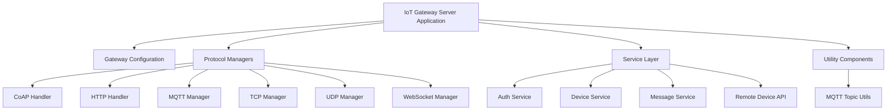
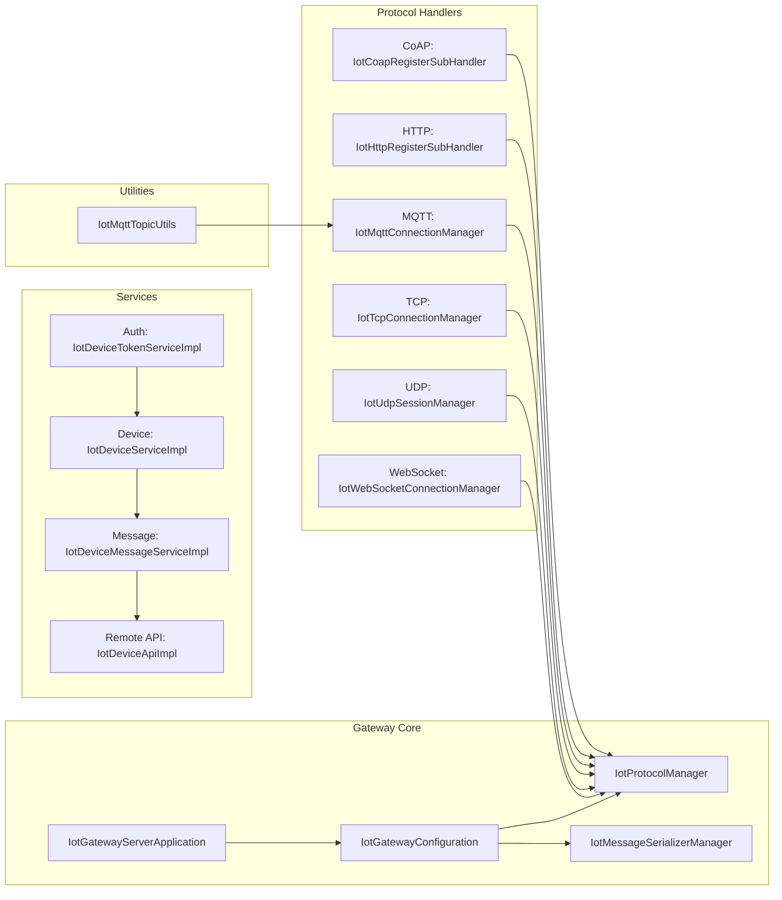
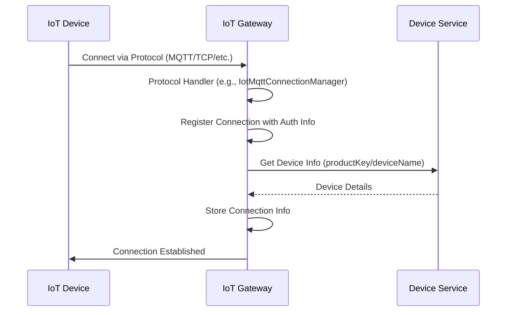
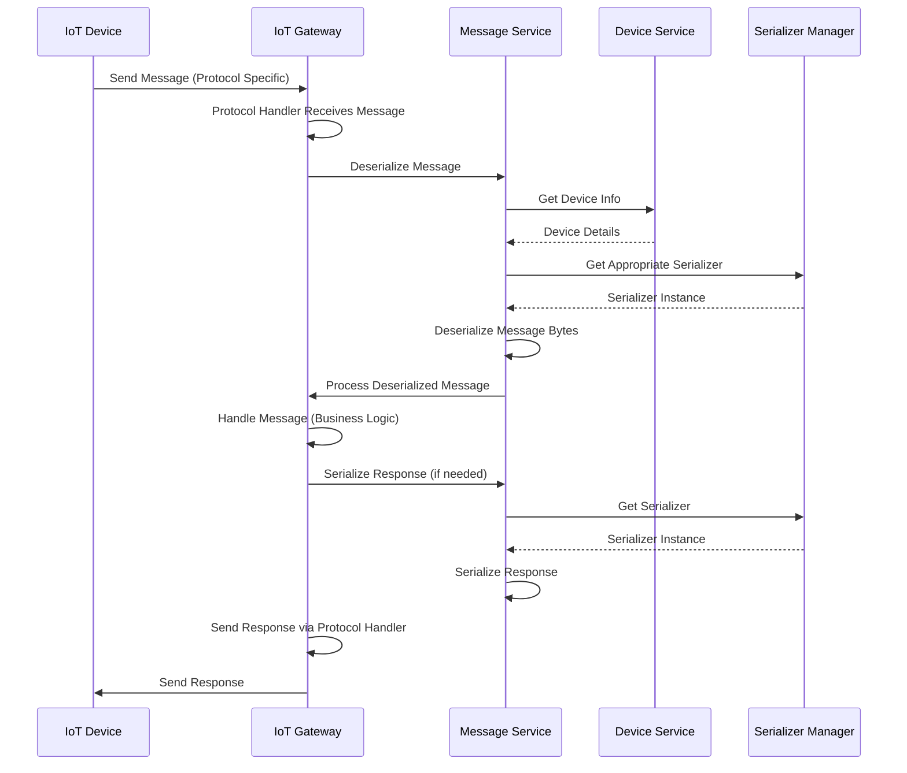

# IoT Gateway Module Documentation

## Overview

The IoT Gateway module is a core component of the Yudao IoT platform that serves as a multi-protocol gateway for connecting and managing IoT devices. It provides a unified interface for devices to connect using various protocols (CoAP, HTTP, MQTT, TCP, UDP, WebSocket) and handles device authentication, message serialization/deserialization, and connection management.

## Core Functionality

1. **Multi-Protocol Support**: Handles device connections across multiple IoT protocols
2. **Device Authentication**: Manages device tokens and authentication
3. **Message Processing**: Serializes and deserializes device messages using various formats
4. **Connection Management**: Maintains device connection states and sessions
5. **Remote API Access**: Provides remote access to device services via RPC
6. **Protocol-Specific Handling**: Implements protocol-specific logic for each supported protocol

## Architecture

### Module Structure



### Component Relationships



## Detailed Component Descriptions

### 1. Application Entry Point

**IotGatewayServerApplication**
- Main Spring Boot application class
- Entry point for the IoT Gateway service
- Uses `@SpringBootApplication` for auto-configuration

### 2. Configuration

**IotGatewayConfiguration**
- Spring configuration class for the gateway module
- Enables configuration properties binding for `IotGatewayProperties`
- Defines key beans:
  - `IotMessageSerializerManager`: Manages message serializers for different formats
  - `IotProtocolManager`: Central protocol manager that coordinates all protocol handlers

### 3. Protocol Handlers

#### MQTT Protocol (IotMqttConnectionManager)
- Manages MQTT connections using Eclipse Vert.x
- Maintains connection state mappings:
  - `connectionMap`: MqttEndpoint → ConnectionInfo
  - `deviceEndpointMap`: Device ID → MqttEndpoint
- Key methods:
  - `registerConnection()`: Registers new device connections with authentication info
  - `unregisterConnection()`: Removes device connections
  - `sendToDevice()`: Sends messages to specific devices
  - `closeAll()`: Closes all active connections
- ConnectionInfo contains: deviceId, productKey, deviceName, remoteAddress

#### TCP Protocol (IotTcpConnectionManager)
- Manages TCP connections using Eclipse Vert.x NetSocket
- Similar connection management pattern as MQTT
- Includes connection limit protection (`maxConnections`)
- ConnectionInfo contains: deviceId, productKey, deviceName

#### UDP Protocol (IotUdpSessionManager)
- Manages UDP sessions with automatic expiration using Guava Cache
- SessionInfo contains: deviceId, productKey, deviceName, address (InetSocketAddress)
- Features automatic session expiration and address updates

#### WebSocket Protocol (IotWebSocketConnectionManager)
- Manages WebSocket connections using Eclipse Vert.x ServerWebSocket
- Similar connection management pattern as TCP
- Supports text message sending to devices
- ConnectionInfo contains: deviceId, productKey, deviceName

#### CoAP & HTTP Handlers
- `IotCoapRegisterSubHandler`: Handles CoAP protocol device registration
- `IotHttpRegisterSubHandler`: Handles HTTP protocol device registration
- Both handle `SubDeviceRegisterRequest` for device registration

### 4. Services

#### Device Token Service (IotDeviceTokenServiceImpl)
- Handles JWT-based device authentication
- Creates tokens containing: productKey, deviceName, expiration time
- Verifies and parses tokens to extract device identity
- Uses JWTUtil for token operations

#### Device Service (IotDeviceServiceImpl)
- Provides caching layer for device information
- Uses two-level caching:
  - Primary cache: Device ID → IotDeviceRespDTO
  - Secondary cache: (productKey, deviceName) → IotDeviceRespDTO
- Caches expire after 1 minute
- Communicates with device service via IotDeviceCommonApi

#### Device Message Service (IotDeviceMessageServiceImpl)
- Handles serialization and deserialization of device messages
- Supports multiple serialization formats via IotMessageSerializerManager
- Process:
  1. Retrieve device information from cache
  2. Get appropriate serializer based on device's serializeType
  3. Serialize/deserialize message using the selected serializer
- Adds metadata to messages (ID, timestamp, deviceId, tenantId, serverId)

#### Remote Device API (IotDeviceApiImpl)
- Provides RPC access to device services
- Uses Spring RestTemplate for HTTP communication
- Configured with timeout settings from gateway properties
- Exposes methods for:
  - Device authentication
  - Device information retrieval
  - Modbus configuration
  - Device registration (single and batch)

### 5. Utilities

#### MQTT Topic Utils (IotMqttTopicUtils)
- Provides utility methods for MQTT topic management
- Key functionalities:
  - Topic construction based on methods and device info
  - Topic validation for publish/subscribe operations
  - Message method normalization (removing _reply suffix)
  - Standard topic paths for MQTT HTTP interfaces:
    - `/mqtt/auth` - Authentication endpoint
    - `/mqtt/event` - Event webhook endpoint
    - `/mqtt/acl` - ACL endpoint

## Data Flow

### Device Connection Flow



### Message Processing Flow



## Configuration Properties

The gateway module uses `IotGatewayProperties` for configuration, which includes:

1. **Token Configuration**
   - Secret key for JWT signing
   - Expiration time for device tokens

2. **RPC Configuration**
   - Service URL for device service communication
   - Connection and read timeouts

3. **Protocol-Specific Settings**
   - MQTT, TCP, UDP, WebSocket connection limits
   - Session timeouts
   - Buffer sizes

## Integration with Other Modules

The gateway module interacts with several other modules in the system:

1. **Device Module** (`yudao-module-iot/yudao-module-iot-biz`)
   - Retrieves device information via `IotDeviceCommonApi`
   - Sends device messages to device service
   - Receives device registration requests

2. **Core Framework Modules**
   - Uses Spring Boot auto-configuration
   - Leverages common utilities (JWT, caching, etc.)
   - Follows standard service and controller patterns

## Key Features

1. **Multi-Protocol Support**: Single gateway handling multiple IoT protocols
2. **Scalable Connection Management**: Efficient connection tracking with limits
3. **Secure Authentication**: JWT-based device authentication
4. **Flexible Message Handling**: Pluggable serialization mechanisms
5. **Automatic Session Management**: Especially for UDP with expiration
6. **Fault Tolerance**: Connection cleanup and error handling
7. **Extensible Design**: Easy to add new protocol handlers

## Usage Examples

### Device Authentication
```java
// Create device token
String token = deviceTokenService.createToken("product123", "device001");

// Verify device token
IotDeviceIdentity identity = deviceTokenService.verifyToken(token);
```

### Sending Messages to Devices
```java
// Create device message
IotDeviceMessage message = new IotDeviceMessage();
message.setMethod("thing.service.invoke");
message.setParams(...);

// Send message to device
deviceMessageService.sendDeviceMessage(
    message, 
    "product123", 
    "device001", 
    "server001"
);
```

### Getting Device Information
```java
// Get device by ID
IotDeviceRespDTO device = deviceService.getDeviceFromCache(1L);

// Get device by productKey/deviceName
IotDeviceRespDTO device = deviceService.getDeviceFromCache("product123", "device001");
```

## Error Handling

The gateway module implements comprehensive error handling:

1. **Connection Errors**: Automatic cleanup of failed connections
2. **Authentication Failures**: Clear exception messages for invalid tokens
3. **Message Processing Errors**: Proper serialization/deserialization error handling
4. **Protocol-Specific Errors**: Appropriate responses per protocol specification
5. **Resource Limits**: Connection/session limit enforcement with clear errors

## Performance Considerations

1. **Caching**: Two-level caching for device information reduces API calls
2. **Connection Pooling**: Efficient reuse of connections where applicable
3. **Asynchronous Processing**: Non-blocking I/O for protocol handling
4. **Memory Management**: Proper cleanup of connections and sessions
5. **Batch Operations**: Support for batch device operations where applicable

## Security Considerations

1. **Token-Based Authentication**: JWT tokens with expiration
2. **Input Validation**: All inputs validated before processing
3. **Secure Communication**: RPC communication with timeout protection
4. **Principle of Least Privilege**: Services only access necessary data
5. **Audit Logging**: Key operations logged for security monitoring

## Dependencies

The gateway module depends on:
- Spring Boot framework
- Eclipse Vert.x for network protocol handling
- Guava for caching (UDP session management)
- JWT library for token handling
- Internal Yudao modules for device service access

## Conclusion

The IoT Gateway module provides a robust, scalable, and secure foundation for connecting IoT devices to the Yudao platform. Its multi-protocol support, efficient connection management, and clear separation of concerns make it a critical component for IoT applications requiring reliable device connectivity and management.