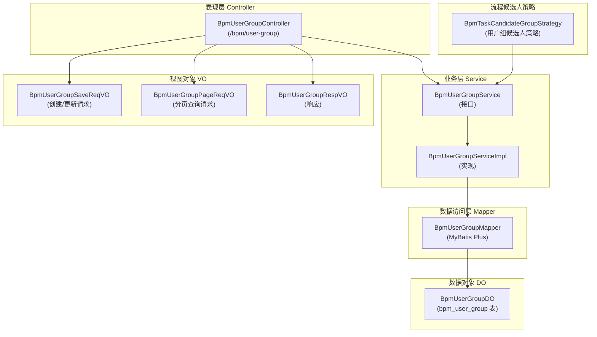
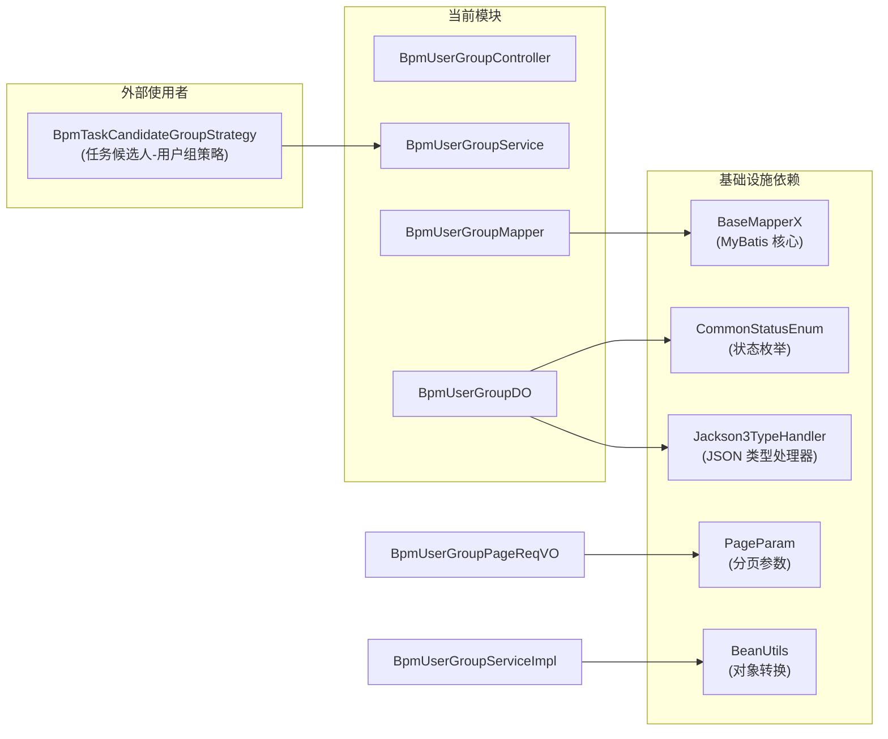
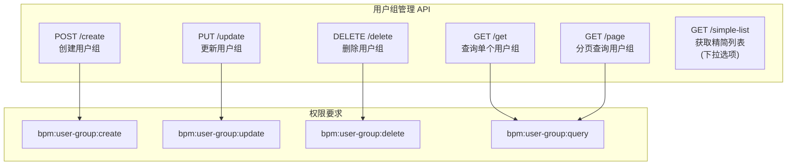
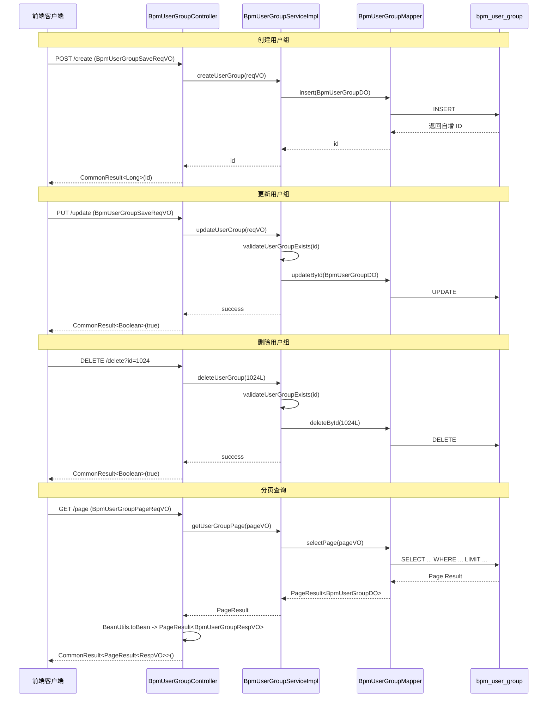
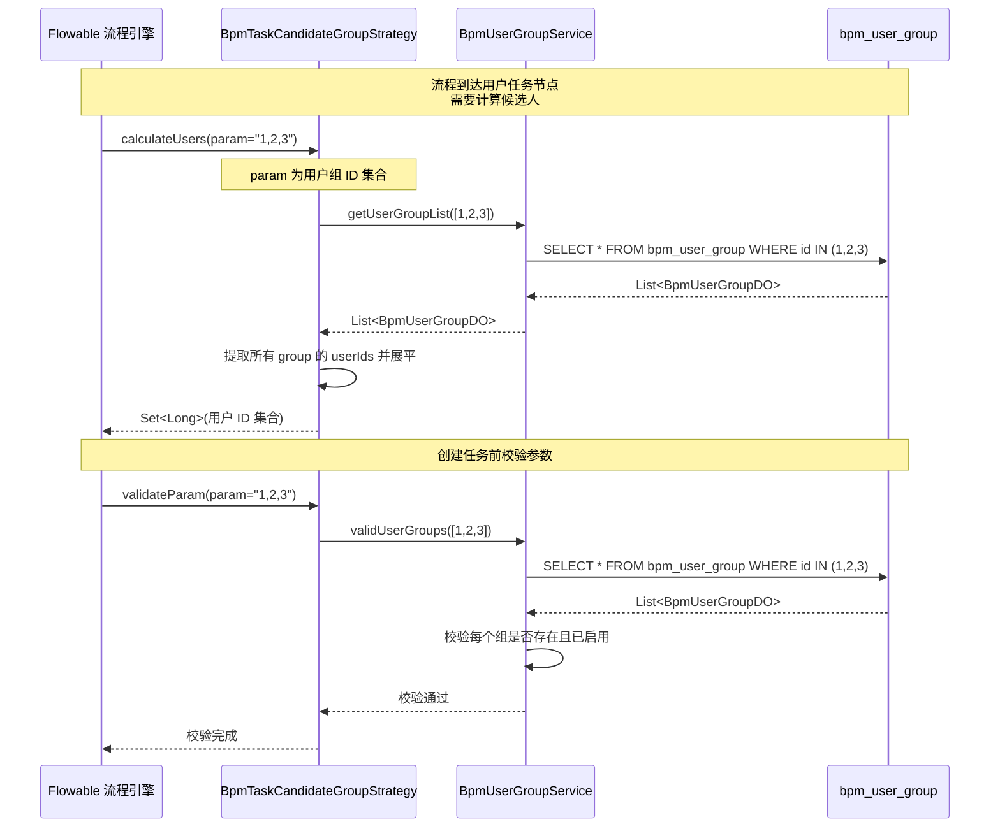
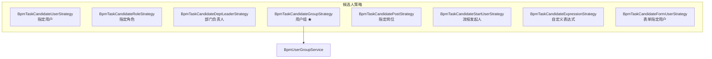
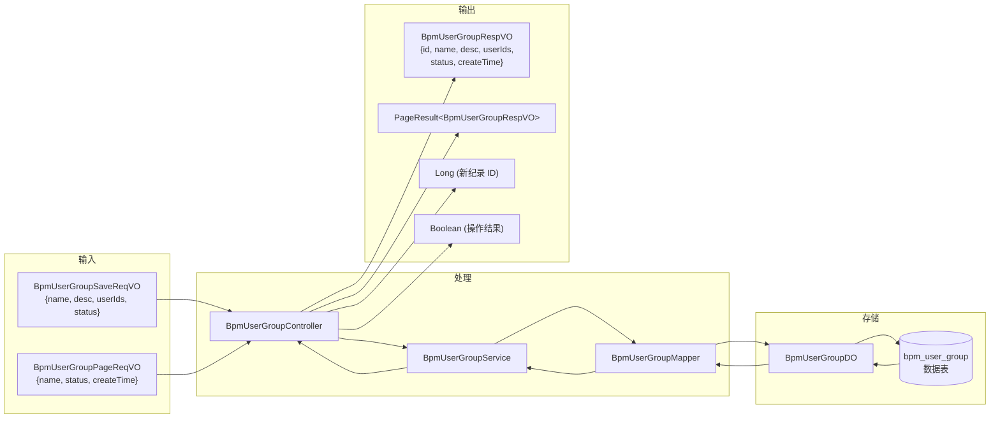

# BPM 用户组模块文档

## 1. 模块简介

用户组模块（BpmUserGroup）是工作流（BPM）系统中的基础数据管理模块之一，负责管理**用户组**的增删改查等功能。用户组是一组用户的集合，在流程设计中被用作**任务候选人策略**，允许将审批任务分配给整个用户组，从而实现基于用户组的灵活审批分配机制。

### 核心功能

- **用户组 CRUD**：创建、更新、删除、查询用户组
- **用户组分页查询**：支持按名称、状态、创建时间等条件进行分页检索
- **用户组状态管理**：启用/禁用用户组，禁用后无法作为任务候选人使用
- **用户组成员管理**：维护用户组包含的成员用户 ID 集合
- **用户组校验**：校验用户组是否存在且处于启用状态，供流程候选人策略调用

---

## 2. 架构设计

### 2.1 整体架构

用户组模块遵循标准的分层架构设计，分为 Controller（接口层）、Service（业务逻辑层）、Mapper（数据访问层）、DO（数据对象层）、VO（视图对象层）。

### 2.2 模块依赖关系

---

## 3. 数据模型

### 3.1 数据库表结构

表名：`bpm_user_group`

| 字段名 | 类型 | 说明 |
|--------|------|------|
| id | bigint | 编号，自增主键 |
| name | varchar | 组名 |
| description | varchar | 描述 |
| status | tinyint | 状态：0-禁用，1-启用（对应 `CommonStatusEnum`） |
| user_ids | json | 成员用户编号数组，使用 Jackson 序列化存储 |
| create_time | datetime | 创建时间（继承自 BaseDO） |
| update_time | datetime | 更新时间（继承自 BaseDO） |
| creator | varchar | 创建者（继承自 BaseDO） |
| updater | varchar | 更新者（继承自 BaseDO） |
| deleted | bit | 是否删除（继承自 BaseDO） |

### 3.2 核心数据对象

**BpmUserGroupDO** 是数据实体，继承自 `BaseDO`。其中 `userIds` 字段使用 Jackson 类型处理器（`Jackson3TypeHandler`）将 `Set<Long>` 序列化为 JSON 字符串存储，支持 Oracle、PostgreSQL、MySQL 等多种数据库。

---

## 4. API 接口

所有接口均位于 `/bpm/user-group` 路径下，需要相应的权限认证。

### 4.1 接口总览

### 4.2 接口详情

#### 4.2.1 创建用户组

- **URL**: `POST /bpm/user-group/create`
- **权限**: `bpm:user-group:create`
- **请求体** (`BpmUserGroupSaveReqVO`):

| 参数 | 类型 | 必填 | 说明 |
|------|------|------|------|
| id | Long | 否 | 编号（创建时为空） |
| name | String | 是 | 组名 |
| description | String | 否 | 描述 |
| userIds | Set\<Long\> | 是 | 成员用户编号数组 |
| status | Integer | 是 | 状态：0-禁用，1-启用 |

- **响应**: `CommonResult<Long>`，返回新创建的用户组 ID

#### 4.2.2 更新用户组

- **URL**: `PUT /bpm/user-group/update`
- **权限**: `bpm:user-group:update`
- **请求体**: 同创建请求，但 `id` 必填
- **响应**: `CommonResult<Boolean>`

#### 4.2.3 删除用户组

- **URL**: `DELETE /bpm/user-group/delete?id={id}`
- **权限**: `bpm:user-group:delete`
- **参数**: `id` - 用户组编号
- **响应**: `CommonResult<Boolean>`

#### 4.2.4 查询用户组

- **URL**: `GET /bpm/user-group/get?id={id}`
- **权限**: `bpm:user-group:query`
- **参数**: `id` - 用户组编号
- **响应**: `CommonResult<BpmUserGroupRespVO>`

#### 4.2.5 分页查询用户组

- **URL**: `GET /bpm/user-group/page`
- **权限**: `bpm:user-group:query`
- **请求参数** (`BpmUserGroupPageReqVO`):

| 参数 | 类型 | 必填 | 说明 |
|------|------|------|------|
| id | Long | 否 | 用户组编号（精确匹配） |
| name | String | 否 | 组名（模糊匹配） |
| status | Integer | 否 | 状态（精确匹配） |
| createTime | LocalDateTime[] | 否 | 创建时间范围 |
| pageNo | Integer | 否 | 页码（继承 PageParam） |
| pageSize | Integer | 否 | 每页条数（继承 PageParam） |

- **响应**: `CommonResult<PageResult<BpmUserGroupRespVO>>`

#### 4.2.6 获取用户组精简列表

- **URL**: `GET /bpm/user-group/simple-list`
- **权限**: 无需特定权限
- **说明**: 仅返回状态为"启用"的用户组，用于前端下拉选择框
- **响应**: `CommonResult<List<BpmUserGroupRespVO>>`（仅包含 id 和 name 字段）

---

## 5. 核心业务流程

### 5.1 用户组 CRUD 流程

### 5.2 用户组在流程候选人中的应用

---

## 6. 模块间引用

### 6.1 被其他模块引用

| 引用方 | 用途 | 引用方式 |
|--------|------|----------|
| `BpmTaskCandidateGroupStrategy` | 流程任务候选人 - 用户组策略，用于将用户组解析为具体用户集合 | 调用 `BpmUserGroupService` 接口 |
| [流程模型模块](model.md) | 流程模型设计中可引用的用户组作为候选人策略 | 间接引用 |
| [流程定义模块](process_definition.md) | 流程部署时使用用户组作为任务候选人 | 间接引用 |

### 6.2 引用其他模块

| 被引用方 | 用途 |
|----------|------|
| [MyBatis 核心模块](../../mybatis.md) | 使用 `BaseMapperX` 提供基础 CRUD 能力 |
| [通用工具模块](../../common.md) | 使用 `BeanUtils`、`PageParam`、`CommonStatusEnum` 等工具类 |
| [流程候选人策略枚举](bpm_candidate_strategy.md) | `BpmTaskCandidateGroupStrategy` 实现了该策略枚举 |

### 6.3 流程候选人策略体系

用户组是 BPM 任务候选人策略体系中的一种。完整的候选人策略包括：

---

## 7. 数据流图

---

## 8. 配置与部署

### 8.1 权限配置

用户组模块定义了以下权限标识：

| 权限标识 | 对应操作 |
|----------|----------|
| `bpm:user-group:create` | 创建用户组 |
| `bpm:user-group:update` | 更新用户组 |
| `bpm:user-group:delete` | 删除用户组 |
| `bpm:user-group:query` | 查询用户组 |

### 8.2 字典配置

用户组状态使用 `CommonStatusEnum` 通用状态枚举：

| 值 | 说明 |
|----|------|
| 0 | 禁用 |
| 1 | 启用 |

### 8.3 数据库配置

- 表名：`bpm_user_group`
- 主键策略：支持自增（MySQL）或序列（Oracle/PostgreSQL/Kingbase/DB2/H2），通过 `@KeySequence("bpm_user_group_seq")` 指定序列名称

---

## 9. 扩展与自定义

### 9.1 添加新的用户组相关字段

1. 在 `BpmUserGroupDO` 中添加新字段
2. 在 `BpmUserGroupSaveReqVO` 和 `BpmUserGroupRespVO` 中添加对应字段
3. 更新数据库表结构

### 9.2 自定义用户组校验逻辑

在 `BpmUserGroupServiceImpl.validUserGroups()` 方法中可以扩展校验逻辑，例如添加业务层面的规则约束。

### 9.3 集成到流程模型

在流程模型设计器中，选择"用户组"候选人策略时，需填入用户组 ID（多个用逗号分隔）。系统会自动调用 `BpmTaskCandidateGroupStrategy` 解析为用户集合。
