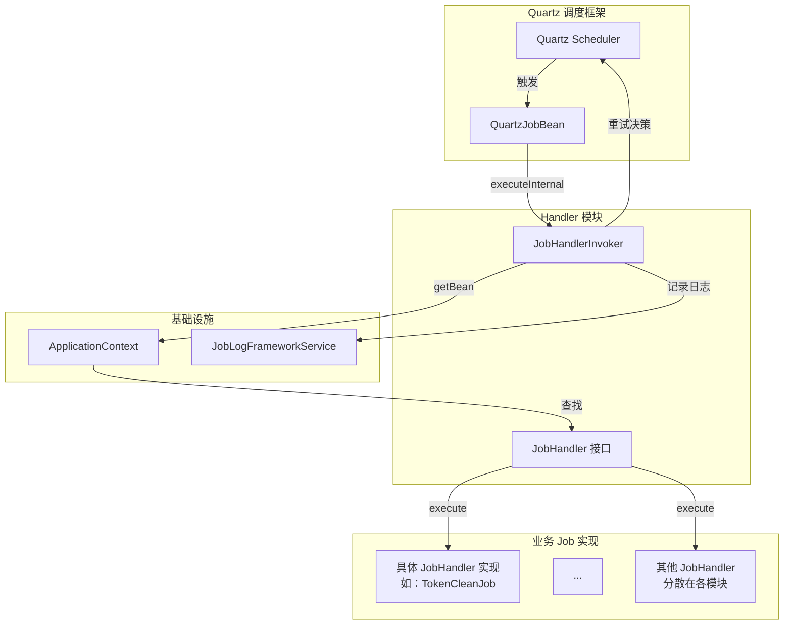
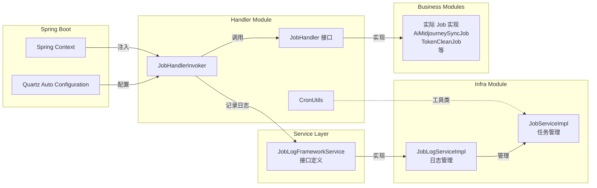
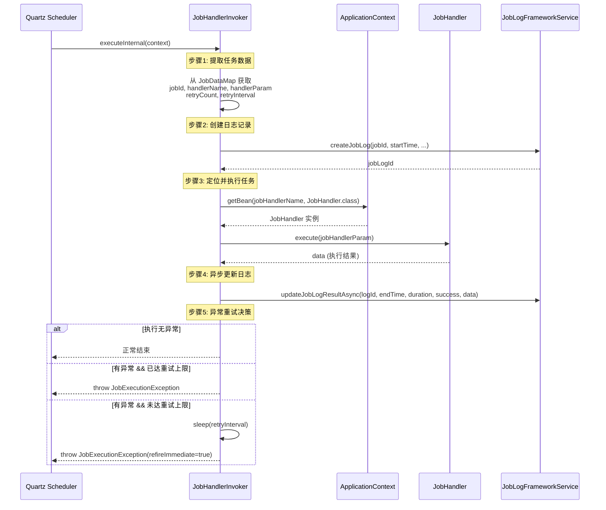
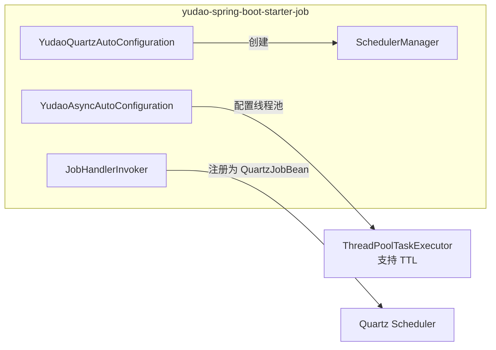

# 定时任务处理器模块 (Job Handler)

## 概述

定时任务处理器模块（Job Handler）是框架中负责**定时任务执行**的核心模块。它基于 **Quartz 调度框架** 构建，提供了统一的 **任务执行器（JobHandlerInvoker）**，用于从 Quartz 调度器中接收任务触发事件，查找对应的 **任务处理器（JobHandler）** 并执行任务逻辑，同时记录任务的执行日志并处理失败重试。

该模块位于 `yudao-spring-boot-starter-job` 启动器内，为整个系统提供标准化的定时任务执行能力。具体 Job 实现（如清理日志、同步订单、AI 任务轮询等）分散在各个业务模块中。

---

## 核心架构



### 核心组件说明

| 组件 | 说明 |
|------|------|
| **JobHandlerInvoker** | 全局唯一任务调用器，继承 QuartzJobBean，负责从 JobExecutionContext 中提取任务元数据、定位并执行 JobHandler、记录执行日志、处理异常重试 |
| **JobHandler** | 任务处理器接口，定义 `execute(String param)` 方法，所有业务 Job 需实现该接口 |
| **JobLogFrameworkService** | 任务日志服务接口，提供 `createJobLog` 和 `updateJobLogResultAsync` 方法，用于异步记录任务执行历史 |
| **JobDataKeyEnum** | 任务数据键枚举，定义 JobDataMap 中使用的键名：`JOB_ID`、`JOB_HANDLER_NAME`、`JOB_HANDLER_PARAM`、`JOB_RETRY_COUNT`、`JOB_RETRY_INTERVAL` |
| **CronUtils** | CRON 表达式工具类，提供校验和下 n 次执行时间计算功能 |

---

## 依赖关系



### 模块间引用关系

- **handler 模块** 依赖于 `spring-context`（获取 ApplicationContext）和 `quartz`（QuartzJobBean 基类）
- **handler 模块** 定义了 `JobLogFrameworkService` 接口，由 infra 模块中的 `JobLogServiceImpl` 实现
- **各业务模块**（如 ai、bpm、infra、system 等）实现 `JobHandler` 接口，提供具体的定时任务逻辑
- **config 模块**（`YudaoQuartzAutoConfiguration`）负责初始化 Quartz Scheduler 和 SchedulerManager

---

## 任务执行流程



### 流程图详细说明

1. **提取任务数据** — 从 Quartz 的 `JobExecutionContext` 中获取 `JobDataMap`，读取任务 ID、处理器名称、参数、重试次数和重试间隔
2. **创建日志记录** — 调用 `JobLogFrameworkService.createJobLog` 创建初始日志，记录任务开始时间
3. **定位并执行任务** — 通过 `ApplicationContext.getBean(handlerName, JobHandler.class)` 获取 Spring Bean，调用其 `execute` 方法执行实际业务逻辑
4. **异步更新日志** — 执行完成后异步更新日志记录（结束时间、耗时、是否成功、结果数据）
5. **异常重试决策**：
   - 若执行成功，正常结束
   - 若执行失败且已达到重试上限（`refireCount >= retryCount`），直接抛出异常
   - 若执行失败且未达重试上限，按指定间隔 sleep 后抛出 `refireImmediately=true` 的异常，触发 Quartz 立即重试

---

## JobHandlerInvoker 类详解

### 类注解

```java
@DisallowConcurrentExecution
@PersistJobDataAfterExecution
```

- **@DisallowConcurrentExecution**：禁止同一 Job 并发执行，确保同一时刻只有一个线程执行该 Job
- **@PersistJobDataAfterExecution**：执行完成后持久化 JobDataMap 中的更新，确保重试计数器等信息被保存

### 核心属性

| 属性 | 类型 | 说明 |
|------|------|------|
| applicationContext | ApplicationContext | Spring 应用上下文，用于获取 JobHandler Bean |
| jobLogFrameworkService | JobLogFrameworkService | 任务日志服务，记录执行历史 |

### JobDataMap 键说明（JobDataKeyEnum）

| 键名 | 类型 | 说明 |
|------|------|------|
| JOB_ID | Long | 任务编号 |
| JOB_HANDLER_NAME | String | Job 处理器在 Spring 容器中的 Bean 名称 |
| JOB_HANDLER_PARAM | String | 执行参数 |
| JOB_RETRY_COUNT | Integer | 最大重试次数（默认 0） |
| JOB_RETRY_INTERVAL | Integer | 重试间隔（毫秒，默认 0） |

### 方法说明

| 方法 | 可见性 | 说明 |
|------|--------|------|
| executeInternal(JobExecutionContext) | protected | Quartz 回调入口，完整执行流程 |
| executeInternal(String, String) | private | 内部执行，通过 ApplicationContext 获取 JobHandler 并调用 |
| updateJobLogResultAsync(...) | private | 异步更新任务执行结果日志 |
| handleException(...) | private | 异常处理与重试决策 |

---

## JobHandler 接口

任务处理器接口是所有业务定时任务的**统一契约**。

```java
public interface JobHandler {
    /**
     * 执行任务
     *
     * @param param 参数
     * @return 结果
     * @throws Exception 异常
     */
    String execute(String param) throws Exception;
}
```

### 已知实现分布

| 业务模块 | Job 实现 | 功能 |
|---------|----------|------|
| system | DemoJob | 演示定时任务 |
| system | TokenCleanJob | 清理过期令牌 |
| infra | JobLogCleanJob | 清理过期任务日志 |
| infra | AccessLogCleanJob | 清理过期 API 访问日志 |
| ai | AiMidjourneySyncJob | 同步 Midjourney 绘画状态 |
| ai | AiSunoSyncJob | 同步 Suno 音乐生成状态 |
| iot | IotDeviceOfflineCheckJob | 设备离线检测 |
| iot | IotOtaUpgradeJob | OTA 升级任务 |
| iot | IotSceneRuleJob | 场景联动规则触发 |
| crm | CrmCustomerAutoPutPoolJob | 客户自动进入公海 |
| trade | TradeOrderAutoCancelJob | 自动取消超时订单 |
| trade | TradeOrderAutoReceiveJob | 自动确认收货 |
| trade | TradeOrderAutoCommentJob | 自动评价 |
| trade | BrokerageRecordUnfreezeJob | 佣金记录解冻 |
| pay | PayNotifyJob | 支付通知重试 |
| pay | PayOrderExpireJob | 支付订单超时关闭 |
| pay | PayOrderSyncJob | 支付订单状态同步 |
| pay | PayRefundSyncJob | 退款订单状态同步 |
| pay | PayTransferSyncJob | 转账订单状态同步 |
| promotion | CombinationRecordExpireJob | 拼团记录过期处理 |
| promotion | CouponExpireJob | 优惠券过期处理 |
| statistics | ProductStatisticsJob | 商品统计数据生成 |
| statistics | TradeStatisticsJob | 交易统计数据生成 |
| im | ImRtcParticipantTimeoutJob | RTC 参与者超时处理 |
| im | ImRtcCallCleanupJob | RTC 通话清理 |

> 更多 Job 实现请参见各业务模块的 `job` 包。

---

## 配置与启用

### 自动化配置



### YudaoQuartzAutoConfiguration

- 自动配置类，使用 `@AutoConfiguration` 注解
- `@EnableScheduling` 开启 Spring 自带的 `@Scheduled` 定时任务支持
- 注入 `SchedulerManager` Bean，用于管理 Quartz Scheduler（启停操作）
- 若项目中未引入 Quartz 依赖，`SchedulerManager` 会降级为无操作模式

### YudaoAsyncAutoConfiguration

- 使用 `@EnableAsync` 开启 Spring 异步执行支持
- 通过 `BeanPostProcessor` 为 `ThreadPoolTaskExecutor` 和 `SimpleAsyncTaskExecutor` 添加 TTL（TransmittableThreadLocal）装饰器，确保异步任务中上下文信息（如租户 ID、安全上下文）的正确传递

---

## CronUtils 工具类

参考 [util_4 模块文档](util_4.md) 获取详细信息。

| 方法 | 说明 |
|------|------|
| `isValid(String cronExpression)` | 校验 CRON 表达式是否合法 |
| `getNextTimes(String cronExpression, int n)` | 根据 CRON 表达式获取未来 n 次执行时间 |

---

## 集成指南

### 第一步：创建 JobHandler 实现

```java
@Component // 注册为 Spring Bean
public class DemoJobHandler implements JobHandler {

    @Override
    public String execute(String param) throws Exception {
        // 业务逻辑
        log.info("执行 DemoJob，参数：{}", param);
        return "执行成功";
    }
}
```

### 第二步：在 Quartz 中注册任务

通过 `SchedulerManager` 或管理后台（调用 infra 模块的 JobController API）将任务注册到 Quartz Scheduler，配置：
- **JobHandler 名称**：Spring Bean 名称（默认类名首字母小写）
- **JobHandler 参数**：自定义参数，通过 `param` 传递给 execute 方法
- **CRON 表达式**：任务触发时间规则
- **重试次数**：失败最大重试次数
- **重试间隔**：每次重试的等待时间（毫秒）

### 第三步：任务管理

通过 infra 模块提供的 **任务管理 API**（`/infra/job/*`）进行任务的增删改查和启停操作，相关文档见 [job 模块文档](job.md)。

---

## 相关文档

| 文档 | 说明 |
|------|------|
| [config_4 模块文档](config_4.md) | Quartz 和异步任务自动化配置 |
| [util_4 模块文档](util_4.md) | CronUtils 工具类 |
| [job 模块文档](job.md) | 任务管理与日志服务（infra 模块） |
| [enums 模块文档](enums.md) | JobDataKeyEnum 枚举定义 |

> **注意**：所有文档保存在同一目录（`docs/`）下，引用链接基于文件名进行访问。
