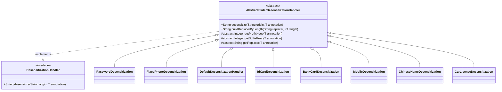

# handler_3 模块文档

## 概述

handler_3 模块是 yudao-framework 中的脱敏处理器组件，位于 `yudao-spring-boot-starter-web` 模块中。该模块提供了一系列用于数据脱敏的处理器实现，特别针对滑动脱敏场景（如保留前后几位字符，中间用特殊字符替换）。

该模块基于抽象类 `AbstractSliderDesensitizationHandler` 实现，提供了通用的脱敏逻辑框架。具体的脱敏处理器通过继承该抽象类并实现特定的配置方法来实现不同类型数据的脱敏需求。

## 架构概述

handler_3 模块遵循简单的继承结构：
- 抽象基类 `AbstractSliderDesensitizationHandler` 实现了通用的脱敏算法
- 各种具体的脱敏处理器继承自该抽象类，实现特定的配置方法
- 所有处理器都实现了 `DesensitizationHandler` 接口

## 功能说明

该模块提供了以下脱敏处理器：

1. **PasswordDesensitization** - 密码脱敏处理器
2. **FixedPhoneDesensitization** - 固定电话脱敏处理器
3. **DefaultDesensitizationHandler** - 默认脱敏处理器（通用滑动脱敏）
4. **IdCardDesensitization** - 身份证脱敏处理器
5. **BankCardDesensitization** - 银行卡脱敏处理器
6. **MobileDesensitization** - 手机号脱敏处理器
7. **ChineseNameDesensitization** - 中文姓名脱敏处理器
8. **CarLicenseDesensitization** - 车牌脱敏处理器

所有处理器都遵循相同的模式：继承自 `AbstractSliderDesensitizationHandler`，实现三个方法来获取脱敏配置：
- `getPrefixKeep()` - 前缀保留位数
- `getSuffixKeep()` - 后缀保留位数
- `getReplacer()` - 替换字符

## 与其他模块的关系

handler_3 模块属于 yudao-framework 的脱敏功能体系，与其他脱敏处理器模块（如 handler_2 中的正则脱敏处理器）协同工作，为系统提供全面的数据脱敏能力。

有关其他脱敏处理器模块的详细信息，请参考：
- [handler_2 模块](handler_2.md) - 正则表达式脱敏处理器

## 子模块文档

以下是 handler_3 模块的详细子模块文档：
- [抽象基类](handler_3_abstract.md) - AbstractSliderDesensitizationHandler
- [密码脱敏](handler_3_password.md) - PasswordDesensitization
- [固定电话脱敏](handler_3_fixed_phone.md) - FixedPhoneDesensitization
- [身份证脱敏](handler_3_handler_3_id_card.md) - IdCardDesensitization
- [银行卡脱敏](handler_3_bank_card.md) - BankCardDesensitization
- [手机号脱敏](handler_3_mobile.md) - MobileDesensitization
- [中文姓名脱敏](handler_3_chinese_name.md) - ChineseNameDesensitization
- [车牌脱敏](handler_3_car_license.md) - CarLicenseDesensitization
- [默认脱敏](handler_3_default.md) - DefaultDesensitizationHandler