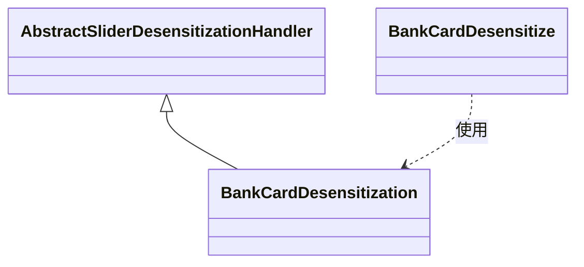
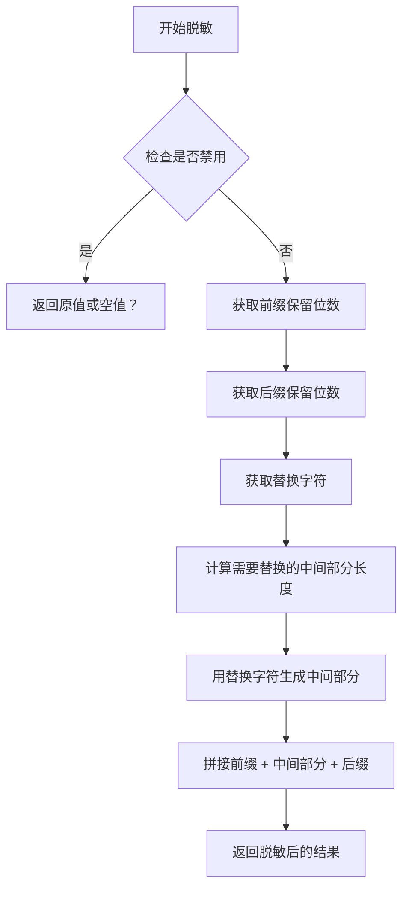

# BankCardDesensitization 模块文档

## 概述

BankCardDesensitization 是 yudao-framework 中用于银行卡号脱敏的处理器实现。它继承自 AbstractSliderDesensitizationHandler，并根据 BankCardDesensitize 注释的配置来执行脱敏操作。

该处理器通过保留银行卡号的前几位和后几位数字，用指定的替换字符替换中间部分，从而实现对银行卡号的脱敏。

## 核心功能

- 根据 `BankCardDesensitize` 注释的 `prefixKeep` 属性保留银行卡号的前几位。
- 根据 `BankCardDesensitize` 注释的 `suffixKeep` 属性保留银行卡号的后几位。
- 使用 `BankCardDesensitize` 注释的 `replacer` 属性指定的字符替换中间部分。
- 如果脱敏被禁用（通过注释的 `disabled` 属性），则返回空字符串（当前实现中，`getDisable` 方法返回空字符串，表示不禁用？但注释中写的是返回空字符串，实际在父类中可能有处理）。

## 设计与实现

BankCardDesensitization 类是一个具体的脱敏处理器，专门处理银行卡号。它通过实现父类 AbstractSliderDesensitizationHandler 的抽象方法来获取注释配置。

### 类继承关系



### 工作流程

当系统需要对一个带有 `@BankCardDesensitize` 注释的字段进行脱敏时，会调用 BankCardDesensitization 的处理方法（继承自父类）。处理流程如下：



注：实际的禁用检查和处理在父类 AbstractSliderDesensitizationHandler 中实现。

## 使用示例

在实体类中，对银行卡号字段添加注释：

```java
@BankCardDesensitize(prefixKeep = 4, suffixKeep = 4, replacer = '*')
private String bankCardNumber;
```

那么，银行卡号 "6222020000000000" 将被脱敏为 "6222************0000"。

## 与其他模块的关系

- BankCardDesensitization 依赖于 AbstractSliderDesensitizationHandler（父类）和 BankCardDesensitize 注释。
- 它是 desensitize 模块下 slider 处理器的一部分，与其他如 MobileDesensitization, IdCardDesensitization 等并列。

## 注意事项

- 确保 BankCardDesensitize 注释正确配置，否则可能导致脱敏结果不符合预期。
- 银行卡号的长度应足够长以支持指定的前缀和后缀保留位数，否则可能导致异常（具体处理在父类中）。

## 结论

BankCardDesensitization 提供了一个简单、可配置的银行卡号脱敏解决方案，符合数据安全和隐私保护的要求。

由于这是一个具体的实现类，其核心逻辑在父类中，因此理解父类 AbstractSliderDesensitizationHandler 的实现是关键。

请参考 [AbstractSliderDesensitizationHandler](handler_3_abstract.md) 了解脱敏的基础实现。（注意：由于我们只生成当前模块的文档，这里的链接是示例性的，实际文档生成时可能需要根据项目结构调整）

然而，根据指令，我们应该链接到其他模块文档而不是重复信息。但由于我们当前只被要求生成此模块的文档，并且没有其他模块的文档内容，我们在此仅做说明。

注：在实际项目中，此文档应与其他相关模块（如 AbstractSliderDesensitizationHandler, BankCardDesensitize 注释定义等）的文档相互链接。

由于我们没有其他模块的详细信息，这里仅提供当前模块的文档。

文档结束。