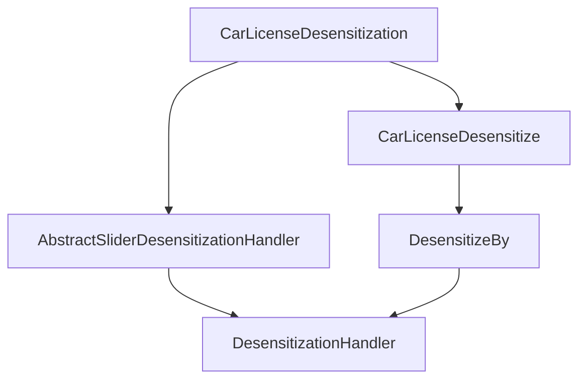

# CarLicenseDesensitization 模块文档

## 概述

`CarLicenseDesensitization` 是 Yudao 框架中用于车牌号脱敏的处理器，属于滑块式（slider-based）脱敏处理器家族的一部分。该处理器实现了车牌号的部分脱敏功能，通过保留车牌号的前缀和后缀一定长度的字符，将中间部分替换为指定的脱敏字符。

## 核心功能

1. **车牌号脱敏**：根据配置保留车牌号的前缀和后缀字符，替换中间部分
2. **可配置脱敏规则**：支持自定义前缀保留长度、后缀保留长度和脱敏字符
3. **条件禁用**：支持通过 Spring EL 表达式动态控制是否执行脱敏
4. **与框架集成**：通过 `@CarLicenseDesensitize` 注解与框架的脱敏机制无缝集成

## 架构设计

### 类关系图

```mermaid
classDiagram
    DesensitizationHandler <|.. AbstractSliderDesensitizationHandler
    AbstractSliderDesensitizationHandler <|-- CarLicenseDesensitization
    CarLicenseDesensitize ..> CarLicenseDesensitization : 使用
    
    class DesensitizationHandler {
        <<interface>>
        +String desensitize(String origin, T annotation)
        +String getDisable(T annotation)
    }
    
    class AbstractSliderDesensitizationHandler<T extends Annotation> {
        <<abstract>>
        +String desensitize(String origin, T annotation)
        +String getDisable(T annotation)
        #Integer getPrefixKeep(T annotation)
        #Integer getSuffixKeep(T annotation)
        #String getReplacer(T annotation)
        #String buildReplacerByLength(String replacer, int length)
    }
    
    class CarLicenseDesensitization {
        +Integer getPrefixKeep(CarLicenseDesensitize annotation)
        +Integer getSuffixKeep(CarLicenseDesensitize annotation)
        +String getReplacer(CarLicenseDesensitize annotation)
        +String getDisable(CarLicenseDesensitize annotation)
    }
    
    class CarLicenseDesensitize {
        <<annotation>>
        +int prefixKeep() = 3
        +int suffixKeep() = 1
        +String replacer() = "*"
        +String disable() = ""
    }
```

### 依赖关系



## 工作原理

### 脱敏算法

`CarLicenseDesensitization` 继承自 `AbstractSliderDesensitizationHandler`，其实现了以下脱敏逻辑：

1. **禁用检查**：首先检查注解中的 `disable()` 属性（支持 Spring EL 表达式），如果返回 `true`，则直接返回原始字符串
2. **参数获取**：获取配置的前缀保留长度(`prefixKeep`)、后缀保留长度(`suffixKeep`)和替换字符(`replacer`)
3. **长度计算**：计算需要替换的中间部分长度：`interval = length - prefixKeep - suffixKeep`
4. **脱敏处理**：根据不同情况进行处理：
   - 情况一：当 `interval <= 0` 时（字符串长度小于等于前后缀保留长度），整个字符串都被替换
   - 情况二：当 `interval > 0` 时，保留前缀和后缀，替换中间部分

### 示例说明

假设车牌号为 "粤A66666"，配置为：
- `prefixKeep()` = 3（保留前3个字符："粤A6"）
- `suffixKeep()` = 1（保留后1个字符："6"）
- `replacer()` = "*"（替换字符）

处理过程：
1. 原始长度：6
2. 需要替换的长度：6 - 3 - 1 = 2
3. 结果：前缀"粤A6" + "**" + 后缀"6" = "粤A6**6"

## API 说明

### CarLicenseDesensitization 类

#### 方法

| 方法名 | 返回类型 | 参数 | 说明 |
|--------|----------|------|------|
| `desensitize` | String | origin: 原始字符串, annotation: CarLicenseDesensitize 注解 | 执行车牌号脱敏操作 |
| `getPrefixKeep` | Integer | annotation: CarLicenseDesensitize 注解 | 获取前缀保留长度 |
| `getSuffixKeep` | Integer | annotation: CarLicenseDesensitize 注解 | 获取后缀保留长度 |
| `getReplacer` | String | annotation: CarLicenseDesensitize 注解 | 获取替换字符 |
| `getDisable` | String | annotation: CarLicenseDesensitize 注解 | 获取禁用表达式（支持 Spring EL） |

### CarLicenseDesensitize 注解

| 属性名 | 类型 | 默认值 | 说明 |
|--------|------|--------|------|
| `prefixKeep` | int | 3 | 前缀保留长度 |
| `suffixKeep` | int | 1 | 后缀保留长度 |
| `replacer` | String | "*" | 替换字符 |
| `disable` | String | "" | 是否禁用脱敏的 Spring EL 表达式，返回 true 时跳过脱敏 |

## 使用示例

### 在实体类中使用

```java
import cn.iocoder.yudao.framework.desensitize.core.slider.annotation.CarLicenseDesensitize;

public class VehicleVO {
    // 保留前3位和后1位，使用*替换中间部分
    // 例如：粤A66666 脱敏后为 粤A6**6
    @CarLicenseDesensitize(prefixKeep = 3, suffixKeep = 1)
    private String licensePlate;
    
    // 自定义脱敏字符
    @CarLicenseDesensitize(replacer = "#")
    private String licensePlateWithHash;
    
    // 动态控制是否脱敏（基于条件）
    @CarLicenseDesensitize(disable = "#{user.isAdmin}")
    private String licensePlateConditional;
}
```

### 在DTO或VO中使用

```java
public class CarInfoRespVO {
    @CarLicenseDesensitize
    private String carLicense; // 默认保留前3位后1位
    
    @CarLicenseDesensitize(prefixKeep = 2, suffixKeep = 2)
    private String specialLicense; // 保留前2位后2位
}
```

## 与其他脱敏处理器的关系

`CarLicenseDesensitization` 属于滑块式脱敏处理器家族，与以下处理器共享相同的基础架构：

- `DefaultDesensitizationHandler`：默认的滑块式脱敏处理器
- `MobileDesensitization`：手机号脱敏处理器
- `FixedPhoneDesensitization`：固定电话脱敏处理器
- `IdCardDesensitization`：身份证号脱敏处理器
- `BankCardDesensitization`：银行卡号脱敏处理器
- `PasswordDesensitization`：密码脱敏处理器
- `ChineseNameDesensitization`：中文姓名脱敏处理器

所有这些处理器都继承自 `AbstractSliderDesensitizationHandler`，复用了相同的脱敏算法框架，只需实现具体的参数获取方法。

## 配置说明

该处理器不需要额外的配置，完全通过注解参数进行配置。框架会自动检测带有 `@CarLicenseDesensitize` 注解的字段并在序列化/反序列化过程中应用脱敏逻辑。

## 性能考虑

1. **轻量级实现**：处理器实现简单，没有复杂的依赖
2. **无状态设计**：每次调用都是独立的，不保存状态
3. **字符串操作优化**：使用 `String.repeat()` 方法高效生成替换字符串
4. **条件短路**：禁用检查放在最前面，避免不必要的计算

## 安全性

1. **防止信息泄露**：通过部分隐藏车牌号信息，保护用户隐私
2. **可配置强度**：通过调整前缀/后缀保留长度可以控制脱敏强度
3. **动态控制**：支持基于用户角色或其他条件动态启用/禁用脱敏

## 最佳实践

1. **根据业务场景调整参数**：不同的车牌号格式可能需要不同的前缀/后缀保留长度
2. **结合业务规则**：考虑是否需要在特定情况下完全显示车牌号（如授权人员查看）
3. **统一脱敏标准**：在团队内部统一车牌号脱敏的参数配置，保持一致性
4. **测试边界情况**：测试短车牌号（长度小于等于前后缀保留长度）和正常长度车牌号的处理结果

## 与框架集成

该处理器通过以下方式与 Yudao 框架集成：

1. **注解驱动**：使用 `@CarLicenseDesensitize` 标记需要脱敏的字段
2. **自动检测**：框架在JSON序列化过程中自动检测并应用脱敏处理器
3. **Spring EL支持**：禁用条件支持Spring表达式语言，提供灵活的控制能力
4. **Jackson兼容**：通过 `@JacksonAnnotationsInside` 和 `@DesensitizeBy` 确保与Jackson序列化框架兼容

## 扩展点

如果需要自定义车牌号脱敏的特殊规则（如考虑不同地区车牌格式的差异），可以：

1. 创建新的处理器类继承 `AbstractSliderDesensitizationHandler<CarLicenseDesensitize>`
2. 覆盖参数获取方法以实现自定义逻辑
3. 通过 `@DesensitizeBy` 注解指定新的处理器

然而，对于大多数标准车牌号脱敏需求，现有的 `CarLicenseDesensitization` 实现已经足够使用。