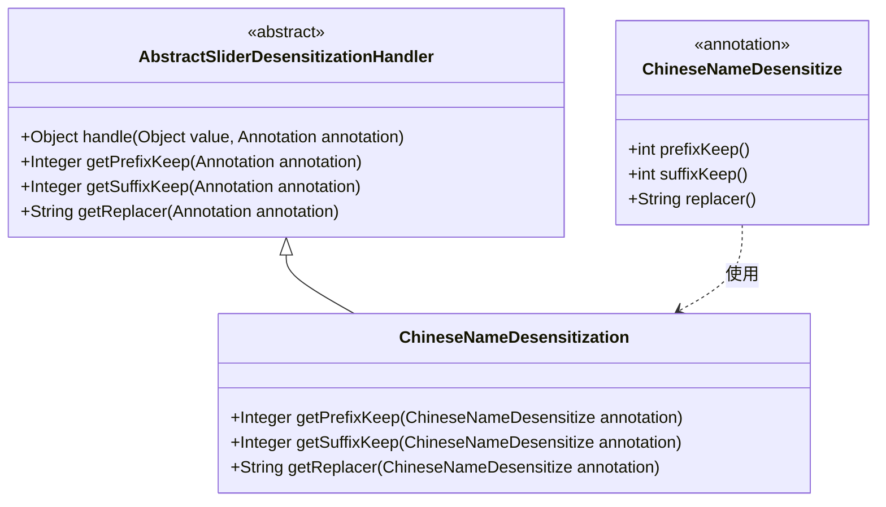
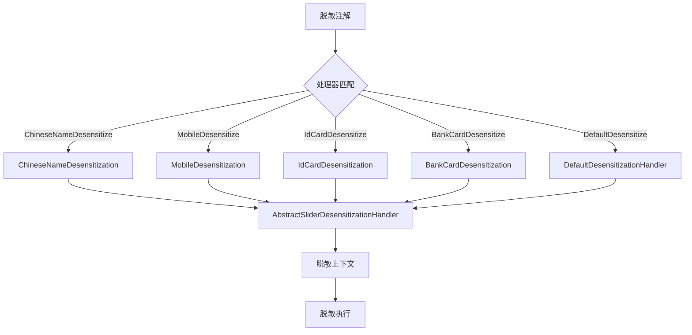

# ChineseNameDesensitization 模块文档

## 1. 模块概述

ChineseNameDesensitization 是 yudao-framework 中用于中文姓名脱敏的处理器实现。它继承自 `AbstractSliderDesensitizationHandler`，并专门处理 `@ChineseNameDesensitize` 注解标记的字段，实现中文姓名的脱敏功能。

该模块属于 `yudao-spring-boot-starter-web` 起步依赖中的脱敏功能组件，位于�ensit化核心处理器层，负责根据注解配置对中文姓名进行前后保留指定字符、中间用替换字符填充的脱敏操作。

## 2. 核心功能

### 2.1 主要职责
- 实现 `AbstractSliderDesensitizationHandler` 的抽象方法，根据 `@ChineseNameDesensitize` 注解配置获取脱敏参数
- 提供中文姓名的脱敏算法：保留前缀和后缀指定数量的字符，中间部分使用配置的替换字符填充
- 支持自定义前缀保留长度、后缀保留长度和替换字符

### 2.2 关键方法实现
| 方法名 | 说明 | 实现细节 |
|--------|------|----------|
| `getPrefixKeep` | 获取前缀保留长度 | 直接返回注解的 `prefixKeep()` 值 |
| `getSuffixKeep` | 获取后缀保留长度 | 直接返回注解的 `suffixKeep()` 值 |
| `getReplacer` | 获取替换字符 | 直接返回注解的 `replacer()` 值 |

### 2.3 工作原理
1. 当系统检测到字段上存在 `@ChineseNameDesensitize` 注解时，会调用该处理器
2. 处理器从注解中提取配置：前缀保留长度、后缀保留长度、替换字符
3. 对目标中文姓名字符串执行脱敏：
   - 保留开头 `prefixKeep` 个字符
   - 保留结尾 `suffixKeep` 个字符
   - 中间部分用 `replacer` 字符填充（长度等于原字符串长度减去前缀和后缀长度）
   - 如果字符串长度不足以同时保留前缀和后缀，则会调整保留策略（具体逻辑在父类中实现）

## 3. 架构设计

### 3.1 类继承关系
ChineseNameDesensitization 继承自 AbstractSliderDesensitizationHandler，形成处理器链的基础实现。



### 3.2 在脱敏模块中的位置
ChineseNameDesensitization 是 slider（滑块）类脱敏处理器的一部分，与其他具体脱敏处理器（如手机号、身份证、银行卡等）并列存在，共同实现了基于注解的可插拔脱敏框架。



## 4. 系统集成

### 4.1 模块依赖
- 所属模块：`yudao-spring-boot-starter-web`
- 所在包：`cn.iocoder.yudao.framework.desensitize.core.slider.handler`
- 依赖组件：
  - 父类：`AbstractSliderDesensitizationHandler`（同模块）
  - 注解：`ChineseNameDesensitize`（同模块，位于 `annotation` 子包）

### 4.2 在系统中的作用
该处理器是 yudao-framework 脱敏功能的具体实现之一，用于在数据脱敏场景中保护中文姓名信息。典型应用场景包括：
- 用户信息展示中的姓名脱敏（如在列表页、详情页中显示）
- API 响应中的敏感字段脱敏
- 日志脱敏和数据脱敏审计

### 4.3 与其他模块的关系
- 为 `yudao-spring-boot-starter-web` 提供脱敏能力支持
- 可被系统中的服务层、控制器层通过注解方式直接使用
- 与数据验证模块（如 `yudao-spring-boot-starter-validation`）互补，共同构建数据安全防护体系
- 在导入/导出功能（如 Excel 处理）中自动应用脱敏规则

## 5. 使用说明

### 5.1 注解使用方式
在需要脱敏的字段上添加 `@ChineseNameDesensitize` 注解，并配置参数：

```java
import cn.iocoder.yudao.framework.desensitize.core.slider.annotation.ChineseNameDesensitize;

public class UserInfoDTO {
    @ChineseNameDesensitize(prefixKeep = 1, suffixKeep = 0, replacer = "*")
    private String realName;
    
    // getters and setters
}
```

### 5.2 参数说明
| 参数名 | 类型 | 说明 | 默认值 |
|--------|------|------|--------|
| `prefixKeep` | int | 前缀保留字符数量 | 0 |
| `suffixKeep` | int | 后缀保留字符数量 | 0 |
| `replacer` | String | 替换字符 | "*" |

### 5.3 脱敏示例
| 原始姓名 | prefixKeep | suffixKeep | replacer | 脱敏结果 |
|----------|------------|------------|----------|----------|
| 张三 | 1 | 0 | * | 张* |
| 李四 | 1 | 1 | # | Li# |
| 王五六 | 1 | 1 | $ | 王$六 |
| 赵钱孙李 | 2 | 1 | - | 赵钱-李 |
| 阿 | 1 | 0 | * | 阿*（当长度不足时，会保留所有字符并按规则填充） |

> 注：当字符串长度小于 `prefixKeep + suffixKeep` 时，实际保留长度会被调整以避免越界，具体调整策略由父类 `AbstractSliderDesensitizationHandler` 实现。

## 6. 最佳实践

1. **参数配置建议**：
   - 对于中文姓名，通常建议保留姓氏（1个字符）或保留名氏的第一个字
   - 示例：`@ChineseNameDesensitize(prefixKeep = 1, suffixKeep = 0, replacer = "*")` 实现“张三”→“张*”
   - 对于双字名，可考虑 `prefixKeep=1, suffixKeep=1` 保留首尾字符

2. **性能考虑**：
   - 处理器实现轻量，无状态，可安全用于高并发场景
   - 建议在DTO/VO层使用，避免在实体层过度使用影响查询性能

3. **与其他脱敏器组合使用**：
   - 在同一个类中可对不同字段使用不同的脱敏处理器
   - 例如：姓名用ChineseNameDesensitization，手机号用MobileDesensitization

4. **单元测试建议**：
   - 测试边界条件：空字符串、单字姓名、长姓名
   - 测试不同参数组合下的脱敏结果
   - 验证异常输入的处理（如负数参数，虽然注解通常会限制为非负）

## 7. 模块扩展点

如需自定义中文姓名脱敏规则，可通过以下方式扩展：
1. 创建新的处理器类继承 `AbstractSliderDesensitizationHandler`
2. 实现对应的注解接口（如果需要特殊参数）
3. 在Spring容器中注册新处理器（通过 `@Component` 或自动扫描）

但通常情况下，现有的 `ChineseNameDesensitization` 已能满足大多数中文姓名脱敏需求，无需额外扩展。

## 8. 与上下文文档的关联

- [脱敏框架总览](handler_3.md)：了解整个脱敏模块的架构和其他处理器
- [注解使用指南](handler_3_annotation.md)：详细说明所有脱敏注解的用法（注：此为示例链接，实际文档名可能不同）
- [父类抽象处理器](handler_3_abstract.md)：了解滑块类脱敏处理器的通用实现逻辑