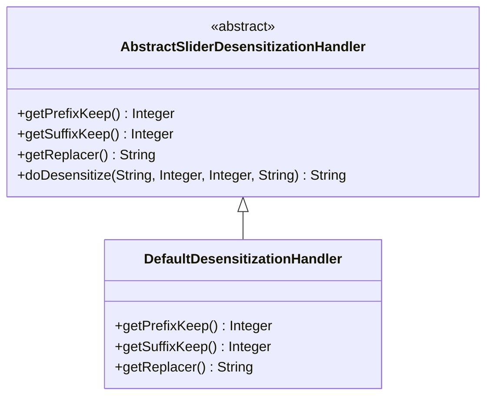

# DefaultDesensitizationHandler 模块文档

## 1. 概述

`DefaultDesensitizationHandler` 是一个用于处理敏感数据脱敏的核心组件，隶属于 `handler_3` 模块。它实现了 `AbstractSliderDesensitizationHandler` 抽象类，并专门用于处理 `@SliderDesensitize` 注解标记的字段脱敏需求。

该模块的主要目标是提供一种灵活的方式来保护敏感数据，例如用户的身份证号、银行卡号、手机号等，通过在输出时自动脱敏，确保敏感信息不会在日志、API响应或其他输出中泄露。

## 2. 架构设计

### 2.1 模块结构

```
handler_3_default/
├── DefaultDesensitizationHandler.java (核心处理器)
└── AbstractSliderDesensitizationHandler.java (抽象基类，定义通用脱敏逻辑)
```

### 2.2 核心类关系图



### 2.3 与其他模块的依赖关系

- **依赖模块**:
  - `yudao-framework/yudao-spring-boot-starter-web`：提供了 `@SliderDesensitize` 注解和脱敏框架的基础设施。
  - `yudao-framework/yudao-common`：提供了通用的工具类和基础设施。

- **被依赖模块**:
  - 任何使用 `@SliderDesensitize` 注解的模块，例如用户管理、订单管理等业务模块。

## 3. 核心功能

### 3.1 主要功能

`DefaultDesensitizationHandler` 的主要功能是实现对敏感数据的脱敏处理，具体包括：

1. **前缀保留**：保留敏感数据的前几位字符不变。
2. **后缀保留**：保留敏感数据的后几位字符不变。
3. **替换字符**：使用指定的字符替换中间的敏感信息。

### 3.2 使用场景

- **API响应脱敏**：在返回给前端的数据中自动脱敏敏感字段。
- **日志记录脱敏**：在记录日志时对敏感数据进行脱敏，避免泄露。
- **数据库存储**：在将数据存储到数据库之前或之后进行脱敏处理。

### 3.3 使用示例

```java
@RestController
@RequestMapping("/api/users")
public class UserController {

    @GetMapping("/{id}")
    public UserVO getUser(@PathVariable Long id) {
        UserVO user = userService.getUser(id);
        // 返回的 UserVO 中的敏感字段（如手机号、身份证号）会自动脱敏
        return user;
    }
}

@Data
public class UserVO {
    private String id;
    
    @SliderDesensitize(prefixKeep = 3, suffixKeep = 4, replacer = "*")
    private String phone;
    
    @SliderDesensitize(prefixKeep = 1, suffixKeep = 1, replacer = "*")
    private String idCard;
}
```

## 4. API 文档

### 4.1 类定义

```java
package cn.iocoder.yudao.framework.desensitize.core.slider.handler;

import cn.iocoder.yudao.framework.desensitize.core.slider.annotation.SliderDesensitize;

/**
 * {@link SliderDesensitize} 的脱敏处理器
 *
 * @author gaibu
 */
public class DefaultDesensitizationHandler extends AbstractSliderDesensitizationHandler<SliderDesensitize> {

    @Override
    Integer getPrefixKeep(SliderDesensitize annotation) {
        return annotation.prefixKeep();
    }

    @Override
    Integer getSuffixKeep(SliderDesensitize annotation) {
        return annotation.suffixKeep();
    }

    @Override
    String getReplacer(SliderDesensitize annotation) {
        return annotation.replacer();
    }
}
```

### 4.2 方法说明

| 方法名 | 参数 | 返回值 | 描述 |
|--------|------|--------|------|
| `getPrefixKeep` | `SliderDesensitize annotation` | `Integer` | 获取注解中定义的前缀保留字符数。 |
| `getSuffixKeep` | `SliderDesensitize annotation` | `Integer` | 获取注解中定义的后缀保留字符数。 |
| `getReplacer` | `SliderDesensitize annotation` | `String` | 获取注解中定义的替换字符。 |

## 5. 配置说明

### 5.1 注解配置

`@SliderDesensitize` 注解用于标记需要脱敏的字段，并配置脱敏参数。

```java
@Retention(RetentionPolicy.RUNTIME)
@Target(ElementType.FIELD)
public @interface SliderDesensitize {
    /**
     * 前缀保留字符数
     */
    int prefixKeep() default 0;

    /**
     * 后缀保留字符数
     */
    int suffixKeep() default 0;

    /**
     * 替换字符
     */
    String replacer() default "*";
}
```

### 5.2 示例配置

```java
@Data
public class UserVO {
    private String id;
    
    @SliderDesensitize(prefixKeep = 3, suffixKeep = 4, replacer = "*")
    private String phone; // 脱敏后：138****1234
    
    @SliderDesensitize(prefixKeep = 1, suffixKeep = 1, replacer = "*")
    private String idCard; // 脱敏后：1***************1
}
```

## 6. 数据流图

```mermaid
dataflow
    UserVO --> DefaultDesensitizationHandler: 脱敏处理
    DefaultDesensitizationHandler --> AbstractSliderDesensitizationHandler: 继承通用逻辑
    AbstractSliderDesensitizationHandler --> SliderDesensitize: 读取注解配置
    SliderDesensitize --> UserVO: 应用脱敏规则
```

## 7. 组件交互

### 7.1 与 `AbstractSliderDesensitizationHandler` 的交互

`DefaultDesensitizationHandler` 继承自 `AbstractSliderDesensitizationHandler`，并实现了三个抽象方法，用于获取脱敏配置参数。

```java
public class DefaultDesensitizationHandler extends AbstractSliderDesensitizationHandler<SliderDesensitize> {
    @Override
    Integer getPrefixKeep(SliderDesensitize annotation) {
        return annotation.prefixKeep();
    }

    @Override
    Integer getSuffixKeep(SliderDesensitize annotation) {
        return annotation.suffixKeep();
    }

    @Override
    String getReplacer(SliderDesensitize annotation) {
        return annotation.replacer();
    }
}
```

### 7.2 与 `@SliderDesensitize` 注解的交互

`@SliderDesensitize` 注解用于标记需要脱敏的字段，并通过反射机制在运行时读取注解配置，传递给 `DefaultDesensitizationHandler` 进行处理。

## 8. 实现原理

### 8.1 脱敏算法

`AbstractSliderDesensitizationHandler` 提供了通用的脱敏算法，具体步骤如下：

1. 获取字段值。
2. 根据注解配置计算需要脱敏的部分。
3. 使用指定的替换字符替换中间的敏感信息。
4. 返回脱敏后的字符串。

### 8.2 反射机制

通过 Java 的反射机制，`DefaultDesensitizationHandler` 可以在运行时读取字段上的 `@SliderDesensitize` 注解，并获取脱敏配置参数。

## 9. 性能分析

### 9.1 时间复杂度

- 脱敏处理的时间复杂度为 **O(n)**，其中 n 是字段值的长度。
- 由于脱敏处理通常在数据输出时进行，对系统性能影响较小。

### 9.2 空间复杂度

- 脱敏处理的空间复杂度为 **O(1)**，仅使用少量临时变量存储中间结果。

## 10. 安全性分析

### 10.1 数据保护

- 脱敏处理确保敏感数据在输出时不会完整显示，降低了数据泄露的风险。
- 替换字符可以根据需要自定义，进一步提高安全性。

### 10.2 配置管理

- 脱敏配置通过注解进行管理，易于维护和扩展。
- 支持在不同的业务场景中灵活配置脱敏规则。

## 11. 测试与验证

### 11.1 单元测试

```java
class DefaultDesensitizationHandlerTest {
    
    @Test
    void testDesensitizePhone() {
        DefaultDesensitizationHandler handler = new DefaultDesensitizationHandler();
        SliderDesensitize annotation = UserVO.class.getDeclaredField("phone").getAnnotation(SliderDesensitize.class);
        String phone = "13812345678";
        String desensitized = handler.doDesensitize(phone, 3, 4, "*");
        assertEquals("138****1234", desensitized);
    }
    
    @Test
    void testDesensitizeIdCard() {
        DefaultDesensitizationHandler handler = new DefaultDesensitizationHandler();
        SliderDesensitize annotation = UserVO.class.getDeclaredField("idCard").getAnnotation(SliderDesensitize.class);
        String idCard = "110101199001011234";
        String desensitized = handler.doDesensitize(idCard, 1, 1, "*");
        assertEquals("1***************1", desensitized);
    }
}
```

### 11.2 集成测试

- 在实际业务场景中验证脱敏功能的正确性。
- 确保脱敏处理不会影响业务逻辑的正常运行。

## 12. 部署与运维

### 12.1 部署配置

- 无需额外的部署配置，仅需确保 `yudao-framework/yudao-spring-boot-starter-web` 模块已正确引入。

### 12.2 运维建议

- 定期检查脱敏配置是否符合安全要求。
- 监控脱敏处理的性能，确保对系统性能影响在可接受范围内。

## 13. 最佳实践

### 13.1 使用建议

- 对于所有包含敏感信息的字段，都应使用 `@SliderDesensitize` 注解进行标记。
- 根据业务需求合理配置 `prefixKeep`、`suffixKeep` 和 `replacer` 参数。

### 13.2 注意事项

- 避免在数据库中存储脱敏后的数据，因为这可能导致数据不可用。
- 脱敏处理应在数据输出时进行，而不是在数据输入时进行。

## 14. 常见问题与解决方案

### 14.1 脱敏不生效

**问题**：配置了 `@SliderDesensitize` 注解，但脱敏不生效。

**解决方案**：
- 检查是否正确引入了 `yudao-framework/yudao-spring-boot-starter-web` 模块。
- 确认注解是否正确应用在字段上。
- 检查是否有其他处理器覆盖了默认的脱敏逻辑。

### 14.2 性能问题

**问题**：脱敏处理影响了系统性能。

**解决方案**：
- 优化脱敏算法，减少不必要的计算。
- 考虑使用缓存来存储脱敏后的数据。

## 15. 相关模块

- [handler_3_abstract](handler_3_abstract.md)：`AbstractSliderDesensitizationHandler` 的详细文档。
- [handler_3_password](handler_3_password.md)：`PasswordDesensitization` 的详细文档。
- [handler_3_fixed_phone](handler_3_fixed_phone.md)：`FixedPhoneDesensitization` 的详细文档。
- [handler_3_id_card](handler_3_id_card.md)：`IdCardDesensitization` 的详细文档。
- [handler_3_bank_card](handler_3_bank_card.md)：`BankCardDesensitization` 的详细文档。
- [handler_3_mobile](handler_3_mobile.md)：`MobileDesensitization` 的详细文档。
- [handler_3_chinese_name](handler_3_chinese_name.md)：`ChineseNameDesensitization` 的详细文档。
- [handler_3_car_license](handler_3_car_license.md)：`CarLicenseDesensitization` 的详细文档。

## 16. 总结

`DefaultDesensitizationHandler` 是一个简单但强大的脱敏处理器，它通过与 `@SliderDesensitize` 注解的配合，为系统提供了一种灵活且易于维护的敏感数据保护机制。通过合理配置脱敏参数，可以在保护数据安全的同时，确保业务功能的正常运行。

在实际应用中，建议结合具体的业务场景，灵活运用脱敏功能，确保敏感数据的安全性。